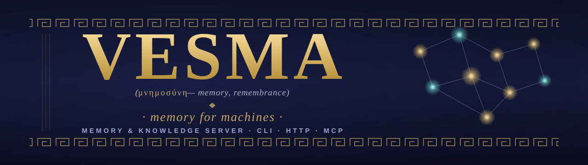
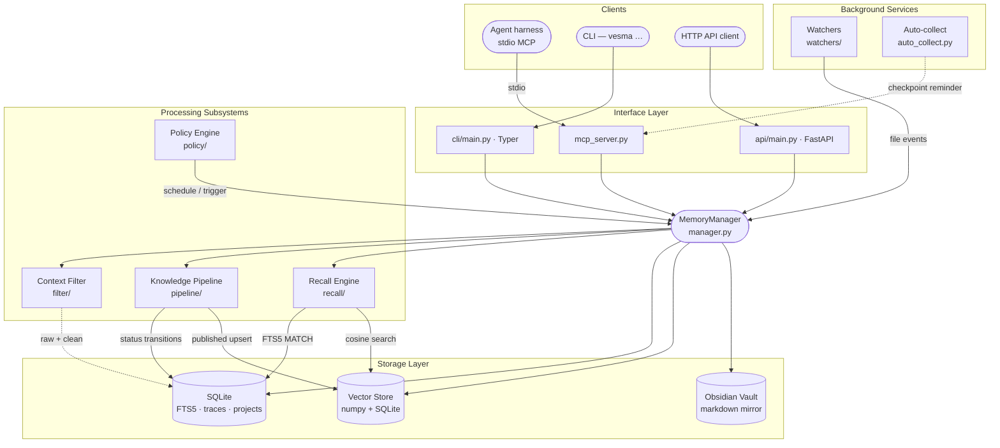

<!-- markdownlint-disable MD041 MD033 -->
<p align="center">
  
</p>

<h1 align="center">Vesma</h1>

<p align="center">
  <strong>A memory &amp; knowledge server for AI agents</strong><br>
  <em>named after the Vesper of memory, built for AI agents that need to remember</em>
</p>

<p align="center">
  <a href="https://pypi.org/project/vesma/"></a>
  <!-- deprecated-note: legacy PyPI package mnemos-memory-server (published until deprecation) -->
  <!-- <a href="https://pypi.org/project/mnemos-memory-server/"></a> -->
  <a href="https://www.npmjs.com/package/@vesmaro/vesma"></a>
  <a href="pyproject.toml"></a>
  <a href="pyproject.toml"></a>
  <a href="https://github.com/vesmaro/vesma/releases"></a>
</p>

<p align="center">
  <strong>🇬🇧 English</strong> · <a href="README.ru.md">🇷🇺 Русский</a>
</p>

<p align="center">
  <a href="#-quick-start">Quick start</a> ·
  <a href="#-features">Features</a> ·
  <a href="#-what-vesma-is">What it is</a> ·
  <a href="#-connect-any-harness">Connect a harness</a> ·
  <a href="#%EF%B8%8F-architecture">Architecture</a> ·
  <a href="#-documentation">Docs</a>
</p>

---

AI agents forget everything when a session ends. Vesma gives them a place to lay it down —
structured, searchable, governed by contract — so what they learn does not vanish with the
closing of a window.

- **Local-first.** One process on your machine. SQLite + a bundled embedding model; nothing leaves the host, no API keys, works offline.
- **One server, any harness.** VS Code Copilot, Claude Code, Cursor, OpenCode, Codex, Windsurf, ZCode, pi, Hermes — the same MCP wire, one line each.
- **The codebase becomes memory.** A project graph — files, symbols, call/import edges — indexes **itself** in the background on first contact; the agent navigates structure instead of re-reading files.
- **The agent learns to *use* it.** Not just tools: always-on instructions, a skill pack, and a memory-first prompt mode, deployed into your harness in one command.

---

## 🚀 Quick start

Three commands from an empty machine to an agent that remembers — and knows when to look.

### 1 · Install the server

```bash
pip install vesma
```

One package, everything included: the memory server, the `vesma` CLI, the REST API, and the
MCP server your agent harness talks to. The embedding model ships inside — search works fully
offline, no API keys, nothing downloaded.

> ⚠️ **Names.** The product and the CLI are `vesma` (`pip install vesma`, PyPI slot `project/vesma`).
> The pre-rebrand packages remain live until deprecation: `pip install mnemos-memory-server`
> installs the same server under the legacy name (its legacy CLI spelling was `vesma`, now an
> alias). The bare `pip install vesma` is an unrelated project — do not use it.

#### Or take the prebuilt image — Docker, Podman, or a Kubernetes cluster

The same server ships as a public image (`ghcr.io/vesmaro/vesma`) — pull and run: no build,
no login. Full guides live in the admin docs.

<details>
<summary><strong>☸️ Kubernetes / K3s — Helm chart with ingress</strong></summary>

```bash
helm install vesma deploy/helm/vesma \
  --namespace vesma --create-namespace \
  --set auth.totpMasterKey="$(openssl rand -hex 32)" \
  --set ingress.className=traefik \
  --set 'ingress.hosts[0].host=vesma.example.com'
kubectl -n vesma rollout status deploy/vesma
```

K3s ships Traefik and local-path storage, so the commands work as-is — chart, values and
TLS setup: **[Kubernetes deployment](docs/en/admin/kubernetes-deployment.md)**.
</details>

<details>
<summary><strong>🐳 Docker / Docker Compose</strong></summary>

```bash
cd deploy/docker
cp .env.example .env                    # put your TOTP_MASTER_KEY=$(openssl rand -hex 32) inside
docker compose up -d                    # podman-compose works too
curl -fsS http://localhost:8787/health  # → {"status":"ok"}
```

Full guide: **[container deployment](docs/en/admin/runbooks/container-deployment.md)**.
</details>

<details>
<summary><strong>🦭 Podman — systemd quadlet or kube play</strong></summary>

```bash
# systemd user service (preferred for a long-running host)
# legacy-named asset — unit file stays mnemos.container until the deploy wave renames it
cp deploy/podman/quadlet/mnemos.container ~/.config/containers/systemd/
# add the TOTP key to ~/.vesmaro.env (both env spellings), then:
podman pull ghcr.io/vesmaro/vesma:4.3.0  # контейнерные образы публикуются по LTS; кодовая линия 5.x — сначала PyPI/npm  # container images publish per-LTS; the 5.x code line is PyPI/npm-first
# quadlet derives the unit name from the file name — the unit is mnemos.service for now
systemctl --user daemon-reload && systemctl --user start vesma
curl -fsS http://localhost:8787/health
```

Both Podman recipes (quadlet + `podman kube play`):
**[deploy/podman/README.md](deploy/podman/README.md)** · full guide:
**[container deployment](docs/en/admin/runbooks/container-deployment.md)**.
</details>

### 2 · Connect your harness — and teach it to use memory

```bash
vesma integration setup
```

One pass: detects the agent harnesses on your machine, registers the Vesma MCP server in each
supported one (VS Code Copilot, Cursor, ZCode, OpenCode, pi, Hermes, and everything reading the
`~/.agents` standard — Claude Code, Codex and friends), and deploys the **behavioral pack** —
always-on instructions and memory skills, so the agent recalls at session start, checkpoints
before its context gets compacted, and treats memory as a priority instead of forgetting the
tools exist.

Running a harness that reads nothing standard? One paste block per harness:
[Connect Vesma to any harness](integrations/mcp-presets.md).

### 3 · Verify — then try it

```bash
vesma doctor
```

PASS / WARN / FAIL per check: store, config, MCP transport, harness registration (`--fix`
repairs the common warnings). Then give it a memory:

```bash
vesma add "First memory — Vesma remembers across sessions" \
  --tags project:vesma,agent:me,vesma:learning
vesma search "remembers across sessions"
```

That is the whole loop: **write, find, never lose it — and the agent knows when to look.**

> 📘 **Want every detail?** The extended guide covers all install variants (`uv tool`, `pipx`,
> CLI-only, external LLM extras, installer script, container), per-harness connection
> walkthroughs, configuration, and troubleshooting:
> **[Getting Started — the complete first run](docs/en/user/getting-started.md)**.

---

## ✨ Features

One local server — and a connected agent harness gets the full memory stack.

| Area | What you get |
|------|--------------|
| **Universal connectivity** | MCP server (38 tools, stdio) + REST API — any MCP-capable harness connects in one line ([tools](docs/en/user/mcp-tools.md) · [HTTP](docs/en/user/http-api.md)) |
| **Ready integrations** | VS Code Copilot, Claude Code, Cursor, Codex, Windsurf, OpenCode, ZCode, pi, Hermes Agent — one-line MCP presets for all of them, [native deploy targets](docs/en/user/integration-guide.md) for most, multi-harness doctor (`vesma doctor`) |
| **Skill pack** | 14+ memory skills deployed into your harnesses |
| **Flexible memory** | Hybrid search (full-text + vector, rank fusion) over the bundled offline model `vesma-embed-v1`, [tag contract](docs/en/user/tag-contract.md), per-agent / per-project memory, [context-filter](docs/en/user/context-filter.md) profiles, CCR compression — 70–90% token savings, originals kept |
| **Context assembly** | `assemble_context`: search → compress → filter → secret scan → cache align → token budget, per-block provenance |
| **Context bridge** | `on_context_rewrite` — when the harness compacts history, the lossless original stays available on demand |
| **Lifecycle hooks** | `pre_llm_call` context injection, `on_session_start`, `post_tool_call` auto-compression of tool outputs |
| **Publication v3.0.0** | Entries visible immediately after save, background refinement with seamless swap, quarantine with neutral retraction |
| **Self-protection** | Injection / secret detectors on input and publication, every output scanned, full per-entry audit |
| **Auto-pipeline** | Background processor: clustering, deduplication, quality gate, publication. Entries awaiting refinement sit at `pipeline_state=pending` until the processor runs — in CLI-only deployments (no daemon) start it with `vesma processor start`; `vesma doctor` reports the pending-queue depth |

Autonomy for an arbitrary harness and LLM-driven enrichment are partial — the
full, honest map lives in [docs/en/features.md](docs/en/features.md).

---

## 🧩 What Vesma is

A **single-tenant, local-first memory server** for AI agents. One in-process core, three equivalent
control surfaces, and a storage layer you can read with your own eyes.

|  | Capability | What it gives you |
|---|------------|-------------------|
| 🔎 | **Hybrid search** | Vector similarity + SQLite FTS5 full-text over every memory |
| 🧪 | **Knowledge pipeline** | `raw → processing → processed → published` lifecycle with a state machine |
| 🧠 | **Per-agent recall** | A focused recall surface scoped to each agent's project context |
| ⚙️ | **Policy engine** | Schedule and trigger automation over the memory store |
| 🧹 | **Context filter** | Five-stage noise stripper for logs / stdout before anything hits a model |
| 🗜️ | **Reversible compression (CCR)** | Compress large content with zero data loss — originals cached in SQLite, retrievable via hash marker |
| 🧷 | **CacheAligner** | Relocate dynamic content (timestamps, UUIDs, session ids, tokens) to the tail so provider KV caches (Anthropic `cache_control`, OpenAI prefix caching) hit across requests |
| 🪶 | **Output token reduction** | Optional `verbosity` / `effort` params on `mnemos_add` / `mnemos_search` / `mnemos_recall_context` (MCP tool names — unchanged wire contract) steer the caller's output style — backward compatible, defaults are a no-op |
| 📂 | **Path-scoped rules** | Ingest project rules and apply them by file path |
| 🗂️ | **Obsidian vault** | A markdown mirror humans can browse, edit, and grep |

SQLite for metadata, a local numpy + SQLite vector index for recall, and an Obsidian-compatible vault
for the humans in the loop.

**Where this is going.** The shipped, measured rung is *stores and finds*. The next rungs —
*collapse with checks* (session → project → cross-project synthesis: automatic by default, but never
unconditional in authority — every derivative traces back to its sources, nothing pins without an
operator) and, later, *builds understanding* — open only as pre-registered experiments prove them
([ADR-0025](docs/project/adr/0025-memory-meta-level-lanes.md)). The invariant on that road is
**zero silent losses**: a fact is either retained, or its loss is visible. And the shape of the
ambition is a *nervous system, not a conductor* — memory that surfaces the right thing at the right
moment, never one that conducts the agent.

---

## 🤝 Connect any harness

Vesma works with every MCP-capable agent harness. Three integration levels —
pick the strongest one your harness supports:

| Harness | Native deploy target | One-line MCP preset | Adapter template |
|---------|----------------------|---------------------|------------------|
| VS Code Copilot | `copilot` (+ prompts via `generic-copilot`) | [mcp-setup.sh](scripts/mcp-setup.sh) | ✓ |
| Claude Code | via `agents` | [preset](integrations/mcp-presets.md#claude-code) | ✓ |
| Cursor | `cursor` | [preset](integrations/mcp-presets.md#cursor) | ✓ |
| Codex | via `agents` | [preset](integrations/mcp-presets.md#codex) | ✓ |
| Windsurf | — | [preset](integrations/mcp-presets.md#windsurf) | ✓ |
| OpenCode | — | [preset](integrations/mcp-presets.md#opencode) | ✓ |
| ZCode | `zcode` | — | ✓ |
| Any AGENTS.md-standard harness | `agents` | — | ✓ |
| pi | `pi` (bridge extension, also on npm as [`pi-mnemos`](https://www.npmjs.com/package/pi-mnemos)) | [preset](integrations/mcp-presets.md#pi) | ✓ |
| [Hermes Agent](https://hermes-agent.nousresearch.com/) | `hermes` (native in-process `MemoryProvider` plugin) | — | — |

- **Native targets** — `vesma integration setup --target <name>` deploys the behavioral pack and
  registers the MCP server in one pass ([integration guide](docs/en/user/integration-guide.md)).
- **One-line presets** — [`integrations/mcp-presets.md`](integrations/mcp-presets.md): every harness
  above, copy-paste ready.
- **Adapter template** — [`integrations/adapter-template.md`](integrations/adapter-template.md):
  Connect / Expose / Configure + acceptance checklist for any harness that speaks MCP stdio.
- **Hermes Agent** runs Vesma in-process: `pip install vesma` in the Hermes environment,
  then `vesma integration setup --target hermes` ([details](docs/en/user/integration-guide.md#hermes-agent)).

The shared contract is the [tag schema](docs/en/user/tag-contract.md) — `project:<slug>`, `agent:<slug>`,
and at least one `mnemos:<subtype>` (tag namespace — unchanged wire contract) — that every memory entry must carry.

---

## 🏗️ Architecture

<details open>
<summary><strong>System diagram</strong> — clients → interfaces → core → storage</summary>

<br>



</details>

A deeper walkthrough — data model, state machines, security boundaries, operational concerns — lives in
[architecture/overview.md](docs/en/architecture/overview.md).

---

## 🎛️ Three surfaces, one core

The same `MemoryManager` powers all three interfaces. Pick the one that fits your client.

| Surface | Use it when… | Reference |
|---------|--------------|-----------|
| **MCP** — `vesma mcp-server` | You are an agent harness — the path every connected agent takes | [mcp-tools.md](docs/en/user/mcp-tools.md) |
| **CLI** — `vesma …` | You live in a shell, want fast ad-hoc add / search, or are scripting cron jobs | [cli-reference.md](docs/en/user/cli-reference.md) |
| **HTTP** — `vesma serve` | You have a non-MCP client — a web dashboard, a mobile app, a CI runner | [http-api.md](docs/en/user/http-api.md) |

The HTTP surface also exposes the **A2A Sessions API** — a persistent backend for multi-step agent
conversations that survive restarts. See [a2a-sessions.md](docs/en/architecture/a2a-sessions.md).

---

## 📚 Documentation

| Page | What it covers |
|------|----------------|
| [docs/README.md](docs/README.md) | Documentation landing — language picker (EN / RU) |
| [getting-started.md](docs/en/user/getting-started.md) | First run: install → first memory → first search → connect your harness |
| [mcp-presets.md](integrations/mcp-presets.md) | Connect Vesma to any harness — one-line MCP presets (VS Code, Claude Code, Cursor, OpenCode, Codex, Windsurf, pi, Hermes) |
| [integration-guide.md](docs/en/user/integration-guide.md) | The behavioral pack: instructions, skills, prompt mode, deploy targets, agent wiring, Hermes plugin |
| [features.md](docs/en/features.md) | What works out of the box, what is partial, what is planned |
| [architecture/overview.md](docs/en/architecture/overview.md) | System shape, data model, state machines, security boundaries |
| [cli-reference.md](docs/en/user/cli-reference.md) | Every `vesma` subcommand with flags, defaults, examples |
| [mcp-tools.md](docs/en/user/mcp-tools.md) | Every `mnemos_*` tool exposed to agent harnesses (tool names — unchanged MCP wire contract) |
| [http-api.md](docs/en/user/http-api.md) | Every HTTP endpoint (memory CRUD, workflow, hooks, A2A Sessions) |
| [tag-contract.md](docs/en/user/tag-contract.md) | The `project:` / `agent:` / `mnemos:` tag schema (namespace — unchanged data contract) enforced on every memory |
| [security.md](docs/en/admin/security.md) | Threat model, SSRF guard, FTS5 escape, auth model |
| [kubernetes-deployment.md](docs/en/admin/kubernetes-deployment.md) | Helm chart for K8s/K3s clusters: ingress, storage, TLS, TOTP secret |
| [contrib/node-install/](contrib/node-install/) | `vesma-node` — one-command bare-metal node bundle: venv + mesh binary + units, with adopt / atomic pair upgrade / uninstall |
| [runbooks/](docs/en/admin/runbooks/) | Install, migrate, backup / restore, dependency updates, container deployment |
| [adr/](docs/project/adr/) | Architectural decision records — the *why* behind the design |
| [CHANGELOG.md](CHANGELOG.md) | Release notes — Keep a Changelog format |
| [CONTRIBUTING.md](CONTRIBUTING.md) | Development setup, git workflow, quality gate |

---

## 📖 The lore

> In Hesiod's *Theogony*, **Mnemosyne** (Μνημοσύνη) is the Titaness of memory — she who, by Zeus, gave
> birth to the nine Muses and through them made the world's remembering possible. Her name is the root of
> *mnemonic*, and she is what every singer, poet, and philosopher prays to before they begin.

The lore section below preserves the memory of the pre-rebrand name — the product itself now sails
under **Vesma**, carrying the same task: **to make remembering possible for
the things that think.** AI agents, unmoored from any single conversation, lose everything that came
before. Vesma gives them a place to lay it down — structured, searchable, governed by contract — so that
what they learn does not vanish with the closing of a session. The Muses, after all, were not for the
gods' benefit. They were for the songs.

---

## ⚖️ License &amp; contributing

Apache-2.0 — see [LICENSE](LICENSE) and [NOTICE](NOTICE). Source: [github.com/vesmaro/vesma](https://github.com/vesmaro/vesma).

Contributions are welcome — [CONTRIBUTING.md](CONTRIBUTING.md) has the development setup, the branch
and commit conventions, and the quality gate a change must pass.

---

## 🛠 CI / Релизы — кластерный конвейер `release-pipeline`

Этот проект подключён к общему кластерному конвейеру релизов
([Korrnals/release-pipeline](https://github.com/Korrnals/release-pipeline),
K3s `abyss-ai-agent`, namespace `release-pipeline`). GitHub Actions не
используется (биллинг аккаунта заблокирован) — конвейер и есть штатный путь
релизов. Релизный артефакт подписывается трёхслойно: SHA256 → SBOM → cosign → GPG.

**Релиз новой версии:**
1. `VERSION` → релизный коммит (конвенция репо) → тег `vX.Y.Z` → push.
2. Обновить версию проекта в `projects[]` файла `~/.cache/release-pipeline-values.yaml` и применить:
   ```bash
   helm upgrade --install release-pipeline \
     ~/LABs/Projects/Project-Umbra/release-pipeline/chart/release-pipeline \
     --kube-context abyss-ai-agent -n release-pipeline \
     -f ~/.cache/release-pipeline-values.yaml
   ```
3. Наблюдение: `kubectl --context abyss-ai-agent -n release-pipeline get jobs`,
   логи: `kubectl ... logs -f job/release-<proj>-<ver>`.

Подробности (типы проектов, kaniko-контейнеры, teardown): README конвейера.
