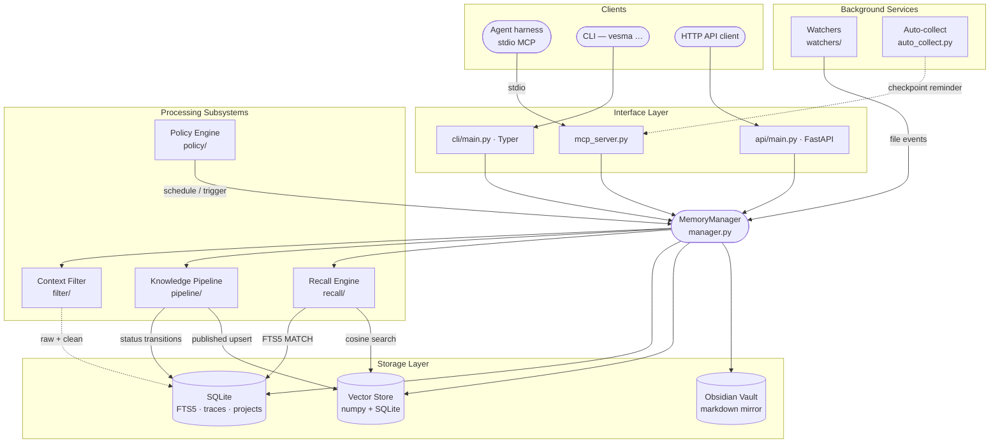

<!-- markdownlint-disable MD041 MD033 -->
<p align="center">
  
</p>

<h1 align="center">Vesma</h1>

<p align="center">
  <strong>Сервер памяти и знаний для AI-агентов</strong><br>
  <em>назван в честь весры памяти, создан для агентов, которым нужно помнить</em>
</p>

<p align="center">
  <a href="https://pypi.org/project/vesma/"></a>
  <!-- deprecated-note: legacy PyPI package mnemos-memory-server (published until deprecation) -->
  <!-- <a href="https://pypi.org/project/mnemos-memory-server/"></a> -->
  <a href="https://www.npmjs.com/package/@vesmaro/vesma"></a>
  <a href="pyproject.toml"></a>
  <a href="pyproject.toml"></a>
  <a href="https://github.com/vesmaro/vesma/releases"></a>
</p>

<p align="center">
  <a href="README.md">🇬🇧 English</a> · <strong>🇷🇺 Русский</strong>
</p>

<p align="center">
  <a href="#-быстрый-старт">Быстрый старт</a> ·
  <a href="#-возможности">Возможности</a> ·
  <a href="#-что-такое-vesma">Что это</a> ·
  <a href="#-подключение-любого-харнеса">Подключить харнес</a> ·
  <a href="#%EF%B8%8F-архитектура">Архитектура</a> ·
  <a href="#-документация">Документация</a>
</p>

---

AI-агенты забывают всё, когда сессия заканчивается. Vesma даёт им место, куда это можно
положить — структурированно, с поиском, по контракту — чтобы то, что агент узнал, не исчезало
с закрытием окна.

- **Локальность прежде всего.** Один процесс на вашей машине. SQLite + встроенная модель эмбеддингов; ничего не покидает хост, без API-ключей, работает офлайн.
- **Кодовая база становится памятью.** Граф проекта — файлы, символы, связи вызовов и импортов — индексируется **сам** в фоне при первом контакте; агент навигирует по структуре вместо перечитывания файлов.
- **Один сервер, любой харнес.** VS Code Copilot, Claude Code, Cursor, OpenCode, Codex, Windsurf, ZCode, pi, Hermes — один и тот же MCP-провод, одна строка на каждого.
- **Агент учится этим *пользоваться*.** Не только инструменты: always-on инструкции, пакет скиллов и режим промпта «память прежде всего», разворачиваемые в ваш харнес одной командой.

---

## 🚀 Быстрый старт

Четыре команды от пустой машины до работающего, самопроверяемого сервиса с агентом,
который помнит, — всё через утилиту `vesma`.

### 1 · Установите сервер

```bash
pip install vesma
```

Всё в одном пакете: сервер памяти, CLI `vesma`, REST API и MCP-сервер, с которым разговаривает
ваш агентский харнес. Модель эмбеддингов встроена — поиск работает полностью офлайн,
без API-ключей и без загрузок.

Другие каналы: `uv tool install vesma` / `pipx install vesma` (изолированно),
`npm install -g @vesmaro/vesma` (npm) или готовый образ ниже.

> ⚠️ **Имена.** Продукт и CLI — `vesma` (`pip install vesma`, слот PyPI `project/vesma`).
> Доребрендинговые пакеты живут до момента deprecation: `pip install mnemos-memory-server`
> ставит тот же сервер под старым именем, а `vesma-memory-server` — наше живое зеркало-алиас.
> Голый слот `pip install vesma` — наш, это основной канал.

#### Или возьмите готовый образ — Docker, Podman или кластер Kubernetes

Тот же сервер опубликован публичным образом (`ghcr.io/vesmaro/vesma`) — скачал и запустил:
без сборки и без логина. Полные руководства — в админ-доках.

<details>
<summary><strong>☸️ Kubernetes / K3s — helm-чарт с ингрессом</strong></summary>

```bash
helm install vesma deploy/helm/vesma \
  --namespace vesma --create-namespace \
  --set auth.totpMasterKey="$(openssl rand -hex 32)" \
  --set ingress.className=traefik \
  --set 'ingress.hosts[0].host=vesma.example.com'
kubectl -n vesma rollout status deploy/vesma
```

В K3s Traefik и local-path хранилище есть из коробки — команды работают как есть.
Чарт, values и настройка TLS: **[Развёртывание в Kubernetes](docs/ru/admin/kubernetes-deployment.md)**.
</details>

<details>
<summary><strong>🐳 Docker / Docker Compose</strong></summary>

```bash
cd deploy/docker
cp .env.example .env                    # впишите TOTP_MASTER_KEY=$(openssl rand -hex 32)
docker compose up -d                    # podman-compose тоже подходит
curl -fsS http://localhost:8787/health  # → {"status":"ok"}
```

Полное руководство: **[контейнерное развёртывание](docs/ru/admin/runbooks/container-deployment.md)**.
</details>

<details>
<summary><strong>🦭 Podman — systemd quadlet или kube play</strong></summary>

```bash
# systemd user-сервис (предпочтительно для постоянно работающего хоста)
# легаси-имя ассета — unit-файл остаётся mnemos.container до деплой-волны
cp deploy/podman/quadlet/mnemos.container ~/.config/containers/systemd/
# впишите TOTP-ключ в ~/.vesmaro.env (VESMA_API__TOTP_MASTER_KEY; образы 4.x принимают и легаси-написание MNEMOS_*), затем:
podman pull ghcr.io/vesmaro/vesma:5.6.2
# quadlet выводит имя unit из имени файла — до переименования это mnemos.service
systemctl --user daemon-reload && systemctl --user start mnemos
curl -fsS http://localhost:8787/health
```

Оба рецепта Podman (quadlet + `podman kube play`):
**[deploy/podman/README.md](deploy/podman/README.md)** · полное руководство:
**[контейнерное развёртывание](docs/ru/admin/runbooks/container-deployment.md)**.
</details>

### 2 · Разверните сервис

```bash
vesma service install
systemctl --user enable --now vesma.service
```

`install` пакует манифесты компонентов, data-каталоги, venv и юнит systemd user
(идемпотентно — повторный запуск пересоздаёт артефакты; ручное создание venv в
рабочих сценариях не участвует). `vesma service run` запускает супервайзер на
переднем плане там, где systemd нет. Живое состояние смотрите через
`vesma service status` и `vesma service health`.

### 3 · Подключите харнес — и научите его пользоваться памятью

```bash
vesma integration setup
```

Один проход: находит агентские харнесы на вашей машине, регистрирует MCP-сервер Vesma в каждом
поддерживаемом харнесе (VS Code Copilot, Cursor, ZCode, OpenCode, pi, Hermes и всё, что читает
стандарт `~/.agents`, — Claude Code, Codex и друзья) и разворачивает **поведенческий пакет** —
always-on инструкции и скиллы памяти, чтобы агент вспоминал в начале сессии, делал чекпоинт
до того, как его контекст сожмут, и относился к памяти как к приоритету, а не забывал,
что инструменты существуют.

Ручная настройка MCP отменена — утилита единственный путь. Харнес, который не читает
ничего стандартного? Один блок для копипаста на каждый:
[Подключите Vesma к любому харнесу](integrations/mcp-presets.md).

### 4 · Проверьте — и попробуйте

```bash
vesma doctor
```

PASS / WARN / FAIL по каждой проверке: хранилище, конфиг, MCP-транспорт, регистрация харнесов
(`vesma doctor fix` чинит типовые предупреждения; `vesma doctor service` сверяет
сервис-установку с layout-контрактом). Затем дайте ему память:

```bash
vesma add "Первая запись — Vesma помнит между сессиями" \
  --tags project:vesma,agent:me,vesma:learning
vesma search "помнит между сессиями"
```

Это весь цикл: **записал, нашёл, не потерял — и агент знает, когда заглянуть в память.**

> 📘 **Хотите каждую деталь?** Расширенный гид покрывает полный жизненный цикл — все варианты
> установки (`uv tool`, `pipx`, npm, контейнер), развёртывание сервиса, подключение каждого
> харнеса, обновления и таймер обновлений, вычистку легаси-установок, конфигурацию и
> разбор неполадок:
> **[Начало работы — полный жизненный цикл](docs/ru/user/getting-started.md)**.

---

## ✨ Возможности

Один локальный сервер — и подключённый агентский харнес получает полный стек памяти.

| Область | Что даёт |
|---------|----------|
| **Универсальное подключение** | MCP-сервер (38 инструментов, stdio) + REST API — любой харнесс с поддержкой MCP подключается одной строкой ([инструменты](docs/ru/user/mcp-tools.md) · [HTTP](docs/ru/user/http-api.md)) |
| **Готовые интеграции** | VS Code Copilot, Claude Code, Cursor, Codex, Windsurf, OpenCode, ZCode, pi, Hermes Agent — однострочные MCP-пресеты для всех, [нативные таргеты развёртывания](docs/ru/user/integration-guide.md) для большинства, мульти-харнесный доктор (`vesma doctor`) |
| **Пакет скиллов** | 14+ скиллов памяти разворачиваются в ваши харнесы |
| **Гибкая память** | Гибридный поиск (полнотекстовый + векторный, слияние рангов) поверх встроенной офлайн-модели `vesma-embed-v1`, [контракт тегов](docs/ru/user/tag-contract.md), память по агентам и проектам, профили [контекстного фильтра](docs/ru/user/context-filter.md), сжатие CCR — экономия 70–90% токенов, оригиналы сохраняются |
| **Сборка контекста** | `assemble_context`: поиск → сжатие → фильтр → скан секретов → выравнивание кэша → бюджет токенов, провенанс каждого блока |
| **Мост контекста** | `on_context_rewrite` — когда харнес сжимает историю, оригинал без потерь доступен по требованию |
| **Хуки жизненного цикла** | `pre_llm_call` — впрыск контекста, `on_session_start`, `post_tool_call` — авто-сжатие вывода инструментов |
| **Публикация v3.0.0** | Запись видна сразу после сохранения, фоновая дообработка с бесшовной подменой, карантин с нейтральной ретракцией |
| **Автозащита** | Детекторы инъекций / секретов на входе и на публикации, скан каждого вывода, полный аудит по каждой записи |
| **Автоконвейер** | Фоновый процессор: кластеризация, дедупликация, гейт качества, публикация |

Автономность для произвольного харнесса и LLM-дообогащение — частично; полная
честная карта: [docs/ru/features.md](docs/ru/features.md).

---

## 🧩 Что такое Vesma

**Однотенантный, локально-ориентированный сервер памяти** для AI-агентов. Одно ядро in-process, три
эквивалентных поверхности управления и слой хранения, который можно прочитать своими глазами.

|  | Возможность | Что это даёт |
|---|------------|-------------------|
| 🔎 | **Гибридный поиск** | Векторная близость + SQLite FTS5 полнотекст по каждой записи |
| 🧪 | **Конвейер знаний** | Жизненный цикл `raw → processing → processed → published` с конечным автоматом |
| 🧠 | **Recall на агента** | Сфокусированная поверхность recall в контексте проекта каждого агента |
| ⚙️ | **Движок политик** | Планирование и триггеры автоматизации над хранилищем памяти |
| 🧹 | **Контекстный фильтр** | Пятиступенчатая очистка шума из логов / stdout до того, как что-то попадёт в модель |
| 🗜️ | **Обратимое сжатие (CCR)** | Сжатие большого контента без потери данных — оригиналы кэшируются в SQLite, извлекаются по хеш-маркеру |
| 🧷 | **CacheAligner** | Перенос динамического контента (таймстампы, UUID, session id, токены) в хвост, чтобы KV-кэши провайдеров (Anthropic `cache_control`, OpenAI prefix caching) попадали между запросами |
| 🪶 | **Сокращение токенов вывода** | Опциональные параметры `verbosity` / `effort` на `mnemos_add` / `mnemos_search` / `mnemos_recall_context` (имена MCP-тулов — неизменный wire-контракт) управляют стилем вывода вызывающей стороны — обратно совместимо, значения по умолчанию — no-op |
| 📂 | **Path-scoped rules** | Ингест правил проекта и применение их по пути файла |
| 🗂️ | **Obsidian vault** | Markdown-зеркало, которое люди могут листать, править и грепать |

SQLite для метаданных, локальный векторный индекс на numpy + SQLite для recall и Obsidian-совместимый
vault для людей в контуре.

**Куда это движется.** Отгруженная и измеренная ступень — *хранит и находит*. Следующие ступени —
*свёртка с чеками* (синтез сессия → проект → кросс-проект: автоматическая по умолчанию, но никогда
безусловная по авторитету — каждый итог возводим к исходникам, ничто не пиннится без оператора) и
позже *строит понимание* — открываются только по мере подтверждения предрегистрированными
экспериментами ([ADR-0025](docs/project/adr/0025-memory-meta-level-lanes.md)). Инвариант этого
пути — **ноль тихих потерь**: факт либо сохранён, либо потеря видна. А форма амбиции — *нервная
система, а не дирижёр*: память, которая поднимает нужное в нужный момент, но никогда не дирижирует
агентом.

---

## 🤝 Подключение любого харнеса

Vesma работает с любым агентским харнесом с поддержкой MCP. Три уровня интеграции —
выбирайте самый сильный из доступных для вашего харнеса:

| Харнесс | Нативная цель | Однострочный MCP-пресет | Шаблон адаптера |
|---------|---------------|-------------------------|-----------------|
| VS Code Copilot | `copilot` (+ промпты через `generic-copilot`) | `vesma integration setup --target copilot` | ✓ |
| Claude Code | через `agents` | [пресет](integrations/mcp-presets.md#claude-code) | ✓ |
| Cursor | `cursor` | [пресет](integrations/mcp-presets.md#cursor) | ✓ |
| Codex | через `agents` | [пресет](integrations/mcp-presets.md#codex) | ✓ |
| Windsurf | — | [пресет](integrations/mcp-presets.md#windsurf) | ✓ |
| OpenCode | — | [пресет](integrations/mcp-presets.md#opencode) | ✓ |
| ZCode | `zcode` | — | ✓ |
| Любой харнесс стандарта AGENTS.md | `agents` | — | ✓ |
| pi | `pi` (бридж-расширение, также на npm как [`pi-mnemos`](https://www.npmjs.com/package/pi-mnemos)) | [пресет](integrations/mcp-presets.md#pi) | ✓ |
| [Hermes Agent](https://hermes-agent.nousresearch.com/) | `hermes` (нативный in-process плагин `MemoryProvider`) | — | — |

- **Нативные таргеты** — `vesma integration setup --target <имя>` разворачивает поведенческий пакет
  и регистрирует MCP-сервер за один проход ([руководство по интеграции](docs/ru/user/integration-guide.md)).
- **Однострочные пресеты** — [`integrations/mcp-presets.md`](integrations/mcp-presets.md): каждый
  харнес из таблицы выше, готово к копипасту.
- **Шаблон адаптера** — [`integrations/adapter-template.md`](integrations/adapter-template.md):
  Connect / Expose / Configure + чеклист приёмки для любого харнеса, говорящего по MCP stdio.
- **Hermes Agent** запускает Vesma in-process: `pip install vesma` в Python-окружении
  Hermes, затем `vesma integration setup --target hermes`
  ([подробнее](docs/ru/user/integration-guide.md#hermes-agent)).

Общий контракт — [схема тегов](docs/ru/user/tag-contract.md) — `project:<slug>`, `agent:<slug>`
и хотя бы один `mnemos:<subtype>` (неймспейс тегов — неизменный контракт данных) — обязательна для каждой записи памяти.

---

## 🏗️ Архитектура

<details open>
<summary><strong>Схема системы</strong> — клиенты → интерфейсы → ядро → хранилище</summary>

<br>



</details>

Более глубокий разбор — модель данных, конечные автоматы, границы безопасности, эксплуатационные
аспекты — в [architecture/overview.md](docs/ru/architecture/overview.md).

---

## 🎛️ Три поверхности, одно ядро

Один и тот же `MemoryManager` питает все три интерфейса. Выберите тот, что подходит вашему клиенту.

| Поверхность | Когда использовать… | Документация |
|---------|--------------|-----------|
| **MCP** — `vesma mcp-server` | Вы — агентский харнес; путь, по которому идёт каждый подключённый агент | [mcp-tools.md](docs/ru/user/mcp-tools.md) |
| **CLI** — `vesma …` | Вы живёте в шелле, нужен быстрый ad-hoc add / search или скрипты для cron | [cli-reference.md](docs/ru/user/cli-reference.md) |
| **HTTP** — `vesma serve` | У вас не-MCP клиент — веб-дашборд, мобильное приложение, CI runner | [http-api.md](docs/ru/user/http-api.md) |

HTTP-поверхность также открывает **A2A Sessions API** — постоянный бэкенд для многошаговых
разговоров агентов, которые переживают рестарты. См. [a2a-sessions.md](docs/ru/architecture/a2a-sessions.md).

---

## 📚 Документация

| Страница | Содержание |
|------|----------------|
| [docs/README.md](docs/README.md) | Главная страница документации — выбор языка (EN / RU) |
| [getting-started.md](docs/ru/user/getting-started.md) | Первый запуск: установка → первая запись → первый поиск → подключение харнеса |
| [mcp-presets.md](integrations/mcp-presets.md) | Подключение Vesma к любому харнесу — однострочные MCP-пресеты (VS Code, Claude Code, Cursor, OpenCode, Codex, Windsurf, pi, Hermes) |
| [integration-guide.md](docs/ru/user/integration-guide.md) | Поведенческий пакет: инструкции, скиллы, режим промпта, таргеты развёртывания, wiring агентов, плагин Hermes |
| [features.md](docs/ru/features.md) | Что работает из коробки, что частично, что в планах |
| [architecture/overview.md](docs/ru/architecture/overview.md) | Устройство системы, модель данных, конечные автоматы, границы безопасности |
| [cli-reference.md](docs/ru/user/cli-reference.md) | Все подкоманды `vesma` с флагами, значениями по умолчанию, примерами |
| [mcp-tools.md](docs/ru/user/mcp-tools.md) | Все инструменты `mnemos_*`, доступные агентским харнесам (имена тулов — неизменный MCP wire-контракт) |
| [http-api.md](docs/ru/user/http-api.md) | Все HTTP-эндпоинты (CRUD памяти, workflow, хуки, A2A Sessions) |
| [tag-contract.md](docs/ru/user/tag-contract.md) | Схема тегов `project:` / `agent:` / `mnemos:` (неймспейс — неизменный контракт данных), обязательная для каждой записи памяти |
| [security.md](docs/ru/admin/security.md) | Модель угроз, SSRF-защита, FTS5 escape, модель аутентификации |
| [kubernetes-deployment.md](docs/ru/admin/kubernetes-deployment.md) | Helm-чарт для кластеров K8s/K3s: ингресс, хранилище, TLS, TOTP-секрет |
| [runbooks/](docs/ru/admin/runbooks/) | Установка, миграция, резервное копирование / восстановление, обновление зависимостей, развёртывание в контейнере |
| [adr/](docs/project/adr/) | Архитектурные решения (ADR) — *почему* за каждым решением в дизайне |
| [CHANGELOG.md](CHANGELOG.md) | Release notes — формат Keep a Changelog |
| [CONTRIBUTING.ru.md](CONTRIBUTING.ru.md) | Настройка разработки, git-workflow, quality gate |

---

## 📖 Легенда

> В «Теогонии» Гесиода **Мнемосина** (Μνημοσύνη) — титанида памяти. Она, от Зевса, родила девять муз и
> через них сделала возможным воспоминание мира. Её имя — корень слова *мнемонический*, и к ней
> обращается каждый певец, поэт и философ, прежде чем начать.

Это программное обеспечение создано для той же задачи: **сделать воспоминание
возможным для тех, кто мыслит.** Раздел легенды ниже хранит память о доребрендинговом
имени — сам продукт теперь идёт под именем **Vesma**. AI-агенты, не привязанные ни к одному разговору, теряют всё, что было
до. Vesma даёт им место, куда это можно положить — структурированно, с поиском, по контракту — чтобы
то, что они узнали, не исчезало с закрытием сессии. Музы, в конце концов, были не для богов. Они были
для песен.

---

## ⚖️ Лицензия и вклад

Apache-2.0 — см. [LICENSE](LICENSE) и [NOTICE](NOTICE). Исходники: [github.com/vesmaro/vesma](https://github.com/vesmaro/vesma).

Вклад приветствуется — в [CONTRIBUTING.ru.md](CONTRIBUTING.ru.md): настройка окружения разработки,
конвенции веток и коммитов и quality gate, который должно пройти каждое изменение.
