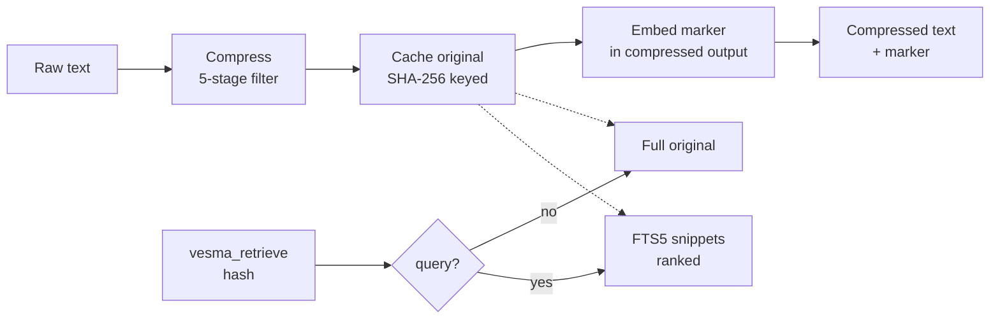
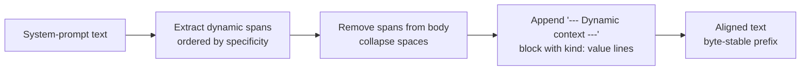
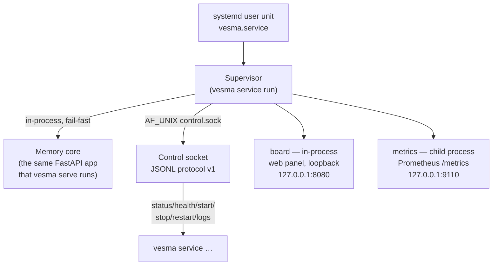

# Vesma — System Architecture

**🌐 Language / Язык:** English · [Русский](../../ru/architecture/overview.md)

> This architecture snapshot is current for Vesma **5.6.2**. The normative
> service-layer contracts (component-manifest, service-lifecycle,
> control-socket, layout — all v1.0.0) live in the separate
> [vesma-specs](https://github.com/vesmaro/vesma-specs) repository.

## Overview

Vesma is a hybrid long-term memory system: a personal knowledge base and
RAG store for AI agents. Primary access surfaces: CLI, HTTP API, MCP server,
and an Obsidian-compatible vault. On top of them sits the service layer: a
component supervisor with a control socket and a systemd user unit
(`vesma.service`) that keeps the core and the components alive. The
supervisor's web panel is the `board` component; the separate frontend
project ([vesma-eyes](https://github.com/vesmaro/vesma-eyes)) remains
planned.

## Core Principles

- **Markdown-first**: human-readable notes in Obsidian format (YAML frontmatter + markdown)
- **Semantic search**: vector embeddings over text data
- **Hybrid search**: full-text search + vector similarity, relevance-ranked results
- **Modularity**: core decoupled from interfaces; each interface is a thin adapter
- **Local-first**: everything works locally, no mandatory cloud dependencies; network binds are loopback by default
- **Spec-first**: contract specifications (vesma-specs) are ratified before/with the implementation, conformance runs verify the match
- **Extensibility**: service-layer components attach via manifests, data sources via plugins

---

## Architecture (Layers)

```
┌──────────────────────────────────────────────────────────────────┐
│                         INTERFACES                                │
│  ┌─────┐  ┌──────────┐  ┌──────┐  ┌─────┐  ┌──────────────────┐  │
│  │ CLI │  │ REST API │  │ MCP  │  │board│  │ federation (A2A, │  │
│  │Typer│  │ FastAPI  │  │ stdio│  │(UI) │  │  pull, sync)     │  │
│  └──┬──┘  └────┬─────┘  └──┬───┘  └──┬──┘  └────────┬─────────┘  │
├─────┴──────────┴───────────┴─────────┴──────────────┴────────────┤
│                    SERVICE LAYER (5.6)                            │
│  systemd user unit vesma.service → Supervisor                     │
│  ┌──────────────────┐  ┌───────────────────────────────────────┐ │
│  │ Control socket    │  │ In-process core (the same FastAPI     │ │
│  │ AF_UNIX, JSONL v1 │  │ app that vesma serve runs)            │ │
│  └──────────────────┘  └───────────────────────────────────────┘ │
│  ┌────────────────────────────────────────────────────────────┐  │
│  │ Manifest-driven children (component-manifest v1): board,   │  │
│  │ metrics                                                     │  │
│  └────────────────────────────────────────────────────────────┘  │
├──────────────────────────────────────────────────────────────────┤
│            CORE (MemoryManager, manager.py)                       │
│  ┌──────────────┐ ┌──────────────┐ ┌──────────────────────────┐  │
│  │MemoryManager │ │ SearchEngine │ │IngestionPipeline         │  │
│  │  CRUD ops    │ │ hybrid search│ │  parse & embed           │  │
│  └──────┬───────┘ └──────┬───────┘ └───────────┬──────────────┘  │
├─────────┴────────────────┴─────────────────────┴─────────────────┤
│                    STORAGE                                        │
│  ┌────────────────┐  ┌───────────────┐  ┌─────────────────────┐  │
│  │ Obsidian Vault │  │  Vector index │  │  SQLite             │  │
│  │ (markdown)     │  │  (vectors.db) │  │  (metadata, A2A,    │  │
│  │                │  │               │  │  CCR, project graph)│  │
│  └────────────────┘  └───────────────┘  └─────────────────────┘  │
├──────────────────────────────────────────────────────────────────┤
│                    EMBEDDING                                      │
│ vesma-embed-v1 (bundled) / onnx / Ollama / sentence-transformers  │
└──────────────────────────────────────────────────────────────────┘
```

---

## Components

### 1. Storage Layer

| Component | Purpose | Technology |
| --- | --- | --- |
| Obsidian Vault | Human-readable notes, markdown + frontmatter | Filesystem |
| Vector index | Vector embeddings for semantic search | SQLite (`vectors.db`, local) |
| SQLite | Metadata, tags, relationships, history, A2A sessions, CCR cache, project graph | SQLite + aiosqlite (WAL) |

**Obsidian compatibility**:
- Each "memory" is a markdown file with YAML frontmatter (tags, source, created, etc.)
- Supports `[[wiki-links]]` and `#tag` notation
- Vault directory is configurable
- File watcher monitors changes and re-indexes

### 2. Embedding Layer

- **Default**: `vesma-embed-v1` — bundled local model (~30 MB, int8 ONNX, RU+EN, 384d), works offline
- Current weights (round 3, 2026-09-09): distilled from **Qwen/Qwen3-Embedding-0.6B** (Apache-2.0), `weights_sha256 3b752e06…`, MRL dimensions 64/128/256/384, opset 15; training corpus ~100k text→teacher-vector pairs including 8086 real store entries (RU 41.9%)
- **Embedder swaps are vintage-tracked**: every vector stores the fingerprint of the embedder that produced it (`weights_sha256` for the bundled model); vectors cut by a different fingerprint are re-embedded automatically by the background heal sweeper, and `vesma doctor` reports the remaining vintage-mismatch count
- **External providers still available**: `onnx` (any HF model), Ollama, `sentence-transformers`
- Embedding provider configured via config file
- Embedding caching to avoid repeated computation

### 3. Core (`MemoryManager`, `manager.py`)

#### MemoryManager
- CRUD for memory entries (create, read, update, delete)
- Automatic embedding generation on create / update
- Sync: markdown file ↔ vector index ↔ SQLite
- Tags, categories, priorities, TTL (entry lifetime)

#### SearchEngine
- **Semantic search**: vector similarity via the local vector index
- **Full-text search**: FTS5 via SQLite
- **Hybrid search**: RRF (Reciprocal Rank Fusion) to combine results
- Filtering by tags, dates, sources, types

#### IngestionPipeline
- Parsing incoming data from different sources
- Chunking long documents (RecursiveCharacterTextSplitter)
- Deduplication (by content hash + cosine similarity)
- Automatic tag and metadata extraction

### Reversible Compression (CCR)

CCR (Compress-Cache-Retrieve) reduces the token cost of large content (tool output, logs, JSON) without losing data. It reuses the existing 5-stage context filter for compression and the existing SQLite store for caching — no separate database, no separate backup.

#### Pipeline



1. **Compress** — `apply_filter` runs the 5-stage pipeline (profile-aware: `log`, `terminal`, `code`, `docs`, `web`, `default`). Achieves 86–96% reduction on logs and JSON.
2. **Cache** — the original uncompressed text is stored in `ccr_cache` keyed by its SHA-256 hash. Content-addressed: re-compressing the same text is a no-op.
3. **Embed marker** — a short parseable marker is prepended to the compressed output. This is literal engine output, so it keeps the canonical tool name `mnemos_retrieve` (the legacy spelling in the byte output lives until 6.0):
   ```text
   [compressed: <hash> | <N>→<M> chars | retrieve via mnemos_retrieve]
   ```
4. **Retrieve** — `vesma_retrieve(hash)` (canonical name `mnemos_retrieve`) returns the full original (zero data loss). `vesma_retrieve(hash, query=...)` returns FTS5-ranked snippets within the cached original.

#### Storage integration

The `ccr_cache` table lives in the same SQLite database as `memories`:

| Table | Purpose | Keyed by |
|-------|---------|----------|
| `ccr_cache` | Original uncompressed content | `hash` (SHA-256, PRIMARY KEY) |
| `ccr_cache_fts` | FTS5 external-content index over `ccr_cache.original` | `rowid` |

FTS5 is kept in sync via `AFTER INSERT/DELETE/UPDATE` triggers — no application-level sync code. Snippet retrieval uses the same FTS5 engine as memory search, scoped to a single cached original by `hash`.

#### Eviction

| Mechanism | Default | When it runs |
|-----------|---------|--------------|
| TTL expiry | 7 days | `ccr_cleanup()` — runs automatically from the background processor on its own interval (T3), or via the CLI |
| LRU eviction | 10000 entries | Opportunistic, on every `compress` call |

Since T3 (v2.9.0), `ccr_cleanup()` is invoked from `_processor_loop` on its own interval (`ccr_cleanup_interval_sec`, default 1200s = 20 min) — not on every processor cycle, to avoid scanning the cache table every `interval_sec`. It is guarded by `ccr.enabled` and wrapped in a try/except so a cleanup failure never crashes the processor loop.

#### Configuration

```yaml
ccr:
  enabled: true                    # master switch
  ttl_days: 7                      # cache entry lifetime
  max_entries: 10000               # LRU eviction threshold
  min_size_chars: 500              # below this, content is returned as-is
  snippet_count: 5                 # snippets returned by retrieve(query=...)
  filter_budget: 4096              # token budget passed to apply_filter
  ccr_cleanup_interval_sec: 1200   # T3: background cleanup interval (60–86400s)
```

Content below `min_size_chars` is returned as-is with `cached=false` and `reduction_pct=0` — tiny content has no token savings.

### CacheAligner (P1-5)

CacheAligner stabilizes the prefix of system-prompt-like text so provider KV caches (Anthropic `cache_control`, OpenAI prefix caching) hit across requests. It extracts dynamic content — ISO timestamps, UUIDs, session ids, short-lived tokens, calendar dates — and relocates each span to a `--- Dynamic context ---` block at the end. The prefix up to the first dynamic span becomes byte-stable; the dynamic values still reach the model, just from the tail.

Inspired by headroom's CacheAligner (https://github.com/headroomlabs-ai/headroom, Apache 2.0). Original implementation — no headroom code is imported.

#### Extraction pipeline



Pattern kinds, in order of specificity (most specific first so an ISO timestamp is matched as a timestamp, not a bare date):

| Kind | Pattern | Example |
|------|---------|---------|
| `timestamp` | ISO 8601 with optional tz | `2026-07-17T10:30:00Z` |
| `uuid` | canonical 8-4-4-4-12 hex | `550e8400-e29b-41d4-a716-446655440000` |
| `session_id` | `sess-*`, `session:*`, `sid-*` | `sess-abc123def456` |
| `date` | calendar dates | `2026-07-17`, `2026/07/17` |
| `token` | bare 20+ char opaque tokens | `a1b2c3d4e5f6789012345` |

Overlapping matches are resolved by earliest start, then longest match — a timestamp wins over a bare date overlapping its tail.

#### Profile behaviour

| Profile | Skips | Why |
|---------|-------|-----|
| `default` (or omitted) | nothing | extract all kinds |
| `code` | `token` | bare 20+ char tokens would mangle long identifiers / hashes in code |
| `docs` | `token` | prose rarely contains real tokens; avoids mangling long hyphenated words |

The profile's skip set merges (union) with per-kind toggles from `CacheAlignerConfig` — disabling a kind in config widens what a profile already skips.

#### Configuration

```yaml
cache_aligner:
  enabled: true               # master switch
  extract_timestamps: true   # ISO 8601 timestamps
  extract_uuids: true        # canonical 8-4-4-4-12 UUIDs
  extract_session_ids: true  # sess-*, session:*, sid-*
  extract_dates: true        # calendar dates 2026-07-17 / 2026/07/17
  extract_tokens: true       # bare 20+ char opaque tokens
```

When `cache_aligner.enabled` is `false`, `align_prefix()` returns the text unchanged with an empty `extracted` list. The MCP tool `vesma_align_prefix` (canonical name `mnemos_align_prefix`) is the public surface; see [mcp-tools.md#mnemos_align_prefix](../user/mcp-tools.md#mnemos_align_prefix).

### Output token reduction (P1-7)

Output token reduction steers the caller's output style without changing what Vesma stores or returns. Three tools — `vesma_add`, `vesma_search`, `vesma_recall_context` (canonical names `mnemos_add`, `mnemos_search`, `mnemos_recall_context`) — accept two optional parameters:

| Parameter | Values | Effect |
|-----------|--------|--------|
| `verbosity` | `default`, `terse`, `minimal` | Injects an output-style guidance suffix into the tool result framing |
| `effort` | `low`, `medium`, `high` | Injects a reasoning-effort hint into the tool result framing |

These are **hints passed through to the caller**, not model config changes. Inspired by headroom's output token reduction work. Original implementation.

#### Backward compatibility

- Defaults (`default` / `medium`) produce an empty guidance suffix — the tool result is byte-identical to the pre-P1-7 output.
- Invalid values are validated against frozensets, logged at `WARNING`, and fall back to the config default — graceful degradation, never raises.
- When `output_style.enabled` is `false`, both resolvers return the no-op defaults regardless of caller input.

#### Configuration

```yaml
output_style:
  enabled: true              # master switch; when false, steering is a no-op
  default_verbosity: default # default when caller omits verbosity
  default_effort: medium     # default when caller omits effort
```

See [mcp-tools.md#output-token-reduction-p1-7](../user/mcp-tools.md#output-token-reduction-p1-7) for the user-facing reference.

---

### 4. Service Layer (5.6)

Since 5.6 the engine can run as a **service**: a supervisor keeps the core
and the components alive under a systemd user unit. The
[component-manifest v1](https://github.com/vesmaro/vesma-specs/tree/main/specs/component-manifest/v1),
[service-lifecycle v1](https://github.com/vesmaro/vesma-specs/tree/main/specs/service-lifecycle/v1),
[control-socket v1](https://github.com/vesmaro/vesma-specs/tree/main/specs/control-socket/v1) and
[layout v1](https://github.com/vesmaro/vesma-specs/tree/main/specs/layout/v1)
contracts are ratified at 1.0.0 in the vesma-specs repository.

#### Process model

`vesma service run` starts one installation:



- **Supervisor** — the lifecycle owner of every component: each child spawns in its own POSIX session (`setsid`, pgid == pid), a reaper thread leaves no zombies, `PR_SET_CHILD_SUBREAPER` is set, and the group-signal boundary protects the stop path. Restart policies follow the manifest tier: `core` restarts forever (exponential backoff, 30s cap, crash-loop alert after 10 attempts), `optional` lives under a rolling-window budget (5 restarts per 300s; exhaustion = one ERROR `event=degraded` line, then silent lazy retries). Start is topological over `depends_on` (independent components proceed in parallel), stop is reverse-topological — SIGTERM → manifest grace period → SIGKILL.
- **In-process core** — the same FastAPI app `vesma serve` runs, embedded in the supervisor process as its heart (SL §3.1): death of the core = death of the supervisor (exit 1), and the unit restarts the whole installation. The multiprocess serve profile does not apply in service mode — the core is always a single process.
- **Manifest-driven children** — every component is described by an `apiVersion: vesma.component/v1` manifest (strict validation, CM §4 error-code registry). Two pack manifests ship with the engine: `board` (an in-process web panel for the supervisor: component status, logs, manual control; loopback-only bind — anything wider fails config validation, fail-closed) and `metrics` (a child-process Prometheus exposition of engine vitals). User components install as drop-in manifests into `components.d/`, and every Python child gets its own venv.
- **Control socket** — `AF_UNIX`/`SOCK_STREAM`, 0600 rights, at `${XDG_RUNTIME_DIR}/vesma/control.sock` (fallback `~/.local/state/vesma/run/` when `XDG_RUNTIME_DIR` is empty). JSONL envelope, version negotiation via `hello`, methods `status` / `health` / `start` / `stop` / `restart` / `logs` (+ `--follow`), an error-code registry (protocol / lifecycle / authz / infra), and `SO_PEERCRED` authentication. No TCP listener exists by construction. Client verbs: `vesma service status|health|start|stop|restart|logs [--socket PATH]`.
- **Child FSM**: `stopped → starting → healthy` with the `degraded`, `backoff` and `blocked` branches; every transition is journalled as a structural line.

#### Layout v1 — canonical paths

Installation paths (do not confuse them with the memory-store legacy paths
`~/.mnemos/` from the Configuration section):

| Path | Mode | Purpose |
|------|------|---------|
| `~/.config/vesma/` | 0700 | service configuration root |
| `~/.config/vesma/vesma.yaml` | — | shared config (`{config_path}`) |
| `~/.config/vesma/components.d/` | 0700 | component manifest drop-in dir |
| `~/.config/vesma/env/<name>.env` | 0600 | secret env files (fail-closed parsing) |
| `~/.local/share/vesma/<name>/` | 0700 | component data |
| `~/.local/share/vesma/venv/` | 0700 | engine (supervisor) venv |
| `~/.local/share/vesma/venvs/<name>/bin` | 0700 | per-component Python venv (`{venv_bin}`) |
| `${XDG_RUNTIME_DIR}/vesma/` | — | runtime: socket, pids; fallback `~/.local/state/vesma/run/` |
| `~/.local/state/vesma/logs/<name>/` | — | files-under-state logs |
| `~/.local/state/vesma/history/` | — | append-only supervisor journal |

`vesma service install` creates everything listed, builds the venvs, deploys the pack manifests and generates the unit `~/.config/systemd/user/vesma.service` (ExecStart is one static line `<venv>/bin/vesma service run`; the generator version and downgrade markers are written into the unit). `vesma service uninstall [--all|COMPONENT]` reverses it. Inside containers (no real systemd) some sandbox directives of the unit are downgraded — every downgrade is marked with `# vesma:downgraded=` and checked against the DR-13 allowlist.

#### `vesma doctor service` — the DR-01…DR-13 checks

| ID | Check | What it catches |
|----|-------|-----------------|
| DR-01 | Rights/ownership of canonical dirs and env files | Deviation from the layout §3.2 modes (0700/0600), foreign ownership |
| DR-02 | venv integrity | Rights, owner, freeze-vs-lock drift |
| DR-03 | user-site leak | Clean-env import test: user-site must not leak into `sys.path` |
| DR-04 | venv uniqueness across manifests | Two components sharing one venv |
| DR-05 | Python version constraints | Declared `python.version` vs the actual interpreter |
| DR-06 | venv ≠ engine venv; reserved names | A component venv colliding with the engine venv |
| DR-07 | Unit drift | Installed `vesma.service` differs from the regenerated unit |
| DR-08 | Control-socket liveness | Connect-probe + `hello`; no socket = supervisor not running (n/a) |
| DR-09 | Health-port collisions | Two manifests claiming the same port |
| DR-10 | Free space on canonical roots | WARN/FAIL thresholds on config/data/state volumes |
| DR-11 | journald `Storage=persistent` | The supervisor journal survives a reboot |
| DR-12 | venv read-only at runtime | `ReadOnlyPaths` in the unit; container downgrades are loud and documented |
| DR-13 | Container downgrades within the allowlist | Only the listed sandbox-directive downgrades |

---

### 5. Data Sources (Ingestors)

| Source | Method | Format |
| --- | --- | --- |
| Manual input | CLI / API | Text / Markdown |
| Obsidian vault | File watcher (watchdog) | Markdown + frontmatter |
| Web pages | URL → trafilatura/BeautifulSoup | HTML → clean text |
| Files | `vesma ingest file` / API | TXT, MD, PDF (`pymupdf`), DOCX (`python-docx`) — the `[pdf]`, `[docx]` extras |
| Documents (chunked) | `ingest_document` (MCP / REST) | Long documents, born-quarantined |
| LLM chats | MCP / export | Dialogues |

### 6. Interfaces

#### CLI (Typer)
```bash
vesma add "Note about something important" --tags project:vesma agent:user mnemos:learning   # quick add
vesma ingest file ./document.pdf --tags project:vesma agent:user mnemos:learning             # from a file
vesma ingest url https://example.com --tags project:research agent:user mnemos:learning      # ingest a URL
vesma search "how to configure nginx"             # hybrid search (FTS5 + vector + RRF)
vesma search "CVE" --project vesma --limit 20    # project-scoped search
vesma recall agent tech-writer --limit 20         # recent entries for an agent
vesma graph register myproj /path/to/root         # register a project-graph root
vesma stats                                       # store statistics
vesma serve                                       # start the HTTP API (foreground)
vesma mcp-server                                  # start the MCP server (stdio)
vesma service install                             # install the service (unit, venvs, manifests)
vesma service status                              # component state tree
vesma doctor                                      # health checks (+ doctor service, doctor paths)
vesma update check                                # update surfaces on this machine
vesma completion                                  # install shell completion
```

#### REST API (FastAPI)

Main endpoint groups (full catalogue in [http-api.md](../user/http-api.md)):

```
GET    /health                            — healthcheck
POST   /memories                          — create entry
GET    /memories, /memories/{id}          — list, entry
GET/POST/DELETE /memories/{id}/workflow   — workflow lifecycle
POST   /search                            — hybrid search
GET    /recall/agent/{name}               — per-agent recall
GET    /tags, POST /tags/rename           — tags
POST   /filter/{id}                       — run the context filter
POST   /compress, /retrieve               — CCR
POST   /context/save, /recall, /assemble, /rewrite — context operations
POST   /hooks/{action}                    — lifecycle hooks
POST   /ingest-url, /ingest-document      — ingest
POST   /watch/start, /watch/stop, /watch/status     — project-graph watch poll
GET    /api/v1/stats, /stats/timeseries, /api/v1/metrics, /metrics — stats and metrics
POST   /reindex                           — re-index
GET    /dlq, POST /dlq/{id}/retry         — dead-letter queue
```

Two separate contracts sit on top: the [A2A Sessions API](a2a-sessions.md) (`/v1/sessions…`, M16) and the federated pull (`POST /api/v1/federation/pull`, per-peer bearer auth, ADR-0016).

#### MCP Server

Tools for Copilot / LLM agents: **40 tools**, brand-primary manifest — with a brand configured (`VESMA_MCP_BRAND=vesma`, the default deploy channel) every tool is advertised under its `vesma_*` name; the canonical `mnemos_*` spellings remain accepted on the call path until 6.0 (the dual-prefix contract). Full catalogue in [mcp-tools.md](../user/mcp-tools.md); the main ones:

- `vesma_search` — hybrid semantic + full-text search over memory
- `vesma_add` — add a new entry
- `vesma_recall_context` / `vesma_save_context` — assemble / persist the session context
- `vesma_assemble_context` — the context assembly pipeline (search → compress → filter → secret scan → cache align → token budget)
- `vesma_awareness` — neighbour presence and project delta (ADR-0035/0036)
- `vesma_index_project`, `vesma_search_graph` — the project graph (ADR-0032)

#### Service CLI

`vesma service install|uninstall|status|health|start|stop|restart|logs|run` — installation setup and the control plane (see the Service Layer section).

---

## Data Model

### Memory (entry)

```python
class Memory:
    id: str              # UUID
    content: str         # main text
    title: str | None    # title (auto or manual)
    tags: list[str]      # tags
    source: str          # source: manual, web, file, mcp, obsidian
    source_url: str | None
    memory_type: str     # note, fact, snippet, bookmark, conversation
    created_at: datetime
    updated_at: datetime
    embedding: list[float] | None
    metadata: dict       # additional data
    file_path: str | None  # path to markdown file in vault
```

### Markdown file (Obsidian)

```markdown
---
id: 550e8400-e29b-41d4-a716-446655440000
title: Configuring nginx reverse proxy
tags: [nginx, devops, linux]
source: web
source_url: https://example.com/nginx-guide
memory_type: note
created: 2026-04-10T12:00:00
updated: 2026-04-10T12:00:00
---

# Configuring nginx reverse proxy

Main note content...
```

---

## Configuration

Config file discovery (in priority order): explicit `--config` → `VESMA_CONFIG` → `./config.yaml` → `~/.mnemos/config.yaml`. Environment variables are canonically read with the `VESMA_` prefix (e.g. `VESMA_MNEMOS__DATA_DIR`); the deprecated `VESMARO_*` spelling stays accepted until 6.0 (the dual-prefix contract, ADR-0031).

```yaml
# config.yaml
mnemos:                                # memory-store section (the section name is legacy, not renamed)
  vault_path: ~/.mnemos/vault          # Obsidian vault (legacy memory-store path)
  data_dir: ~/.mnemos/data             # vector index + SQLite (legacy memory-store path)

embedding:
  provider: nano                      # nano (vesma-embed-v1, bundled) | onnx | ollama | sentence-transformers
  model: vesma-embed-v1
  # ollama_url: http://localhost:11434

search:
  default_limit: 20
  hybrid_alpha: 0.5                  # semantic search weight (0=FTS, 1=vector); 0.5 balances the RRF legs — at 0.7 vector dominance drowned FTS-rank-1 matches (issue #300)

api:
  host: 127.0.0.1                    # loopback by default (zero-config profile, ADR-0017)
  port: 8787

mcp:
  transport: stdio                   # stdio is the only implemented transport
```

> Two path planes must not be confused: the **memory store** (vault, SQLite,
> cache — `~/.mnemos/…` by default, legacy paths, governed by the `mnemos:`
> section) and the **service installation** (unit, venvs, manifests — layout
> v1, `~/.config/vesma/`, `~/.local/share/vesma/`,
> `~/.local/state/vesma/`). See the Service Layer section.

---

## Roadmap

> Snapshot of the original plan (the MVP era). Phases 1–2 shipped in full
> (including PDF/DOCX parsing); the service layer of Phase 3 shipped in 5.6
> (CM/SL/CS/LY contracts ratified at 1.0.0). The authoritative current plan
> lives in [PLAN.md](../../../PLAN.md).

### Phase 1 — MVP (shipped)
- [x] Architecture and data models
- [x] Core: MemoryManager + SQLite + vector store (`vectors.db`)
- [x] Embedding layer (bundled `vesma-embed-v1`)
- [x] Hybrid search
- [x] CLI (add, search, recall, tags)
- [x] Obsidian vault sync (read/write)
- [x] REST API (FastAPI)

### Phase 2 — Integrations (shipped)
- [x] MCP server for Copilot
- [x] Web scraping (ingest URLs)
- [x] PDF/DOCX parsing (the `[pdf]` / `[docx]` extras)

### Phase 3 — Service layer and advanced features (service layer shipped)
- [x] Service layer: supervisor, control socket, manifests, layout v1, doctor service (5.6, contracts v1.0.0)
- [x] Project graph (ADR-0032, on by default)
- [x] Export / Import
- [ ] Web UI (vesma-eyes)
- [ ] Auto-categorisation (LLM-powered)
- [ ] Auto-summarisation of long documents
- [ ] Periodic consolidation (merge similar entries)

### Phase 4 — Scaling
- [ ] Migration to PostgreSQL + pgvector (optional)
- [ ] Multi-user support
- [ ] Storage encryption
