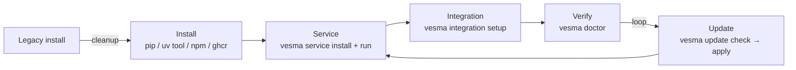

# Getting Started

**🌐 Language / Язык:** English · [Русский](../../ru/user/getting-started.md)

> The complete Vesma user lifecycle: install → service → integration →
> doctor → updates → legacy cleanup. Current for release 5.6.2.

Vesma is a standalone memory & knowledge server for AI agents. One utility —
`vesma` — drives the whole cycle: installs the package, deploys the service,
connects agent harnesses, checks health and updates itself. Every command on
this page works on a clean Linux / macOS / WSL2 machine.

The lifecycle:



For general context see the [architecture overview](../architecture/overview.md). The
full CLI command reference lives in [cli-reference.md](cli-reference.md); every MCP
tool is documented in [mcp-tools.md](mcp-tools.md), every HTTP endpoint in
[http-api.md](http-api.md).

> **5.6.2 tip.** `-h` works at every level — `vesma -h`, `vesma service -h`,
> `vesma service start -h`. Forgot the flags — append `-h` to any command.

---

## Installation

Vesma is published on PyPI as **`vesma`** (the bare slot has been ours since the
rebrand). Pick a channel:

| Channel | Command | What you get |
|---------|---------|--------------|
| **pip** — the common case | `pip install vesma` | server + `vesma` CLI + REST API + MCP server |
| **uv tool / pipx** — isolated | `uv tool install vesma` · `pipx install vesma` | same, with `vesma` on `PATH` and project environments untouched |
| **npm** | `npm install -g @vesmaro/vesma` | CLI + MCP server from the npm channel |
| **ghcr container** | see the block below | the server in one command, nothing installed into the system |
| **`vesma update apply`** | for an existing Vesma install | updates the pip distribution via the utility itself (see [Updates](#updates)) |

Plus external LLM enrichment: `pip install "vesma[ollama]"` — also `openai`,
`anthropic`, `gemini`.

> **One package, no extras.** Since 4.1.0 the MCP SDK is a core dependency (ADR-0023):
> the base install serves agent harnesses out of the box, and the legacy `[mcp]`
> extra remains an empty no-op alias so old commands and snippets keep working.
> The `vesma-embed-v1` embedding model (~30 MB) ships inside the wheel: search works
> fully offline, on CPU, with no downloads and no API keys.

> ⚠️ **Names.** The product and the CLI are `vesma` (`pip install vesma`). The
> pre-rebrand package `mnemos-memory-server` lives until deprecation and installs
> the same server (`pip install "mnemos-memory-server[ollama]"` works through the
> whole dual period). `vesma-memory-server` is our live mirror alias of the same code.

### Container in one command

The image is published to `ghcr.io/vesmaro/vesma`; `docker` works too — replace
`podman` with `docker`:

```bash
export VESMA_API__TOTP_MASTER_KEY=$(python3 -c "import secrets; print(secrets.token_urlsafe(32))")
podman run -d --name vesma \
  -p 8787:8787 \
  -v vesma-data:/data \
  -v vesma-vault:/vault \
  -e VESMA_API__TOTP_MASTER_KEY="${VESMA_API__TOTP_MASTER_KEY}" \
<!-- version:image -->
  ghcr.io/vesmaro/vesma:5.6.5
<!-- /version:image -->

curl -s http://localhost:8787/health | jq
```

<!-- version:tags -->
Tags: `:5.6.5` (pinned) · `:latest` (rolling).
<!-- /version:tags -->

Full guide: [container-deployment.md](../admin/runbooks/container-deployment.md).

### Pinning a version

<!-- version:pip -->
```bash
pip install vesma==5.6.5
```
<!-- /version:pip -->

<!-- deprecated-note: the 4.x line shipped as vesma_memory_server-*.whl; since 5.0.0 the release
artifact is vesma-<version>-py3-none-any.whl (attached to the GitHub release and published on
PyPI — `pip install vesma` installs the same wheel). -->

### Prerequisites

| Tool | Version | Why |
|------|---------|-----|
| Python | ≥ 3.11 | Minimum runtime (solved via `pip` — no manual venv needed) |
| `uv` or `pipx` | latest | Optional, for an isolated tool install |

> **OS note.** Vesma is developed on Linux (Arch, Fedora, Ubuntu 22.04+) and
> regularly smoke-tested on macOS. Windows works through WSL2. The systemd unit in
> `contrib/systemd/` is Linux-only.

> **Hardware.** The bundled `vesma-embed-v1` runs comfortably on a single CPU core.
> No GPU required. A 2 vCPU / 2 GB VM is enough for personal use.

> **venv — install flow only.** Creating a venv manually (python -m venv, hand-renamed
> directories like `venv-5.x`) is forbidden: the service layer expects venvs created by
> `vesma service install` (`~/.local/share/vesma/venv/` and `venvs/<name>/`). Old manual
> venvs are a sign of a legacy install — see
> [Cleaning up old installations](#cleaning-up-old-installations).

---

## Service (`vesma service`)

The service is the supervisor that drives the Vesma components over a control
socket: the embedded memory core, the board and child components from manifests.
It is also the right way to keep Vesma running on a machine (a systemd user unit).

| Command | Purpose |
|---------|---------|
| `vesma service install` | Deploys the service: component manifests, data dirs, venvs, the systemd user unit. Idempotent — re-running regenerates every artifact (hand edits to the unit are overwritten by design) |
| `vesma service run` | Runs the supervisor in the foreground: control socket + embedded core + components. Single-instance: when a live supervisor already answers on the socket, exits 0 |
| `vesma service status [component]` | The component state tree (running/stopped/failed + PID, uptime) as JSON |
| `vesma service health [component]` | The supervisor's own health verdict: OK / DEGRADED / FAIL with the reason. Use it after start/restart to confirm the component actually came up |
| `vesma service start {component}` | Start a component (idempotent: already-running is not an error) |
| `vesma service stop {component}` | Stop a component (idempotent); `--force` SIGKILLs a wedged process |
| `vesma service restart {component}` | A real stop-then-start cycle (not idempotent by contract) — to reload a config or manifest change |
| `vesma service logs {component}` | Recent component log lines (`--tail N`, default 100; `--follow`/`-f` streams until the source stops) |
| `vesma service uninstall [name]` | Remove one component or the whole installation (`--all`). Only files the install flow owns are removed (manifest, env file, venv); **component data dirs are preserved** |

The typical cycle:

```bash
vesma service install                 # manifests, dirs, venvs, the unit
systemctl --user enable --now vesma.service   # autostart (unit at ~/.config/systemd/user/vesma.service)
vesma service status                  # state tree — requires a live supervisor
vesma service health                  # health verdict after the start
vesma service logs core --follow      # tail a component's log
```

Without systemd (containers, manual mode) run the supervisor in the foreground:

```bash
vesma service run
```

Every client verb (status/health/start/stop/restart/logs) talks to the
supervisor over the control socket `${XDG_RUNTIME_DIR}/vesma/control.sock`;
`--socket` points at a non-default socket (tests, multi-instance machines).
When the socket does not answer, the command exits with a hint to start
`vesma service run`.

Under systemd logs go to journald (`vesma service logs` is a journalctl filter
by identifier); without systemd — to `~/.local/state/vesma/logs/<name>/` with
10 MB × 5 rotation. The contract admits no "third place" for logs.

---

## Doctor

`vesma doctor` is one command over the whole local installation:

```bash
vesma doctor
```

Every check prints PASS / WARN / FAIL with a concrete fix hint.
Exit codes: `0` — healthy, `1` — at least one FAIL, `2` — warnings only.
`--json` emits the results for scripts and CI.

Three subcommands:

| Command | Purpose |
|---------|---------|
| `vesma doctor fix` | Auto-repairs WARN-level findings: stale integration files → `integration update`, unwired agents → `integration setup`, missing MCP registration → registration. `--dry-run` previews what would be fixed without executing. FAIL-level checks are never auto-fixed |
| `vesma doctor service` | Checks the service installation against the layout contract (DR-01…DR-13): rights and ownership of directories, venv integrity, user-site leaks, venv uniqueness, unit drift. Read-only: findings carry a ready fix command, but the doctor never executes anything itself |
| `vesma doctor paths` | The paths table — where every artifact lives (config, data dir, DB, vault, cache, completion) — without running any checks |

> **Legacy spelling.** The old `vesma doctor --fix` flag is still accepted but prints a
> deprecation hint — since 5.6.2 the canon is `vesma doctor fix` (a subcommand).

The full developer gate (contributors only): clone the repository,
`uv sync --extra dev`, then `make verify` — ruff + mypy `--strict` +
bandit + pip-audit + the test suite. If `pip-audit` complains about a pinned CVE,
see the [dependency update runbook](../admin/runbooks/dependency-updates.md).

---

## Integration and MCP

**Manual MCP setup is cancelled.** Do not paste blocks into `mcp.json` or the
native harness configs by hand — the utility is the only path. (Old manual
registration snippets you may find in earlier docs no longer need to be applied.)

### Deployment

```bash
vesma integration setup
```

One non-interactive pass: detects every harness on this host, registers the MCP
server in each supported one, deploys the behavioral pack (instructions, skills,
prompt mode) and wires all agents. Idempotent: re-running refreshes stale files
without duplicating. A failure on one target never blocks the remaining targets.

| Flag | Effect |
|------|--------|
| `--target <name>` (`-t`, repeatable) | Only the named harnesses: `copilot`, `zcode`, `pi`, `hermes`, `claude-code`, `cursor`, `codex`, `windsurf`, `agents`… |
| `--no-wire-agents` | Skip agent MCP wiring |
| `--select a,b` | Wire only the named agents |
| `--no-mcp` | Skip MCP server registration |
| `--dry-run` | Show what would be deployed without writing |
| `--home <path>` | Deploy into an alternate home (another container, a dotfiles checkout) |

### Updating what is deployed

After a package upgrade, refresh the deployed files:

```bash
vesma integration update            # all harnesses
vesma integration update -t zcode   # one harness only
```

Only files carrying an outdated pack version stamp are touched. The other verbs
of the group: `vesma integration detect` (what is detected and where it is
deployed), `vesma integration verify` (compare deployed files against the
shipped pack), `vesma integration uninstall` (removes only files carrying the
pack's stamp).

### Memory status

At any moment you can see how memory is attached to every detected harness:

```bash
vesma memory status
```

A read-only report per harness: pack state (stamps), MCP registration (server
keys only), local store markers and the active priority mode
(`overlay+mirror` by default; ADR-0034).

The full target and flag map is in the [integration guide](integration-guide.md);
copy-paste blocks for non-standard harnesses live in
[mcp-presets.md](../../../integrations/mcp-presets.md).

---

## Completion

```bash
vesma completion            # auto-detects $SHELL and installs
vesma completion zsh        # explicit: bash / zsh / fish
vesma completion --show-instructions   # manual install instructions, writes nothing
```

Installs the engine-backed scripts (`vesma __complete`): commands, subcommands,
options and option values at every level, with candidate descriptions (zsh and
fish show them; bash completes values only — its readline cannot render
descriptions). Idempotent: re-running rewrites the scripts and refreshes their
embedded version stamp.

`vesma doctor` knows about the stamp: a stale completion script yields a WARN
with the `vesma completion` fix command. Manual source lines for bashrc/zshrc —
in `vesma completion --show-instructions`.

---

## Your first record (CLI)

```bash
vesma add "Hello world" --tags project:test agent:getting-started vesma:learning
```

Expected output:

```text
✓ Saved: Hello world (550e8400-e29b-41d4-a716-446655440000)
```

Vesma automatically:

1. **Wrote the entry to SQLite** at `~/.mnemos/data/mnemos.db` (created on first run).
2. **Mirrored it to your Obsidian vault** at `~/.mnemos/vault/` as a markdown file with YAML frontmatter.
3. **Validated the tag contract** — `project:test` + `agent:getting-started` + `vesma:learning` is a valid trio. Skip one and you get `❌ Tag contract violation: ...` instead.

The tag contract is documented in [tag-contract.md](tag-contract.md). The short version: every memory needs **exactly one** `project:<slug>`, **exactly one** `agent:<slug>`, and **at least one** `vesma:<subtype>` (e.g. `vesma:learning`, `vesma:bug-pattern`, `vesma:decision`). The legacy `vesma:` spelling is accepted as an input alias everywhere and normalized to the canon; stored tags keep the canonical `vesma:*` form.

> **Note.** Freshly added entries get the `raw` status. The background processor
> (it runs in the MCP and HTTP API modes, and in a CLI-only deployment —
> `vesma processor start`) automatically clusters, synthesizes, quality-checks and
> publishes them. The vector search index only includes entries with the `published`
> status. Rebuild it manually with `vesma reindex`.

External content has its own subcommands (since 5.6.2): `vesma ingest url URL`
(a web page) and `vesma ingest file PATH` (a local file), both with `--dry-run`
to preview the context filter.

## Your first search

Hybrid search combines SQLite FTS5 full-text with vector similarity and merges
the rankings through Reciprocal Rank Fusion (RRF):

```bash
vesma search "hello"
```

Useful flags:

| Flag | Effect |
|------|--------|
| `--limit N` / `-l N` | Maximum results (default 10) |
| `--project P` / `-p P` | Restrict to a project slug |
| `--tags T` | Filter by tags (comma-separated) |
| `--published-only` | Only pipeline-published entries |

For programmatic access with extended options (vector weight, raw content, tag
filters) use the HTTP API — see [http-api.md](http-api.md).

---

## Your project indexes itself (the project graph)

Vesma can also index a project's **code structure** — file outlines, symbol
search, call tracing — with no source bytes stored. This is the
[project graph](project-graph.md), on by default. Since PG-0.5 it needs no
setup: **your project indexes itself**. The first MCP call (or a
`pre_llm_call` hook) an agent makes inside a directory carrying a packaging
manifest (`pyproject.toml`, `package.json`, `go.mod`, `Cargo.toml` or
`setup.py`) auto-registers and indexes the project in the background
(`auto_index`, audit reason `auto-first`). No explicit call, no instruction,
no skill.

What happens, in order:

1. Work in your project as usual — an agent calls any MCP tool there.
2. The first index runs in the background (`auto-first`); from then on a
   beacon line in `assemble_context` output reports graph freshness on its own.
3. Check it with `vesma_project_graph_status` (look up the `project_id` with
   `vesma_list_graph_projects`).

Don't want the auto path? Two switches in `config.yaml`:
`code_graph.auto_index: false` stops only the background auto path (the manual
graph tools keep working); `code_graph.enabled: false` turns the whole surface
off. Full walkthrough: [project-graph.md](project-graph.md).

---

## Running the HTTP API (optional)

The MCP server is the primary integration surface: your agent harness spawns `vesma mcp-server` over stdio and gets the full `vesma_*` tool set. Pick your harness:

> The MCP server is the primary integration surface: your agent harness spawns `vesma mcp-server` over stdio and gets the full `vesma_*` tool set. Pick your harness:

| Harness | Fastest path |
|---------|--------------|
| VS Code Copilot | `curl -fsSL …/scripts/mcp-setup.sh \| bash`, then reload the window |
| Claude Code | `vesma integration setup --target claude-code` (native `CLAUDE.md` + user-scope MCP), or `claude mcp add --scope user vesma -- vesma mcp-server` |
| Cursor | `vesma integration setup --target cursor`, or paste one line into `~/.cursor/mcp.json` |
| OpenCode | paste one block into `~/.config/opencode/opencode.json` |
| Codex / Windsurf | `vesma integration setup --target codex` / `--target windsurf` (native config merge), or one TOML / JSON block each |
| ZCode, pi, Hermes Agent | `vesma integration setup --target zcode` / `--target pi` / `--target hermes` |
| Anything else | [adapter-template.md](../../../integrations/adapter-template.md) |

**The full copy-paste instructions for every harness live on one page: [Connect Vesma to any harness](../../../integrations/mcp-presets.md).** The behavioral layer — instructions, skills, and prompt mode that make agents actually *use* the memory — is a separate one-pass step:

```bash
vesma integration setup
```

The plain command deploys to **all detected harnesses on this host and wires
all agents** — non-interactive and idempotent (re-running refreshes). Use
flags to narrow: `--target <name>` (repeatable) installs to a specific
harness, `--no-wire-agents` skips agent wiring. See the
[integration guide](integration-guide.md) for all targets and flags.

### Memory status

At any point, check how memory is attached to each detected harness:

```bash
vesma memory status
```

A read-only report per harness: pack attachment (stamps), the MCP
registration (server keys only — vesma plus any external memory engines
seen in the harness config), the local store markers (existence/mtime,
never contents) and the active precedence mode (`overlay+mirror` by
default; ADR-0034).

Manual VS Code reference — user- or workspace-scope `mcp.json`:

```jsonc
{
  "servers": {
    "vesma": {
      "type": "stdio",
      "command": "vesma",
      "args": ["mcp-server"]
    }
  }
}
```

> **Registry-key note.** The `"vesma"` key in MCP config files is the server *registry name* the integration layer reads and manages (`servers["vesma"]`) — it is untouched by the rebrand; the *command* is `vesma mcp-server`.

> **Tip — auto-collect mode.** Set `VESMA_AUTO_COLLECT=1` in the server's `env` block to make Vesma nudge your agent to call `vesma_save_context` every ~6 tool calls. See [mcp-tools.md#auto-collect-mode](mcp-tools.md#auto-collect-mode) for the trade-offs.

---

## Run the HTTP API (optional)

For non-MCP clients, dashboards, and A2A traffic:

```bash
vesma serve --host 127.0.0.1 --port 8787
```

| Endpoint | Purpose |
|----------|---------|
| `http://127.0.0.1:8787/health` | Liveness probe |
| `http://127.0.0.1:8787/metrics` | Statistics (Prometheus-style) |
| `http://127.0.0.1:8787/docs` | Swagger UI |
| `http://127.0.0.1:8787/v1/sessions` | A2A sessions API (M16) |

> **Security.** The default binds to `127.0.0.1`. Never expose the port without a
> reverse proxy with authentication — see [security.md](../admin/security.md).

When the service supervisor is running (`vesma service run` or the unit), the
HTTP API core is already embedded in it — a separate `vesma serve` is not needed.

Quick check:

```bash
curl -s http://127.0.0.1:8787/health | jq
# {"status":"ok"}
```

---

## Updates

**Update checking — enabled by default, silent.** Vesma asks PyPI "is there a
newer version?" with a single GET of the version manifest (3 s timeout, no
telemetry, nothing is sent), caches the answer for 24 hours in
`<data_dir>/update-check.json` and surfaces it in `vesma stats`, in
`vesma --version` (a stderr line) and as one INFO line at server start.
Offline machines are fine: a failed check serves the cached answer (marked
"stale") and never breaks anything. Turn the check off:

```bash
VESMA_UPDATES_CHECK=off vesma serve      # hard env kill-switch
```

or in `config.yaml` (env equivalent: `VESMA_UPDATES__CHECK_ENABLED=false`):

```yaml
updates:
  check_enabled: false
```

### The `vesma update` subcommands

| Command | Purpose |
|---------|---------|
| `vesma update check` | Reports every update surface of the machine. Never prompts, never applies — safe in pipes and CI |
| `vesma update apply` | Apply the update now: pip `--user --upgrade` (+ npm best-effort). Never prompts — invoking `apply` IS the confirmation. `--to VERSION` pins/rolls back to a specific version. Every run appends a record to `~/.local/share/vesma/update-history.json` |
| `vesma update components` | The component inventory: what is installed and how it updates. Local state only — no network. `--json` for scripts |
| `vesma update timer install` | Install and enable the weekly systemd user timer (`vesma-update.timer`) — the automated check+apply pass |
| `vesma update timer uninstall` | Remove the timer and its service unit |
| `vesma update timer status` | Whether the timer is installed, whether it is enabled, when it last fired |

Bare `vesma update` keeps the 5.2.0 behavior: report + an interactive apply
prompt in a TTY. The old flag forms (`--check`, `--yes`, `--to`, `--scope`,
`--install-timer`, `--uninstall-timer`) still work as hidden deprecated aliases
with a stderr hint — write new scripts against the subcommands.

```bash
vesma update check              # report only
vesma update apply              # pip user-site (+ npm best-effort)
vesma update apply --to 5.6.1   # rollback / version pin
vesma update timer install      # weekly automation
```

`apply` touches only the pip user-site (and npm, if installed) — prod venvs,
Go binaries and containers are never silently updated; they only appear in the
report (marked `MANUAL GATE` / `report only`). After an update restart the agent
harness / `vesma serve` / the service (`vesma service restart <component>`) to
pick up the new version.

The timer unit templates live in
[`contrib/vesma-update.service`](../../../contrib/vesma-update.service) /
[`.timer`](../../../contrib/vesma-update.timer) — the file headers explain the
distrobox adaptation (one `distrobox-enter` ExecStart per box) and what is never
updated automatically.

---

## Cleaning up old installations

Installations from the rebrand and the pre-service-track era leave artifacts
under old names on the machine. Two scenarios below. Before either one, record
the current state: `vesma doctor paths` (where the config points),
`vesma update components` (which distributions are installed).

### Scenario A — clean the legacy, keep the database

The database, the vault and the configs **stay in place**. Only the old-name
mechanics are removed.

**What to keep (do not delete):**

| Path | What it is |
|------|-----------|
| `~/.mnemos/` | The engine store: `data/mnemos.db` (SQLite + vector index), `vault/` (Obsidian mirror), `config.yaml`, `logs/` |
| `~/.config/vesma/` | Service-layer config: `vesma.yaml`, the `components.d/` manifests, `env/` secret files |
| `~/.local/share/vesma/` | Component data + the engine and component venvs (`venv/`, `venvs/`) — owned by the install flow, never edit by hand |
| `~/.local/state/vesma/` | Logs, the transition journal, the fallback runtime |
| `~/.cache/vesma/` | Cache — regenerable, safe to delete at any moment (recreated on demand) |

**What to remove:**

```bash
# 1. pip distributions under old names (keep one current dist; the list — vesma update components)
pip uninstall mnemos-memory-server vesma-memory-server

# 2. legacy vesma-* units (systemd user)
systemctl --user disable --now vesma-*.service 2>/dev/null
rm -i ~/.config/systemd/user/vesma-*.service ~/.config/systemd/user/vesma-*.timer
systemctl --user daemon-reload

# 3. old shell wrappers and old-name launchers
rm -i ~/.local/bin/vesma ~/.local/bin/vesma-*

# 4. old completion scripts (the current ones are vesma.*; leave them)
rm -i ~/.mnemos/completion/vesma.*

# 5. legacy venv directories with versions in the name (hand-created — NOT the canonical vesma/venv*)
rm -ri ~/venv-5.x   # example: any manual venv of the old install
```

Then bring what remains up to date:

```bash
vesma completion            # regenerate the current completion scripts
vesma integration update    # refresh the deployed pack
vesma doctor                # the health gate — every check should be green
vesma doctor service        # the service installation against the layout v1 contract
```

### Scenario B — full removal, nothing kept

> ⚠️ **IRREVERSIBLE.** The `~/.mnemos/` store (database, vector index, vault,
> logs), the service-layer configs and all component data are erased with no way
> back. If the data matters at all — export first:
> `vesma export backup.json` (see [export-import.md](export-import.md)).

```bash
# 1. a proper teardown of the service by the utility (stop + remove unit + artifacts)
vesma service uninstall --all

# 2. remove the update timer
vesma update timer uninstall

# 3. remove the behavioral pack from all harnesses (only files carrying the pack's stamp)
vesma integration uninstall

# 4. distributions and the global npm package
pip uninstall vesma vesma-memory-server mnemos-memory-server
npm uninstall -g @vesmaro/vesma 2>/dev/null

# 5. service-layer units, if anything remains
systemctl --user disable --now vesma.service 2>/dev/null
rm -i ~/.config/systemd/user/vesma*.service ~/.config/systemd/user/vesma-update.{service,timer}
systemctl --user daemon-reload

# 6. the data and config directories — everything
rm -ri ~/.mnemos ~/.config/vesma ~/.local/share/vesma ~/.local/state/vesma ~/.cache/vesma

# 7. launchers and completion scripts
rm -i ~/.local/bin/vesma ~/.local/bin/vesma ~/.local/bin/vesma-*
rm -i ~/.mnemos/completion/vesma.* ~/.config/fish/completions/vesma.fish
```

Steps 1–3 go through the utility because only it knows the full list of its own
artifacts; the manual directory removal is for leftovers of an already-gutted
install.

---

## The legacy layer: how to recognize an old installation

Signs of a legacy deployment (pre-service-track):

| Sign | Where to look |
|------|---------------|
| venv directories with versions in the name (`venv-5.x`, `venv-4.3`), hand-created | home directory, `~/venv*`, paths from old units |
| `vesma-*.service` / `vesma-*.timer` units in systemd user | `ls ~/.config/systemd/user/` |
| shell wrappers `vesma-*-unit.sh`, launchers `vesma`, `vesma-train` | `ls ~/.local/bin/` |
| configs under old names in `~/.config` outside `vesma/` | `ls ~/.config/` |
| a token env file outside the canonical location | the `env_file` path in old manifests/units |
| logs in three places (journald + scattered files + the data dir) | old units, `~/.mnemos/logs/` |

The migration table (canon — layout v1, §9): the single migration entry point is
the **install flow** (`vesma service install`); hand-moving units and scripts is
not supported.

| Legacy | Canonical (layout v1) | Note |
|--------|----------------------|------|
| legacy configs under old names in `~/.config` | `~/.config/vesma/vesma.yaml` (the general config) + `~/.config/vesma/components.d/<name>.yaml` (per component) | the legacy name is not preserved: content is triaged by purpose |
| scattered file logs ("logs in 3 places") | journald (systemd) / `~/.local/state/vesma/logs/<name>/` (non-systemd) | one place per mode; old files are archived by the operator and not continued |
| a legacy token env file outside the canonical paths | `~/.config/vesma/env/<name>.env` (`0600`, fail-closed loading) | rotate the token when moving it |
| data of the old deployment under test names | `~/.local/share/vesma/<name>/` | renaming is a separate engine wave |
| legacy venv directories with versions in the name | `~/.local/share/vesma/venvs/<name>/` | one venv per python unit; recreated from the lock file, not moved |
| artifacts of the retired orchestrator | discarded (not migrated) | — |
| ad-hoc launchers (nohup scripts, shell wrappers) | discarded (not migrated) | launching = the supervisor driven by manifests |

Migration order: 1) inventory — `vesma doctor service` (DR-01…DR-13 + the list
of legacy paths) → 2) `vesma service install` creates the manifests / env files /
venvs, data moves with owner and rights → 3) a green component conformance →
4) discard the legacy mechanisms (disable + stop the old units, scenario A above).

---

## Migrating from legacy ai-brain

If you have an old `ai-brain` installation (`~/.ai-brain/ai_brain.db` +
`~/brain-vault/`), Vesma imports it in one command. Dry-run first:

```bash
vesma migrate from-ai-brain --dry-run
```

Read the summary, then run it for real:

```bash
vesma migrate from-ai-brain
```

The migrator translates legacy source types, fixes the tag contract
(`project:legacy`, `agent:unknown`, `vesma:legacy`), preserves entry statuses
and moves the `content_ru` / `content_en` columns into `metadata` (no data
loss). For non-standard locations use `--source PATH` and `--vault PATH`.

---

## Configuration

Vesma reads `config.yaml` from the current directory or `~/.mnemos/config.yaml`.
The full schema is in [config.example.yaml](../../../config.example.yaml). The most useful knobs:

| Setting | Default | Purpose |
|---------|---------|---------|
| `vesma.data_dir` | `~/.mnemos/data` | SQLite store + vector index |
| `vesma.vault_path` | `~/.mnemos/vault` | Obsidian mirror |
| `vesma.strict_tag_contract` | `true` | Enforce the tag contract (`false` — legacy imports only) |
| `embedding.provider` | `nano` | `nano` (vesma-embed-v1, bundled) / `onnx` / `ollama` / `sentence-transformers` |
| `search.hybrid_alpha` | `0.5` | Vector leg weight in RRF (0.0 = pure FTS, 1.0 = pure vector) |
| `api.host` / `api.port` | `127.0.0.1` / `8787` | Defaults for `vesma serve` |
| `llm.provider` / `llm.model` | `ollama` / `qwen2.5:3b` | Pipeline synthesis and the context filter |

Every one of them is overridden by environment variables (`VESMA_*`, `__` is the
nesting separator; the 5.0–5.2 spelling `VESMARO_*` is retired as of 6.0.0, the
4.x spelling `VESMA_*` is no longer read):

```bash
VESMA_SEARCH__HYBRID_ALPHA=0.7 vesma search "deployment"
```

### Logging

Vesma writes logs to `~/.mnemos/logs/mnemos.log` by default (rotation, 10 MB × 3 files):

```yaml
logging:
  level: INFO                    # DEBUG | INFO | WARNING | ERROR
  log_file: ~/.mnemos/logs/mnemos.log
  max_file_size_mb: 10
  backup_count: 3
```

CLI: `vesma --verbose serve` for DEBUG level, `vesma serve --log-file /path/to/log`
to override the path. Service component logs live separately — see
[Service](#service-vesma-service).

---

## Troubleshooting

### The `vesma` command is not found

If you installed with plain `pip` into a venv — the venv must be activated. Prefer
an isolated install (`uv tool` / `pipx`) — it puts `vesma` on `PATH` in every
shell (`~/.local/bin`; add the directory to `PATH` if your distribution does not
do it).

### `vesma mcp-server` crashes with an `mcp` import error

The install is broken or a foreign `mcp` 1.x landed on top of the core SDK:
`pip install --force-reinstall vesma` (the SDK has been a core dependency since
4.1.0 — ADR-0023; after reinstall the transport is confirmed by `vesma doctor`).

### `vesma service …` client verbs answer "control socket does not exist"

The supervisor is not running. Start `vesma service run` (foreground) or the unit
(`systemctl --user start vesma.service`), then retry. Installation diagnostics —
`vesma doctor service`.

### Search returns only "raw" entries

The vector index only includes entries with the `published` status; fresh entries
start as `raw` and are published by the background processor. To publish
immediately, set `status: "published"` when creating via the HTTP API — or let
the pipeline run (`vesma processor start` in a CLI-only deployment).

### `sqlite3.OperationalError: database is locked`

Another `vesma` process (CLI, MCP or HTTP) holds the write lock. SQLite uses
WAL mode, but there is one writer at a time. Close the other process or wait for
its transaction to commit (the default timeout is 5 s). For multi-harness
installations give each harness its own data dir — see the "one owner per store"
note in the [integration guide](integration-guide.md).

### The MCP server runs, but the tools do not appear in the harness

1. Check that the harness config parses (valid JSONC / TOML, no trailing commas).
2. Restart the harness after any config change.
3. Do not edit the config by hand — redeploy with the utility: `vesma integration setup`
   (idempotent, refreshes stale files), then restart the harness again.
4. Probe the wire directly: `printf '{"jsonrpc":"2.0","id":1,"method":"initialize","params":{"protocolVersion":"2024-11-05","capabilities":{},"clientInfo":{"name":"probe","version":"0.0.0"}}}\n' | vesma mcp-server` — a JSON-RPC reply with `"serverInfo":{"name":"vesma"...}` means the server side is fine.
5. Run `vesma doctor` — the MCP transport and registration checks point at the broken link; `vesma doctor fix` repairs the WARN level.

---

## Where to go next

| If you want to… | Read |
|-----------------|------|
| Connect a specific harness (VS Code, Claude Code, Cursor, OpenCode, Codex, Windsurf, pi, Hermes…) | [Connect Vesma to any harness](../../../integrations/mcp-presets.md) |
| Deploy the behavioral pack (instructions / skills / prompts / agent wiring) | [integration-guide.md](integration-guide.md) |
| Understand the service layer: manifests, supervisor, control socket | [architecture overview](../architecture/overview.md) |
| See every CLI subcommand | [cli-reference.md](cli-reference.md) |
| See every MCP tool | [mcp-tools.md](mcp-tools.md) |
| See every HTTP endpoint | [http-api.md](http-api.md) |
| Have the engine index THIS repository's code graph for code search — it indexes itself (the `auto_index` config block: auto-register + auto-reindex) | [project-graph.md](project-graph.md) |
| Read the tag schema | [tag-contract.md](tag-contract.md) |
| Dive into the project graph (symbol search, call tracing, auto-indexing) | [project-graph.md](project-graph.md) |
| Perform an operational task | [admin/runbooks/install.md](../admin/runbooks/install.md) |
| Review the security boundaries | [security.md](../admin/security.md) |
| Learn why a decision was made | [project/adr/](../../project/adr/) |

---

_Last updated: 2026-10-06 (release 5.6.2)_
