# ADR 0032: Project Graph as Memory

**Status:** Accepted (with conditions) — ArchCom 2026-09-28, accept-staged:
each wave PG-0..PG-3 launches only on an explicit owner green-light;
the owner-only questions are listed in «Open questions». Decision
mnemos id `266aa582`; contract mnemos id `b7572c97`.

**Update 2026-09-28 (owner, same day):** «graphs on by default» — the
owner exercised the reserved default-on decision for BOTH graph
families: `graph_auto_mint` / `graph_walk` / `feedback_apply`
(ADR-0030) and `code_graph.enabled` / `code_graph.watch` (this ADR)
now default to `true`; `tree-sitter` was promoted from the
`[code-graph]` extra to a CORE dependency in the same unreleased wave
(a default-enabled flag over a missing dependency would be a silent
degradation). Verified after the flip: full suite green (4575), bench
s1 gate PASS (recall@5 = 0.9484 vs the 0.9121 walk-on guard floor),
and the graph remains inert until an explicit `index_project` /
`watch_start`. The operator can still hide the surface with
`code_graph.enabled: false`. Decision mnemos id `8457c635`.
**Deciders:** Tech Lead (chair), Product Architect, Senior System Engineer,
Senior Security Engineer — all four entered conditional positions; the
challenge phase converged every one (Python-only wave 1, beacon before
repo-map, the export door welded, per-agent attribution as a wave-1
binding).
**Scope:** a new engine section — the project graph: a memory-first
index of project artifacts (files, symbols, relations) in a sidecar
SQLite `code_graph.db` beside `vectors.db`, tree-sitter parsing (Python
first-class), ten MCP tools with REST twins, the token contract ported
from DeusData, the recall beacon (v1) and the headroom-gated repo-map
section (PG-1), security invariants PG1–PG7, test invariants PGT-1..7,
and the ecosystem waves PG-0..PG-3 (vitals, eyes lenses, GCW
consumption skills, languages). The ADR-0030 memory graph
(`memory_edges` — relations between memories) is a different line and
is deliberately NOT extended here; the release line (a 4.4.x minor vs
a separate 4.5) is an owner decision.
**Preconditions:** ADR-0030 — the memory graph is live (A0 DONE, A1
blocked on the headroom redesign), the `graph_epoch` precedent, the
spent one-shot `memory_edges` window; ADR-0027 — multicontext Ф0/Ф2
DONE (the beacon rides outside budget blocks); ADR-0025 — the lanes leg
falsified (E3); ADR-0016 — the federation threat model and the
separate-ADR-before-egress pattern; ADR-0014 — TOTP for the eyes
remote; the verified DeusData research of 2026-09-28; the live code
audit at main=`3ed97e6`.

## Context

The owner initiative (2026-09-28) starts from token economics: agents
burn tokens re-deriving project state — what changed since the last
session, what depends on what, where things live. The proposal: a
separate memory section holding a graph of projects, running through
the whole vesmaro/mnemos ecosystem — each component in self-mode plus
ecosystem amplification — with visualization subsections in mnemos-eyes
(Projects / Sessions / Agents / Tasks).

The reference — `github.com/DeusData/codebase-memory-mcp` — was
researched from primary sources (2026-09-28): 45,274 stars, a single
C binary, MIT, 17 MCP tools, unusually thorough supply-chain hygiene.
Two verified findings drive this ADR:

1. **Their token contract is portable and right.** A deterministic
   ceiling of 4 UTF-8 bytes per token, whole-line drops, strict
   advancing cursors, fail-closed index limits. We port it nearly
   verbatim (Decision, clause 5).
2. **Their own paper reports the graph as a supplement, not a
   replacement.** arXiv:2603.27277: the graph agent answers at 83%
   quality vs 92% for baseline file reading — while spending ~10x
   fewer tokens. The honest reading: the graph saves tokens; it does
   not beat reading for correctness. (The research also flagged the
   marketing smells: four different token-savings magnitudes across
   their docs, inflated language counts — CSV and `.gitignore` counted
   as «languages» — and `ingest_traces` marked «not implemented» in
   their own source.)

Our base, verified at main=`3ed97e6`:

1. **No project graph exists.** No tree-sitter, LSP, or ctags anywhere
   in the engine; `watch_start` is a stub that logs and returns
   (the `watch_start` stub in `MemoryManager`).
2. **The A1 headroom blocker is live.** The vector leg fills the
   recall page; there are no slots for new content. Any new recall
   surface must wait behind the headroom redesign (ADR-0030
   addendum §B.3).
3. **The settled surfaces are closed.** The tag contract (ADR-0002) is
   closed — the graph does not reopen it; the one-shot `memory_edges`
   schema window was spent by A0 while the table was empty, so a
   rebuild is now a real migration — the project graph does not touch
   `memory_edges` at all.

## Decision

**1. accept-staged — a memory-first project graph, not a DeusData
clone.** The committee accepts the owner initiative in the re-encharged
form: the project graph is a memory section of the server — a sidecar
`code_graph.db` by the `vectors.db` precedent, shared by every agent
of the server, surfaced by a beacon in recall, honest about staleness,
with security invariants PG1–PG7 binding from day one. The
differentiator against code-intelligence competitors (DeusData,
serena, aider): the graph IS memory — one map shared by all agents of
a server, with degradation metrics in vitals and lenses in eyes; they
sell per-process indexes that no two agents share. NOT ported from
DeusData: the daemon, openCypher, the 3D UI, 163 grammars, RAM-first,
`ingest_traces`. Wave 1 is Python only — the cost of a language is
import resolution, not the grammar (2–4 weeks per language). Waves
launch on the owner's green-light; every mechanism is default-off
until validated.

**2. Storage — the sidecar `code_graph.db`.** A separate WAL-mode
SQLite file in data_dir beside `vectors.db`
(`src/vesmaro/storage/code_graph_store.py`, after
`storage/vector_store.py`). The main DB is untouched: a derived,
rebuildable index must not be tied to chronicle migrations and
backups. Extending `memory_edges` is forbidden — the CHECK on `kind`
(the `memory_edges` CHECK), the FK cascade into `memories`, and the spent
one-shot window close that door.

```sql
-- code_graph.db (sidecar, WAL) — key columns; CHECKs are binding
CREATE TABLE project_nodes (
    id          TEXT PRIMARY KEY,   -- <project>#<rel_path>#<symbol>#<line>
    project     TEXT NOT NULL,      -- logical FK to projects.id (main DB)
    kind        TEXT NOT NULL CHECK (kind IN
                  ('Project','File','Module','Class','Function','Method','Type')),
    name        TEXT NOT NULL,
    qname       TEXT NOT NULL,
    path        TEXT,               -- ALWAYS repo-relative (PG1)
    start_line  INTEGER, end_line INTEGER, lang TEXT,
    signature   TEXT,               -- NO defaults (PG1); NO docstrings/literals
    metadata    TEXT NOT NULL DEFAULT '{}'
);
CREATE TABLE project_edges (
    from_id     TEXT NOT NULL REFERENCES project_nodes(id) ON DELETE CASCADE,
    to_id       TEXT NOT NULL REFERENCES project_nodes(id) ON DELETE CASCADE,
    kind        TEXT NOT NULL CHECK (kind IN
                  ('CONTAINS_FILE','DEFINES','IMPORTS','CALLS','INHERITS','TESTS','USES')),
    weight      REAL NOT NULL DEFAULT 1.0,
    provenance  TEXT NOT NULL DEFAULT 'tree-sitter',  -- unproven ≠ CALLS (USAGE honesty)
    PRIMARY KEY (from_id, to_id, kind)
);
CREATE TABLE graph_files (           -- incrementality + coverage honesty
    project     TEXT NOT NULL,
    path        TEXT NOT NULL,        -- repo-relative
    mtime       REAL, size INTEGER,
    hash        TEXT,                 -- sha256 at index time (freshness, NOT content)
    parse_ok    INTEGER, parse_error TEXT,   -- «clean ≠ proof»: parse failures stay visible
    PRIMARY KEY (project, path)
);
CREATE TABLE graph_meta (key TEXT PRIMARY KEY, value TEXT NOT NULL);
-- indexes: nodes(project,kind), nodes(qname), nodes(project,path),
--          edges(from_id,kind), edges(to_id,kind)
```

Freshness for the rest of the engine rides the main DB: a
`project_graph_epoch:{project}` meta key by the ADR-0030 B.5
`graph_epoch` precedent — federation, awareness, and vitals see the
epoch without reading the sidecar. Backups: the sidecar rebuilds from
sources and is not tied to main-DB backup policy; the multi-project
backup policy inherits the no-federate protection (a fleet's project
map is reconnaissance data).

**3. Indexation — parser-level honesty, no daemon.** py-tree-sitter;
wave 1 ships `tree-sitter-python` only (TS is a PG-3 JTBD wave; Go a
candidate on the mesh signal; the rest are not committed). Extraction
takes named nodes only — comments and string literals are skipped at
the parser level, so PG1 holds by construction, not by declaration.
Python import resolution: relative-import + `sys.path` heuristics;
unproven calls become `USES` edges with a provenance marker, never
`CALLS` — false precision is worse than its absence. Triggers:

- `index_project` (MCP/REST) — the primary, manual path.
- `watch_start` stops being a stub: a lightweight poll task inside the
  server process (no daemon — the engine is exactly one long-lived
  process): adaptive mtime+size checks, sha256 only for changed files.
- Session start is a cheap staleness check, NOT an indexation —
  Security rejected auto-index at start (audit noise, races, latency).
  Reindexation runs only when the index is absent or actually stale,
  serialized per project (one at a time; concurrent callers get
  in-progress status), audited with a reason.

Atomicity: reindexation = DELETE by project + bulk insert in one
sidecar transaction; a limit breach fails the WHOLE index — no partial
graph is published. File surface (PG3): a denylist first (dotfiles,
`.env*`, `*.key/*.pem/*.p12/*.pfx`, `venv/.venv/node_modules/.git/
dist/build/target`, vendored), then an extension allowlist; symlinks
are not followed; the secrets detector runs at index time — a hit
poisons the file forever (symbol names stay, snippets are excluded).
Root registration (PG2): `index_project` accepts only a project id
from the `projects` table (extended with
paths-cleared-for-index semantics plus registered_by/registered_at),
never an arbitrary agent-supplied path. Self-mode: the root is the
harness cwd, registration is self-signed, limits and audit stand
(«operator» = the user).

**4. Ten tools (waves PG-0/PG-1).** REST twins in `api/main.py` per
the surface-parity canon. None of these ride the recall page —
explicit calls plus the beacon (clause 6).

| # | Tool | What it does |
|---|---|---|
| 1 | `index_project` | Full/incremental indexation by project id |
| 2 | `project_graph_status` | Freshness, volume, parse failures, staleness % |
| 3 | `search_graph` | Node/edge search by name/qname/path (FTS-compatible) |
| 4 | `trace_path` | BFS over edges from a symbol (depth ≤ 2, fanout cap — the ADR-0030 walk pattern) |
| 5 | `get_file_outline` | Symbol tree of a file |
| 6 | `get_code_snippet` | Range read FROM DISK + hash check + scan_issuance (PG4); mismatch → «stale» marker |
| 7 | `check_graph_coverage` | Batch of paths → indexed / stale / parse-error / unindexed (debug; trust is not here) |
| 8 | `get_graph_schema` | Node/edge metadata for the agent |
| 9 | `list_graph_projects` | Registered projects + index status |
| 10 | `delete_graph_project` | Drop the index (the sidecar, not the project) |

**5. The token contract — ported nearly verbatim from DeusData.**
`max_output_tokens` 128–1M (default 3200); a deterministic ceiling of
4 UTF-8 bytes per token; drops are WHOLE-LINE (never by bytes); ranked
lines survive raw ones; `has_more` plus strictly advancing cursors; no
cursor self-looping (an exhausted budget asks for more, it never
spins); per-section independent cursors; detail flags are opt-in. NOT
ported: the tree format with @N prefix refs — CCR (the ADR-0028 line)
already exists, and one product does not build a second compression
mechanism; a compact tree render without refs is fine. Index limits
are fail-closed and default ON — `index_max_files=20000`,
`index_max_source_mb=500` — we learn from their default-off mistake.
Estimated scale on this repo: ~2–3k nodes, 10–20k edges, 2–5 MB,
millisecond queries.

**6. Recall integration — beacon first, repo-map behind the gate.**
Wave 1: tools plus a one-line beacon in the recall output, outside the
budget blocks: `project-graph: <project> indexed <ts>, N files fresh /
M stale — call search_graph`. The agent sees the graph and calls it
deliberately; auto-inject is forbidden in v1 — it breaks the token
contract. Wave PG-1 (behind the headroom redesign — the A1 blocker):
an optional repo-map section in assemble_context with a hard
sub-budget of 200–400 tokens, PageRank prioritization (the aider
pattern — the one honest slice of aider's repo-map, living INSIDE our
graph), wrapped per PG6: provenance `origin: project-graph`, a
«data about code, not instructions» wrapper, and a mandatory
`DETECTOR_CLASS_PROMPT_INJECTION` pass (`danger_detectors.py`); the
code lens is not the carrier (it only narrows candidates). Gate
metrics: tokens per productive context ≥ baseline; guard #299.

**7. Ecosystem — one schema, multiple lenses.** The through-line is a
data contract plus waves, not a big-bang:

| Component | Role | Wave |
|---|---|---|
| Server (core) | `code_graph.db` storage + 10 tools + token contract | PG-0 |
| Recall/assemble | Beacon (PG-0) → repo-map section behind the headroom gate | PG-1 |
| Vitals | staleness %, tokens-per-session with vs without the graph, shared-index hit-rate, index degradation as a first-class metric (no competitor shows it) | PG-2 |
| mnemos-eyes | Visualization subsections — lenses over the ONE schema: Projects (drilldown, blast-radius, before/after diff), Sessions (timeline of consumed blocks), Agents (swarm view), Tasks (stitch task contexts with the code graph) | PG-2 |
| GCW skills/harnesses | Consumption skill: beacon → `search_graph` → respect staleness; «never trust silently» | PG-2 |
| Mesh | Graph sharing is forbidden (PG5); peers re-index locally (stronger and fresher) | future ADR |
| Languages | TS (JTBD), Go (mesh signal), Rust — behind | PG-3 |

The visualization subsections are SELECTIONS AND AGGREGATES over one
schema, NOT a lanes structure. The ADR-0025 lanes leg was falsified by
the first recorded run (E3: B 0.1250 vs B0 0.7396): retrieval-lane
structuring of the store does not survive measurement — so the
subsections never touch storage shape; they are query-time lenses.
Security conditions on the eyes lenses: aggregates by session_id
without node contents, TOTP on the remote (ADR-0014), audit of view
reads. Self-mode per component: the core works without
eyes/vitals/mesh; skills work without the server (the beacon lives in
output); eyes work without federation. The multiplier is the
server→recall→eyes→vitals chain; mesh and client wrappers catch up.

**8. Phasing and gates.**

| Phase | What | Complexity | Gate |
|---|---|---|---|
| PG-0 «Foundation» | `code_graph_store.py` + schema; tree-sitter-python indexer + incrementality + limits; tools 1–10; token contract; PG1–PG7 as mechanisms + tests; beacon; `watch_start` poll; audit | M | pytest + ruff + mypy baseline; bench-S1 untouched; every mechanism default-off until validated; acceptance = indexing this repo (~2–3k nodes) + a snippet issue with hash check |
| PG-1 «Recall» | repo-map section in assemble_context (200–400 tokens, PageRank) with the PG6 wrapper | M | headroom redesign closed (A1 blocker); tokens-per-productive-context ≥ baseline; guard #299 |
| PG-2 «Ecosystem» | vitals metrics + eyes lenses (aggregates) + the GCW consumption skill | M | PG-0/PG-1 green; S5 stand run with vs without the graph |
| PG-3 «Languages+» | TS (+Go on signal) — per-language import resolution; cross-repo behind a separate decision | M+ | JTBD request/signal; PG-2 green |

Release line: as a 4.4.x minor (the 4.4.0 major is the ADR-0030 memory
graph line) OR as a separate 4.5 — an owner decision (see Open
questions); the 5.0.0 rebrand window (ADR-0031) is untouched.

```mermaid
flowchart LR
    OWN{{"Owner green-light"}}
    PG0["PG-0 Foundation"]
    HR{{"headroom redesign closed<br/>(A1 blocker · guard #299)"}}
    PG1["PG-1 Recall repo-map"]
    S5{{"S5 stand:<br/>with vs without"}}
    PG2["PG-2 Ecosystem"]
    JT{{"JTBD signal"}}
    PG3["PG-3 Languages+"]
    OWN --> PG0 --> HR --> PG1 --> S5 --> PG2 --> JT --> PG3
    classDef phase fill:#daf5da,stroke:#3d8b3d
    classDef gate fill:#fff3c4,stroke:#b8860b
    class PG0,PG1,PG2,PG3 phase
    class OWN,HR,S5,JT gate
```



## Consequences

**What becomes true:**

- Token rent on re-reading ends structurally: agents query a shared
  millisecond index instead of re-deriving project state from files.
- Two agents see one map — the multi-agent coordination no competitor
  ships (DeusData/serena/aider indexes are per-process). Reads are
  attributed per-agent (`agent_id`/`session_id`), so a compromised
  agent is distinguishable from legitimate traffic — the zero-cost
  condition that made Security accept the shared-map differentiator.
- Zero bytes of source persist, by construction: the parser skips
  comments and strings at extraction time; PGT-1 proves it by dump.
- Honesty is the trust model: a staleness marker rides every response,
  parse failures stay visible, snippets read from disk with hash
  verification — the graph is a map, not the truth, and it never
  pretends otherwise.
- The recall page contract survives: v1 adds one beacon line; content
  waits behind headroom inside its own 200–400 token sub-budget.
- The export door is welded BEFORE any code exists: graph artifacts
  are born no-federate class-level with no agent-side opt-out — the
  ADR-0016 pattern applied proactively instead of retrofitted.
- Index degradation becomes observable product surface (vitals): no
  competitor shows the customer how stale their map is.

**Costs and accepted residuals:**

| Risk | Mitigation | Why accepted |
|---|---|---|
| Names carry secrets/PII (a backup file named after its key) | issuance scan covers part of it | conscious residual, recorded |
| A poisoned file stays visible locally by names | egress closed at federation/export | a local agent has filesystem access anyway |
| Edges lag the filesystem (no daemon) | staleness marker in every response; «silence is forbidden» | snippets are honest (disk + hash); the graph is a map, not truth |
| `CALLS` is approximate without LSP | provenance column + `USES` discipline | false precision is worse than its absence |
| The recall page overflows (A1) | PG-1 behind the headroom gate; v1 is a beacon | no content without a slot |
| A content hash confirms a guess about content | negligible with whole-file sha256 | accepted, recorded |
| The eyes server is a map-leak channel | local-only or TOTP auth; aggregates only | a PG5/PG7 condition, not a deferral |
| Python-only wave 1 leaves TS/Go unserved | languages priced by import resolution (2–4 weeks each); PG-3 behind JTBD signals | focus beats spray; the schema is language-agnostic |

## Alternatives considered

| Alternative | Why rejected |
|---|---|
| A full DeusData clone | Someone else's code-intelligence field; C performance unneeded; their own paper shows the 83% vs 92% quality regression |
| An LSP foundation (serena) | A process per project; no persistence, no multi-agent sharing — the differentiator is lost |
| Aider repo-map as the replacement | Not persistent, not shared; fits as the PG-1 repo-map slice inside our graph |
| A separate graph MCP outside memory | Two contexts again — the agent pays tokens for pull requests |
| Extending `memory_edges` | The CHECK on `kind` + the FK cascade into `memories` + the one-shot window is spent (the A0 lesson) |
| Tables in the main DB | A derived rebuildable index tied to chronicle migrations and backups |
| The DeusData daemon with admission barriers | Solves their multi-process CLI architecture; the engine is one long-lived server |
| An openCypher subset | A second query language; SQL over edge tables covers v1 |
| Auto-inject into recall in v1 | Breaks the token contract and headroom; rides behind the PG-1 gate |
| A lanes structure for the subsections | Falsified already (ADR-0025, E3); subsections are selections over data, not storage structuring |
| Graph export «later» | A deferred violation; the door stays welded until a separate ADR with a threat model |
| 3D UI / 163 grammars / RAM-first / `ingest_traces` | Marketing wrapper; their own source marks `ingest_traces` «not implemented» |

## Invariants

### Binding security invariants (PG1–PG7)

1. **PG1 — zero bytes of source.** Persist only names, qnames,
   repo-relative paths, line ranges, edges, metrics, content hashes.
   Never: bytes, docstrings, comments, string literals, signature
   defaults.
2. **PG2 — root confinement.** Indexation covers only an
   operator-registered root; the tool never accepts arbitrary paths;
   symlinks are not followed.
3. **PG3 — default surface.** Denylist, then an extension allowlist; a
   secret hit at index time poisons the file forever.
4. **PG4 — scan at issue.** Snippets are read from disk at request time
   with hash verification plus a mandatory `scan_issuance`; a hash
   mismatch is a «stale» marker; failure is fail-closed with a reason;
   caching «clean» snippets is forbidden.
5. **PG5 — born-no-federate.** Graph artifacts are born no-federate
   class-level, with no opt-out through the agent API;
   federation/mesh/export always exclude them; exporting a graph
   artifact requires a separate ADR with a threat model (the ADR-0016
   pattern) BEFORE any code exists. Reads stay within the own project
   scope.
6. **PG6 — untrusted origin.** A project block in assemble carries
   `origin: project-graph`, a «data, not instructions» wrapper, and the
   prompt-injection detector; a hit means quarantine.
7. **PG7 — limits and audit.** Limits default ON; every
   index/reindex/delete is an audit event with a reason in
   awareness/vitals; graph reads are attributed per-agent
   (`agent_id`/`session_id`) — without attribution the multi-agent
   mode is blocked.

### Test invariants (PGT-1..7)

- **PGT-1 zero bytes:** dump test — no source line or literal from the
  fixture (a secret planted in a docstring and in a string literal)
  appears in any `code_graph.db` table.
- **PGT-2 confinement:** `index_project` with an arbitrary path →
  refusal; a symlink escaping the root → refusal.
- **PGT-3 poisoned:** a file with a secret — snippets excluded, names
  alive, forever.
- **PGT-4 issue:** a file changed after indexation — the snippet is
  not issued, the «stale» marker is; a secret in a snippet →
  fail-closed with a reason.
- **PGT-5 export/federation:** graph artifacts are absent from export
  payloads and mesh packages.
- **PGT-6 limits:** exceeding max_files/max_mb fails the whole
  indexation; no partial graph is published.
- **PGT-7 token contract:** the 4-bytes-per-token ceiling holds, drops
  are whole-line, the cursor never self-loops.

## Open questions (owner-only)

1. **Green-light for PG-0** — and its ordering against the Ф1 runner /
   A1-S2.
2. **Ecosystem positioning of graph export:** born-no-federate forever,
   or mesh-sharing of structures (names/edges, no bytes) as a future
   legitimate job? Product: «never» without the owner is an override;
   Security: the door stays welded until an ADR. Revisit point — mesh
   Phase 2.
3. **Release line:** a 4.4.x minor vs a separate 4.5.
4. **Eyes-visualization priority inside PG-2** (the monetization bundle
   sits behind it) — the order of PG-2 subcomponents.

## References

- ArchCom protocol 2026-09-28 and architectural contract —
  `~/.gcw/architectural-committee/2026-09-28-project-graph.md` and
  `2026-09-28-project-graph-contract.md` (committee-local, not part of
  this repository); mnemos decision id `266aa582`, contract id
  `b7572c97`.
- Research (verified, primary sources only):
  DeusData/codebase-memory-mcp —
  `~/.gcw/architectural-committee/2026-09-28-project-codebase-graph/research-codebase-memory-mcp.md`
  (45,274 stars; the portable token contract; the 83%-vs-92% arXiv
  nuance; marketing-smell flags).
- [ADR-0030](0030-memory-graph-self-fueling.md) — the memory graph
  line: the spent one-shot `memory_edges` window, the A1 headroom
  blocker this ADR's PG-1 gate cites, the `graph_epoch` precedent.
- [ADR-0027](0027-multi-context-memory.md) — multicontext: the budget
  blocks the beacon rides outside.
- [ADR-0025](0025-memory-meta-level-lanes.md) — the falsified lanes leg
  (E3): why visualization subsections are lenses, not lanes.
- [ADR-0016](0016-federation-threat-model.md) — the federation threat
  model; the separate-ADR-before-egress pattern PG5 inherits.
- [ADR-0014](0014-api-auth-threat-model.md) — API auth and TOTP: the
  eyes remote condition.
- Issue #299 — the PG-1 recall guard.
- Live code audit at main=`3ed97e6`: the `watch_start` stub
  (`MemoryManager.watch_start`), the `memory_edges` CHECK, the
  `projects` table DDL, and the `vectors.db` precedent
  (`storage/vector_store.py`); line numbers drift, so the audit names
  symbols, not lines.