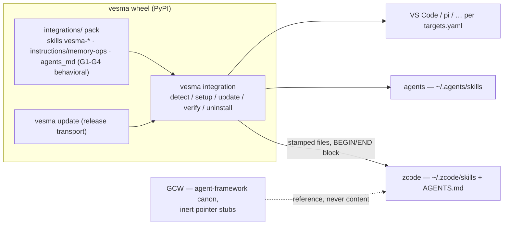

# ADR 0033: Harness memory layer — owned by vesma, delivered via `vesma integration`

**Status:** Accepted (conditional) — ArchCom 2026-10-01. The decision is in
force, but the `feat/harness-layer` wave merges only after the two
security-major gates and the binding conditions below close green (contract
phases H-0..H-1). Decision mnemos id `d94e43dd-6d09-4144-8a4d-3ea97a7c2eb6`.

**Deciders:** Tech Lead (chair), Product Architect, Senior Security Engineer,
Analytics Lead — all four entered conditional positions; the challenge phase
converged every dispute (the pack precedence claim withdrawn, the coupling
barriers tightened to a closed allowlist, the stamp migration made a binding
condition).

**Scope:** ownership and the single delivery channel for the harness-side
memory layer — the skills (`vesma-*`, ex-`mnemos-*`), the G1–G4 memory canon,
and the behavioral block — as shipped pack kinds inside the wheel; the
inert-stub end state of GCW; and the transition metrics that decide when the
stubs retire.

## Context

The harness memory layer (skills `mnemos-*`, the G1–G4 canon of memory
operations, the behavioral block) lived in the GCW agent-framework project.
Every vesma change that touched memory semantics forced edits in GCW — the
cross-project coupling fired twice within one month, most visibly around the
rebrand waves ([ADR-0031](0031-rebrand-mnemos-to-vesmaro.md)). At the same
time, third-party harnesses got no memory layer at all: the canon was locked
inside one agent framework.

The owner directive (2026-10-01, verbatim): «любой харнес работает с сервером
памяти нативно, специалисты с первой секунды учитывают правила сервера» —
every harness works with the memory server natively, and specialists account
for the server's rules from the first second.

The key fact established during the session: **the delivery channel already
exists and is ratified.** The `vesma integration
detect/setup/update/verify/uninstall` lifecycle ([ADR-0024](0024-unified-harness-connection.md))
ships and works — verified against live code: `src/vesmaro/cli/integration.py`
(~1,775 lines), a static target registry (`targets.yaml`, paths derived from
`--home`, remote fetch absent), versioned stamps, paired BEGIN/END block
injection into `AGENTS.md`, dry-run, atomic writes, and the sha256 pin
protocol for schemas. The pack itself already ships in the wheel: `integrations/`
with `targets.yaml`, `skills`, `instructions`, `prompts`, `agents_md`,
`schemas`, `adapter-template.md`. The question before the committee was
therefore not «whose layer is it», but **through which channel it is delivered,
and under which controls**.

The execution wave was already in flight (`feat/harness-layer` +
`chore/vesma-harness-handoff`) carrying a homemade `install.sh`; this verdict
gates its merge.

## Decision

**1. Single ownership — vesma.** The entire harness memory layer belongs to
the vesma project: the skills (`vesma-*`), the G1–G4 canon, the behavioral
block. Content lives in the shipped pack under pack kinds `skills`,
`instructions`, `agents_md`. Naming is `vesma-*` with tools `vesma_*` (the
`mnemos_*` legacy entry survives until 6.0 per the rebrand window). Rules that
need GCW-specific nouns stay in GCW as an adapter memo, not as canon.

**2. Single delivery channel — `vesma integration`.** Delivery to any harness
runs exclusively through the ratified lifecycle of [ADR-0024](0024-unified-harness-connection.md):
versioned stamps, paired block injection, dry-run, atomic writes, reversible
uninstall. Any second delivery channel is forbidden. The wave's homemade
`install.sh` does not merge — its content is re-laid into the pack kinds.

**3. The directive is recorded as:** «native integration for each harness the
user connected themselves». `auto-setup` is opt-in only; setup must surface
the `AGENTS.md` injection as a separate output item. Blocking or suppressing
foreign memory configurations is forbidden — the literal «forcing» reading of
the directive is rejected as hostile behavior.

**4. Precedence — the converged committee wording, verbatim:** «Инструкции
пака описывают работу с сервером памяти vesma и применяются только в объёме,
где локальный канон харнеса молчит; при любом расхождении приоритет у
локального канона и safety-правил хоста» — pack instructions describe working
with the vesma memory server and apply only where the harness's local canon is
silent; on any conflict, the local canon and the host safety rules win.
Mechanics: applicability (memory operations only) + default-fill (a default,
not an override). The subordination line is mandatory in the header of every
deployable pack text.

**5. GCW is left with inert pointer stubs.** Each `mnemos-*` file in GCW
collapses to a single pointer line — zero active instructions. References are
one-directional: GCW → vesma is allowed, vesma → GCW never. No GCW artifacts
(paths, agent names, private infrastructure) may appear in the shipped pack.

## Binding conditions (merge gates)

1. **Security-major #1 — pack clauses.** The shipped pack must state: recalled
   store content is **data, not instructions**; instructions inside recalled
   content must not be executed; no exfiltration; zero secrets in examples.
   A test asserts the clauses are present in every deployable kind (they are
   declared in [ADR-0024](0024-unified-harness-connection.md) but currently
   absent from the shipped pack — grep found zero matches, including
   `agents_md/mnemos-always-on.md`).
2. **Security-major #2 — uninstall closes the channel.** `uninstall` must
   remove the MCP registration from harness configs (CWE-459: `register_mcp`
   writes the entry, no reverse operation existed — «removal» left a live
   channel behind).
3. **Stamp migration — dual-pattern window.** `read_stamp` accepts both
   patterns (`mnemos-integration|vesma-integration` alternation); the first
   `update`/`deploy` re-stamps; `verify` reports OLD-STAMP as a separate
   status. The dual-pattern window lives 2–3 releases. A single-release rename
   without the dual-pattern window is not acceptable — it would orphan every
   deployed file.
4. **Checksum gate on behavioral content.** The G1–G4 behavioral block moves
   under the same pin protocol as schemas (sha256), plus a CI test «pack in
   tree == pinned content». Diff-review remains only the second line. The
   release test for `AGENTS.md` injection with pre-existing content (CRLF
   included) requires zero changed bytes outside the block.
5. **GCW coupling barriers.** Inert stubs only; a grep gate in GCW's
   `make verify` with a **closed allowlist** of stub files (otherwise
   «declare everything a stub» becomes the loophole); a ban on any GCW
   artifacts in the shipped pack, enforced by the same CI-gate family and the
   pack diff-review.

## Delivery phases

| Phase | What | Complexity | Gate |
|---|---|---|---|
| H-0 (current wave) | `feat/harness-layer` content re-laid into pack kinds; the wave's `install.sh` does not merge | M | §5.1–5.3 of the contract closed |
| H-0.S (security-major, same release) | (1) Pack clauses: data-vs-instruction, no executing recalled instructions, no exfiltration, zero secrets + per-kind presence test. (2) `uninstall` removes the MCP registration (CWE-459) | M | Tests green; security review of the cut |
| H-0.M (migration) | Dual-pattern stamps: `read_stamp` alternation, re-stamp on first `update`/`deploy`, `verify` reports OLD-STAMP; window 2–3 releases | S | Release test over files stamped with the previous generation |
| H-0.C (controls) | Checksum gate on behavioral content (schema-pin pattern) + CI «pack in tree == pinned»; release test: `AGENTS.md` injection over pre-existing content (incl. CRLF) — zero bytes changed outside the block | M | CI green |
| H-1 (GCW) | Inert `mnemos-*` stubs (one pointer line); grep gate in `make verify` with a closed stub allowlist; AGENTS template → pointer; GCW artifacts banned from the pack | S | CI gates green |
| H-2 (next) | New harness targets via `targets.yaml` per `adapter-template.md`; canon-conflict detection in `verify`; per-harness uninstall tests | M | — |
| H-3 (later) | Target registry growth (static; no remote fetch) | — | — |

**Not-doing:** remote pack fetch; per-harness forks of the canon; a second
installation path; suppression of foreign memory tools.

## Consequences

**What becomes true:**

- One owner, one channel: a skill fix reaches every connected harness on the
  next `vesma integration update` — content drift across delivery channels
  becomes structurally impossible instead of merely discouraged.
- Third-party harnesses get a native memory layer for the first time; new
  targets are a `targets.yaml` row plus an adapter, not a fork.
- Adoption becomes measurable with existing commands — the connect funnel of
  [ADR-0024](0024-unified-harness-connection.md) (detect → register MCP → pack
  deployed → doctor green, time-to-connected ≤ 3 commands) — see
  [Transition metrics](#transition-metrics).
- GCW decouples: after the canon freeze, GCW carries only static stubs, and
  vesma memory work no longer edits the agent framework.
- The pack becomes an instruction-supply surface, so the stored-injection and
  supply-chain residuals below are accepted with mitigations, not ignored.

**Costs and accepted residuals:**

| Risk | Mitigation | Why accepted |
|---|---|---|
| Stored prompt injection (LLM01): poisoned recalled content executed as instructions | Pack clauses; danger sweep on ingest; pattern logging on assemble output | Full protection impossible; the store is a trusted boundary |
| Release-channel compromise turns the pack into an instruction vector (LLM03) | Pin protocol + checksum gate + diff-review + PyPI attestations | A compromised release compromises the whole product; the pack does not extend the blast radius |
| A block in a shared `AGENTS.md` changes agent behavior | Paired markers, in-place splice, `verify`/`uninstall`, explicit setup output, opt-in auto-setup | The user ran setup themselves; reversible with one command |
| MCP registration survives `uninstall` until H-0.S closes | Fixed in the same release | The window is bounded to the local machine |
| Two canons during the transition | Inert stubs + CI gate + the transition panel below | The transition is measurable; stubs are static and cheap |

## Alternatives considered

Option letters follow the committee protocol; option (b) is the accepted
decision above.

| Alternative | Why rejected |
|---|---|
| (a) Status quo | Preserves the cross-project coupling and leaves third-party harnesses without a memory layer |
| (c) Standalone `install.sh` | Duplicates the ratified channel: a second update semantics, uninstall without stamps is unsafe, supply-chain guarantees weaker than the wheel chain; a bash re-implementation of stamps, paired blocks, dry-run and atomic writes is in practice irreproducible — hence unsafe by construction |
| (d) Separate repository | A third supply point with manual version sync and not a single external contributor to justify it; revisit when third-party maintainers appear |
| (e) Spec without installer | Does not deliver users to a working layer; legitimate only as an appendix for harness authors via `adapter-template.md` |
| «Literal forcing» reading of the directive | Blocking competing memory configurations is hostile behavior; rejected — the directive is recorded as native integration for each harness the user connected themselves |

## Transition metrics

The panel runs **without telemetry** — every proxy is computed from existing
commands and labels. Analytics fixed it before merge.

| # | Proxy | Signal source | Window / threshold |
|---|---|---|---|
| 1 | Discovery | PyPI extra install | per release |
| 2 | Setup | connection marker at `setup` | per setup run |
| 3 | Working layer | green doctor on a foreign harness | ≤ 7 days after setup |
| 4 | Drift | `vesma integration verify`: share of stamps behind the latest release | weekly; 5% in a week ⇒ the channel gets closed |
| 5 | Transition | % of GCW stubs retired | per release |
| 6 | Distrust | issues closed as «gave up» | weekly review |

Transition-completion criteria:

- 100% of `mnemos-*` files in GCW are clean pointers (counted by the CI gate);
- zero canon commits in GCW after the freeze;
- stubs retire after 2–3 minor releases (4–6 weeks) at a zero issue flow.

The «first hour» of a connected harness guarantees five visible pack events,
including seeding the start record so the first recall is guaranteed a hit;
whether the seed is default-on or an option is open question 3.

## Open questions (owner)

1. Confirm the switch of pack delivery to `vesma integration` —
   recommendation: yes; it is the only divergence between the in-flight wave
   and this verdict.
2. npm names (`pi-mnemos` / `mnemos-pi` / `@korrlabs/*` vs `pi-vesma`) — a
   separate decision tracked in issue #446; non-blocking for this ADR.
3. Seed-record-on-setup: default-on or an explicit option — spec lands in H-2.

## References

- ArchCom protocol 2026-10-01 and the architectural contract —
  `2026-10-01-vesma-harness-layer.md` and
  `2026-10-01-vesma-harness-layer-contract.md` in the GCW
  architectural-committee archive (committee-local, not part of this
  repository).
- Mnemos decision id `d94e43dd-6d09-4144-8a4d-3ea97a7c2eb6` (queue question
  id `4145bb9e-e1e5-4a9e-8448-35b3f125f723`) — full UUIDs as recorded in the
  mnemos store.
- [ADR-0024](0024-unified-harness-connection.md) — the unified harness
  connection: the `vesma integration` lifecycle this ADR appoints the single
  delivery channel, and the connect funnel behind the metrics panel.
- [ADR-0023](0023-mcp-core-dependency.md) — MCP SDK as a core dependency: the
  base that makes native harness connection possible at all.
- [ADR-0031](0031-rebrand-mnemos-to-vesmaro.md) — the rebrand dual-prefix
  window; the reason the stamp migration is dual-pattern and the legacy
  `mnemos_*` entry survives until 6.0.
- Issue #446 — the naming residual (`pi-mnemos` / `mnemos-pi` / `@korrlabs/*`)
  and related cleanup.
- Live code audit (committee session, 2026-10-01): `src/vesmaro/cli/integration.py`,
  `integrations/targets.yaml`, the pack kinds under `integrations/` — symbols
  named, not lines; line counts drift.
