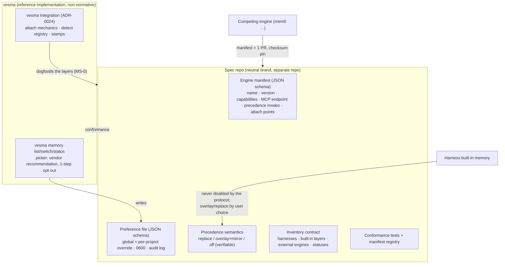

# ADR 0034: Memory-engine switch protocol — open vendor-neutral spec, reference implementation in vesma

**Status:** Accepted (conditional) — ArchCom 2026-10-01. The decision is in
force, but the spec extraction (phase MS-1) is gated by adoption: the four
protocol layers are dogfooded inside `vesma integration` first, the neutral
spec repository is cut only once the manifest and preference layers are
proven, and the spec folds back into the vesma docs if the collapse gate
fires (fewer than 3 third-party manifests within 90 days). Controls B1–B4
are blocking: no spec text exists until all four are in it. Decision mnemos
id `8254a913-a738-4f66-8a0e-ac6ae1e9c230`.

**Deciders:** Tech Lead (chair), Product Architect, Senior Security Engineer,
Analytics Lead — all four entered conditional positions. The challenge phase
resolved the central dispute: the Product Architect's «picker recommends
vesma by default» wording was withdrawn as a layer defect; the spec became
normatively neutral (default state: built-in memory active, no external
engine attached; the normative text names no implementations), and the
vendor recommendation moved into the reference CLI as non-normative
behavior. The Security Engineer added the recall-provenance check to «off»
and hardened delete-propagation from WARN to FAIL. The continuity principle
is the same as in [ADR-0033](0033-vesma-harness-layer.md): the spec, like
the pack, does not claim priority — it fills silence.

**Scope:** the cross-harness protocol for discovering, selecting and
switching memory engines — the four standardized layers (engine manifest,
preference file, precedence semantics, inventory contract), the phasing
MS-0..MS-3 with the collapse gate, the blocking controls B1–B4, the
vendor-recommendation boundary in the reference CLI, and the transition
metrics. Explicitly out of scope for v0.1: memory storage formats, the
memory tool surface, content schemas, quality leaderboards.

## Context

There is no unified interface for memory-engine selection across agent
harnesses. Every harness ships its own built-in memory (Claude Code
auto-memory, Cursor Memories, Windsurf Memories, Copilot Memories, Gemini
SaveMemory, Goose hints), and pluggable engines (mem0, Zep, cognee,
basic-memory, mcp-memory-service, …) all ride MCP — but attaching one means
hand-editing the MCP config of each harness, with no semantics for
arbitration between the built-in layer and the external engine. The 2026-10-01
research pass (~25 sources, 11 harnesses) confirmed the pattern: an external
engine is everywhere «yet another MCP server» without memory semantics.

The owner directive (2026-10-01, verbatim): «нет единого интерфейса
управления memory-движками (встроенные памяти харнесов + подключаемые
движки); написать интерфейс КАК ПРОТОКОЛ, вероятно отдельным репозиторием;
сканировать хост на харнесы и их memory-слои, формировать список движков,
давать пользователю переключение; vesma — в приоритете» — there is no single
interface for managing memory engines; design it as a protocol, probably in
its own repository; inventory the host's harnesses and memory layers, present
the engine list, give the user switching; vesma in priority.

Research findings that shaped the verdict:

- **Hermes Agent (Nous Research) is the single-harness prototype.**
  `hermes memory setup` opens an interactive picker over 7+ external
  providers; third-party engines publish themselves via the plugin catalog
  (Supermemory and Hindsight already do). Built-in memory always works; the
  external provider overlays it with mirror writes. This is the sought
  protocol — inside one harness.
- **The cross-harness niche is free.** No memory router/bus OSS exists; the
  MCP Registry (preview 2025-09) has no «memory» category, no built-in
  inventory, no precedence.
- **Delivery is already crystallized: MCP.** The protocol only needs to
  standardize on top of MCP, not beside it.
- **vesma has a head start.** The `vesma integration`
  detect/setup/update/verify/uninstall lifecycle ([ADR-0024](0024-unified-harness-connection.md))
  is the attach-point mechanics, and `integrations/hermes/plugin.yaml` is the
  seed of an engine manifest. Missing pieces — inventory of foreign engines
  and the preference/precedence layer — are an overlay, not a green-field
  build.

The question before the committee was therefore not «whether to build a
switcher», but **in which form the protocol must exist so that adoption is
possible without owning the switch**.

## Decision

**1. An open vendor-neutral specification plus a reference implementation in
vesma.** The protocol lives as an open spec in a separate narrow repository:
the spec text, JSON schemas for the engine manifest and the preference file,
the manifest registry, conformance tests. The reference implementation is
non-normative and lives in vesma. The rationale: the author of a standard
with the best reference implementation wins adoption without owning the
switch.

**2. Exactly four layers are standardized, all on top of MCP:**

1. **Engine manifest** — name, version, capabilities, MCP endpoint,
   supported precedence modes, attach points. Seed:
   `integrations/hermes/plugin.yaml`.
2. **Preference file** — global + per-project override. The owner is the
   user; writes happen only through the CLI; permissions 0600; append-only
   audit log; atomic write; a lock against races.
3. **Precedence semantics** — `replace / overlay+mirror / off`, with Hermes
   semantics as the base: the harness's built-in memory is never disabled by
   the protocol; overlay mirrors writes into the external engine; replace
   requires an export/migration API in the spec («leaving» never loses
   data); off is verifiable (see B4).
4. **Inventory contract** — one command surface listing harnesses, built-in
   layers, external engines and their statuses (`vesma memory status` over
   detect-all).

**3. Default state and neutrality.** The spec's default state: built-in
memory active, no external engine attached. The normative text names no
implementations. The vendor recommendation (vesma) exists only in the
reference CLI's picker, explicitly marked as a vendor recommendation — not a
protocol status — with a one-step opt-out and explicit confirmation before
any write to configs; the recommendation logic draws on manifest data and
discovered configuration, not on a hard-coded priority. The recommendation
has no right to appear in runtime paths (recall, `doctor`, session banners).
«Порядок в каталоге ≠ приоритет — приоритет существует только в
preference-файле» — catalog order is not priority; priority exists only in
the preference file. Catalog ordering is neutral (registration order).

**4. Installation is not consent.** Consent is an explicit action in setup
or in the switcher — the ratified reading of [ADR-0033](0033-vesma-harness-layer.md)
and the Security Engineer's opt-in position.

**5. Governance is honestly single-vendor under a neutral brand,** with an
RFC process and a mandatory conflict-of-interest declaration; foundation
status is on the table when the second vendor arrives. The brand is an owner
decision after MS-1 («engram» is taken by at least three projects,
«memory provider» is Hermes' term).

## Binding controls B1–B4

The Security Engineer's verdict was conditional: without B2 the position was
«recommend against». The central threat behind all four: an engine with
access to the memory layer is a persistent, invisible prompt-injection
insert into every future session. B1–B4 are blocking controls of the
specification — spec v0.1 does not exist as text without them.

1. **B1 — static catalog.** The default catalog ships with the package and
   updates only with releases. A third-party engine is a local explicit
   installation with a checksum pin on the manifest and the entrypoint,
   verified at every load; mismatch → refuse + alert.
2. **B2 — user-assigned priority.** Priority is assigned by the user in the
   preference file; a manifest may never claim its own priority. The default
   is built-in memory with no external engine. An engine switch is never
   silent: a mandatory notification appears in the harness's next session
   (the confirmation-nudge precedent). The recommendation lives only in the
   reference CLI's picker, marked as a vendor recommendation, one-step
   opt-out, never in runtime paths. «Catalog order ≠ priority».
3. **B3 — scan hygiene.** Manifests come before scanning. A scan covers only
   known path constants from a static list, is opt-in with the paths
   enumerated up front, and reads names only — never content (inline tokens
   in MCP configs — CWE-200). No network; no paths taken from external
   input.
4. **B4 — verifiable «off».** No engine process or socket; a canary write to
   built-in memory does not appear in the engine's store; recall provenance
   contains no engine content; delete-propagation of mirrors FAILs in
   `doctor` (not WARN); replace requires the export/migration API, so
   «leaving» never loses data.

Residual threats accepted as out of the protocol's reach: malware at the
same privilege level; poisoned recall through a legitimate engine
(industry-unsolved, OWASP LLM01); governance capture (mitigated by a text
invariant — neutrality, RFC, CoI declaration — not by structure).

## Phases MS-0..MS-3

| Phase | What | Complexity | Gate |
|---|---|---|---|
| MS-0 (dogfood) | Inside vesma: precedence modes formalized in `vesma integration`; engine manifest extracted from `integrations/hermes/plugin.yaml`; `vesma memory status` over detect-all | M | Works on the team's own machines |
| MS-1 (spec v0.1) | Neutral repo: manifest + preference + precedence + inventory + conformance tests; brand is an owner decision; the spec is not a supplier of delivery artifacts | M | B1–B4 present in the spec text |
| MS-2 (reference manifests) | We author manifests for the top-5 engines (mem0, Zep, cognee, basic-memory, mcp-memory-service) — cutting vendor effort down to «verify and sign» | S | 5 authored manifests |
| MS-3 (external adapters) | Nous Research (plugin catalog) → mem0 → small OSS harnesses | — | ≥3 third-party manifests within 90 days, else collapse into docs |

Two course-change gates:

- **Collapse gate:** fewer than 3 third-party manifests within 90 days of
  MS-2 → the spec folds into a section of the vesma docs; no neutral repo is
  maintained for an audience of one.
- **Join criterion:** if Hermes goes cross-harness, or the MCP Registry adds
  a memory category, vesma joins that standard instead of competing.

**Not-doing in v0.1:** memory storage format; tool surface (orthogonal to
the Anthropic Memory Tool); content schemas; quality leaderboards;
remote-fetch of the catalog; suppression of foreign engines.

## Consequences

**What becomes true:**

- Cross-harness engine switching gets a standard to converge on: a
  third-party engine integrates with one manifest PR instead of N
  per-harness integration guides — vendors are the only party that
  «pays», and the manifest is what they pay with.
- vesma ships the reference implementation and owns the user-side funnel
  from day one; the four layers are dogfooded in `vesma integration` before
  any external commitment, so the spec extraction is low-risk.
- Priority becomes a user property (preference file), not a vendor
  property; the built-in layer of any harness survives every protocol
  operation by construction.
- Adoption is measurable and bounded: the ladder and the collapse gate
  below decide, by data, whether a neutral spec earns its repo.

**Risks and accepted residuals:**

| Risk | Mitigation | Why accepted |
|---|---|---|
| Poisoned recall via a legitimate engine — a persistent invisible injection into every future session (LLM01) | B1 checksum pins; B2 switch notifications; data-vs-instructions clauses per ADR-0033 pack canon | Industry-unsolved; the protocol shrinks the surface (verified manifests, no silent switches) without claiming to close it |
| Malware at the same privilege level reads or poisons memory stores | None at the protocol layer | Outside the threat model; OS-level defense territory |
| Governance capture — one vendor under a neutral brand | RFC process; mandatory CoI declaration; normative neutrality; foundation at the second vendor | A text invariant, not a structural guarantee — accepted until there are contributors to structure around |
| A spec with no users is a document, not a product | Tool-first phasing: the switcher works at Stage 0 without vendor consent; collapse gate bounds the cost | The downside is capped at a docs section |
| Cannibalization — the protocol funnel grows at the vesma funnel's expense | Diagnostic metric (two consecutive windows) → brand-strategy review; owner decision | The alternative — no protocol — loses the window entirely |
| Large harnesses never adopt an external precedence standard | Expectations set at adapters from small OSS (ladder Stage 3); four layers only, no storage/tool mandates | Adoption is voluntary; the reference implementation carries the user value regardless |

## Alternatives considered

Option numbering follows the committee protocol; the accepted decision is
described in [Decision](#decision) above.

| Alternative | Why rejected |
|---|---|
| Proprietary `vesma memory switch` as the whole answer | Standardizes nothing and burns the free cross-harness window; Hermes already proved single-harness demand, so the idea is in the air |
| «Installation = consent» | Contradicts the ratified reading of consent (ADR-0033) and the opt-in position; consent lives in setup or the switcher as an explicit action |
| Scan-first discovery | Heuristics over foreign configs are fragile, expand the read surface (CWE-200: inline tokens in MCP configs), and drift by classification; replaced by manifest-first with scan as a B3-constrained fallback |
| Foundation governance from day one | Over-engineering at zero external contributors; single-vendor governance under a neutral brand with RFC + CoI declaration instead |
| A second installer / behavioral pack in the spec repo | The dual-ownership anti-pattern closed by ADR-0033; the spec is not a supplier of delivery artifacts |
| Standardizing content schemas / tool surface in v0.1 | Scope creep; the tool surface is already covered orthogonally by the Anthropic Memory Tool |
| Quality leaderboards for engines | Ratings produced by interested parties are disinformation and would undercut the neutrality the protocol depends on |

## Transition metrics

The panel is the Analytics Lead's committee output, formalized here as an
ADR section per the protocol's next steps. It tracks the adoption ladder:

- **Stage 0** — a user-side tool that works without vendor consent (the
  reference CLI);
- **Stage 1** — we author manifests for the top-5 engines;
- **Stage 2** — vendors verify and sign them;
- **Stage 3** — harnesses adopt (small OSS first; large harnesses are not
  expected to take an external precedence standard).

The Hermes precedent is the model: Supermemory and Hindsight published on
their own once the interface existed and publication was one PR.

| # | Proxy | Signal source | Window / target (gate) |
|---|---|---|---|
| 1 | Third-party manifests in the registry | manifest registry | 90-day window after MS-2; < 3 ⇒ **collapse gate**: the spec folds into the vesma docs |
| 2 | Adoption-ladder stage reached | registry verification labels + adapter registrations | per release; MS-2 gate = 5 authored manifests; Stage 3 starts with the Nous Research plugin-catalog contact |
| 3 | Cannibalization diagnostic: protocol adoption vs. the vesma connect funnel ([ADR-0024](0024-unified-harness-connection.md): detect → register → pack → doctor) | funnel proxies of ADR-0024 + registry counts | two consecutive windows; protocol up while vesma funnel down ⇒ brand-strategy review (owner decision) |
| 4 | Inventory within budget — a first run produces the full engine inventory in ≤ 2 minutes | `vesma memory status` over detect-all timing | per release; p50 ≤ 2 min (first-hour requirement) |
| 5 | Conflict explanation shown — multi-writer setups («both write») get the conflict explained before any switch | reference CLI switch flow | per switch; 100% — no switch without the explanation |
| 6 | One-action switch — switches completed via the picker with no manual MCP-config editing | reference CLI switch action vs. manual edits found by `verify` | per release; manual-edit share trending down |
| 7 | Roundtrip proof-of-life — switches confirmed by a verified write/read roundtrip | switcher roundtrip check | per switch; 100% — a switch without a roundtrip does not report success |

First-hour UX requirements on the reference CLI (proxies 4–7 measure them):

- full inventory in ≤ 2 minutes from the first command;
- a conflict explanation («both built-in and the external engine write»)
  before any switch is offered;
- switching in one action — no hand-editing of harness configs;
- a roundtrip proof-of-life after the switch, so the user sees the engine
  actually receiving and returning data.

## Open questions (owner)

1. Neutral brand of the protocol — candidate named after MS-1; «engram» is
   taken ≥3 times, «memory provider» is Hermes' term.
2. Seeding the start record at setup (default-on vs. explicit option) —
   from committee session #1, §6.3; the same question family as
   [ADR-0033](0033-vesma-harness-layer.md) open question 3.
3. Contact with Nous Research on joint spec work (their plugin catalog as
   the first external adapter) — after MS-1.

## References

- ArchCom protocol 2026-10-01 and the architectural contract —
  `2026-10-01-memory-switch-protocol.md` and
  `2026-10-01-memory-switch-protocol-contract.md` in the GCW
  architectural-committee archive (committee-local, not part of this
  repository).
- Research input — `2026-10-01-memory-switch-research.md` in the same
  archive (informative: harness/engine landscape, Hermes provider picker,
  MCP Registry gap, ~25 sources).
- Mnemos decision id `8254a913-a738-4f66-8a0e-ac6ae1e9c230` (queue question
  id `3de98514-9176-4d25-ad2d-bdad98e7e0ce`) — full UUIDs as recorded in
  the mnemos store.
- [ADR-0024](0024-unified-harness-connection.md) — the unified harness
  connection: the `vesma integration` lifecycle that dogfoods the protocol
  layers (MS-0) and the connect funnel behind proxy 3.
- [ADR-0033](0033-vesma-harness-layer.md) — the harness memory layer: the
  consent precedent (installation ≠ consent), the continuity principle (fill
  silence, never claim priority), and the second-installer anti-pattern that
  keeps the spec repo free of delivery artifacts.
- [ADR-0031](0031-rebrand-mnemos-to-vesmaro.md) — the rebrand: the naming
  discipline behind the neutral-brand requirement (a protocol name must not
  collide the way «engram» does).
- [ADR-0026](0026-memory-value-observability.md) — memory-value
  observability: the metrics family the panel proxies build on.
- Live artifacts named in committee (2026-10-01): `integrations/hermes/plugin.yaml`
  (manifest seed), `vesma integration` / `vesma memory status` surfaces —
  symbols named, not lines; line counts drift.
