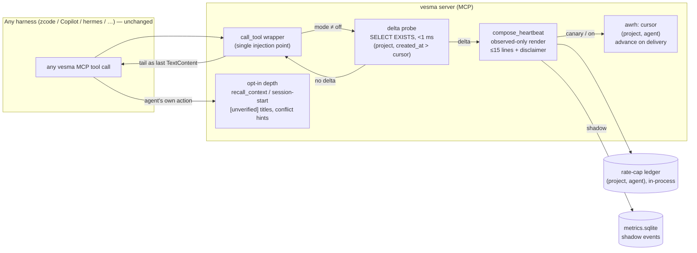

# ADR 0035: Native awareness delivery — doorbell-heartbeat on every MCP response

**Status:** Accepted (conditional) — ArchCom 2026-10-01. The decision is in
force; the `feat/native-awareness-heartbeat` wave lands wave 0 (shadow) first,
and the default flips to `on` only after the wave 0/1 gates below close green.
Decision mnemos id `2b1fade5`.

**Deciders:** Tech Lead (chair), Product Architect, Analytics Lead, Senior
Security Engineer, Senior System Engineer (feasibility, invited by the chair)
— all five entered conditional positions. The challenge phase resolved the one
substantive dispute — `[unverified]` titles in the unsolicited tail (C11) — in
a dedicated Product Architect ⇄ Security round that produced the doorbell
form. The System Engineer corrected two assumptions before acceptance: the
existing awareness cursor is session-scoped (C14 had to change), and the
literal «ALL tools» reading is a bug (double delivery on `assemble_context`).

**Scope:** how the awareness picture of peer activity — the owner's «око/рой»,
the all-seeing eye and the swarm — reaches the agent natively, without manual
invocation and without changes to foreign harnesses: the three-layer contour
(heartbeat / opt-in depth / hooks), the binding conditions C11–C14, the
config flag, and the shadow → canary → default-on phasing. Out of scope: the
content of the depth surfaces (owned by the awareness core and
[ADR-0027](0027-multi-context-memory.md)), MCP server-push, the REST leg.

## Context

The owner's directive (2026-10-01): the eye and the swarm are killer
features; they must work natively in every harness connected to vesma, and a
manual invocation destroys the value. The Tech Lead's minimal variant —
inject awareness only into `recall_context` — was rejected by the owner as a
half-measure: «в первый вызов рекол сделает, а дальше?.. нужен синк на каждом
шагу или как?» ("recall will cover the first call, and then what?.. do we
need a sync on every step, or what?").

The transport frame is fixed: MCP is request-response; the server never
pushes into the conversation. «Native» therefore means exactly one thing —
awareness must ride the calls agents already make. Anything that requires
harness cooperation is not v1 by definition, because foreign harnesses cannot
be asked to change.

QA on 2026-10-01 confirmed the gap: the data accumulates on its own, the
render is ready, and there is no delivery. The only surfaces today are the
explicit `mnemos_awareness` tool (nobody calls it) and hooks with
`include_awareness=true` (no harness passes it). The committee's question was
therefore not «whether to deliver natively» but which mechanism carries it,
at what cadence, on which surfaces, and under which controls — without
breaking the cache contract, the token budget, or the trust boundary.

## Decision

**A three-layer doorbell-heartbeat contour.** The key compromise, converged in
the challenge round: the unsolicited channel carries only server-observed
facts — depth with `[unverified]` titles arrives only where the agent came by
itself. The trust boundary coincides with the request boundary; freshness is
native.

1. **Heartbeat (Now, v1).** A delta-gated, observed-only awareness tail on
   the responses of all MCP tools, attached through a single injection point
   — the `call_tool` wrapper in `mcp_server.py`. The tail is one appended
   `TextContent` after the handler, ≤15 lines (~200 tokens), with a
   disclaimer frame. It is composed only when peers wrote after the last
   delivered cursor position; no delta → the field is absent entirely and the
   response is byte-identical to the pre-feature response (C13, the tail-LAST
   discipline of [ADR-0028](0028-cache-contract.md)). The cursor advances on
   delivery, not on compose. This answers the owner's «sync on every step?»
   structurally: delivery happens on the first call after a peer write, so
   the cost is proportional to peer activity, not to call count.
2. **Opt-in depth (surfaces the agent visits itself).** The full picture with
   `[unverified]` titles and conflict hints rides `recall_context`,
   session-start, and explicit calls — the surfaces an agent reaches by its
   own action, where requesting depth is consent.
3. **Hooks (`assemble_context` / `pre_llm_call`) — Next.** The channel for
   harnesses under our control via the vesma pack
   ([ADR-0033](0033-vesma-harness-layer.md)); not part of v1 because it
   requires harness cooperation.

### Binding conditions C11–C14

1. **C11 — heartbeat v1 is observed-only.** The unsolicited tail carries only
   what the server measured: peer names (sanitized agent ids, one line, no
   markdown or control characters — client-supplied text is a CWE-74 /
   OWASP LLM01 vector and does not travel), record counts, timestamps — plus
   exactly one server-side action flag line. The flag line is
   **descriptive-only**: no directive lexicon («urgent», «act now»), no
   policy semantics, no pinnable phrasing; the disclaimer frame is mandatory.
2. **C12 — a cheap probe.** The delta check is a standalone
   `SELECT EXISTS(1 FROM memories WHERE project=? AND created_at>? AND
   status!='archived')` in the sqlite store — no hydration (the current
   `_window_rows` hydrates 200 rows per call: CWE-770 class cost on every
   invocation). One-line index migration:
   `CREATE INDEX IF NOT EXISTS idx_memories_project_created ON
   memories(project, created_at)`; probe cost <1 ms; an `agent ≠ caller`
   post-filter. A probe failure suppresses the tail with a warning and a
   counter — the tool call itself is never touched. A negative cache
   (TTL 2 s) is added only if shadow shows the probe needs it.
3. **C13 — byte identity of the default.** No delta → the response is
   byte-identical to the pre-feature version, pinned by a CI test. The tail
   is a separate block (lane=awareness), never inline; `assert_awareness_tail`
   extends to cover it. A deny-list of surfaces never carries the tail:
   `mnemos_assemble_context` (it already composes the full picture — attaching
   the tail there means double render and double cursor advance), export,
   federation.
4. **C14 — `awrh:` cursor and cap key.** The heartbeat gets its own cursor
   keyed `(project, agent)` under the new namespace prefix `awrh:` — the
   existing `awr:` encoding length-prefixes a 3-tuple, and a 2-tuple in the
   same namespace would alias at parse time. The cursor advances strictly
   before the response returns → **at-most-once** delivery (at-least-once is
   impossible in request-response — accepted explicitly); advancements are
   logged with identity. The rate-cap key is `(project, agent)` without
   session: session churn must not reopen the window; a restart resets the
   in-process ledger — a bounded, documented residual.

### Configuration

`awareness.native_heartbeat_mode: Literal['off','shadow','canary','on']`,
default `off` (the kill switch); env override
`VESMARO_AWARENESS__NATIVE_HEARTBEAT_MODE`. In `shadow` the tail is computed
and logged, never rendered. The REST leg carries no tail in v1 — a silent
text tail would break the typed JSON contract; a typed `awareness` field is a
v2 question.

The new `compose_heartbeat` copies the contour of the existing
`compose_pre_llm_awareness` (read → clamp → delta → render → advance) and
reuses `delta_blocks` / `render_awareness_section`; the existing pin is not
touched.

## Phases (shadow → canary → default-on)

| Phase | What | Complexity | Gate |
|---|---|---|---|
| Wave 0 — shadow | Probe + wrapper + render + events in `metrics.sqlite`; the tail is computed and logged, never rendered into responses; this ADR, the CI byte-identity pin, tests, docs | M (3–5 days) | delivery-as-intended ≥90% of sessions with a delta; rate-cap suppressions <5%; suppressed-demand ≈0; budget holds (tail ≤200 tokens, ≤2 deliveries / 5 min, tail's byte share of the response in norm); server compose time in norm |
| Wave 0.5 — pre-registration | Replay scenarios + ≥1 negative control (a scenario where the tail must NOT change the action — divergence there prices the noise), blind labeling, McNemar analysis plan — fixed before the run (E0 per [ADR-0025](0025-memory-meta-level-lanes.md)) | S | pre-registration protocol committed |
| Wave 1 — canary | `canary` on the team's vesma-pack/zcode machines (both sides ours), kill-switch, auto-rollback on budget breach | +S/M | engagement ≥50% (after the flag line, the agent called an opt-in surface); freshness p50 ≤60 s; token budget p95 ≤1000 tokens/agent-hour |
| Wave 2 — default-on | The default flips to `on` | +S | v1.1 gate: pull → changed action ≥40%; a null result is reported as a result |

Delivery notes:

- **Merge the wrapper first and early** — `mcp_server.py` is a hot file that
  waves W2b/W3 also touch.
- **Events** (counters and timestamps, zero content): `peer_write`;
  `delta_available`; `heartbeat_delivery` (tool, lines, token estimate, cursor
  before/after); `heartbeat_suppressed{no_delta|rate_cap|budget|presence_stale|probe_error}`;
  `tool_call` (name, ts, session); `conflict_hint_emitted`. Freshness =
  `peer_write.ts → delivery.ts`. Click-through is not measured directly —
  observed outcomes are.
- **The field read is a quasi-experiment**: a per-session flag by
  deterministic hash; outcomes from the audit log (duplicate task claims,
  conflicting records in the window, redundant `search` right after
  delivery).
- **Delivery is not value.** The passive-only-claims ban of
  [ADR-0026](0026-memory-value-observability.md) extends to awareness: only
  the causal gates (engagement, pull→action) can carry a value claim.

**Not-doing in v1:** no tail on the REST leg; no MCP server-push; no hooks
delivery; no conflict hints in the heartbeat; no `[unverified]` titles in the
tail as an automatic fallback.

## Consequences

**What becomes true:**

- **Zero changes in foreign harnesses.** Nativity is a property of the
  server, not of the harness: every harness that speaks MCP gets the
  heartbeat by construction, and new harnesses get it for free.
- **Freshness is structural.** The picture arrives on the first tool call
  after a peer write — the «sync on every step?» question dissolves; cost
  scales with peer activity, not with call count.
- **The trust boundary coincides with the request boundary.** The unsolicited
  channel carries only what the server observed; self-reported depth travels
  only where the agent asked for it. The doorbell split is a stronger product
  design, not a security concession.
- **No new outward leak class.** The tail lands in the agent's context;
  outward go only logs. That the tail discloses same-project peer presence is
  the existing boundary.

**Risks and accepted residuals:**

| Risk | Mitigation | Why accepted |
|---|---|---|
| Impersonation of agent/session on a local MCP suppresses another agent's awareness | Cursor advancements logged with identity; token-verified agent_id where available (agent tokens, mesh) | The class is not new (`pre_llm_call` is equally exposed); local-first deployment |
| Restart resets the rate ledger (≤2 extra deliveries) | Bounded by the cap key | Insignificant noise |
| Models ignore the flag line (engagement <50%) | Salience iterations: peer names and counters in the observed facts; rewording and placement of the flag line | Measured by the wave 1 gate; `(b)` titles are NOT enabled under metric pressure — a deliberate committee Later only |
| Probe failure mutes delivery | Suppress + warning + counter (`heartbeat_suppressed{probe_error}`) | Observable in metrics, never silent — silent degradation is banned by canon |
| `metrics.sqlite` unavailable | Events lost with an error counter (`MetricsStore._fail` pattern); the tail is not blocked | Telemetry must not stop the product |

## Alternatives considered

Option letters follow the committee protocol; the accepted decision is
mechanism B in doorbell form, described in [Decision](#decision) above.

| Alternative | Why rejected |
|---|---|
| (A) bootstrap-only — inject into `recall_context` only | Half-measure: the picture goes stale within minutes; rejected by the owner, confirmed by the committee. Survives as one opt-in depth surface, not as the freshness channel |
| (F) explicit probe / manual call | Preserves exactly the pinning problem the directive exists to kill; rejected by the owner |
| (E) MCP server-push as v1 | Uneven client support (zcode has none) plus a new listening surface; Later as a progressive enhancement |
| (D) pre-LLM hook as v1 | Requires harness cooperation — breaks the «every harness, zero changes» promise; Next for vesma-pack/zcode ([ADR-0033](0033-vesma-harness-layer.md)) |
| (C) on-write delivery as a standalone mechanism | Read-heavy agents without their own writes go blind; absorbed into B as a subset |
| `(b)` `[unverified]` titles in the tail as an automatic fallback | A fallback fired by metric pressure is a silent degradation of the trust boundary; recorded as a deliberate Later decision on engagement-funnel data, with explicit committee review |
| Immediate default-on | Bypasses the pre-registration discipline of [ADR-0025](0025-memory-meta-level-lanes.md) / [ADR-0026](0026-memory-value-observability.md); replaced by shadow → canary → default-on |

## Follow-ups (deliberate Later)

- **`(b)` titles in the tail** (cap 80 + disclaimer) — a conscious Later
  decision on the wave 1 engagement funnel. If engagement stays <50% after
  salience iterations, the committee revisits deliberately, never
  automatically. Conflict hints in the heartbeat travel with `(b)`: they
  derive from client text and stay on opt-in surfaces until then.
- **REST leg** — a v2 question: a typed `awareness` field in the JSON
  contract, not a silent tail.
- **MCP server-push** — a progressive enhancement when supporting clients
  appear.
- **W5d naming is not touched**: the existing `compose_pre_llm_awareness`
  pin is preserved; the new `compose_heartbeat` copies its contour.

## Addendum (2026-10-01, same session): persistent envelope + relevance filling

**Origin — the owner's proposal:** do not spend tokens on owning the
situation; the engine and cortex check the field under the hood
continuously — at zero token cost for checking — and add to the context a
strictly fixed volume of meta-layer, «just enough to know who is doing
what around» («ровно столько, чтобы понимать, кто где что делает и какие
изменения»). **Chair ruling: accepted as an EXTENSION of the doorbell
contour** (composable, not a replacement); all four committee positions
converged (protocol «Аддендум», contract §8).

1. **Persistent envelope (wave 0).** Non-empty delta → a fixed-CEILING
   block ~≤120 tokens: ≤8 agents × 1 line + header (lane=awareness).
   Empty delta → ONE deterministic calm-line (~10 tokens, timestamp-free
   server constant, precedent `PICTURE_RATE_LIMITED_LINE`): a constant
   block turns absence into a positive signal — «quiet» is no longer
   indistinguishable from «the eye is off». C13 is amended accordingly:
   the byte-identity pin becomes a literal pin of the calm-line;
   `mode=off` keeps the legacy bytes. «Fixed volume» means a constant
   ceiling, NOT byte equality — padding cuts signal; owner confirmation
   pending.
2. **Relevance filling — v1 deterministic.** Envelope lines are ranked by
   my-goal token overlap + recency + record type (a generalization of
   `conflict_hints`). Server-side data only; deterministic tie-break
   pinned by tests. The tail carries ORDER ONLY — no numeric scores: a
   score in the response would turn goal-rewriting into a binary-search
   oracle over peer content (Security finding).
3. **cortex-rank (post-wave slice, after W3).**
   `awareness.rank_provider: deterministic|vesma` (default
   `deterministic`; a separate knob from `decision_provider` — different
   blast radius). Score-only, never renders lines; a local/open-weights
   model, peer content never leaves the server; `provider=` is logged
   without content. Failure degrades to deterministic — never an error,
   never an empty envelope. Enabled only by a pre-registered measured win
   (E0 per [ADR-0025](0025-memory-meta-level-lanes.md)): one content,
   two orders, blind forced-choice judge, win >55% with the CI excluding
   50%, no latency/budget regression; shadow logs the counterfactual
   order — one render.
4. **Metrics and gates.** `heartbeat_delivery` gains a
   `{state: calm|delta}` dimension; funnel semantics:

| Metric | Semantics |
|---|---|
| `calm_rate` | passive fact — read together with `delta_available`, never a standalone gate (a dead project «improves» it) |
| `false_alarm_rate` | stand-only (blind judge); field proxy «ignore» — no observable action within K calls after a non-calm delivery |
| engagement ≥50% | counted on non-calm deliveries only |
| budget | ≤120 tokens/delivery; the calm-line inside the existing p95 ≤1000 tokens/agent-hour |

The deny-list (`mnemos_assemble_context` / export / federation) covers
the envelope as a whole and is unchanged.

Mnemos addendum id `530f34cb`
(`archcom-addendum-native-awareness-envelope`) — cited by mnemos id per
canon; the committee-local artifacts are not part of this repository.

## References

- Mnemos decision record id `2b1fade5` (ArchCom decision) and contract record
  id `1131684b` — cited by mnemos id per canon; the committee-local artifacts
  are not part of this repository.
- [ADR-0025](0025-memory-meta-level-lanes.md) — the E0 pre-registration
  canon, blind labeling, and McNemar pairing that wave 0.5 inherits.
- [ADR-0026](0026-memory-value-observability.md) — memory-value
  observability: the passive-only-claims ban extended to awareness; the
  replay stand behind the causal gates.
- [ADR-0027](0027-multi-context-memory.md) — the awareness invariants this
  ADR must not break: tail-only, never-pinnable, born no-federate; the `awr:*`
  cursor namespace the new `awrh:` prefix deliberately does not alias.
- [ADR-0028](0028-cache-contract.md) — the cache contract: the tail-LAST
  discipline and byte-stability basis of C13.
- [ADR-0033](0033-vesma-harness-layer.md) — the harness memory layer: hooks
  as the Next delivery channel for harnesses under our control.
- Issue #453 — the awareness-delivery tracker, updated with the committee
  verdict.
- [ADR-0036](0036-native-situational-awareness-canon.md) — the canon / roster /
  cortex layers (E/C/R/X/S) built on top of this delivery contour; this ADR
  remains the delivery decision and is not superseded.
