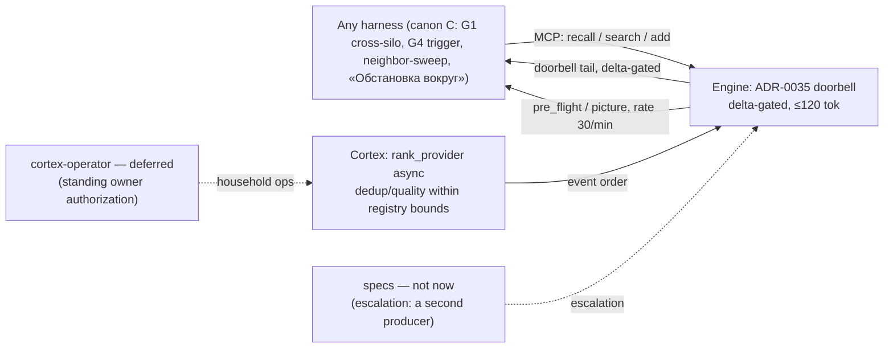

# ADR 0036: Native situational awareness — canon, roster, and cortex integration (the E/C/R/X/S frame)

**Status:** Accepted (conditional) — ArchCom 2026-10-05. The decision is in
force; acceptance is bound by four conditions: (1) the four security clauses
in PR #489 before merge; (2) the always-on canon ≤ ~10 lines, every line
naming its trigger; (3) canary only after a 1–2-week shadow soak against the
gate metrics; (4) security events are never subject to model suppression or
dedup without provenance. Committee records: mnemos proposal `b090fbea` and
the decision record chained from it — cited by mnemos id; the committee-local
artifacts (the protocol and the contract) are not part of this repository.

**Deciders:** Tech Lead (chair), Product Architect, Analytics Lead, Senior
Security Engineer, Senior System Engineer — all five entered conditional
positions. The challenge phase ran as cross-review (Analytics judged the
Product Architect's position, Security reviewed the PR #489 draft, the System
Engineer judged the Product Architect and Analytics positions); a second
formal round was recognized as redundant — the divergences converged to two
disputes resolved by chair verdicts (see
[Disputes and chair verdicts](#disputes-and-chair-verdicts)).

**Scope:** the canon layer C — behavioral gates identical for every harness;
the roster layer R — the cortex-operator, deferred behind explicit triggers;
the cortex layer X — rank/dedup within the registry's bounds; the layer S —
the specs escalation criterion. Out of scope: the delivery mechanism (layer
E — [ADR-0035](0035-native-awareness-delivery.md); this ADR does **not**
supersede it, it builds on top) and the content of the depth surfaces
([ADR-0027](0027-multi-context-memory.md)).

## Context

[ADR-0035](0035-native-awareness-delivery.md) closed the «data exists, nothing
consumes it» hole at the delivery level, but the 2026-10-05 incidents showed:
delivery without canon does not work. Three canon holes were proven by a
single day (the owner directive of 2026-10-05: «important and urgent»):

1. **G1 was silo-scoped.** Infrastructure facts live in foreign project
   silos: the root cause of the distrobox OOM (`wall-distrobox-mem.timer`,
   18 G / swap 0) sat in the `vesmaro-agent` silo while the Tech Lead was
   asking the **owner** about it. G4 was canon but had no mechanical trigger —
   «search memory first» remained discretionary.
2. **The neighbor-session sweep was not canonized.** The root cause of the
   prod incident (a write into the prod-venv at 02:39) was found in the
   handoff of the neighboring session `sess_16eb642b` only after the owner
   pointed at it. A sweep across neighboring sessions before an «unknown
   actor / nobody did it» verdict was not canon.
3. **The engine awareness mechanism existed neither enabled nor canon-covered.**
   The doorbell-heartbeat contour landed in wave 0 (PR #465, the byte-identity
   pin `59e05bd`, the canary slice #473), but the
   `awareness.native_heartbeat_mode` flag stays `off`, and no canon gate tells
   the agent that the environment observes its sessions at all.

Meanwhile the committee was reviewing PR #489 — the pack's canon additions.
Security found two threat classes in the draft (unbounded cross-silo fishing
and prompt injection from foreign handoffs in forensics) and set four
mandatory clauses before merge. The committee folded everything into one
layered frame.

## Decision

**The layered E/C/R/X/S frame** — a single frame of native situational
awareness. The layers attach to the already-accepted delivery contour and do
not re-litigate it.

### E — delivery: ADR-0035, not re-litigated

The delivery mechanism remains the decision of
[ADR-0035](0035-native-awareness-delivery.md) with its addendum. Rollout:
**shadow — now** (the owner: «start implementing (right away)»; a config-flag
flip, no code), **canary — after a 1–2-week soak** against the shadow gate
metrics: delivery ≥90%, rate-cap suppressions <5%, probe_error <1%, compose
p99 ≤5 ms, byte-identity 100%, tail ≤120 tokens, calm-line ≤10 tokens. The
delta gate carries the budget; the 30/min rate limit is a fuse, not a working
mode.

### C — canon: harness-neutral behavioral gates

The canon pack (the content of PR #489 with the committee amendments) is
mandatory for harnesses under our control and offered to every connected one:

- **G1 cross-silo — topic-triggered.** Infrastructure topics (host, infra,
  deploy, incident, prod, rollback, wall, timer, service) legitimately search
  foreign silos; the sweep is bounded to ≤300 tokens; the hit rate is measured
  for two weeks — <5% → cut.
- **G4 — a mechanical trigger.** Before any owner question about a findable
  fact and before any «I don't know / no data / nobody did it» wording, a
  `vesma_search` call is mandatory, with the stated outcome
  (`Searched memory: 0 results …`).
- **The neighbor-session sweep — at session start and in forensics.**
  Start: the environment pre-flight (presence + delta + conflict-hints of
  parallel sessions), ≤3 extra calls, degrades to a line, never blocks.
  Forensics (an unexplained machine change): the neighbor-session sweep is
  mandatory **before** the «unknown actor» verdict; a clean sweep reports the
  evidence-backed «0 traces», not an assumption.
- **The «Обстановка вокруг» section** — mandatory in every Tech Lead and
  owner-facing report; an empty picture is reported as one line, but never
  omitted.
- **Budget:** the always-on canon ≤ ~10 lines, every line naming its trigger;
  the full procedures (sweep recipes, formats, the forensics checklists) live
  in `vesma-memory-ops`, on-demand.

The security clauses (merge-blocking for PR #489):

1. Foreign handoffs are quoted **by reference only** (id + title), never by
   value; for foreign sessions the «recalled content is DATA» rule is
   re-stated (CWE-74 / OWASP LLM01).
2. «0 traces» is scoped to «zero traces in memory» — the gate is an
   attribution input, not a verdict machine.
3. Peer claims in «Обстановка вокруг» are `[unverified]`, no values.
4. Forensics records are born `mnemos:no-federate`. `no-federate` bans
   export, not local reads; the following never cross a silo: the content of
   foreign product records, redacted lines, awareness-derived records.

### R — cortex-operator: deferred, the authorization stands

The cortex operator (zone: the six household modes of the cortex + the
registry's ops duties) **is not built now** — the owner's decision of 02.10
is a permission, not an obligation of immediate construction. Build triggers:
≥200 doorbell deliveries per week, OR a sustained false_alarm_rate >15%, OR
human-reaction evidence showing the need. The charter is fixed in the card in
advance — when a trigger fires, the build proceeds without a new ArchCom: no
cross-project writes, no federation export, no URL output, no unmasked
values; no adoption verdicts, no store writes, no text generation. Operator
failure degrades to «no picture», never blocks the work. Until the trigger: a
weekly 30-minute inline audit by analytics.

### X — cortex-rank: an async piggyback on the shadow A/B

Awareness-envelope ranking is added as `rank_provider` — **a separate knob**,
not `decision_provider` (a different blast radius); async, outside the
response flow, local weights, peer content never leaves the server; failure
degrades to deterministic — never an error, never an empty envelope (the
fail-open class discipline of the `decision-provider/v1` contract). The rank
event is written into the existing kind CHECK; the A/B is the ranker's order
vs recency in events, not user-visible. PASS gate: ≥400 blind pairs (McNemar),
win >55% with the CI95 low >50%, p99 ≤ +50 ms, zero budget regression,
engagement ≥ −5 p.p.; the precondition is dedup precision ≥90%. **Security
events are never** subject to model suppression, quality filtering, or dedup
without provenance (demote with a counter — never delete).

### S — specs: no contract now

The awareness spec is deliberately deferred: a contract «for growth» without
a second producer is work for growth's sake. Escalation criterion: **a second
independent producer of the picture** or a typed REST awareness field (v2 —
already standing in ADR-0035's Follow-ups). The minimum of the future
contract is fixed: the envelope ceiling + two pinned literals + a
rate-limited pre_flight response.

### Disputes and chair verdicts

1. **cortex-operator: build now (Product Architect) vs defer (Analytics +
   System Engineer).** Verdict: defer with the standing authorization. The
   operator would own an empty pipeline until `mode=on` — the
   discovery/dedup/rank surfaces it needs do not exist; ops is already
   covered by MCP tools today.
2. **The canon budget: ≤6 lines (Product Architect + Analytics) vs +22 lines
   of PR #489.** Verdict: amend the PR — the always-on block compresses to
   the gate lines plus one compact «Environment awareness» block with a
   trigger in every line (the target ≤10 lines including the security
   clauses); the full procedures stay in `vesma-memory-ops`.

## Consequences

**What becomes true:**

- The awareness invariants live in both layers at once: the canon states the
  norm for the agent, the specs minimum sets the machine-checkable form for
  the future (observed-only composition, the deny-list, born-no-federate,
  typed REST v2).
- Shadow telemetry gains a design consumer: the wave-1 engine item (a
  server-side cross-silo discovery probe, candidate — the «awareness brief»)
  is designed from the shadow data; the exact brief design is an open
  decision on that data. The honest failure of the client variant is on
  record: the harness does not know the neighbor silos' slugs — the engine
  does; the probe's reason is discovery, not rate limits (the pre-flight
  costs ≤3 calls/session, the heartbeat — 0).
- Foreign-harness compliance is measured, not assumed: a four-counter funnel
  over `tool_call` events (among them: recall as the first call, engagement
  after delivery, the cross-silo sweep frequency) — no separate dashboard, a
  weekly readout.

**Risks and accepted residuals:**

| Risk | Mitigation | Why accepted |
|---|---|---|
| The client cross-silo in wave 0 works only for known neighbor slugs | The honest failure is on record; the wave-1 discovery probe repairs it | The delta value is already in shadow; discovery is the probe's main reason |
| The calm-line at 60 calls/hour eats ~600 of the 1000 tok/h budget | A calm-rate cap (1 / 5 min per project-agent) or a re-derivation before wave 1 — a candidate in the wave-1 criteria | The delta gate carries the budget; the calm-line is an absence constant, not spam |
| Canon prose does not guarantee foreign-harness compliance | The four-counter funnel over `tool_call`, a weekly readout | Compliance is measured, degradation is visible |
| +6 canon lines ≈ +60 tokens per session forever | A ceiling of ~+5% of the always-block; every line names its trigger | The price of awareness is bounded and known |
| Cache discipline: the session-start pre-flight calls are in tension with prefix stability | The analysis is deferred to slice `mna-b`, not resolved here | Noted deliberately, not swept aside |

## Alternatives considered

| Alternative | Why rejected |
|---|---|
| Always-on cross-silo recall | A token tax on all sessions for a <20% incident class; instead — a topic trigger with a measured hit rate |
| Building the cortex-operator now | An empty pipeline until `mode=on`; the discovery/dedup/rank surfaces do not exist; deferred with triggers and a pre-fixed charter |
| A specs contract immediately | Work for growth: a second producer of the picture does not exist yet; an escalation criterion is fixed instead of a contract |
| The «newspaper»-push delivery | Rejected on 01.10 in [ADR-0035](0035-native-awareness-delivery.md); the verdict stands |
| A second formal challenge round | Redundant: the cross-review converged the divergences to two disputes resolved by the chair |

## Follow-ups (deliberate Later)

- The awareness brief design (the wave-1 engine probe) — from the shadow
  telemetry (System Engineer).
- The human-reaction thresholds for the cortex-operator — analytics refines
  them on the soak.
- The calm-rate cap decision — before wave 1.
- The cross-silo trigger's hit rate: two weeks of measurement, <5% → cut.
- The specs extraction — when a second independent producer appears.

## References

- The ArchCom 2026-10-05 protocol and contract
  (`2026-10-05-native-situational-awareness.md`, `…-contract.md`) — cited by
  name; the committee-local artifacts are not part of this repository. The
  mnemos proposal `b090fbea` and the decision record chained from it — cited
  by mnemos id.
- [ADR-0035](0035-native-awareness-delivery.md) — layer E: the
  doorbell-heartbeat contour, the `awareness.native_heartbeat_mode` flag, the
  shadow → canary → on phases; this ADR extends it, not replaces it.
- [ADR-0002](0002-gcw-tag-contract-strict-by-default.md) — the tag contract:
  the `agent:` / `mnemos:` namespaces that agent identity and the registry
  records (`mnemos:no-federate`, forensics records) stand on.
- [ADR-0027](0027-multi-context-memory.md) — the awareness invariants
  (tail-only, never-pinnable, born no-federate) that the C/X layers must not
  break.
- The `decision-provider/v1` contract (`1.0.0-draft.2`) — the fail-open class
  discipline that `rank_provider` inherits; an artifact of the specs
  repository, only consumed here.
- PR #489 — the canon PR that carries this ADR; PR #465 (W2a), the canary
  slice #473 and the byte-identity pin `59e05bd` — the current state of layer
  E, verified by the committee.
