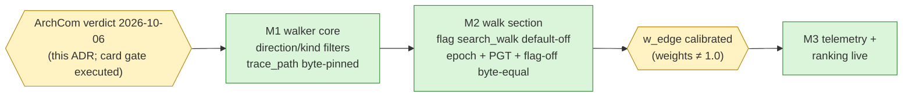

# ADR 0038: PG-1 Two-Level Graph Walk — One Walker, a Separate `walk` Section, Work Caps

**Status:** Accepted (ArchCom 2026-10-06, consensus without disputes; the
architect's and security's positions on PG-1 converged independently, the
analyst and the architect agreed on every parity point). The nine conditions
below ARE the contract of the walk section and bind every slice M1–M3.
Committee protocol `~/.gcw/architectural-committee/2026-10-06-vesma-pg1-walk-and-rest-parity.md`
(team-local, not committed); decision mnemos id `9fe25643` (short prefix —
the full UUID lives in the mnemos store).
**Deciders:** Tech Lead (chair), Product Architect, Senior Security Engineer,
Analytics Lead.
**Scope:** the PG-1 slice of the project graph (ADR-0032) — a two-level
walk exposed as a separate `walk` section of the `search_graph` response,
and the shared BFS walker extracted from `trace_path`. Surface parity of
REST/CLI/MCP is recorded separately in
[the surface-parity record](../../en/user/api-surface-parity.md); recall-page
injection stays governed by ADR-0032 clause 6.
**Preconditions:** ADR-0032 — the project graph is live (sidecar
`code_graph.db`, ten tools, PG1–PG7, the token contract); backlog note
`6435400d` — the proposed two-level walk form; card `vesma-graphs-pg1-walk`
— its ArchCom gate is executed by this verdict (code comes only after it).
Facts verified on main at the time of the verdict: every `project_edges`
row carries `weight = 1.0` (ranking is a no-op), `trace_path` walks
outgoing edges only, and `get_node` resolves ids globally — no
project-scope check exists.

## Context

An agent that asks «what calls X» or «what does X depend on, one hop out»
today gets two expensive options: `trace_path` (one anchored BFS, no
ranking, outgoing only) or plain search plus reading whole files. The
token rent of the second option is exactly what the project graph was
built to end (ADR-0032 Context): the graph knows the neighbourhood; the
agent should be able to rent the map instead of buying the territory.

The backlog note `6435400d` proposed a two-level walk attached to
`search_graph`. The committee ratified the form with corrections — the
corrections are the decision below. Two verified facts shaped them:

1. **The walker must not fork.** `trace_path` already walks edges with
   pinned, tested answer shapes; a second BFS implementation in
   `search_graph` would drift away from it within a release or two.
2. **Nothing in the current graph ranks.** All edge weights are `1.0`,
   so any ranking the walk would do today is a no-op — it must ship
   wired but inert, and switch on when calibration makes weights
   meaningful.

## Decision

Nine conditions, numbered as in the protocol; each slice must hold all
of them, not only its own.

1. **One walker.** Extract the BFS core from `trace_path`; the
   search-walk reuses it. M1 must keep `trace_path` answers byte-equal
   (pin + existing tests as the guard).
2. **A separate `walk` section in the `search_graph` response — never
   mixed into `results`.** Section markers appear only when they fired
   (absent-when-empty; the `fallback_used` / `first_search` precedent).
   With the flag off, the `search_graph` response is byte-identical to
   today's.
3. **The quota stays pure; the caps stand alone.** The walk quota
   `k = min(ceil(limit/5), limit//2)` remains a pure function of
   `limit`; the hard caps (fanout 32, total work 512 nodes) apply
   INDEPENDENTLY of `k`; depth is clamped to `[1, 2]` fail-closed; no
   wall-clock timeout (the work caps replace it); the walk queries the
   edge indexes point-wise, not via a recursive CTE.
4. **PG1 rows.** The walk yields node metadata only (as `trace_path`
   does), paths strictly repo-relative; by default WITHOUT signatures
   and literal content — signatures are where `api_key="..."`-class
   leaks live.
5. **Project boundary at `to_id`.** Resolving an edge's `to_id` checks
   the current-project prefix; a foreign edge is skipped and raises the
   truncation flag. A PGT test plants a cross-project edge and asserts
   the skip (today's `get_node` resolves globally — there is no
   protection; this is a new explicit check).
6. **Freshness rides the payload, not a cache.** The walk payload
   carries the graph `epoch` and `last_indexed_at`; no TTL cache of
   walk results is introduced; consumers invalidate on the carried
   epoch.
7. **Audit with token economics.** Walks are written to `graph_audit`
   (actor/session + details: nodes, edges, k, truncated) PLUS the
   economics pair: `out_tokens` and `avoided_bytes` — the summed size of
   the source files of the returned nodes that the agent would otherwise
   have opened whole.
8. **Baseline BEFORE implementation.** The period of `/search` without
   the walk is the «search + read» baseline. The verdict metric is the
   median per-session saving: `avoided_read_tokens − out_tokens(walk)`.
   Adoption ≥ 30% of graph sessions is tracked as a separate line — it
   is NOT the payback criterion (analyst's position).
9. **Slices.**
   - **M1 — walker core.** Extract the shared BFS core; add
     direction (`in`/`out`) and edge-kind filters. Today `trace_path`
     walks outgoing edges only; «who calls this» needs incoming.
   - **M2 — the walk section.** Ship behind `code_graph.search_walk`
     (default-off): quota, ranking hooks, epoch in payload, PGT-7 (the
     token contract over the walk section) plus the PGT cross-project
     test, and flag-off byte equality.
   - **M3 — telemetry and calibration.** Token-economics telemetry and
     `w_edge` calibration. All weights are `1.0` today — ranking is a
     no-op and stays inert until calibration makes them non-uniform.

## Consequences

**What becomes true:**

- «What calls X, two hops out» is answered from the map for the price of
  one tool call — the agent stops paying file-reading rent for
  structural questions.
- `trace_path` and the walk share one audited, capped, PG1-clean core;
  a fix to the walker fixes both surfaces at once.
- Every walk leaves an audit row that prices itself: `out_tokens` vs
  `avoided_bytes` — the feature carries its own ROI measurement from
  day one, and the no-walk period provides an honest baseline (condition 8).
- Foreign projects cannot leak through an edge: the walk enforces the
  project prefix at `to_id` and marks truncation instead of following.

**Costs and accepted residuals:**

| Risk | Mitigation | Why accepted |
|---|---|---|
| Work caps truncate large neighbourhoods silently | mandatory `truncated` flag + audit row | determinism and bounded latency beat exhaustive walks |
| Incoming edges are only as good as `CALLS` provenance | `USES` stays `USES` (ADR-0032 honesty); direction filter is explicit | false precision is worse than absence |
| Ranking ships as a no-op (all weights 1.0) | M3 turns it on only after calibration | shipping ranked output over uniform weights would be theatre |
| Adoption may stay low (agents ignore the section) | beacon/discipline is the ADR-0032 consumption line; adoption tracked, not forced | condition 8 keeps adoption OUT of the payback verdict |
| `avoided_bytes` overestimates saving (agent would not read everything) | median per-session metric, baseline comparison, M3 calibration | the metric is directional, and it is the honest one available pre-hoc |

## Alternatives considered

| Alternative | Why rejected |
|---|---|
| Adaptive quota floor (grow `k` when the graph is sparse) | nondeterminism — the same query would cost differently on different days; the pure `k(limit)` stands |
| Wall-clock timeout on the walk | hides variance and is flaky in tests; work caps (fanout 32, total 512) bound the walk deterministically |
| Mixing walk hits into `results` | breaks the pinned `results` contract and the absent-when-empty marker discipline; the separate section is the whole point |
| TTL cache of walk results | a second freshness mechanism; the epoch already rides the payload and consumers invalidate on it |
| Recursive CTE for the walk | one statement, but no per-level caps or truncation flags; point queries over the edge indexes keep control per hop |

## Invariants

Inherited unchanged from ADR-0032 and binding for every slice:
**PG1** (zero bytes of source — the walk's default no-signature rule is a
restatement, not a relaxation), **PG5** (born-no-federate — walk results
are graph artifacts), **PG7** (limits default-on, per-agent attribution,
audit). New test obligations:

- **PGT byte-pin (M1):** `trace_path` responses byte-identical before
  and after the core extraction, on the existing test corpus.
- **PGT flag-off (M2):** `search_graph` with `search_walk: false` is
  byte-identical to the pre-M2 response.
- **PGT cross-project (M2):** a planted edge whose `to_id` leaves the
  project is skipped; the response carries the truncation flag; nothing
  from the foreign project appears in the payload.
- **PGT walk token contract (M2):** the walk section obeys the ADR-0032
  §5 ceiling (4 bytes/token, whole-line drops) like every other section.

## Open questions

None owner-blocking. The committee left none open: the card
`vesma-graphs-pg1-walk` gate is executed by this verdict, and the M3
calibration trigger (weights becoming non-uniform) is an engineering
gate, not an owner decision. Adoption tracking lives in vitals (M3).

## References

- Committee protocol 2026-10-06 —
  `~/.gcw/architectural-committee/2026-10-06-vesma-pg1-walk-and-rest-parity.md`
  (team-local, not committed); decision mnemos id `9fe25643` (short
  prefix; the full UUID lives in the mnemos store).
- [ADR-0032](0032-project-graph.md) — the project graph: the ten tools,
  PG1–PG7, the token contract, the PG-1 repo-map gate this ADR extends.
- [ADR-0030](0030-memory-graph-self-fueling.md) — the memory-graph line:
  the `graph_audit` / `edge_stats` precedents, the `graph_epoch` mechanism.
- Surface-parity record (same verdict session):
  [api-surface-parity.md](../../en/user/api-surface-parity.md) — the
  ratified CLI/REST/MCP dispositions and the versioning canon.
- Backlog note `6435400d` — the original two-level walk proposal (the
  ratified form, with this ADR's corrections).
- Card `vesma-graphs-pg1-walk` — the implementation card whose ArchCom
  gate this verdict executes.
