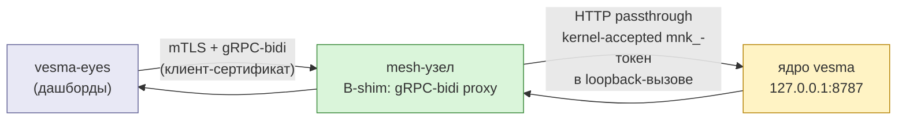

# ADR 0042: Транспорт vesma-eyes → память — B-shim (gRPC-bidi прокси в mesh → loopback ядра), нога 8788 переходная

**Вердикт:** Принят (ArchCom, 2026-10-06). Целевой транспорт — вариант **B-shim**:
тонкий gRPC-bidi прокси, живущий в mesh-узле, который терминирует mTLS-стрим
клиента (vesma-eyes) и передаёт каждый HTTP-обмен на loopback-адрес ядра
(`127.0.0.1:8787`). Переходная нога — вариант **A** (порт 8788, вторая копия
ядра 5.3.0 с bearer+TOTP как python-компонент `vesma.service`) — допускается
только как временная нога (см. «Фаза A-then-B») и закрывается с приёмкой
B-shim. Схема TOTP вымирает вместе с LAN-ногой 8788.

**Решали:** Tech Lead (председатель), Product Architect, Senior Security
Engineer; Senior System Engineer (опциональный участник, вызван
председателем; исполнитель спайк-дня). Итог финализирован после спайк-дня
2026-10-06, уточнившего оценки по варианту B. Протокол комитета
`~/.gcw/architectural-committee/2026-10-06-eyes-8788-transport.md`
(team-local, в репозиторий не коммитится).

**Охват:** сетевой вход в память ноутбука для vesma-eyes (дашбордов) — то,
каким лицом дашборды достают до единственного ядра памяти; де-комиссия
текущего лица 8788; попутный фикс proto-стабов (issue #514). Вне охвата:
внутренние HttpAdapter глаз (своя зона eyes-команды), серверный код самой
mesh-федерации (ADR-0021/0025), ревизии модели угроз ядра вне входа дашбордов.

## Контекст

vesma-eyes — дашборды поверх памяти ноутбука. Сегодня у них два лица:

1. **Внутреннее лицо** — глаза ходят напрямую на ядро ядровыми вызовами
   (HttpAdapter поверх `127.0.0.1:8787`).
2. **Внешнее лицо на LAN** — вторая копия ядра 5.3.0 на `0.0.0.0:8788`
   с bearer-токеном и TOTP-схемой (ADR-0014), с TLS-терминацией «впереди»
   (т.е. на LAN без TLS до терминатора — известная задолженность).

При миграции на новый сервисный слой (`src/vesmaro/service/`, issue #515)
внешнее лицо не выразилось компонентом: второй процесс ядра на 8788 не
вписывается в супервайзер `vesma.service` без сознательного решения. Это
решение — то самое: комитет выбрал, чем стать лицу 8788 на целевом ландшафте
(и когда оно умрёт).

Три факта из ядра, проверенные на момент вердикта:

1. **Все вызовы глаз существуют в ядре 8787.** Таблица спайк-дня: гэпов
   эндпоинтов ноль. Глаза ходят SSE только к собственному board-серверу;
   в ядре SSE-роутов нет (единственный `StreamingResponse` в `api/main.py` —
   скачивание экспорта), WebSocket ядро не предоставляет и не требуется.
2. **Ядро аутентифицирует `mnk_`-bearer** (`api/auth.py`, `api/middleware.py`)
   и живёт loopback-only по дефолту (`config.py`: `ApiConfig.host =
   "127.0.0.1"`, `port = 8787`) — вход «клиент-сертификат снаружи →
   kernel-accepted `mnk_`-токен внутри» ложится на существующую схему без
   её ревизии.
3. **Ядро единственное.** Отдельный LAN-процесс ядра — это вторая копия
   движка (замер спайка: RSS ~406 МБ, **не** оценка «~200 МБ»), вторая база
   риска рассинхронизации конфигов-миграций и второй публичный вход, который
   нужно охранять. Одна копия на loopback проксируется проще, чем охраняется.

## Решение

Целевой транспорт — **B-shim**: gRPC-bidi прокси в mesh-узле
(mTLS- терминатор), передающий HTTP-обмены как кадры одного стрима на
loopback ядра (`127.0.0.1:8787`), passthrough — прокси не знает семантики
вызовов, только кадры. Глаза говорят mTLS+RPC с mesh; ядро по-прежнему
говорит HTTP по loopback с `mnk_`-токеном. Между ними — один тонкий
компонент, поднятый спайком до работоспособного прототипа за день (см.
«Спайк-доказательства»).

### Фаза A-then-B: нога 8788 переходит, но временно

До приёмки B-shim допускается нога **A** — 8788 как python-компонент
`vesma.service` (супервайзер закрывает эксплуатационные издержки: старт,
рестарт, логи — но НЕ закрывает TLS-задолженность и НЕ закрывает RAM второй
копии ядра). Нога A оправдана ТОЛЬКО если релизная координация глаз↔mesh
задержит swap: в этом случае 8788 входит в супервайзер как временный
компонент с ясным выходом, а не живёт бесхозно. Если swap не задерживается —
фаза A не поднимается вовсе: 8788 де-комиссится напрямую на B-shim.

Обязательное условие Безопасности для фазы A: **прод-8788-лицо не теряет
TLS-срез в той же волне** — перевод 8788 под супервайзер не упрощает и не
снимает TLS-терминацию; задолженность закрывается только смертью ноги, а не
её «узакониванием».

### Спайк-доказательства (спайк-день, ветка wt/b-shim-spike, SHA 317a4c8)

Прототип `spike/b-shim/main.go` (174 строки): gRPC-bidi passthrough-прокси,
кадры HTTP-обменов мультиплексируются по одному стриму (`frame_id`),
вверх по HTTP на uvicorn. Тех-чек только: без TLS, без auth — мерили
механику.

Замеры (обязательная пометка честности: loopback-to-loopback внутри
бокса; LAN-RTT ~1 мс/exchange в замер не входит — прод-цифры будут чуть
выше, но оверхед прокси относительно direct измерен в той же петле):

| Метрика | direct (8787) | через прокси |
|---|---|---|
| p50, мс | 8.86 | 9.52 |
| p95, мс | 77.9 | 77.6 |
| RPS | 43.4 | 43.3 |

Чтение: оверхед прокси 0,6 мс p50, p95 идентичен (77.9 → 77.6 — в пределе
шума), RPS не differs (43.4 → 43.3). Плавающий p95 подтверждён обеими
ногами замера: на проде узкое место — ядро, не прокси. Стрим-механика
проверена `stream_probe.py`: bidi-стрим держится открытым без idle-таймаута,
серверные фреймы доезжают инкрементально (истинный стрим, не буферизованный
блоб). Убийца варианта A — RAM второй копии ядра (RSS ~406 МБ) — в B-shim
устраняется по построению: прокси Go на порядки легче, второй копии ядра
просто нет.

### Что даёт swap (и почему не A, не C, не D, не E)

- Вторая копия ядра и её RAM-стоппер устраняются по построению.
- TLS-задолженность закрывается: mTLS-терминация в mesh — это уже
  существующая классифицированная поверхность mesh (ADR-0021/0025),
  а не новый самодельный вход.
- Оценка окупаемости падает с «1,5–3 нед» (первичная оценка B) до
  **3–5 дней** (после спайка): тонкая прослойка, гэпов эндпоинтов нет,
  стрим-нога не нужна.
- TOTP-схема вымирает вместе с LAN-ногой: на целевом ландшафте глазам
  не нужен второй фактор — их credential единственный (клиент-сертификат),
  и это осознанное упрощение, а не упущение (см. условие (а)).

### Условия принятия (обязательные)

1. **(а) Auth-инъекция в прокси.** Клиент-сертификат — единственный
   credential глаз на внешнем контуре; Go-узел B-shim подставляет
   kernel-accepted `mnk_`-токен в loopback-вызов. Токен не виден клиенту,
   не живёт в глазах, не светится на LAN. Эта строка — class
   security-boundary: фиксация trust-boundary-строкой в CM 1.1.0
   (config-contract) + каскад-ревью до мержа (это не «ещё один прокси»,
   это trust boundary, где аутентификация подменяется компонентом).
2. **(б) Runbook отзыва пина глаза ДО выключения 8788.** Де-комиссия ноги
   не может оставить живых клиентов на мёртвом порту: отзыв пинов глаз
   (клиент-сертификатов) документируется и исполняется до выключения ноги
   (runbook-поверхность, не код).
3. **(в) Стрим от ядра — будущая строка контракта, не прятать в шим.**
   Если глазам понадобится серверный стрим от ядра (сейчас не нужен),
   это будущая строка контракта proxy — отдельный вызов с явным
   согласованием, не «автоматом» через passthrough.
4. **(г) Лимитирование дашбордной нагрузки на единственное ядро.** Ядро
   теперь и пишет memory-строки, и обслуживает дашборды — rate-limit
   строка в config обязательна до приёмки swap (защита от дашборд-шторма
   вплоть до отказа памяти для агентов — приоритет агентских вызовов над
   дашбордными должен быть выражен кодом, не молчаливым дефолтом).
5. **(д) План отказа от TOTP — к Безопасности.** Ответственность за
   вымирание TOTP-схемы на LAN-ноге — Безопасности (документ — что
   отмирает, когда, что остаётся); Безопасность принимает план до
   фактической смерти ноги.

### Открытые вопросы (не блокируют начало фазы A)

1. **Swap HttpAdapter глаз на gRPC-клиент** — оценка eyes-команды (чужая
   зона, не наш код) — главный драйвер графика swap. Комитет не оценивает —
   глаза оценивают сами.
2. **Дата выключения 8788** — фиксируется в CM 1.1.0 (условие (б)
   опирается на эту дату), в этом ADR не называется.

## Последствия

**Что станет верно:**

- Единый сетевой вход: глазами достаются до ядра через mesh-прокси, а не
  через второй публичный порт; поверхность, которую охраняет Безопасность —
  одна (mTLS в mesh), а не две.
- TOTP-схема вымирает с ногой 8788; ADR-0014 остаётся у ядра (bearer+TOTP
  внутри loopback-ядра — про то, как агенты/локальные клиенты аутентифицируются
  в ядро; на LAN-вход их больше не дергают).
- Вторая копия ядра (~406 МБ RSS) умирает; дашбордный трафик живёт в том же
  mesh-домене, что и вся федерация.
- Супервайзер `vesma.service` получает либо ничего нового (если A не
  поднималась), либо один временный компонент с ясным выходом (если A была).

**Цены и принятые остатки:**

| Риск | Митигация | Почему принято |
|---|---|---|
| Прокси — trust boundary, где auth подменяется компонентом | условие (а): клиент-сертификат единственный credential, `mnk_`-подстановка внутри, CM 1.1.0 фиксация + каскад-ревью | это не «новый вход», это классифицированная поверхность; класс security-boundary требует каскад-ревью владельцем (директива 2026-09-28) |
| Замер оверхеда только loopback (LAN-RTT не входит) | таблица p50/p95/RPS в спайке честно помечена; прод-приёмка замеряет на реальной петле | относительный оверхед прокси измерен в одной петле с direct — LAN-RTT входит в обе ноги одинаково; порядок не изменит |
| Дашборд-шторм может душить ядро, пока агент пишет | условие (г): rate-limit строка в config | единственное ядро не «достает» без защиты; молчаливый дефолт = silent degradation |
| Swap глаз (HttpAdapter → gRPC-клиент) — чужая зона, оценка неизвестна | открытый вопрос 1; swap не блокирует начало фазы A | eyes-команда оценивает свои работы; комитет выносит это за скобки, не оценивая чужое |
| Нога A может задержаться и прожить дольше запланированного | условие (б): runbook отзыва пина до выключения; дата выключения фиксируется в CM 1.1.0 | нога A — сознательное временное лицо с назначенным выходом, не бессрочно-бесхозное |

## Альтернативы, рассмотренные и отвергнутые

| Вариант | Суть | Почему отвергнут |
|---|---|---|
| **A — 8788 как python-компонент** `vesma.service` | супервайзер поднимает вторую копию ядра 5.3.0 на 8788 | Эксплуатационные издержки (старт/рестарт/логи) закрывает, но TLS-задолженность и RAM второй копии ядра (замер спайка: RSS ~406 МБ) сохраняет; выход из задолженности — не «узаконить второе лицо», а устранить его. Допущена ТОЛЬКО как переходная нога (см. «Фаза A-then-B») |
| **B без шима — «аналитический RPC в mesh» (первичная формулировка)** | полноценный RPC-фасад в mesh с повторной проверкой auth поверх kernel-вызовов | Первичная оценка 1,5–3 нед (повторное согласование auth, отдельных вызовов, отдельной версии). Спайк показал: passthrough-шим тоньше, дешевле (3–5 дней) и не проигрывает по безопасности при условии (а) — потому целевой не «B чистый», а **B-shim** |
| **C — агент-посредник** | LLM-агент между глазами и ядром | Отвергнут: латентность и недетерминизм LLM в пути дашбордов — дашборды — детерминированные поверхности, LLM-звено ломает и предсказуемость, и SLA |
| **D — вшить mesh-core в глаза** | ядро/клиент mesh в самом vesma-eyes | Отвергнут: сцепка жизненных циклов (релиз глаз ↔ релиз mesh) и сертификаты на клиенте — клиентский оверхед и новая точка хрупкости |
| **E — статус-кво** | вторая копия ядра на 8788 вне супервайзера, как сегодня | Отвергнут: это задокументированный CWE-319 (plaintext поверх LAN при TLS-терминации впереди), плюс RAM второй копии ядра — лицо, охраняемое и съедающее память одновременно |

## Связи

- Issue #515 — лицо 8788 как компонент сервисного слоя (фаза A — нога
  этого ADR).
- Issue #514 — proto-стабы: попутный фикс в том же поезде (gen-скрипт
  proto-стабов не генерирует stubs для `spike/b-shim`-класса, границу
  генерации уточнить при мерже шима).
- [ADR-0014](0014-api-auth-threat-model.md) — модель угроз API-аутентификации
  ядра (bearer+TOTP); остаётся у loopback-ядра, LAN-носитель вымирает.
- [ADR-0021](0021-nano-model-track.md) — mesh-поверхность и классифицированный
  mTLS-вход (домен, куда въезжает дашбордный трафик).
- [ADR-0025](0025-memory-meta-level-lanes.md) — lanes-структура памяти,
  обслуживаемая единственным ядром (то, что теряет приоритет при ДДоСе
  дашбордами — см. условие (г)).

## Ссылки

- Протокол АрхКома 2026-10-06
  `~/.gcw/architectural-committee/2026-10-06-eyes-8788-transport.md`
  (team-local, в репозиторий не коммитится).
- Спайк-день B-shim, ветка `wt/b-shim-spike` (SHA `317a4c8`):
  `spike/b-shim/main.go` (174 строки), `stream_probe.py`, `bench_client.py`,
  таблица замеров — tech-check only (без TLS, без auth — механика).
- Замер RSS второй копии ядра (спайк-день): ~406 МБ (замер, не оценка
  «~200 МБ» из ранних обсуждений).

Related issues: #515, #514