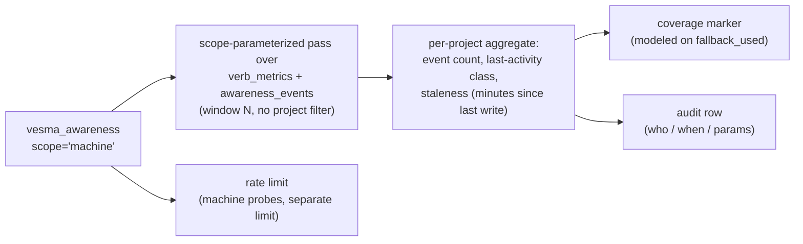

# ADR 0043: Awareness machine-wide liveness — `scope="machine"` on `vesma_awareness`

**Status:** Accepted (conditional) — ArchCom 2026-10-06, verdict **ACCEPT WITH
CONDITIONS**. The decision is in force; six binding conditions close before or
with each phase (see [Phases](#phases) and the [Security clauses](#security-clauses)):

1. Surface: `scope="machine"` on the existing `vesma_awareness`; no new REST
   twin is required — the awareness REST endpoint already exists and gains the
   same parameter.
2. Semantics: «live» = a store write within window N (default 15 minutes,
   configurable, fixed before the shadow measurement); advisory-only; no
   blocking or waiting semantics.
3. Honesty of output: a coverage-class marker in every response (modeled on
   `fallback_used`); the wording «активность не наблюдалась» ("no activity was
   observed") — never «машина свободна» ("the machine is free").
4. The ADR-0036 clause set is inherited in full (all five), plus the five new
   Security clauses of this ADR.
5. Phases: 5.6.x — the `awareness.machine_scope` flag, default `off`, quiet
   mode (log + reconciliation against the manual quad, the false-«empty»
   metric); 5.7 — exposure on the green metric; OS-signals — deferred, returns
   to the agenda on shadow numbers, cascade review mandatory on implementation.
6. The interim manual quad stays mandatory until phase-2 exposure; the quad's
   OS leg stays forever — the product does not replace it.

Committee records: the protocol `2026-10-06-awareness-machine-liveness.md` and
the contract `2026-10-06-awareness-machine-liveness-contract.md` — cited by
name; the committee-local artifacts are not part of this repository. Mnemos
learning `38a3104d` (the manual-quad fix) — cited by mnemos id.

**Deciders:** Tech Lead (chair), Product Architect, Analytics Lead, Senior
Security Engineer, Senior System Engineer — full quorum (both the
product-affect and the security-affect profiles covered). The challenge phase
closed three disputes: the Analytics vs System dispute on whether the
heartbeat leg is a new permanent tax (it is not — it has been paid since wave
1), the Security vs Product dispute on the memory-silent blind zone (closed by
the output semantics plus the coverage marker), and the Analytics requirement
to lock the liveness window N before any measurement (accepted without
objection).

**Scope:** machine-wide session liveness as a `scope="machine"` parameter on
the existing `vesma_awareness` tool — the same SQL engine as the
project-scoped awareness reads, without the project filter, read-API only.
This ADR extends [ADR-0035](0035-native-awareness-delivery.md) and
[ADR-0036](0036-native-situational-awareness-canon.md); it does **not**
supersede them. Out of scope: OS-level signals (option в — deferred with five
prepared Security conditions and a mandatory cascade review), any
blocking/waiting semantics, and any new permanent heartbeat traffic.

## Context

On 2026-10-06 a Tech Lead ran `vesma_awareness(action="pre_flight")` —
project-scoped, 900-second window — received an empty answer, read it as «no
live sessions on this machine», claimed a worktree, and dispatched an
executor. Ground truth: ~5 sessions were live — 34 zcode processes; the 5.6.0
REST service had logged 1100+ store-wide calls over 6 hours;
`awareness_events` had arrived from 7+ scopes within minutes; a remote branch
had been pushed 10 minutes earlier. The incident is a recipe failure, not a
recipe absence: the Tech Lead acted per canon and still got «the machine is
empty». It was the second coordination incident in two days caused by
invisible sessions — the false negative was not a hypothesis but an
accomplished fact ([issue #518](https://github.com/vesmaro/vesma/issues/518),
the tracker).

The root cause is structural: `pre_flight` is **project-scoped and
windowed**. Sessions that are coding without calling memory, or writing into
other project silos, are invisible to it. [ADR-0036](0036-native-situational-awareness-canon.md)
canonized a bounded cross-silo sweep in G1, but no tool answers «who is live
on this machine right now» — every agent re-invents an ad-hoc manual quad
(process list + store-wide SQL + worktree mtimes + fresh remote branches).
Mnemos learning `38a3104d` fixed exactly the manual quad — a primitive every
agent needs in every session, each time re-derived with errors, is a product
gap by definition (the Product Architect's position). The plank «maximum
result with minimum immersion» is reached by a surface, not by an instruction.

## Decision

**`scope="machine"` on the existing `vesma_awareness`** — not a new verb.
Extending a proven surface inherits the ADR-0036 clauses automatically; the
store is the shared substrate of the multi-host ecosystem, so the semantics
scale across hosts for free. Option letters follow the committee protocol:
(а) = a store-wide sweep over existing metrics; (б) = heartbeat pings of the
awareness contour; (в) = OS signals read by the MCP server.

The accepted mechanism is (а): a scope-parameterized pass over the existing
`verb_metrics` (ts/surface/verb/status/project — `metrics/ledger.py`, 30-day
retention plus an hourly aggregate) and `awareness_events`, in the window N,
without the project filter. This is the same SQL engine as
`project_delta`/`operational_picture`, minus the `project=` parameter,
read-API only. Option (б) is not built — the heartbeat already exists (hooks,
default-on, since wave 1) and feeds (а) with rows; a new permanent traffic is
not built. The 06.10 incident would have been caught: the live sessions went
through the 5.6.0 REST service, so their verb rows exist. Estimated cost:
~150–250 lines with tests (the `awareness.py` parameterization + config +
MCP/REST plumbing); the probe costs single-digit milliseconds at ~100–200k
rows per 30 days.

**Output (aggregation-only).** Per project with activity in the window: an
event counter, the last-activity class (verb type), staleness in minutes
since the last write. Across projects: counts and booleans only. Never:
paths, usernames, branches, cmdline, contents.

**Semantics of «live».** A store write within window N — default 15 minutes,
configurable, fixed by this ADR before the shadow measurement; changing N
after the shadow phase starts requires a new ratification (choosing T by the
data itself is banned — the Analytics condition). Advisory-only: presence
answers «who will I bump into», never «when is my turn»; blocking and waiting
semantics are banned by the contract; work capture happens only through
task-board claims. Presence-as-lock — the main source of herd behavior — does
not pass into the surface.

**Honest coverage.** The memory-silent blind zone is real: sessions with zero
memory calls are invisible to (а). Per canon G1 almost every owner session
leaves a verb row (recall itself is a verb), so the silent set is a minority —
but its size is not nameable until measured. Every response therefore carries
a coverage-class marker, modeled on `fallback_used`; an empty result is
worded «активность не наблюдалась» ("no activity was observed") — the wording
«машина свободна» ("the machine is free") is banned. This closes the
Security-vs-Product dispute: the marker and the wording both enter the
contract.

**Configuration.** `awareness.machine_scope`, default `off` — the kill
switch, mirroring the `awareness.native_heartbeat_mode` contour of
[ADR-0035](0035-native-awareness-delivery.md). Flag-off responses are
byte-identical to the pre-feature responses, pinned by tests (the C13
discipline). In quiet mode the machine-scope answers are computed and logged,
never rendered.

### Security clauses

Inherited from [ADR-0036](0036-native-situational-awareness-canon.md) — all
five, in full: (1) `[unverified]` for self-reported presence; (2) no
cross-scope values — counters only; (3) foreign sessions by reference
(id + title), never by value; (4) records derived from a sweep are born
`mnemos:no-federate`; (5) «0 traces» carries the scope disclaimer — zero
traces **in memory**, an attribution input, not a verdict machine.

New in this ADR, binding:

1. **Aggregation-only.** Across projects only booleans and counts; never
   paths, usernames, branch names, cmdline, or contents. The new thing in
   (а) is the cross-project READ, not the data collection — but it breaks
   project read isolation: enumerating presence across projects is a
   behavioral fingerprint of the work rhythm. Compensation: aggregation-only
   output plus clauses 2–4.
2. **Rate limit.** Machine probes get a separate limit on the existing
   picture-rate-limit pattern — a defense against the timing side-channel.
3. **Opt-out.** A session or a whole machine can be excluded, with the
   default (opt-in) documented.
4. **Audit.** Every cross-project query writes a row (who / when / params)
   into the existing codegraph-style audit mechanism.
5. **Coverage marker.** The honesty marker of the blind-zone class in every
   response (modeled on `fallback_used`), per [Decision](#decision) above.

**Deferred option (в) — OS signals.** A qualitatively new trust boundary: the
memory server becomes an observer of the host; `/proc` yields usernames and
cmdlines (tokens in arguments — the distrobox case confirms it); worktree
paths and branch names disclose uncommitted work of foreign projects to any
caller — cross-project leakage by design; a compromised MCP server or a
prompt injection (CWE-74 / OWASP LLM01) becomes an enumeration of the whole
machine's activity. Presence as machine-truth is a surveillance component,
not a memory store. It is admitted only if (а)+(б) prove measurably
insufficient, and only with the five prepared Security conditions:
read-only least-privilege; a categorical ban on `/proc/*/cmdline` and environ
reads; aggregates only; a separate privileged tool outside the default
contour; `mnemos:no-federate` on everything derived — plus the clause set
above (opt-out, rate limit, audit) and a mandatory cascade review. Without
the full set — no.

### Phases

| Phase | Version | What | Gate |
|---|---|---|---|
| 1 (quiet mode) | 5.6.x | Flag `awareness.machine_scope` default `off`; answers computed and logged, never rendered; the false-«empty» metric against the manual quad; the «silent sessions» counter | Baseline fixed; flag-off byte-identity tests |
| 2 (exposure) | 5.7 | The flag default stays `off`, but the surface is opened and documented; opt-out available | Green phase-1 metric — zero false «empty» readings across all quad-divergence events (divergence ≥ 1) — plus the TL verdict |
| 3 (deferred) | — | (в) OS signals | The five Security conditions + cascade review + shadow numbers on the share of «silent» active hours |

Until phase-2 exposure the interim manual quad stays mandatory (issue #518
interim rule); after exposure the quad's OS leg — the process check — stays
forever, because the product never covers memory-silent sessions.

## Consequences

**What becomes true:**

- Every session-start pre-flight (canon G1) can answer machine-wide liveness
  without ad-hoc store-wide SQL; the manual quad shrinks to its OS leg.
- The incident class gets a measured counter: quiet mode logs every machine
  answer that would have read «empty» while the quad showed live sessions —
  the false negative stops being invisible.
- Cross-project READ exists in awareness for the first time: project read
  isolation is deliberately broken, under compensating controls (clauses 1–5
  above). This is an accepted, documented boundary change — not a silent one.
- Foreign harnesses get the surface for free: nativity is a property of the
  server ([ADR-0035](0035-native-awareness-delivery.md)), and machine scope
  is one more parameter on an existing tool.

**Risks and accepted residuals:**

| Risk | Mitigation | Why accepted |
|---|---|---|
| Memory-silent sessions are invisible — the incident class reproduces as «empty» | The coverage marker in every response; the manual quad's OS leg stays mandatory forever | The blind zone is honestly labeled, not hidden; per canon G1 the silent set is a minority, and its size gets measured in shadow |
| Cross-project READ breaks read isolation (a behavioral fingerprint of work rhythm) | Aggregation-only + audit + rate limit + opt-out | The committee weighed the isolation cost against two incidents in two days; counts and booleans only |
| Heartbeat rows become presence metadata — cross-project correlation by timestamps | Aggregation-only output; the audit trail of every machine query | The trust class is not new (peer claims are `[unverified]` today); the same boundary as the whole awareness contour |
| Window N mis-calibrated | N is fixed before the measurement; a change after shadow starts = a new ratification | Choosing the threshold by the data it is evaluated on is banned |
| Timing side-channel through machine probes | A separate rate limit on the picture-rate-limit pattern | Bounded probe cost; the fuse pattern is proven |

Open question, deliberate: calibrating N from the shadow data — any change
goes through a new ratification.

## Alternatives considered

| Alternative | Why rejected |
|---|---|
| A separate verb `vesma_liveness` | An extra trust point without added value; extending the proven surface inherits the ADR-0036 clauses automatically |
| (в) OS signals in v1 | A new trust boundary (a host observer) without a measured need; surveillance-class; deferred with the five Security conditions and a mandatory cascade review |
| (б) as new permanent heartbeat traffic | The heartbeat has been paid since wave 1 (hooks, default-on); no new traffic is built — the existing records are used |
| Presence-as-lock (blocking/waiting semantics) | The main source of herd behavior; cut off by API design — presence answers «who will I bump into», never «when is my turn»; work capture only via task-board claims |

## Follow-ups (deliberate Later)

- The «silent sessions» share — active hours with zero verb rows, measured in
  shadow; a material share is the trigger that returns (в) to the agenda.
- The N calibration on shadow data — only through a new ratification.
- The phase-2 exposure decision — on the green phase-1 metric plus the TL
  verdict.
- (в) implementation, if ever: the five Security conditions + the clause set
  of this ADR + a mandatory cascade review, before any code.

## References

- The ArchCom 2026-10-06 protocol and contract
  (`2026-10-06-awareness-machine-liveness.md`,
  `2026-10-06-awareness-machine-liveness-contract.md`) — cited by name; the
  committee-local artifacts are not part of this repository.
- Mnemos learning `38a3104d` — the manual-quad fix; the incident recipe that
  this ADR replaces with a surface (cited by mnemos id per canon).
- [ADR-0035](0035-native-awareness-delivery.md) — the delivery contour (the
  heartbeat, the flag pattern, the C13 byte-identity discipline); this ADR
  extends it, not replaces it.
- [ADR-0036](0036-native-situational-awareness-canon.md) — the canon and the
  five security clauses inherited in full; this ADR extends it, not replaces
  it.
- [Issue #518](https://github.com/vesmaro/vesma/issues/518) — the tracker:
  the incident, the committee questions, the interim rule in force until
  phase-2 exposure.
