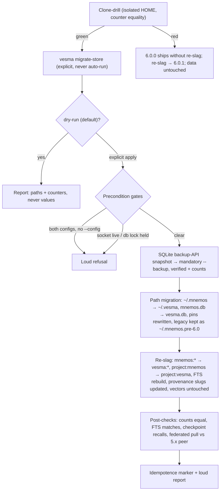

# ADR 0044: Store migration — `vesma migrate-store`, 5.x → 6.0

**Status:** Accepted (conditional — gated on B3: snapshot gate, dry-run
default, clone-drill counter equality, quiesce, fork refusal; a failed
drill → 6.0.0 ships without the re-slag and it moves to 6.0.1) — ArchCom
2026-10-07, verdict 4/«УСЛОВНО» 3/3, with the format-freeze override by the
owner the same evening. The decision is in force for the 6.0.0 train; the
mover merges and runs only when all five gates close green.

**Deciders:** ArchCom 2026-10-07 — Tech Lead (chair), Product Architect,
Senior Security Engineer, Senior System Engineer (all four conditional);
the owner overrode the data-format freeze the same evening (master plan
§6.2.1, «хвосты = ВСЁ старое / чистый лист»), moving the tag re-slug into
the mover's scope. The 2026-10-03 committee verdict (option B — freeze,
3/3) is thereby superseded for 6.0; this ADR records that override and its
conditions, not a re-litigation.

**Scope:** the storage-identity migration semantics for 6.0 — the canonical
tag namespace flip `mnemos:*` → `vesma:*` (including the silo slug
`project:mnemos` → `project:vesma`), the store home `~/.mnemos/` →
`~/.vesma/` and `mnemos.db` → `vesma.db`, the `vesma migrate-store` command
contract (gates, ordering, idempotence, output privacy), and the
federation transition window with 5.x peers. Out of scope: the federation
wire identity — proto and wire names, `MNEMOS1` — which settles in the B4
coordinated window, not in the store mover; crypto/auth constants (the
fernet salt `mnemos.api.auth.fernet.v1`, the session cookie name) — frozen
unless a re-encryption plan is ratified; history surfaces (ADRs, CHANGELOG,
git history) — never rewritten, they are history-proof, not a live surface;
and the mover implementation itself, which is the parallel B3 wave.

**Preconditions:** the input-alias slice already merged on
`release/6.0.0` (`vesma:*` accepted at every typing surface; export schema
`vesma_version`; CHANGELOG 6.0.0 unreleased), the full-backup wave (A0),
the single-store-per-device policy with SQLite backup-API snapshots, and
the mint-protection strip class (server-minted metadata keys are never
client-settable).

## Context

The storage layer still carries mnemos-era internals that are invisible at
the UI but load-bearing for the product: the tag namespace `mnemos:*` on
every stored record (the storage data contract), the silo slugs
(`project:mnemos` and friends — the key recall, awareness and task scoping
resolve against), the config/data home `~/.mnemos/` with `mnemos.db`, and
the cursors, checkpoints and run ledgers that reference those slugs. The
canonical home remained `~/.mnemos/` through the whole 5.x line — the
store-path leg of [ADR-0031](0031-rebrand-mnemos-to-vesmaro.md) never
touched the live store, and ADR-0031 explicitly deferred the data-contract
rename to "a separate 6.0 decision". This ADR is that decision.

The live store is real data, not a naming exercise: thousands of records
per store, federation peers syncing tagged records across devices, FTS
content that embeds tags, checkpoints whose recallability the G1 memory
gates depend on. A mistake here corrupts or orphans live data with a
cross-device blast radius — a different risk class from every other 6.0
rename. The 2026-10-03 committee weighed exactly this and chose option B:
migrate nothing in the store, freeze `mnemos:*` as a documented data
format, and paper over the typing surfaces with the input alias. The
landed 6.0.0 slices (alias, `vesma_version`, freeze doc lines) are that
verdict's product.

On 2026-10-07 the committee ratified the consolidation master plan and
again confirmed the freeze (verdict 1, 3/3: formats are not «tails»; their
replacement is a data-migration project of its own). The owner then
overrode the freeze the same evening, within the breaking 6.0 release:
«tails = everything old». The consequence is this ADR: the tag/slug/path
re-slag is included in the mover, under the same gates the committee set
for the mover itself. The override does not erase the 2026-10-03 risk
register — it converts its mitigation from «don't touch» to «touch only
behind gates».

## Decision

**1. A mover, not an alias, carries the 6.0 storage identity.** `vesma
migrate-store` is an explicit, operator-invoked command that flips the
store's identity end to end: canonical tag prefix `vesma:*`, silo slug
`project:vesma`, home `~/.vesma/`, database `vesma.db`. The landed input
alias remains the typing ergonomics layer; after a migrated store, the
canonical write target is `vesma:*`. The command is never auto-run on boot
— the v2.1 `migrate_layout()` auto-run precedent caused startup races, and
explicit-only is a standing rule.

**2. The mover is conditional; the gates are the decision.** It merges and
executes only with all five B3 gates in place:

| Gate | Semantics |
|---|---|
| Snapshot gate | SQLite backup-API snapshot to a mandatory `--backup` target, verified readable, with pre-migration row counts recorded — before anything is touched |
| Dry-run default | The command reports planned changes (paths and counters) and exits without writing unless explicitly overridden |
| Clone-drill counter equality | A rehearsal on an isolated-HOME clone of the live store must end with exact counter equality between source and migrated clone (plan-time baseline: 3790 records — the gate is equality, not the number) |
| Quiesce | A live socket or a held database lock is a loud refusal, never a concurrent migration |
| Fork refusal | Zero-config setup refuses to create a fresh `~/.vesma` while a legacy `~/.mnemos` store exists — no silent store split |

**3. Migration order is fixed and one-way per run:** precondition checks
(refuse if both configs exist without an explicit `--config` choice;
quiesce) → snapshot → path migration (same-FS atomic rename, cross-FS
falls back to copy + fsync + hash; config pins rewritten; the legacy
directory preserved renamed `~/.mnemos.pre-6.0` until the operator deletes
it) → tag/slug re-slag (in-place UPDATE sweep, FTS rebuild, slug-bearing
provenance and pipeline-state lines updated; vectors untouched — they are
id-keyed) → post-checks (row counts match, FTS matches, a known checkpoint
recalls, one federated pull against a live 5.x peer succeeds) →
idempotence marker and a loud report. Re-running on a migrated store is a
no-op, not a second mutation. The run is timeboxed; breaching the timebox
rolls back to the snapshot.

**4. Output privacy is a hard contract.** The mover prints paths and
counters, never record values, never tag contents, never secret-bearing
fields — a store holds secrets-adjacent data by design (the no-federate
marker exists precisely to fence it). The drill runs in an isolated HOME
so rehearsal cannot touch live state. The server-minted metadata strip
class is preserved across migration: a rewrite pass never promotes
server-minted keys into operator-editable ones.

**5. The no-federate trust marker dual-matches for the whole transition
window.** Records arriving from 5.x peers carry `mnemos:no-federate`; a
migrated store stores `vesma:no-federate`. Every enforcement site must
match both spellings until the dual-accept window closes — a single-
spelling rewrite across a mixed 5.x/6.0 fleet converts the trust boundary
into an exfiltration amplifier. This is a required invariant of the B3
wave and of any new enforcement code until 5.x EOL.

**6. Federation runs a dual-accept window.** The 6.0 code accepts both
`mnemos:*` and `vesma:*` on read/filter, writes only the canonical
spelling; records with legacy tags arriving from peers are accepted,
stored, rewritten lazily; sync dedup keys are versioned by the
tag-namespace epoch. The window closes with the 5.x line (EOL 2026-10-20)
and is removed no earlier than 6.1.

**7. Fallback is pre-agreed, not improvised.** A failed clone-drill means
6.0.0 ships WITHOUT the re-slag: the store keeps `mnemos:*`, the landed
input alias keeps absorbing typed `vesma:*`, the freeze doc lines stay
true, and the re-slag moves to 6.0.1. Live data is untouched in either
branch of this decision — the gates exist so that «migrate» and «don't
migrate yet» are both safe outcomes.

## Rollout

The mover is the LAST fill block of 6.0.0 and runs on a quiet window, one
device at a time; further machines are staggered after the reference
machine proves a full run. The drill always precedes any live run and
never executes against the live file. The clone-drill gate is a
ratification precondition of this ADR — a merged mover without a green
drill does not authorize a live migration.

## Consequences

**What becomes true:**

- 6.0 is «vesma end to end» at every surface a user can touch — typed
  tags, exports, slugs, paths — with no mnemos spelling left on live
  surfaces. The tag-contract storage prefix, the export schema and the
  tag-contract docs all flip canonical spelling with the migration.
- Memory continuity survives the rebrand: checkpoints remain recallable
  under the new slug, FTS stays consistent, vectors and record ids are
  untouched — the G1 gates keep working across the migration.
- Cross-device federation keeps working during the transition: 5.x peers
  and migrated 6.0 stores exchange records through the dual-accept window.

**Costs:**

- A new data-loss-class command with a full test burden, a drill
  orchestration step, and a standing dual-accept tax on read/filter paths
  and every no-federate enforcement site until the window closes.
- The freeze doc lines landed with the alias slice («`mnemos:` is the
  canonical storage prefix») become false after a migrated store; the B3
  wave owns flipping the point-of-contact docs in the same change, not
  after.
- The dual-spelling maintenance window must actually close: legacy-tag
  acceptance is removed no earlier than 6.1, and the enforcement-site
  audit rides the 5.x EOL cleanup.

**Risks accepted:**

- The rewrite touches the trust-marker surface (~20 enforcement sites).
  Mitigation: the dual-match invariant (Decision 5) plus cascade review on
  the B3 wave — the mover is a trust-boundary, data-loss and lifecycle
  surface by the project's cascade-review rule.
- A partial migration (interrupted run) is the worst failure shape.
  Mitigation: snapshot-first ordering, idempotence marker, timebox
  rollback, and post-checks that refuse to report success on a skewed
  store.

## Alternatives considered

| Alternative | Why rejected / deferred |
|---|---|
| Read-alias forever (the 2026-10-03 option B freeze, landed as the alias slices) | Ratified twice by committee, then overridden by the owner for 6.0: the prefix is not invisible — it faces users in `--tags` typing, exports and docs, so the freeze makes branding churn permanent at live surfaces. Retained as the pre-agreed fallback if the B3 gates fail (Decision 7). |
| Clean-slate store («sansara»: start 6.0 on an empty store, leave 5.x data behind) | Rejected: history becomes unfindable — the checkpoint/amnesia cliff — and recall continuity is the product, not a feature of it. The owner's «чистый лист» is a directive about naming tails, explicitly not about discarding data (historical documents are not rewritten either). |
| Manual transfer (hand-run SQL, blind config rewrites, per-file sed) | Rejected: `Settings` is `extra=forbid`, so a blind `mnemos:` → `vesma:` config rewrite either crashes the service loudly or silently reverts `data_dir`/vault paths — a data-loss class; a partial rename is worse than none because tooling matches on exact spellings across harness packs, board integrations and awareness code. |
| Unconditional full migration in 6.0.0 (option A as drafted 2026-10-03, without gates) | Rejected by the 2026-10-07 committee: an ungated rewrite of live federated data is exactly the risk the five gates close. The committee's verdict is conditional, not optimistic. |
| Auto-run the migration on 6.0 boot | Rejected: the v2.1 `migrate_layout()` auto-run precedent caused startup races; a data rewrite must be an operator action with a snapshot and a report, never a boot side effect. |

## References

- Draft spec and the 2026-10-03 committee verdict B, including the risk
  register this ADR converts into gates:
  [docs/release/6.0.0-store-migration-draft.md](../../release/6.0.0-store-migration-draft.md).
- Master plan `vesma-master-plan-20261007` v1.3, §6.1 (ArchCom verdict,
  B3 gates, security condition 5) and §6.2 (owner decisions of
  2026-10-07 evening, including the freeze override and the 6.0.1
  fallback) — team-local handoff document, not part of this repository.
- ArchCom protocol 2026-10-07 «vesma-consolidation-rebrand-6x» —
  positions, criticism phase, rejected alternatives; team-local.
- [ADR-0031](0031-rebrand-mnemos-to-vesmaro.md) — the mnemos → vesmaro
  rebrand; its Decision 3 explicitly deferred the data-contract rename to
  a separate 6.0 decision, which this ADR closes.
- CHANGELOG, [6.0.0] unreleased — the landed alias, `vesma_version` and
  point-of-contact freeze lines that this ADR subordinates to the mover.
