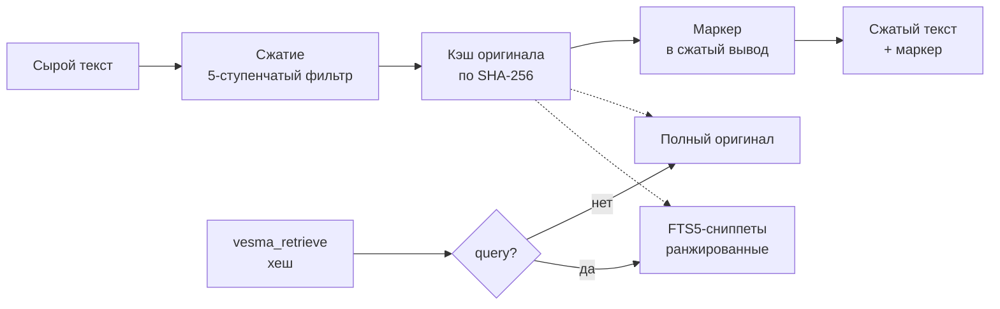
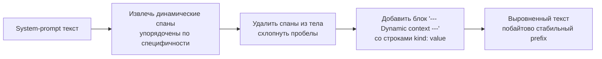
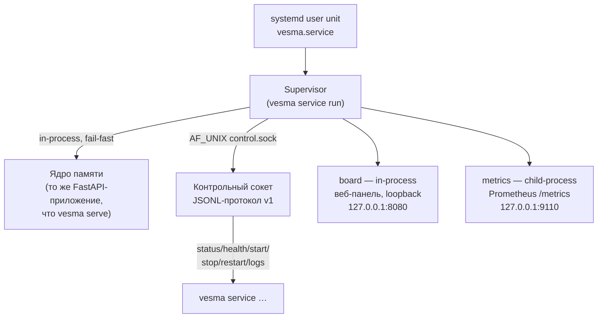

# Vesma — Архитектура системы

**🌐 Language / Язык:** [English](../../en/architecture/overview.md) · Русский

> Снимок архитектуры актуален для Vesma **5.6.2**. Нормативные контракты
> сервисного слоя (component-manifest, service-lifecycle, control-socket,
> layout — все v1.0.0) живут в отдельном репо
> [vesma-specs](https://github.com/vesmaro/vesma-specs).

## Обзор

Vesma — гибридная система долговременной памяти: личная база знаний +
RAG-хранилище для AI-агентов. Основные поверхности доступа: CLI, HTTP API,
MCP-сервер и Obsidian-совместимый vault. Поверх них работает сервисный слой:
супервайзер компонентов с контрольным сокетом и systemd user-юнитом
(`vesma.service`), который держит ядро и компоненты живыми. Web UI панели
супервайзера — компонент `board`; отдельный фронтенд-проект
([vesma-eyes](https://github.com/vesmaro/vesma-eyes)) остаётся в плане.

## Ключевые принципы

- **Markdown-first**: человеко-читаемые заметки в формате Obsidian (YAML frontmatter + markdown)
- **Семантический поиск**: vector embeddings поверх текстовых данных
- **Гибридный поиск**: full-text search + vector similarity, ранжирование по релевантности
- **Модульность**: ядро отделено от интерфейсов, каждый интерфейс — тонкий адаптер
- **Local-first**: всё работает локально, без обязательных облачных зависимостей; сетевые бинды — loopback по умолчанию
- **Spec-first**: контрактные спецификации (vesma-specs) ратифицируются до/вместе с реализацией, конформанс-прогоны проверяют соответствие
- **Расширяемость**: компоненты сервисного слоя подключаются манифестами, источники данных — плагинами

---

## Архитектура (слои)

```
┌──────────────────────────────────────────────────────────────────┐
│                         ИНТЕРФЕЙСЫ                                │
│  ┌─────┐  ┌──────────┐  ┌──────┐  ┌─────┐  ┌──────────────────┐  │
│  │ CLI │  │ REST API │  │ MCP  │  │board│  │ federation (A2A, │  │
│  │Typer│  │ FastAPI  │  │ stdio│  │(UI) │  │  pull, sync)     │  │
│  └──┬──┘  └────┬─────┘  └──┬───┘  └──┬──┘  └────────┬─────────┘  │
├─────┴──────────┴───────────┴─────────┴──────────────┴────────────┤
│                    СЕРВИСНЫЙ СЛОЙ (5.6)                           │
│  systemd user unit vesma.service → Supervisor                     │
│  ┌──────────────────┐  ┌───────────────────────────────────────┐ │
│  │ Контрольный сокет │  │ In-process ядро (то же FastAPI-прило- │ │
│  │ AF_UNIX, JSONL v1 │  │ жение, что vesma serve)               │ │
│  └──────────────────┘  └───────────────────────────────────────┘ │
│  ┌────────────────────────────────────────────────────────────┐  │
│  │ Дети по манифестам (component-manifest v1): board, metrics │  │
│  └────────────────────────────────────────────────────────────┘  │
├──────────────────────────────────────────────────────────────────┤
│            ЯДРО (MemoryManager, manager.py)                       │
│  ┌──────────────┐ ┌──────────────┐ ┌──────────────────────────┐  │
│  │MemoryManager │ │ SearchEngine │ │IngestionPipeline         │  │
│  │  CRUD ops    │ │ hybrid search│ │  parse & embed           │  │
│  └──────┬───────┘ └──────┬───────┘ └───────────┬──────────────┘  │
├─────────┴────────────────┴─────────────────────┴─────────────────┤
│                    ХРАНИЛИЩЕ                                      │
│  ┌────────────────┐  ┌───────────────┐  ┌─────────────────────┐  │
│  │ Obsidian Vault │  │  Vector index │  │  SQLite             │  │
│  │ (markdown)     │  │  (vectors.db) │  │  (metadata, A2A,    │  │
│  │                │  │               │  │  CCR, граф проектов)│  │
│  └────────────────┘  └───────────────┘  └─────────────────────┘  │
├──────────────────────────────────────────────────────────────────┤
│                    EMBEDDING                                      │
│ vesma-embed-v1 (встроена) / onnx / Ollama / sentence-transformers │
└──────────────────────────────────────────────────────────────────┘
```

---

## Компоненты

### 1. Хранилище (Storage Layer)

| Компонент | Назначение | Технология |
| --- | --- | --- |
| Obsidian Vault | Человеко-читаемые заметки, markdown + frontmatter | Файловая система |
| Векторный индекс | Векторные эмбеддинги для семантического поиска | SQLite (`vectors.db`, локально) |
| SQLite | Метаданные, теги, связи, история, A2A-сессии, CCR-кэш, граф проектов | SQLite + aiosqlite (WAL) |

**Obsidian-совместимость**:
- Каждая «память» — markdown-файл с YAML frontmatter (tags, source, created, etc.)
- Поддержка `[[wiki-links]]` и тегов `#tag`
- Vault-директория настраивается в конфиге
- Файловый watcher отслеживает изменения и переиндексирует

### 2. Embedding Layer

- **По умолчанию**: `vesma-embed-v1` — встроенная локальная модель (~30 МБ, int8 ONNX, RU+EN, 384d), работает офлайн
- Текущие веса (round 3, 2026-09-09): дистилляция с **Qwen/Qwen3-Embedding-0.6B** (Apache-2.0), `weights_sha256 3b752e06…`, MRL-размерности 64/128/256/384, opset 15; обучающий корпус ~100k пар «текст→вектор учителя», включая 8086 реальных записей стора (RU 41.9%)
- **Смена эмбеддера отслеживается по «винтажу»**: каждый вектор хранит отпечаток создавшего его эмбеддера (для встроенной модели — `weights_sha256`); векторы чужого отпечатка автоматически переэмбеддятся фоновым heal-свипером, а `vesma doctor` показывает оставшееся количество векторов чужого винтажа
- **Внешние провайдеры остаются доступны**: `onnx` (любая HF-модель), Ollama, `sentence-transformers`
- Embedding-провайдер настраивается через конфиг
- Кэширование эмбеддингов для избежания повторных вычислений

### 3. Ядро (`MemoryManager`, `manager.py`)

#### MemoryManager
- CRUD для записей памяти (create, read, update, delete)
- Автоматическая генерация эмбеддингов при создании/обновлении
- Синхронизация: markdown-файл ↔ векторный индекс ↔ SQLite
- Теги, категории, приоритеты, TTL (время жизни записи)

#### SearchEngine
- **Семантический поиск**: vector similarity через локальный векторный индекс
- **Полнотекстовый поиск**: FTS5 через SQLite
- **Гибридный поиск**: RRF (Reciprocal Rank Fusion) для объединения результатов
- Фильтрация по тегам, датам, источникам, типам

#### IngestionPipeline
- Парсинг входящих данных из разных источников
- Чанкинг длинных документов (RecursiveCharacterTextSplitter)
- Дедупликация (по хешу контента + cosine similarity)
- Автоматическое извлечение тегов и метаданных

### Обратимое сжатие (CCR)

CCR (Compress-Cache-Retrieve) снижает токен-стоимость большого контента (вывод инструментов, логи, JSON) без потери данных. Переиспользует существующий 5-ступенчатый контекстный фильтр для сжатия и существующее SQLite-хранилище для кэширования — отдельной БД и отдельного бэкапа нет.

#### Конвейер



1. **Сжатие** — `apply_filter` запускает 5-ступенчатый конвейер (профильный: `log`, `terminal`, `code`, `docs`, `web`, `default`). Даёт 86–96% сокращения на логах и JSON.
2. **Кэш** — оригинальный несжатый текст сохраняется в `ccr_cache` по SHA-256 хешу. Адресация по содержимому: повторное сжатие того же текста — no-op.
3. **Маркер** — короткий парсимый маркер добавляется в начало сжатого вывода. Это литеральный вывод движка, поэтому в нём сохраняется каноническое имя `mnemos_retrieve` (legacy-написание в байтовом выводе живёт до 6.0):
   ```text
   [compressed: <хеш> | <N>→<M> символов | retrieve via mnemos_retrieve]
   ```
4. **Извлечение** — `vesma_retrieve(hash)` (каноническое имя `mnemos_retrieve`) возвращает полный оригинал (без потери данных). `vesma_retrieve(hash, query=...)` возвращает FTS5-ранжированные сниппеты внутри кэшированного оригинала.

#### Интеграция с хранилищем

Таблица `ccr_cache` находится в той же базе SQLite, что и `memories`:

| Таблица | Назначение | Ключ |
|---------|------------|------|
| `ccr_cache` | Оригинальный несжатый контент | `hash` (SHA-256, PRIMARY KEY) |
| `ccr_cache_fts` | FTS5 external-content индекс над `ccr_cache.original` | `rowid` |

FTS5 синхронизируется триггерами `AFTER INSERT/DELETE/UPDATE` — синхронизационного кода на уровне приложения нет. Извлечение сниппетов использует тот же движок FTS5, что и поиск по памяти, ограниченный одним кэшированным оригиналом по `hash`.

#### Вытеснение

| Механизм | По умолчанию | Когда запускается |
|----------|--------------|-------------------|
| Истечение TTL | 7 дней | `ccr_cleanup()` — запускается автоматически из фонового процессора на своём интервале (T3), либо через CLI |
| LRU-вытеснение | 10000 записей | Оппортунистически, при каждом вызове `compress` |

Начиная с T3 (v2.9.0), `ccr_cleanup()` вызывается из `_processor_loop` на своём интервале (`ccr_cleanup_interval_sec`, по умолчанию 1200с = 20 мин) — не на каждом цикле процессора, чтобы не сканировать таблицу кэша каждые `interval_sec`. Защищено `ccr.enabled` и обёрнуто в try/except, поэтому сбой очистки никогда не роняет цикл процессора.

#### Конфигурация

```yaml
ccr:
  enabled: true                    # главный переключатель
  ttl_days: 7                      # время жизни записи кэша
  max_entries: 10000               # порог LRU-вытеснения
  min_size_chars: 500              # ниже этого контент возвращается как есть
  snippet_count: 5                 # сниппетов в retrieve(query=...)
  filter_budget: 4096              # токен-бюджет для apply_filter
  ccr_cleanup_interval_sec: 1200   # T3: интервал фоновой очистки (60–86400с)
```

Контент ниже `min_size_chars` возвращается как есть с `cached=false` и `reduction_pct=0` — у мелкого контента нет выигрыша по токенам.

### CacheAligner (P1-5)

CacheAligner стабилизирует prefix system-prompt-подобного текста, чтобы KV-кэши провайдеров (Anthropic `cache_control`, OpenAI prefix caching) попадали между запросами. Извлекает динамический контент — ISO-таймстампы, UUID, session id, короткоживущие токены, календарные даты — и переносит каждый спан в блок `--- Dynamic context ---` в конце. Prefix вплоть до первого динамического спана становится побайтово стабильным; динамические значения по-прежнему доходят до модели, но из хвоста.

Инспирировано headroom CacheAligner (https://github.com/headroomlabs-ai/headroom, Apache 2.0). Оригинальная реализация — код headroom не импортируется.

#### Конвейер извлечения



Виды паттернов, в порядке специфичности (наиболее специфичные первыми, чтобы ISO-таймстамп сопоставился как timestamp, а не как bare date):

| Вид | Паттерн | Пример |
|-----|--------|--------|
| `timestamp` | ISO 8601 с опциональной tz | `2026-07-17T10:30:00Z` |
| `uuid` | канонический 8-4-4-4-12 hex | `550e8400-e29b-41d4-a716-446655440000` |
| `session_id` | `sess-*`, `session:*`, `sid-*` | `sess-abc123def456` |
| `date` | календарные даты | `2026-07-17`, `2026/07/17` |
| `token` | «голые» 20+ символьные непрозрачные токены | `a1b2c3d4e5f6789012345` |

Пересекающиеся совпадения разрешаются по earliest start, затем longest match — таймстамп выигрывает у bare date, наложенного на его хвост.

#### Поведение профиля

| Профиль | Пропускает | Почему |
|---------|------------|--------|
| `default` (или опущен) | ничего | извлекает все виды |
| `code` | `token` | «голые» 20+ символьные токены исказили бы длинные идентификаторы / хеши в коде |
| `docs` | `token` | в прозе редко бывают реальные токены; избегаем искажения длинных дефисных слов |

Skip-множество профиля объединяется (union) с подключевыми тогглами из `CacheAlignerConfig` — отключение вида в конфиге расширяет то, что профиль уже пропускает.

#### Конфигурация

```yaml
cache_aligner:
  enabled: true               # главный переключатель
  extract_timestamps: true   # ISO 8601 таймстампы
  extract_uuids: true        # канонические 8-4-4-4-12 UUID
  extract_session_ids: true  # sess-*, session:*, sid-*
  extract_dates: true        # календарные даты 2026-07-17 / 2026/07/17
  extract_tokens: true       # «голые» 20+ символьные непрозрачные токены
```

Когда `cache_aligner.enabled` равно `false`, `align_prefix()` возвращает текст без изменений с пустым списком `extracted`. MCP-инструмент `vesma_align_prefix` (каноническое имя `mnemos_align_prefix`) — публичная поверхность; см. [mcp-tools.md#mnemos_align_prefix](../user/mcp-tools.md#mnemos_align_prefix).

### Сокращение токенов вывода (P1-7)

Сокращение токенов вывода управляет стилем вывода вызывающей стороны, не меняя того, что Vesma хранит или возвращает. Три инструмента — `vesma_add`, `vesma_search`, `vesma_recall_context` (канонические имена `mnemos_add`, `mnemos_search`, `mnemos_recall_context`) — принимают два опциональных параметра:

| Параметр | Значения | Эффект |
|----------|----------|--------|
| `verbosity` | `default`, `terse`, `minimal` | Вставляет во framing результата подсказку по стилю вывода |
| `effort` | `low`, `medium`, `high` | Вставляет во framing результата подсказку по уровню размышлений |

Это **подсказки, передаваемые вызывающей стороне**, а не изменения конфигурации модели. Инспирировано работой headroom по сокращению токенов вывода. Оригинальная реализация.

#### Обратная совместимость

- Значения по умолчанию (`default` / `medium`) дают пустую подсказку — результат инструмента побайтово идентичен выводу до P1-7.
- Невалидные значения валидируются по frozenset'ам, логируются на уровне `WARNING` и откатываются к значению из конфига — мягкая деградация, никогда не выбрасывает исключение.
- Когда `output_style.enabled` равно `false`, оба resolver'а возвращают no-op-значения по умолчанию независимо от ввода вызывающей стороны.

#### Конфигурация

```yaml
output_style:
  enabled: true              # главный переключатель; при false steering — no-op
  default_verbosity: default # значение по умолчанию, если вызывающая сторона опустила verbosity
  default_effort: medium     # значение по умолчанию, если вызывающая сторона опустила effort
```

См. [mcp-tools.md#сокращение-токенов-вывода-p1-7](../user/mcp-tools.md#сокращение-токенов-вывода-p1-7) — пользовательский референс.

---

### 4. Сервисный слой (5.6)

Начиная с 5.6 движок умеет работать как **сервис**: супервайзер держит ядро
и компоненты живыми под systemd user-юнитом. Контракты
[component-manifest v1](https://github.com/vesmaro/vesma-specs/tree/main/specs/component-manifest/v1),
[service-lifecycle v1](https://github.com/vesmaro/vesma-specs/tree/main/specs/service-lifecycle/v1),
[control-socket v1](https://github.com/vesmaro/vesma-specs/tree/main/specs/control-socket/v1) и
[layout v1](https://github.com/vesmaro/vesma-specs/tree/main/specs/layout/v1)
ратифицированы 1.0.0 в репо vesma-specs.

#### Процессная модель

`vesma service run` запускает одну инсталляцию:



- **Супервайзер** — владелец жизненного цикла всех компонентов: spawn каждого ребёнка в собственной POSIX-сессии (`setsid`, pgid == pid), reaper-тред без зомби, `PR_SET_CHILD_SUBREAPER`, group-signal boundary при стопе. Рестарт-политики по тирам манифеста: `core` рестартуется вечно (экспоненциальный backoff, cap 30с, crash-loop-алерт при 10 попытках), `optional` — в рамках скользящего окна (5 рестартов за 300с, исчерпание = одна ERROR-строка `event=degraded` и тихие lazy-ретраи). Старт — топологический по `depends_on` (независимые — параллельно), стоп — обратнотопологический, SIGTERM → grace period из манифеста → SIGKILL.
- **In-process ядро** — то же FastAPI-приложение, что запускает `vesma serve`, встроено в процесс супервайзера как его «сердце» (SL §3.1): смерть ядра = смерть супервайзера (exit 1), юнит перезапускает всё целиком. Мультипроцессный профиль `vesma serve` в сервисном режиме не применяется — ядро всегда один процесс.
- **Дети по манифестам** — каждый компонент описывается манифестом `apiVersion: vesma.component/v1` (строгая валидация, коды ошибок CM §4). В комплекте два pack-манифеста: `board` (in-process веб-панель супервайзера: статус компонентов, логи, ручное управление; bind только loopback — любое расширение отвергается fail-closed) и `metrics` (дочерний процесс Prometheus-экспозиции vitals). Пользовательские компоненты ставятся drop-in-манифестами в `components.d/`, каждый python-ребёнок получает собственный venv.
- **Контрольный сокет** — `AF_UNIX`/`SOCK_STREAM`, права 0600, путь `${XDG_RUNTIME_DIR}/vesma/control.sock` (fallback `~/.local/state/vesma/run/` при пустом `XDG_RUNTIME_DIR`). JSONL-конверт, согласование версии через `hello`, методы `status` / `health` / `start` / `stop` / `restart` / `logs` (+ `--follow`), реестр кодов ошибок (протокол / lifecycle / authz / infra), аутентификация по `SO_PEERCRED`. TCP-листенера нет по построению. Клиентские глаголы: `vesma service status|health|start|stop|restart|logs [--socket PATH]`.
- **FSM ребёнка**: `stopped → starting → healthy` с ветками `degraded`, `backoff`, `blocked`; каждая транзакция journалируется структурной строкой.

#### Layout v1 — канонические пути

Пути инсталляции (не путать с легаси-путями стора памяти `~/.mnemos/` из раздела «Конфигурация»):

| Путь | Режим | Назначение |
|------|-------|------------|
| `~/.config/vesma/` | 0700 | корень конфигурации сервиса |
| `~/.config/vesma/vesma.yaml` | — | общий конфиг (`{config_path}`) |
| `~/.config/vesma/components.d/` | 0700 | drop-in манифесты компонентов |
| `~/.config/vesma/env/<name>.env` | 0600 | env-файлы секретов (fail-closed разбор) |
| `~/.local/share/vesma/<name>/` | 0700 | данные компонента |
| `~/.local/share/vesma/venv/` | 0700 | venv движка (супервайзера) |
| `~/.local/share/vesma/venvs/<name>/bin` | 0700 | venv python-компонента (`{venv_bin}`) |
| `${XDG_RUNTIME_DIR}/vesma/` | — | runtime: сокет, пиды; fallback `~/.local/state/vesma/run/` |
| `~/.local/state/vesma/logs/<name>/` | — | логи файлов-в-стейт |
| `~/.local/state/vesma/history/` | — | append-only журнал супервайзера |

`vesma service install` создаёт всё перечисленное, собирает venv-ы, разворачивает pack-манифесты и генерирует юнит `~/.config/systemd/user/vesma.service` (ExecStart — одна статическая строка `<venv>/bin/vesma service run`; generator-версия и маркеры downgrades пишутся в юнит). `vesma service uninstall [--all|COMPONENT]` — обратная операция. В контейнерах (нет настоящего systemd) часть sandbox-директив юнита понижается — каждая понижка помечена маркером `# vesma:downgraded=` и проверяется DR-13 allowlist'ом.

#### `vesma doctor service` — проверки DR-01…DR-13

| ID | Проверка | Что ловит |
|----|----------|-----------|
| DR-01 | Права/владение канонических каталогов и env-файлов | Отступление от режимов layout §3.2 (0700/0600), чужое владение |
| DR-02 | Целостность venv | Права, владелец, расхождение freeze vs lock |
| DR-03 | Утечка user-site | Импорт в чистом окружении: user-site не должен просачиваться в `sys.path` |
| DR-04 | Уникальность venv между манифестами | Два компонента на одном venv |
| DR-05 | Ограничения версии Python | Декларация `python.version` против реального интерпретатора |
| DR-06 | venv ≠ venv движка; зарезервированные имена | Компонентный venv, совпавший с движковым |
| DR-07 | Дрейф юнита | Установленный `vesma.service` отличается от регенерированного |
| DR-08 | Живость контрольного сокета | Connect-probe + `hello`; отсутствие сокета = супервайзер не запущен (n/a) |
| DR-09 | Коллизии health-портов | Два манифеста претендуют на один порт |
| DR-10 | Свободное место на канонических корнях | Пороги WARN/FAIL на config/data/state-томах |
| DR-11 | journald `Storage=persistent` | Журнал супервайзера переживёт перезагрузку |
| DR-12 | venv read-only в рантайме | `ReadOnlyPaths` в юните; container-downgrade — громкий, документированный |
| DR-13 | Container downgrades в allowlist | Только перечисленные понижки sandbox-директив |

---

### 5. Источники данных (Ingestors)

| Источник | Метод | Формат |
| --- | --- | --- |
| Ручной ввод | CLI / API | Текст / markdown |
| Obsidian vault | File watcher (watchdog) | Markdown + frontmatter |
| Веб-страницы | URL → trafilatura/BeautifulSoup | HTML → чистый текст |
| Файлы | `vesma ingest file` / API | TXT, MD, PDF (`pymupdf`), DOCX (`python-docx`) — extras `[pdf]`, `[docx]` |
| Документы (чанками) | `ingest_document` (MCP / REST) | Длинные документы, born-quarantine |
| LLM-чаты | MCP / экспорт | Диалоги |

### 6. Интерфейсы

#### CLI (Typer)
```bash
vesma add "Заметка о важном" --tags project:vesma agent:user mnemos:learning   # быстрое добавление
vesma ingest file ./document.pdf --tags project:vesma agent:user mnemos:learning             # из файла
vesma ingest url https://example.com --tags project:research agent:user mnemos:learning      # ингест URL
vesma search "как настроить nginx"               # гибридный поиск (FTS5 + vector + RRF)
vesma search "CVE" --project vesma --limit 20    # поиск в пределах проекта
vesma recall agent tech-writer --limit 20         # последние записи агента
vesma graph register myproj /path/to/root         # регистрация корня графа проектов
vesma stats                                       # статистика хранилища
vesma serve                                       # запуск HTTP API (foreground)
vesma mcp-server                                  # запуск MCP-сервера (stdio)
vesma service install                             # установка сервиса (юнит, venv-ы, манифесты)
vesma service status                              # дерево состояний компонентов
vesma doctor                                      # проверки здоровья (+ doctor service, doctor paths)
vesma update check                                # поверхности обновления этой машины
vesma completion                                  # установка шелл-комплита
```

#### REST API (FastAPI)

Основные группы эндпоинтов (полный каталог — в [http-api.md](../user/http-api.md)):

```
GET    /health                            — healthcheck
POST   /memories                          — создать запись
GET    /memories, /memories/{id}          — список, запись
GET/POST/DELETE /memories/{id}/workflow   — жизненный цикл workflow
POST   /search                            — гибридный поиск
GET    /recall/agent/{name}               — recall по агенту
GET    /tags, POST /tags/rename           — теги
POST   /filter/{id}                       — прогон контекстного фильтра
POST   /compress, /retrieve               — CCR
POST   /context/save, /recall, /assemble, /rewrite — контекстные операции
POST   /hooks/{action}                    — жизненные хуки
POST   /ingest-url, /ingest-document      — ингест
POST   /watch/start, /watch/stop, /watch/status     — watch-опрос графа проектов
GET    /api/v1/stats, /stats/timeseries, /api/v1/metrics, /metrics — статистика и метрики
POST   /reindex                           — переиндексация
GET    /dlq, POST /dlq/{id}/retry         — очередь недоставленного
```

Поверх них — два отдельных контракта: [A2A Sessions API](a2a-sessions.md) (`/v1/sessions…`, M16) и федеративный pull (`POST /api/v1/federation/pull`, per-peer bearer-аутентификация, ADR-0016).

#### MCP-сервер

Инструменты для Copilot/LLM-агентов: **40 инструментов**, манифест brand-primary — при настроенном бренде (`VESMA_MCP_BRAND=vesma`, канал деплоя по умолчанию) каждый инструмент публикуется под именем `vesma_*`; канонические имена `mnemos_*` остаются принятыми на вызов до 6.0 (контракт двойного префикса). Полный каталог — в [mcp-tools.md](../user/mcp-tools.md); основные:

- `vesma_search` — гибридный (семантический + полнотекстовый) поиск по памяти
- `vesma_add` — добавить новую запись
- `vesma_recall_context` / `vesma_save_context` — собрать/сохранить контекст сессии
- `vesma_assemble_context` — конвейер сборки контекста (поиск → сжатие → фильтр → скан секретов → выравнивание кэша → бюджет)
- `vesma_awareness` — присутствие соседей и дельта проекта (ADR-0035/0036)
- `vesma_index_project`, `vesma_search_graph` — граф проектов (ADR-0032)

#### Сервисный CLI

`vesma service install|uninstall|status|health|start|stop|restart|logs|run` — установка инсталляции и управление контрольной плоскостью (см. раздел «Сервисный слой»).

---

## Структура данных

### Memory (запись памяти)

```python
class Memory:
    id: str              # UUID
    content: str         # основной текст
    title: str | None    # заголовок (авто или ручной)
    tags: list[str]      # теги
    source: str          # источник: manual, web, file, mcp, obsidian
    source_url: str | None
    memory_type: str     # note, fact, snippet, bookmark, conversation
    created_at: datetime
    updated_at: datetime
    embedding: list[float] | None
    metadata: dict       # дополнительные данные
    file_path: str | None  # путь к markdown-файлу в vault
```

### Markdown-файл (Obsidian)

```markdown
---
id: 550e8400-e29b-41d4-a716-446655440000
title: Настройка nginx reverse proxy
tags: [nginx, devops, linux]
source: web
source_url: https://example.com/nginx-guide
memory_type: note
created: 2026-04-10T12:00:00
updated: 2026-04-10T12:00:00
---

# Настройка nginx reverse proxy

Основной контент заметки...
```

---

## Конфигурация

Поиск конфигурационного файла (в порядке приоритета): явный `--config` → `VESMA_CONFIG` → `./config.yaml` → `~/.mnemos/config.yaml`. Переменные окружения канонически читаются с префиксом `VESMA_` (например, `VESMA_MNEMOS__DATA_DIR`); deprecated-написание `VESMARO_*` остаётся принятым до 6.0 (контракт двойного префикса, ADR-0031).

```yaml
# config.yaml
mnemos:                                # секция стора памяти (имя секции legacy, не переименовано)
  vault_path: ~/.mnemos/vault          # Obsidian vault (легаси-путь стора)
  data_dir: ~/.mnemos/data             # векторный индекс + SQLite (легаси-путь стора)

embedding:
  provider: nano                       # nano (vesma-embed-v1, встроена) | onnx | ollama | sentence-transformers
  model: vesma-embed-v1
  # ollama_url: http://localhost:11434

search:
  default_limit: 20
  hybrid_alpha: 0.5                  # вес семантического поиска (0=FTS, 1=vector); 0.5 балансирует ноги RRF — при 0.7 доминирование векторной ноги топило FTS-совпадения ранга 1 (issue #300)

api:
  host: 127.0.0.1                    # loopback по умолчанию (zero-config профиль, ADR-0017)
  port: 8787

mcp:
  transport: stdio                   # stdio — единственный реализованный транспорт
```

> Два слоя путей не путать: **стор памяти** (vault, SQLite, кэш — по умолчанию
> `~/.mnemos/…`, legacy-пути, управляются секцией `mnemos:`) и **инсталляция
> сервиса** (юнит, venv-ы, манифесты — layout v1, `~/.config/vesma/`,
> `~/.local/share/vesma/`, `~/.local/state/vesma/`). См. раздел
> «Сервисный слой».

---

## Путь развития

> Снимок исходного плана (MVP-эпоха). Фазы 1–2 реализованы полностью
> (включая PDF/DOCX-парсинг); сервисный слой Фазы 3 реализован в 5.6
> (контракты CM/SL/CS/LY ратифицированы 1.0.0). Актуальный план — в
> [PLAN.md](../../../PLAN.md).

### Фаза 1 — MVP (реализована)
- [x] Архитектура и модели данных
- [x] Core: MemoryManager + SQLite + векторное хранилище (`vectors.db`)
- [x] Embedding layer (встроенная `vesma-embed-v1`)
- [x] Гибридный поиск
- [x] CLI (add, search, recall, tags)
- [x] Obsidian vault sync (read/write)
- [x] REST API (FastAPI)

### Фаза 2 — Интеграции (реализована)
- [x] MCP-сервер для Copilot
- [x] Web scraping (ingest URLs)
- [x] PDF/DOCX парсинг (extras `[pdf]` / `[docx]`)

### Фаза 3 — Сервисный слой и продвинутые фичи (сервисный слой — реализован)
- [x] Сервисный слой: супервайзер, контрольный сокет, манифесты, layout v1, doctor service (5.6, контракты v1.0.0)
- [x] Граф проектов (ADR-0032, включён по умолчанию)
- [x] Экспорт/импорт
- [ ] Web UI (vesma-eyes)
- [ ] Автокатегоризация (LLM-powered)
- [ ] Автосаммаризация длинных документов
- [ ] Периодическая консолидация (merge похожих записей)

### Фаза 4 — Масштабирование
- [ ] Миграция на PostgreSQL + pgvector (опционально)
- [ ] Multi-user support
- [ ] Шифрование хранилища
