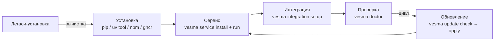

# Начало работы

**🌐 Language / Язык:** [English](../../en/user/getting-started.md) · Русский

> Полный жизненный цикл пользователя Vesma: установка → сервис → интеграция →
> doctor → обновления → вычистка легаси. Актуально для релиза 5.6.2.

Vesma — standalone-сервер памяти и знаний для AI-агентов. Одна утилита `vesma`
ведёт весь цикл: ставит пакет, разворачивает сервис, подключает агентские
харнесы, проверяет здоровье и обновляет саму себя. Каждая команда этой страницы
выполнима на чистой Linux / macOS / WSL2-машине.

Жизненный цикл:



Для общего контекста см. [обзор архитектуры](../architecture/overview.md). Справочник
по всем подкомандам CLI — [cli-reference.md](cli-reference.md). По каждому
MCP-инструменту — [mcp-tools.md](mcp-tools.md). По каждому HTTP-эндпоинту —
[http-api.md](http-api.md).

> **Подсказка 5.6.2.** `-h` работает на любом уровне — `vesma -h`,
> `vesma service -h`, `vesma service start -h`. Не помните флаги — добавьте
> `-h` к любой команде.

---

## Установка

Vesma опубликован на PyPI пакетом **`vesma`** (голый слот — наш, со времён ребрендинга).
Выберите канал:

| Канал | Команда | Что получите |
|-------|---------|--------------|
| **pip** — обычный случай | `pip install vesma` | сервер + CLI `vesma` + REST API + MCP-сервер |
| **uv tool / pipx** — изолированно | `uv tool install vesma` · `pipx install vesma` | то же самое, `vesma` в `PATH`, проектные окружения не тронуты |
| **npm** | `npm install -g @vesmaro/vesma` | CLI + MCP-сервер из npm-канала |
| **ghcr-контейнер** | см. блок ниже | сервер одной командой, без установки в систему |
| **`vesma update apply`** | для уже установленного Vesma | обновление pip-дистрибутива силами утилиты (см. [Обновление](#обновление)) |

Плюс внешнее LLM-дообогащение: `pip install "vesma[ollama]"` — также `openai`,
`anthropic`, `gemini`.

> **Один пакет, без экстры.** Начиная с 4.1.0 MCP SDK — основная зависимость (ADR-0023):
> базовая установка обслуживает агентские харнесы из коробки, а легасная экстра `[mcp]`
> осталась пустым no-op-алиасом, чтобы старые команды и сниппеты продолжали работать.
> Модель эмбеддингов `vesma-embed-v1` (~30 МБ) встроена в wheel: поиск работает полностью
> офлайн, на CPU, без загрузок и без API-ключей.

> ⚠️ **Имена.** Продукт и CLI — `vesma` (`pip install vesma`). Доребрендинговый пакет
> `mnemos-memory-server` живёт до deprecation и ставит тот же сервер
> (`pip install "mnemos-memory-server[ollama]"` работает весь двойной период).
> `vesma-memory-server` — наше живое зеркало-алиас того же кода.

### Контейнер одной командой

Образ публикуется в `ghcr.io/vesmaro/vesma`; работает и `docker` — замените `podman` на `docker`:

```bash
export VESMA_API__TOTP_MASTER_KEY=$(python3 -c "import secrets; print(secrets.token_urlsafe(32))")
# образы 4.x дополнительно принимают легаси-написание MNEMOS_API__TOTP_MASTER_KEY (deprecated)
podman run -d --name vesma \
  -p 8787:8787 \
  -v vesma-data:/data \
  -v vesma-vault:/vault \
  -e VESMA_API__TOTP_MASTER_KEY="${VESMA_API__TOTP_MASTER_KEY}" \
<!-- version:image -->
  ghcr.io/vesmaro/vesma:5.6.3
<!-- /version:image -->

curl -s http://localhost:8787/health | jq
```

<!-- version:tags -->
Теги: `:5.6.3` (фиксированная) · `:latest` (rolling).
<!-- /version:tags -->

Полное руководство: [container-deployment.md](../admin/runbooks/container-deployment.md).

### Фиксация версии

<!-- version:pip -->
```bash
pip install vesma==5.6.3
```
<!-- /version:pip -->

<!-- deprecated-note: линейка 4.x шла wheel'ом mnemos_memory_server-*.whl; с 5.0.0 артефакт
релиза — vesma-<версия>-py3-none-any.whl (приложен к GitHub-релизу и опубликован на PyPI —
`pip install vesma` ставит тот же wheel). -->

### Предварительные требования

| Инструмент | Версия | Зачем |
|------------|--------|-------|
| Python | ≥ 3.11 | Минимальная среда выполнения (решается через `pip` — ручной venv не нужен) |
| `uv` или `pipx` | последняя | Опционально, для изолированной tool-установки |

> **Замечание об ОС.** Vesma разрабатывается на Linux (Arch, Fedora, Ubuntu 22.04+)
> и регулярно проходит smoke-тест на macOS. Windows работает через WSL2. Юнит systemd
> в `contrib/systemd/` — только для Linux.

> **Железо.** Встроенная `vesma-embed-v1` комфортно работает на одном ядре CPU.
> GPU не требуется. VM с 2 vCPU / 2 ГБ ОЗУ достаточно для личного использования.

> **venv — только install-флоу.** Ручное создание venv (python -m venv, руками
> переименованные каталоги вида `venv-5.x`) запрещено: сервисный слой ожидает
> venv, созданный `vesma service install` (`~/.local/share/vesma/venv/` и
> `venvs/<name>/`). Старые ручные venv — признак легаси-установки, см.
> [Вычистка старых установок](#вычистка-старых-установок).

---

## Сервис (`vesma service`)

Сервис — это супервайзер, управляющий компонентами Vesma по control-сокету:
встроенное ядро памяти, борд и дочерние компоненты из манифестов. Он же —
правильный способ держать Vesma запущенным на машине (юнит systemd user).

| Команда | Назначение |
|---------|-----------|
| `vesma service install` | Разворачивает сервис: манифесты компонентов, data-каталоги, venv, юнит systemd user. Идемпотентна — повторный запуск пересоздаёт артефакты (ручные правки юнита затираются by design) |
| `vesma service run` | Запускает супервайзер на переднем плане: control-сокет + встроенное ядро + компоненты. Одноэкземплярная: если живой супервайзер уже отвечает на сокете — выход 0 |
| `vesma service status [component]` | Дерево состояний компонентов (running/stopped/failed + PID, uptime) как JSON |
| `vesma service health [component]` | Вердикт здоровья супервайзера: OK / DEGRADED / FAIL с причиной. Используйте после start/restart, чтобы убедиться, что компонент поднялся |
| `vesma service start {component}` | Запустить компонент (идемпотентно: уже запущенный — не ошибка) |
| `vesma service stop {component}` | Остановить компонент (идемпотентно); `--force` — SIGKILL для зависшего процесса |
| `vesma service restart {component}` | Реальный цикл stop-then-start (не идемпотентен по контракту) — для перечитывания конфига или манифеста |
| `vesma service logs {component}` | Последние строки лога компонента (`--tail N`, по умолчанию 100; `--follow`/`-f` — поток до остановки источника) |
| `vesma service uninstall [name]` | Удалить один компонент или всю установку (`--all`). Убираются только файлы, которыми владеет install-флоу (манифест, env-файл, venv); **данные компонентов сохраняются** |

Типовой цикл:

```bash
vesma service install                 # манифесты, каталоги, venv, юнит
systemctl --user enable --now vesma.service   # автозапуск (юнит ~/.config/systemd/user/vesma.service)
vesma service status                  # дерево состояний — требует живого супервайзера
vesma service health                  # вердикт здоровья после старта
vesma service logs core --follow      # хвост лога компонента
```

Без systemd (контейнер, ручной режим) супервайзер запускается на переднем плане:

```bash
vesma service run
```

Все клиентские глаголы (status/health/start/stop/restart/logs) говорят с
супервайзером через control-сокет `${XDG_RUNTIME_DIR}/vesma/control.sock`;
флаг `--socket` указывает нестандартный сокет (тесты, мульти-инстанс). Когда
сокет не отвечает, команда завершается с подсказкой запустить
`vesma service run`.

Логи при systemd идут в journald (`vesma service logs` — journalctl-фильтр по
идентификатору); без systemd — в `~/.local/state/vesma/logs/<name>/` с ротацией
10 МБ × 5. Никаких «третьих мест» логов контракт не допускает.

---

## Doctor

`vesma doctor` — одна команда здоровья по всей локальной установке:

```bash
vesma doctor
```

Каждая проверка печатает PASS / WARN / FAIL с конкретной подсказкой.
Код выхода: `0` — здорово, `1` — хотя бы один FAIL, `2` — только предупреждения.
`--json` отдаёт результаты для скриптов и CI.

Три подкоманды:

| Команда | Назначение |
|---------|-----------|
| `vesma doctor fix` | Авто-починка WARN-уровня: устаревшие файлы интеграции → `integration update`, неподключённые агенты → `integration setup`, отсутствующая регистрация MCP → регистрация. `--dry-run` показывает, что было бы исправлено, без исполнения. FAIL-уровень автоматически не чинится никогда |
| `vesma doctor service` | Проверка сервис-установки по layout-контракту (DR-01…DR-13): права и владение каталогами, целостность venv, утечка user-site, уникальность venv, дрейф юнита. Только чтение: находки несут готовую команду исправления, но doctor сам ничего не исполняет |
| `vesma doctor paths` | Таблица путей — где лежит каждый артефакт (конфиг, data-каталог, БД, vault, кэш, completion) — без запуска проверок |

> **Легаси-написание.** Старый флаг `vesma doctor --fix` ещё принимается, но печатает
> подсказку deprecation — канон с 5.6.2: `vesma doctor fix` (подкоманда).

Полный девелоперский гейт (только для контрибьюторов): клонируйте репозиторий,
`uv sync --extra dev`, затем `make verify` — ruff + mypy `--strict` +
bandit + pip-audit + набор тестов. Если `pip-audit` жалуется на закреплённую CVE,
см. [ранбук по обновлению зависимостей](../admin/runbooks/dependency-updates.md).

---

## Интеграция и MCP

**Ручная настройка MCP отменена.** Не добавляйте блоки в `mcp.json` и родные
конфиги харнесов руками — единственный путь: утилита. (Старые сниппеты ручной
регистрации, которые вы могли встретить в ранних доках, больше применять не нужно.)

### Развёртывание

```bash
vesma integration setup
```

Один неинтерактивный проход: обнаруживает все харнесы этого хоста, регистрирует
MCP-сервер в каждом поддерживаемом, разворачивает поведенческий пак (инструкции,
скиллы, промпт-режим) и подключает всех агентов. Идемпотентна: повторный запуск
обновляет устаревшее, не дублируя. Сбой одного таргета не блокирует остальные.

| Флаг | Действие |
|------|---------|
| `--target <имя>` (`-t`, можно повторять) | Только указанные харнесы: `copilot`, `zcode`, `pi`, `hermes`, `claude-code`, `cursor`, `codex`, `windsurf`, `agents`… |
| `--no-wire-agents` | Пропустить подключение агентов к MCP |
| `--select a,b` | Подключить только перечисленных агентов |
| `--no-mcp` | Не регистрировать MCP-сервер |
| `--dry-run` | Показать, что будет развёрнуто, без записи |
| `--home <путь>` | Развёртывание в альтернативный home (другой контейнер, dotfiles-чеккоут) |

### Обновление развёрнутого

После обновления пакета освежите уже развёрнутые файлы:

```bash
vesma integration update            # все харнесы
vesma integration update -t zcode   # только один
```

Обновляются только файлы с устаревшим штампом версии пака. Остальные глаголы
группы: `vesma integration detect` (что обнаружено и куда развёрнуто),
`vesma integration verify` (сверка развёрнутых файлов с паком),
`vesma integration uninstall` (снимает только файлы со штампом пака).

### Статус памяти

В любой момент можно посмотреть, как память подключена к каждому обнаруженному
харнесу:

```bash
vesma memory status
```

Отчёт только для чтения, по каждому харнесу: состояние пака (штампы),
MCP-регистрация (только ключи серверов), маркеры локального хранилища и активный
режим приоритета (`overlay+mirror` по умолчанию; ADR-0034).

Полная карта таргетов и флагов — [руководство по интеграции](integration-guide.md);
копипаст-блоки для нестандартных харнесов — [mcp-presets.md](../../../integrations/mcp-presets.md).

---

## Completion

```bash
vesma completion            # автоопределение $SHELL и установка
vesma completion zsh        # явно: bash / zsh / fish
vesma completion --show-instructions   # инструкция ручной установки без записи файлов
```

Устанавливает скрипты автородного движка (`vesma __complete`): команды,
подкоманды, опции и значения опций на любом уровне, с описаниями кандидатов
(zsh и fish показывают описания; bash — только значения, его readline не умеет
их рисовать). Идемпотентно: повторный запуск перезаписывает скрипты и обновляет
встроенный штамп версии.

`vesma doctor` знает о штампе: устаревший скрипт completion даёт WARN с командой
`vesma completion` для обновления. Ручные source-строки для bashrc/zshrc — в
`vesma completion --show-instructions`.

---

## Первая запись (CLI)

```bash
vesma add "Hello world" --tags project:test agent:getting-started mnemos:learning
```

Ожидаемый вывод:

```text
✓ Saved: Hello world (550e8400-e29b-41d4-a716-446655440000)
```

Vesma автоматически:

1. **Записал запись в SQLite** по пути `~/.mnemos/data/mnemos.db` (создаётся при первом запуске).
2. **Отразил её в Obsidian-vault** `~/.mnemos/vault/` как markdown-файл с YAML-фронтматтером.
3. **Проверил контракт тегов** — `project:test` + `agent:getting-started` + `mnemos:learning` —
   корректная тройка. Пропустите один из тегов, и вместо подтверждения получите
   `❌ Tag contract violation: ...`.

Контракт тегов описан в [tag-contract.md](tag-contract.md). Коротко: каждая запись требует
**ровно одного** `project:<slug>`, **ровно одного** `agent:<slug>` и **хотя бы одного**
`vesma:<subtype>` (например, `mnemos:learning`, `mnemos:bug-pattern`, `mnemos:decision`).

> **Замечание.** Только что добавленные записи получают статус `raw`. Фоновый процессор
> (работает в режимах MCP и HTTP API, а в CLI-развёртывании — `vesma processor start`)
> автоматически кластеризует, синтезирует, проверяет качество и публикует их. Индекс
> векторного поиска включает только записи в статусе `published`. Перестроить его
> вручную: `vesma reindex`.

Внешний контент — отдельные подкоманды (с 5.6.2): `vesma ingest url URL` (страница
из веба) и `vesma ingest file PATH` (локальный файл), обе с `--dry-run` для
предпросмотра контекстного фильтра.

## Первый поиск

Гибридный поиск объединяет полнотекстовый FTS5 SQLite с векторным сходством
и сливает ранжирования через Reciprocal Rank Fusion (RRF):

```bash
vesma search "hello"
```

Полезные флаги:

| Флаг | Действие |
|------|---------|
| `--limit N` / `-l N` | Максимум результатов (по умолчанию 10) |
| `--project P` / `-p P` | Ограничить slug'ом проекта |
| `--tags T` | Фильтр по тегам (через запятую) |
| `--published-only` | Только записи, опубликованные конвейером |

Для программного доступа с расширенными опциями (вес вектора, сырой контент, фильтр
по тегам) используйте HTTP API — см. [http-api.md](http-api.md).

---

## Запуск HTTP API (опционально)

Для не-MCP клиентов, дашбордов и A2A-трафика:

```bash
vesma serve --host 127.0.0.1 --port 8787
```

| Эндпоинт | Назначение |
|----------|-----------|
| `http://127.0.0.1:8787/health` | Проверка живости |
| `http://127.0.0.1:8787/metrics` | Статистика (в стиле Prometheus) |
| `http://127.0.0.1:8787/docs` | Swagger UI |
| `http://127.0.0.1:8787/v1/sessions` | A2A sessions API (M16) |

> **Безопасность.** Значение по умолчанию — привязка к `127.0.0.1`. Не выставляйте
> порт наружу без обратного прокси с аутентификацией — см. [security.md](../admin/security.md).

Когда работает сервис-супервайзер (`vesma service run` или юнит), ядро HTTP API
уже встроено в него — отдельный `vesma serve` не нужен.

Быстрая проверка:

```bash
curl -s http://127.0.0.1:8787/health | jq
# {"status":"ok"}
```

---

## Обновление

**Проверка обновлений — включена по умолчанию, тихая.** Vesma спрашивает у PyPI
«есть ли версия новее?» одним GET версионного манифеста (таймаут 3 с, никакой
телеметрии, ничего не отправляется), кэширует ответ на 24 часа в
`<data_dir>/update-check.json` и показывает в `vesma stats`, в `vesma --version`
(строка в stderr) и одной INFO-строкой при старте сервера. Офлайн-машины не
страдают: неудачная проверка отдаёт кэшированный ответ (с пометкой «stale») и
никогда ничего не ломает. Выключить проверку:

```bash
VESMA_UPDATES_CHECK=off vesma serve      # жёсткий env-выключатель
```

или в `config.yaml` (env-эквивалент: `VESMA_UPDATES__CHECK_ENABLED=false`):

```yaml
updates:
  check_enabled: false
```

### Подкоманды `vesma update`

| Команда | Назначение |
|---------|-----------|
| `vesma update check` | Отчёт по всем поверхностям обновлений машины. Никогда не спрашивает и не применяет — безопасна в пайпах и CI |
| `vesma update apply` | Применить обновление сейчас: pip `--user --upgrade` (+ npm best-effort). Никогда не спрашивает — сам вызов `apply` и есть подтверждение. `--to VERSION` — пин/откат на конкретную версию. Каждый запуск дописывает запись в `~/.local/share/vesma/update-history.json` |
| `vesma update components` | Инвентарь компонентов: что установлено и как обновляется. Только локальное состояние — без сети. `--json` для скриптов |
| `vesma update timer install` | Установить и включить недельный systemd user-таймер (`vesma-update.timer`) — автоматический check+apply |
| `vesma update timer uninstall` | Снять таймер и его service-юнит |
| `vesma update timer status` | Установлен ли таймер, включён ли, когда срабатывал последний раз |

Простой `vesma update` без подкоманды сохраняет поведение 5.2.0: отчёт +
интерактивный prompt применения в TTY. Старые флаговые формы (`--check`,
`--yes`, `--to`, `--scope`, `--install-timer`, `--uninstall-timer`) работают как
скрытые deprecated-алиасы с подсказкой в stderr — новые скрипты пишите на
подкомандах.

```bash
vesma update check              # отчёт-only
vesma update apply              # pip user-site (+ npm best-effort)
vesma update apply --to 5.6.1   # откат / закрепление версии
vesma update timer install      # недельная автоматизация
```

`apply` трогает только pip user-site (и npm, если установлен) — прод-венвы,
Go-бинарники и контейнеры молча не обновляются никогда, они только в отчёте
(помечены `MANUAL GATE` / `report only`). После обновления перезапустите
агент-харнес / `vesma serve` / сервис (`vesma service restart <component>`),
чтобы подхватить новую версию.

Шаблоны юнитов таймера лежат в
[`contrib/vesma-update.service`](../../../contrib/vesma-update.service) /
[`.timer`](../../../contrib/vesma-update.timer) — в шапке файлов объяснена
адаптация под distrobox (по одному `distrobox-enter` ExecStart на бокс) и что
никогда не обновляется автоматически.

---

## Вычистка старых установок

Установки времён ребрендинга и сервис-трека оставляют на машине артефакты под
старыми именами. Здесь два сценария. Перед любым из них зафиксируйте текущее
состояние: `vesma doctor paths` (куда смотрит конфиг), `vesma update components`
(какие дисты стоят).

### Сценарий А — вычистить легаси, сохранив базу данных

База, vault и конфиги **остаются на месте**. Удаляется только механика старых
имён.

**Что сохранить (не удалять):**

| Путь | Что это |
|------|---------|
| `~/.mnemos/` | Стор движка: `data/mnemos.db` (SQLite + векторный индекс), `vault/` (зеркало Obsidian), `config.yaml`, `logs/` |
| `~/.config/vesma/` | Конфиг сервис-слоя: `vesma.yaml`, манифесты `components.d/`, env-файлы `env/` |
| `~/.local/share/vesma/` | Данные компонентов + venv движка и компонентов (`venv/`, `venvs/`) — владелец: install-флоу, руками не трогать |
| `~/.local/state/vesma/` | Логи, журнал переходов, fallback runtime |
| `~/.cache/vesma/` | Кэш — регенерируемое, можно удалять в любой момент (создастся заново) |

**Что удалить:**

```bash
# 1. pip-дистры старых имён (оставить один актуальный дист; список — vesma update components)
pip uninstall mnemos-memory-server vesma-memory-server

# 2. легаси-юниты mnemos-* (systemd user)
systemctl --user disable --now mnemos-*.service 2>/dev/null
rm -i ~/.config/systemd/user/mnemos-*.service ~/.config/systemd/user/mnemos-*.timer
systemctl --user daemon-reload

# 3. старые sh-обёртки и лаунчеры старых имён
rm -i ~/.local/bin/mnemos ~/.local/bin/mnemos-*

# 4. старые completion-скрипты (актуальные — vesma.*; их не трогать)
rm -i ~/.mnemos/completion/mnemos.*

# 5. легаси venv-каталоги с версиями в имени (созданные руками — НЕ канонические vesma/venv*)
rm -ri ~/venv-5.x   # пример: любой ручной venv старой установки
```

Затем обновите то, что осталось, до актуального состояния:

```bash
vesma completion            # пересоздать актуальные скрипты completion
vesma integration update    # освежить развёрнутый пак
vesma doctor                # база здоровья — все проверки должны быть зелёными
vesma doctor service        # сервис-установка по контракту layout v1
```

### Сценарий Б — полное удаление без сохранения

> ⚠️ **НЕОБРАТИМО.** Стор `~/.mnemos/` (база, векторный индекс, vault, логи),
> конфиги сервис-слоя и все данные компонентов стираются без возможности
> восстановления. Если данные хоть что-то значат — сначала сделайте выгрузку:
> `vesma export backup.json` (см. [export-import.md](export-import.md)).

```bash
# 1. корректный teardown сервиса силами утилиты (остановка + снятие юнита + артефакты)
vesma service uninstall --all

# 2. снять таймер обновлений
vesma update timer uninstall

# 3. снять поведенческий пак со всех харнесов (только файлы со штампом пака)
vesma integration uninstall

# 4. дисты и глобальный npm-пакет
pip uninstall vesma vesma-memory-server mnemos-memory-server
npm uninstall -g @vesmaro/vesma 2>/dev/null

# 5. юниты сервис-слоя, если что-то осталось
systemctl --user disable --now vesma.service 2>/dev/null
rm -i ~/.config/systemd/user/vesma*.service ~/.config/systemd/user/vesma-update.{service,timer}
systemctl --user daemon-reload

# 6. каталоги данных и конфигов — всё целиком
rm -ri ~/.mnemos ~/.config/vesma ~/.local/share/vesma ~/.local/state/vesma ~/.cache/vesma

# 7. лаунчеры и completion-скрипты
rm -i ~/.local/bin/vesma ~/.local/bin/mnemos ~/.local/bin/mnemos-*
rm -i ~/.mnemos/completion/vesma.* ~/.config/fish/completions/vesma.fish
```

Шаги 1–3 — утилитой, потому что только она знает полный список своих артефактов;
ручное удаление каталогов — для хвостов после уже снесённой установки.

---

## Легаси-слой: как опознать старую установку

Признаки легаси-развёртывания (до сервис-трека):

| Признак | Где смотреть |
|---------|--------------|
| venv-каталоги с версиями в имени (`venv-5.x`, `venv-4.3`), созданные руками | домашний каталог, `~/venv*`, пути из старых юнитов |
| Юниты `mnemos-*.service` / `mnemos-*.timer` в systemd user | `ls ~/.config/systemd/user/` |
| sh-обёртки `mnemos-*-unit.sh`, лаунчеры `mnemos`, `mnemos-train` | `ls ~/.local/bin/` |
| Конфиги с прежними именами в `~/.config` вне `vesma/` | `ls ~/.config/` |
| env-файл с токеном вне канонического места | путь `env_file` в старых манифестах/юнитах |
| Логи в трёх местах (journald + разрозненные файлы + data-каталог) | старые юниты, `~/.mnemos/logs/` |

Таблица миграции (канон — layout v1, §9): одна точка миграции — **install-флоу**
(`vesma service install`); ручной перенос юнитов и скриптов не предусмотрен.

| Легаси | Канон (layout v1) | Примечание |
|--------|-------------------|------------|
| легаси-конфиги с прежними именами в `~/.config` | `~/.config/vesma/vesma.yaml` (общий конфиг) + `~/.config/vesma/components.d/<name>.yaml` (по компоненту) | легаси-имя не сохраняется: содержимое разбирается по назначению |
| разрозненные файловые логи («логи в 3 местах») | journald (systemd) / `~/.local/state/vesma/logs/<name>/` (не-systemd) | одно место по режиму; старые файлы архивируются оператором и не продолжаются |
| легаси env-файл с токеном вне канонических путей | `~/.config/vesma/env/<name>.env` (права `0600`, fail-closed загрузка) | токен при переносе ротируется |
| данные прежнего развёртывания с тестовыми именами | `~/.local/share/vesma/<name>/` | переименование — отдельная волна движка |
| легаси venv-каталоги с версиями в имени | `~/.local/share/vesma/venvs/<name>/` | один venv на python-юнит; пересоздание из lock-файла, не перенос каталога |
| артефакты отставленного оркестратора | утилизируются (не мигрируют) | — |
| ad-hoc лаунчеры (nohup-скрипты, sh-обёртки) | утилизируются (не мигрируют) | запуск = супервайзер по манифестам |

Порядок миграции: 1) инвентарь — `vesma doctor service` (DR-01…DR-13 + список
легаси-путей) → 2) `vesma service install` создаёт манифесты / env / venvs,
данные переносятся с владельцем и правами → 3) зелёный конформанс компонента →
4) утилизация легаси-механизмов (disable + stop старых юнитов, сценарий А выше).

---

## Миграция с legacy ai-brain

Если у вас есть старая установка `ai-brain` (`~/.ai-brain/ai_brain.db` +
`~/brain-vault/`), Vesma импортирует её одной командой. Сначала dry-run:

```bash
vesma migrate from-ai-brain --dry-run
```

Прочитайте сводку, затем запускайте по-настоящему:

```bash
vesma migrate from-ai-brain
```

Мигратор переводит легаси-типы источников, исправляет контракт тегов
(`project:legacy`, `agent:unknown`, `mnemos:legacy`), сохраняет статусы записей
и переносит колонки `content_ru` / `content_en` в `metadata` (без потери данных).
Для нестандартных расположений используйте `--source PATH` и `--vault PATH`.

---

## Конфигурация

Vesma читает `config.yaml` из текущего каталога или `~/.mnemos/config.yaml`.
Полная схема — в [config.example.yaml](../../../config.example.yaml). Самые полезные ручки:

| Параметр | По умолчанию | Назначение |
|----------|--------------|-----------|
| `mnemos.data_dir` | `~/.mnemos/data` | Хранилище SQLite + векторный индекс |
| `mnemos.vault_path` | `~/.mnemos/vault` | Зеркало Obsidian |
| `mnemos.strict_tag_contract` | `true` | Принуждать контракт тегов (`false` — только для легаси-импортов) |
| `embedding.provider` | `nano` | `nano` (vesma-embed-v1, встроенная) / `onnx` / `ollama` / `sentence-transformers` |
| `search.hybrid_alpha` | `0.5` | Вес векторной ноги в RRF (0.0 = чистый FTS, 1.0 = чистый вектор) |
| `api.host` / `api.port` | `127.0.0.1` / `8787` | Значения по умолчанию для `vesma serve` |
| `llm.provider` / `llm.model` | `ollama` / `qwen2.5:3b` | Синтез конвейера и контекстный фильтр |

Любой из них переопределяется переменными окружения (`VESMA_*`, `__` — разделитель
вложенности; написание 5.0–5.2 `VESMARO_*` принимается до 6.0, написание 4.x
`MNEMOS_*` больше не читается):

```bash
VESMA_SEARCH__HYBRID_ALPHA=0.7 vesma search "deployment"
```

### Логирование

Vesma пишет логи в `~/.mnemos/logs/mnemos.log` по умолчанию (ротация, 10 МБ × 3 файла):

```yaml
logging:
  level: INFO                    # DEBUG | INFO | WARNING | ERROR
  log_file: ~/.mnemos/logs/mnemos.log
  max_file_size_mb: 10
  backup_count: 3
```

CLI: `vesma --verbose serve` для уровня DEBUG, `vesma serve --log-file /path/to/log`
для переопределения пути. Логи сервис-компонентов живут отдельно — см.
[Сервис](#сервис-vesma-service).

---

## Устранение неполадок

### Команда `vesma` не найдена

Если ставили обычным `pip` в venv — venv должен быть активирован. Предпочитайте
изолированную установку (`uv tool` / `pipx`) — она кладёт `vesma` в `PATH` в каждом
шелле (`~/.local/bin`; добавьте каталог в `PATH`, если ваш дистрибутив этого не
делает).

### `vesma mcp-server` падает с ошибкой импорта `mcp`

Установка сломана либо поверх основного SDK лёг чужой `mcp` 1.x:
`pip install --force-reinstall vesma` (SDK — основная зависимость с 4.1.0 —
ADR-0023; после переустановки транспорт подтверждает `vesma doctor`).

### Клиентские глаголы `vesma service …` отвечают «control socket does not exist»

Супервайзер не запущен. Запустите `vesma service run` (передний план) или юнит
(`systemctl --user start vesma.service`), затем повторите. Диагностика установки —
`vesma doctor service`.

### Поиск возвращает только «raw» записи

Векторный индекс включает только записи в статусе `published`; новые записи
стартуют как `raw` и публикуются фоновым процессором. Чтобы опубликовать сразу,
задайте `status: "published"` при создании через HTTP API — или дайте конвейеру
отработать (`vesma processor start` в CLI-развёртывании).

### `sqlite3.OperationalError: database is locked`

Другой процесс `vesma` (CLI, MCP или HTTP) держит блокировку записи. SQLite
использует WAL-режим, но писатель в каждый момент один. Закройте другой процесс
или дождитесь коммита его транзакции (таймаут по умолчанию — 5 с). Для
мульти-харнесных установок выдайте каждому харнесу свой data dir — см. замечание
«один владелец на хранилище» в [руководстве по интеграции](integration-guide.md).

### MCP-сервер работает, но инструменты не появляются в харнесе

1. Проверьте, что конфиг харнеса парсится (валидный JSONC / TOML, без висячих запятых).
2. Перезапустите харнес после правки конфига.
3. Не правьте конфиг руками — переразверните утилитой: `vesma integration setup`
   (идемпотентна, обновляет устаревшее), затем снова перезапустите харнес.
4. Проверьте провод напрямую: `printf '{"jsonrpc":"2.0","id":1,"method":"initialize","params":{"protocolVersion":"2024-11-05","capabilities":{},"clientInfo":{"name":"probe","version":"0.0.0"}}}\n' | vesma mcp-server` — JSON-RPC-ответ с `"serverInfo":{"name":"vesma"...}` означает, что серверная сторона в порядке.
5. Запустите `vesma doctor` — проверки MCP-транспорта и регистраций укажут на сломанное звено; `vesma doctor fix` чинит WARN-уровень.

---

## Куда идти дальше

| Если хотите… | Читайте |
|--------------|---------|
| Подключить конкретный харнес (VS Code, Claude Code, Cursor, OpenCode, Codex, Windsurf, pi, Hermes…) | [Подключите Vesma к любому харнесу](../../../integrations/mcp-presets.md) |
| Развернуть поведенческий пакет (инструкции / скиллы / промпты / wiring агентов) | [integration-guide.md](integration-guide.md) |
| Понять сервис-слой: манифесты, супервайзер, control-сокет | [обзор архитектуры](../architecture/overview.md) |
| Посмотреть все подкоманды CLI | [cli-reference.md](cli-reference.md) |
| Посмотреть все MCP-инструменты | [mcp-tools.md](mcp-tools.md) |
| Посмотреть все HTTP-эндпоинты | [http-api.md](http-api.md) |
| Прочитать схему тегов | [tag-contract.md](tag-contract.md) |
| Выполнить операционную задачу | [admin/runbooks/install.md](../admin/runbooks/install.md) |
| Пересмотреть границы безопасности | [security.md](../admin/security.md) |
| Узнать, почему принято то или иное решение | [project/adr/](../../project/adr/) |

---

_Последнее обновление: 2026-10-06 (релиз 5.6.2)_
