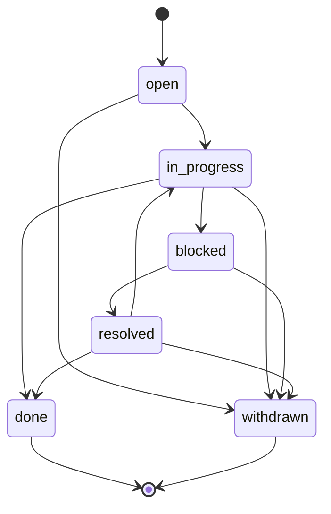

# Справочник MCP-инструментов

**🌐 Language / Язык:** [English](../../en/user/mcp-tools.md) · Русский

> Полная справка по инструментам `vesma_*`, экспортируемым MCP-сервером Vesma (`vesma mcp-server`).

Vesma говорит на [Model Context Protocol](https://modelcontextprotocol.io/) (MCP) поверх **stdio JSON-RPC 2.0**. VS Code Copilot и любой MCP-совместимый клиент могут вызывать инструменты, перечисленные здесь.

Сервер определён в `src/vesmaro/mcp_server.py`. Каждый инструмент регистрируется с помощью декоратора `@server.list_tools()` и диспетчеризируется функцией `call_tool()`.

Быстрое подключение к VS Code — в [getting-started.md#run-the-mcp-server](getting-started.md#подключите-ваш-харнес-mcp). Те же возможности доступны через HTTP — см. [http-api.md](http-api.md). Схема тегов, соблюдаемая большинством инструментов, — в [tag-contract.md](tag-contract.md).

---

## Транспорт

| Свойство | Значение |
|----------|--------- |
| Протокол | MCP (JSON-RPC 2.0 поверх stdio) |
| Имя сервера | `vesma` |
| Транспорт по умолчанию | stdio (без TCP) |
| Префикс инструментов | `vesma_` |
| Кодировка | UTF-8, JSON |

Сервер не занимает никакой порт. Остановить через `Ctrl+C` или отправкой EOF на stdin.

---

## Каталог инструментов (сводка)

| Инструмент | Назначение | Требует теги |
|------------|------------ |--------------|
| [`mnemos_add`](#mnemos_add) | Создать новую запись | да |
| [`mnemos_search`](#mnemos_search) | Гибридный поиск FTS + вектор | нет |
| [`mnemos_agent_recall`](#mnemos_agent_recall) | Per-agent recall (M3) | нет |
| [`mnemos_recall_context`](#mnemos_recall_context) | Восстановить контекст сессии для проекта | нет |
| [`mnemos_save_context`](#mnemos_save_context) | Сохранить контрольную точку сессии | нет (авто) |
| [`mnemos_list_recent`](#mnemos_list_recent) | Список последних записей | нет |
| [`mnemos_list_tags`](#mnemos_list_tags) | Список всех тегов с количеством | нет |
| [`mnemos_tags`](#mnemos_tags) *(пилот #97)* | Сгруппированные операции над тегами: rename / remove / add (`action: enum`) | нет |
| [`mnemos_tags_rename`](#mnemos_tags_rename) | Массовое переименование префиксов тегов (напр. `gcw:` → `vesma:`); по умолчанию dry-run | нет |
| [`mnemos_workflow`](#mnemos_workflow) *(#96)* | Жизненный цикл workflow: set / get / history (`action: enum`) | нет |
| [`mnemos_ingest_url`](#mnemos_ingest_url) | Загрузить и сохранить веб-страницу | да |
| [`mnemos_ingest_document`](#mnemos_ingest_document) | Ингест документа чанками с born-quarantine (ADR-0027 Ф3) | да |
| [`mnemos_watch_start`](#mnemos_watch_start) | Регистрирует проект в watch-опросе графа проектов (ADR-0032 §3.2) | нет |
| [`mnemos_watch_stop`](#mnemos_watch_stop) | Остановить одну или все регистрации watch | нет |
| [`mnemos_watch_status`](#mnemos_watch_status) | Активные регистрации watch и итог последнего опроса | нет |
| [`mnemos_index_project`](#mnemos_index_project) | Индексация зарегистрированного корня проекта в граф проектов (ADR-0032, включено по умолчанию) | нет |
| [`mnemos_project_graph_status`](#mnemos_project_graph_status) | Объёмы, свежесть, ошибки разбора и число poisoned-файлов по проекту | нет |
| [`mnemos_search_graph`](#mnemos_search_graph) | Ранжированный поиск по имени/квалифицированному имени/пути в графе, окно токен-контракта; гибридный literal-фолбэк на пустом результате (W-H) | нет |
| [`mnemos_trace_path`](#mnemos_trace_path) | BFS по рёбрам графа от одного символа (глубина ≤ 2); неоднозначные хвосты отвечают списком кандидатов (W-H) | нет |
| [`mnemos_get_file_outline`](#mnemos_get_file_outline) | Схема символов одного проиндексированного файла (формы, никогда тела) | нет |
| [`mnemos_get_code_snippet`](#mnemos_get_code_snippet) | Секрет-сканированное чтение диапазона строк С ДИСКА (PG4) | нет |
| [`mnemos_check_graph_coverage`](#mnemos_check_graph_coverage) | Вердикт по каждому пути: indexed / stale / parse-error / unindexed / missing / poisoned | нет |
| [`mnemos_get_graph_schema`](#mnemos_get_graph_schema) | Карта контракта графа: виды, лимиты, токен-контракт | нет |
| [`mnemos_list_graph_projects`](#mnemos_list_graph_projects) | Зарегистрированные проекты вместе со статусом индекса | нет |
| [`mnemos_delete_graph_project`](#mnemos_delete_graph_project) | Удалить индекс графа (призраки: и строку регистрации, за confirm-гейтом с эхом имени); очищает poisoned-набор | нет |
| [`mnemos_register_project`](#mnemos_register_project) | Зарегистрировать корень проекта для графа (#454) — ответ на отказы «not registered» | нет |
| [`mnemos_auto_collect_status`](#mnemos_auto_collect_status) | Вектор сигналов сжатия контекста (M7) | нет |
| [`mnemos_compress`](#mnemos_compress) | Обратимое сжатие (CCR) — кэш оригинала, маркер в вывод | нет |
| [`mnemos_retrieve`](#mnemos_retrieve) | Извлечение оригинала из кэша CCR или FTS5-сниппеты | нет |
| [`mnemos_align_prefix`](#mnemos_align_prefix) | CacheAligner — перенос динамического контента для стабильности prefix cache | нет |
| [`mnemos_filter`](#mnemos_filter) | Запуск / обновление контекстного фильтра для существующей записи (секреты сканируются) | нет |
| [`mnemos_assemble_context`](#mnemos_assemble_context) *(#125)* | ADR-0017 D1 — сборка контекстного блока перед вызовом LLM (recall → CCR → filter → scan → align → budget) | нет |
| [`mnemos_context_rewrite`](#mnemos_context_rewrite) *(#125)* | ADR-0018 — событие жизненного цикла `on_context_rewrite`: сообщить о перезаписи контекста, оригинал уходит в LTM (идемпотентно, без версий) | нет |
| [`mnemos_hooks`](#mnemos_hooks) *(#125)* | Хуки жизненного цикла ADR-0017 D1 / ADR-0018 — групповой инструмент `action:enum`: `pre_llm_call` / `on_session_start` / `post_tool_call` (автосжатие, opt-in) | нет |
| [`mnemos_awareness`](#mnemos_awareness) *(#254)* | Awareness-пре-флайт — наблюдаемая сервером активность соседей, дельта, подсказки о конфликтах и «операционная картина» swarm v0a/v0b (соседи в том же проекте: только счётчики/ids/времена + заявленная соседом задача — самоподанная, с меткой [unverified]) | нет |
| [Нативное сердцебиение awareness](#нативное-сердцебиение-awareness-adr-0035) *(ADR-0035)* | Хвост awareness, который нативно ездит на каждом ответе MCP-инструмента (без ручного вызова) — регулируется `awareness.native_heartbeat_mode`; волна 0 поставляет `shadow` (измеряется, не рендерится) | — |
| [`mnemos_export`](#mnemos_export) | Экспорт записей в файл (JSON или SQLite-снимок) | нет |
| [`mnemos_import`](#mnemos_import) | Импорт записей из файла экспорта (merge или restore) | нет |
| [`mnemos_reprocess`](#mnemos_reprocess) | Ручной запуск конвейера знаний для записей в очереди raw/processing | нет |
| [`mnemos_stats`](#mnemos_stats) | Счётчики состояния и ключевые пути | нет |

---

## `mnemos_add`

Создать новую запись в памяти. MCP-слой применяет контракт тегов Vesma ([M2](tag-contract.md)) перед записью.

### Входные параметры

| Поле | Тип | Обязательное | По умолчанию | Описание |
|------|-----|--------------|-------------|---------- |
| `content` | string | **да** | — | Текст для запоминания. |
| `title` | string | нет | авто | Краткий заголовок. |
| `tags` | string[] | **да** | — | Должны включать `project:<slug>`, `agent:<slug>` и хотя бы один `mnemos:<subtype>` (неймспейс подтипов — контракт данных, ребрендингом не изменяемый). |
| `memory_type` | string | нет | `note` | Одно из `note`, `fact`, `snippet`, `bookmark`, `conversation`. |
| `filter_profile` | string | нет | авто | Одно из `log`, `terminal`, `code`, `docs`, `web`, `default`. Управляет контекстным фильтром M10. |
| `verbosity` | string | нет | из конфига | Одно из `default`, `terse`, `minimal`. Вставляет подсказку по стилю вывода во framing результата. См. [Сокращение токенов вывода (P1-7)](#сокращение-токенов-вывода-p1-7). |
| `effort` | string | нет | из конфига | Одно из `low`, `medium`, `high`. Вставляет подсказку по уровню размышлений во framing результата. См. [Сокращение токенов вывода (P1-7)](#сокращение-токенов-вывода-p1-7). |

### Вывод

```json
{
  "id": "550e8400-e29b-41d4-a716-446655440000",
  "title": "Use uv, not pip",
  "status": "raw"
}
```

### Пример вызова (JSON-RPC)

```json
{
  "jsonrpc": "2.0",
  "id": 1,
  "method": "tools/call",
  "params": {
    "name": "mnemos_add",
    "arguments": {
      "content": "Use uv, not pip",
      "tags": ["project:vesma", "agent:tech-writer", "mnemos:learning"]
    }
  }
}
```

### Ошибки

| Ошибка | Причина |
|--------|-------- |
| `❌ Tag contract violation: ...` | Отсутствует тег `project:`, `agent:` или `mnemos:`. |
| `❌ Error: ...` | Сбой записи SQLite, vault или ошибка эмбеддинга (последняя не критична — см. [обзор архитектуры](../architecture/overview.md#1-хранилище-storage-layer)). |

### Связанные ресурсы

- Схема тегов: [tag-contract.md](tag-contract.md)
- HTTP-эквивалент: [`POST /memories`](http-api.md#post-memories--создать-запись-create-memory)
- CLI-эквивалент: [`vesma add`](cli-reference.md#add)

---

## `mnemos_search`

Гибридный поиск: FTS5 (полнотекстовый) + вектор + Reciprocal Rank Fusion. По умолчанию ищет только среди `published`-записей.

**Семантика запроса:** FTS5-ветка трактует ВСЮ строку `query` как одну цитированную фразу (токены подряд, в порядке следования — `_build_fts_query` заключает весь ввод в кавычки). Запрос из набора ключевых слов вида `postgres migration` найдёт только точную фразу; чтобы найти отдельные ключевые слова, делайте отдельные запросы по одному термину.

### Входные параметры

| Поле | Тип | Обязательное | По умолчанию | Описание |
|------|-----|--------------|-------------|---------- |
| `query` | string | **да** | — | Строка поиска на естественном языке. Матчится FTS5-веткой как ОДНА целая фраза — см. «Семантика запроса» выше. |
| `tags` | string[] | нет | — | Фильтр: все эти теги должны присутствовать. |
| `project` | string | нет | — | Ограничить проектом. |
| `agent` | string | нет | — | ADR-0035 W1: опциональный slug агента-вызывающего (1–64 символа `[a-z0-9_-]`) — питает идентичность нативного awareness-сердцебиения, чтобы поисковые вызовы участвовали в картине активности пиров. На состав результатов НЕ влияет. |
| `task` | string | нет | — | ADR-0027 Phase 2 (epic #308): опциональная область задачи — «голый» slug (`[a-z0-9_-]{1,64}`, без префикса `task:`). Байт-в-байт эквивалентен `tags=["task:<slug>"]` (поверхность arm-C из F1): сужает результаты до записей этой задачи; с `tags` комбинируется пересечением (должны выполняться оба). Сначала нормализуется (`My Task` → `my-task`); неисправимые slug отклоняются громко. Замечание про «голый» slug (#455): slug без префикса в `tags` (не в `task`) сам по себе ничего не матчит — когда такой запрос даёт ноль строк, а записи `task:<slug>` существуют, поиск повторяет запрос один раз с точным тегом и помечает найденные строки (`task_tag_fallback`). |
| `limit` | integer | нет | `10` | Максимум результатов. |
| `include_raw` | boolean | нет | `false` | Если true, возвращает `raw_content` вместо очищенного `content`. |
| `verbosity` | string | нет | из конфига | Одно из `default`, `terse`, `minimal`. Вставляет подсказку по стилю вывода во framing результата. См. [Сокращение токенов вывода (P1-7)](#сокращение-токенов-вывода-p1-7). |
| `effort` | string | нет | из конфига | Одно из `low`, `medium`, `high`. Вставляет подсказку по уровню размышлений во framing результата. См. [Сокращение токенов вывода (P1-7)](#сокращение-токенов-вывода-p1-7). |

### Вывод

```json
[
  {
    "id": "550e8400-e29b-41d4-a716-446655440000",
    "title": "Use uv, not pip",
    "content": "Use uv, not pip — it's faster and resolves transitive CVE closure correctly.",
    "tags": ["project:vesma", "agent:tech-writer", "mnemos:learning"],
    "score": 0.812,
    "search_type": "hybrid",
    "status": "published"
  }
]
```

### Пример вызова

```json
{
  "jsonrpc": "2.0",
  "id": 2,
  "method": "tools/call",
  "params": {
    "name": "mnemos_search",
    "arguments": {
      "query": "how to manage Python dependencies",
      "limit": 5,
      "project": "vesma"
    }
  }
}
```

### Ошибки

- `❌ Error: ...` — сбой парсинга запроса (редко; обычно завершается с пустым результатом).

### Связанные ресурсы

- HTTP-эквивалент: [`POST /search`](http-api.md#post-search--гибридный-поиск)
- CLI-эквивалент: [`vesma search`](cli-reference.md#search)

---

## `mnemos_agent_recall`

Per-agent recall (M3). Возвращает последние записи одного агента, опционально фильтруя по проекту и/или подзапросу.

### Входные параметры

| Поле | Тип | Обязательное | По умолчанию | Описание |
|------|-----|--------------|-------------|---------- |
| `agent` | string | **да** | — | Slug агента, напр. `cr-security-reviewer`. |
| `project` | string | нет | — | Ограничить проектом. |
| `task` | string | нет | — | ADR-0027 Phase 2 (epic #308): опциональная область задачи — «голый» slug (`[a-z0-9_-]{1,64}`, без префикса `task:`). Байт-в-байт эквивалентен фильтру по тегу `task:<slug>` (поверхность arm-C из F1): сужает записи агента до одной области задачи, на обеих ветках — и recency, и query. |
| `query` | string | нет | — | Опциональный FTS/векторный запрос в рамках агента. |
| `limit` | integer | нет | `20` | Максимум записей. |

При отсутствии `query` инструмент возвращает последние записи (по убыванию времени). При наличии `query` выполняет гибридный поиск в рамках тегов агента.

### Вывод

```json
[
  {
    "id": "550e8400-e29b-41d4-a716-446655440000",
    "title": "Bandit B608 hardcoded SQL — flag for triage",
    "content": "Found hardcoded SQL in src/legacy/loader.py:42 ...",
    "tags": ["project:vesma", "agent:cr-security-reviewer", "mnemos:bug-pattern"],
    "created_at": "2026-06-15T10:42:00+00:00",
    "status": "published"
  }
]
```

### Пример вызова

```json
{
  "jsonrpc": "2.0",
  "id": 3,
  "method": "tools/call",
  "params": {
    "name": "mnemos_agent_recall",
    "arguments": {
      "agent": "cr-security-reviewer",
      "project": "vesma",
      "query": "bandit SQL injection",
      "limit": 10
    }
  }
}
```

### Ошибки

- Нет типичных. Возвращает пустой массив при отсутствии совпадений.

### Связанные ресурсы

- HTTP-эквивалент: [`GET /recall/agent/{name}`](http-api.md#get-recallagentname--отзыв-агента)
- CLI-эквивалент: [`vesma recall agent <slug>`](cli-reference.md#recall-agent)

---

## `mnemos_recall_context`

Восстановить последнюю контрольную точку сессии для проекта. **Первое**, что агент должен вызвать при старте сессии, особенно после сжатия контекста.

### Входные параметры

| Поле | Тип | Обязательное | По умолчанию | Описание |
|------|-----|--------------|-------------|---------- |
| `project` | string | нет | авто (cwd) | Имя проекта. Автоопределяется из текущей директории, если не указано. |
| `agent` | string | нет | — | ADR-0035 W1: опциональный slug агента-вызывающего (1–64 символа `[a-z0-9_-]`) — питает идентичность нативного awareness-сердцебиения, чтобы recall-вызовы участвовали в картине активности пиров. На состав возвращаемых чекпоинтов НЕ влияет. |
| `query` | string | нет | — | Опциональный фокусный аспект. |
| `task` | string | нет | — | ADR-0027 Phase 2 (epic #308): опциональная область задачи — «голый» slug (`[a-z0-9_-]{1,64}`, без префикса `task:`). Байт-в-байт эквивалентен фильтру тега чекпойнта плюс `task:<slug>` (поверхность arm-C из F1): возвращает только чекпойнты, сохранённые в этой задаче. |
| `verbosity` | string | нет | из конфига | Одно из `default`, `terse`, `minimal`. Вставляет подсказку по стилю вывода во framing результата. См. [Сокращение токенов вывода (P1-7)](#сокращение-токенов-вывода-p1-7). |
| `effort` | string | нет | из конфига | Одно из `low`, `medium`, `high`. Вставляет подсказку по уровню размышлений во framing результата. См. [Сокращение токенов вывода (P1-7)](#сокращение-токенов-вывода-p1-7). |

### Вывод

Блок простого текста в формате Markdown:

```text
# Context for project 'vesma'

---
# Session checkpoint — 2026-06-15T10:42:00+00:00

## Goals
Ship M15 production hardening.
## Completed
bandit clean, mypy --strict green
## In Progress
pip-audit CVE-2026-45829 ignore
## Decisions
Pin chromadb 1.5.9 with audit
## Context
Active files: src/vesmaro/manager.py, src/vesmaro/api/main.py
```

Если контрольная точка не найдена:

```text
No context found for project 'vesma'. Start by saving context with mnemos_save_context.
```

В **режиме auto-collect** (`MNEMOS_AUTO_COLLECT=1`) к выводу добавляется блок `## 🔄 Auto-Collect Mode Active` с обязательными правилами сессии.

### Пример вызова

```json
{
  "jsonrpc": "2.0",
  "id": 4,
  "method": "tools/call",
  "params": {
    "name": "mnemos_recall_context",
    "arguments": { "project": "vesma" }
  }
}
```

### Связанные ресурсы

- `mnemos_save_context` — парный инструмент записи
- [architecture.md](../architecture/overview.md)
- HTTP-эквивалент: [`POST /context/recall`](http-api.md#post-contextrecall--отозвать-контекст-сессии)

---

## `mnemos_save_context`

Сохранить контрольную точку сессии. Агенты должны вызывать это **превентивно**: после значимой работы, перед переключением задач или при большом размере контекста.

### Входные параметры

| Поле | Тип | Обязательное | По умолчанию | Описание |
|------|-----|--------------|-------------|---------- |
| `project` | string | нет | авто (cwd) | Имя проекта. |
| `goals` | string | нет | — | Текущие цели сессии. |
| `completed` | string | нет | — | Что завершено. |
| `in_progress` | string | нет | — | Что в процессе. |
| `decisions` | string | нет | — | Ключевые технические решения + обоснование. |
| `context` | string | нет | — | Прочий контекст (пути к файлам, архитектура, особенности). |
| `agent` | string | нет | `"user"` | Идентичность агента для чекпойнта — валидируемый канал идентичности (при указании — непустая строка, из одних пробелов отклоняется). Должен совпадать с серверной привязкой session→agent, если передан `session`. |
| `session` | string | нет | — | Идентификатор сессии, привязывающий чекпойнт к разговору. Первое предъявление фиксирует привязку session→agent на сервере; последующие вызовы с той же сессией, но другим агентом отклоняются. |
| `task` | string | нет | — | ADR-0027 Phase 2 (epic #308): опциональная область задачи — «голый» slug (`[a-z0-9_-]{1,64}`, без префикса `task:`). Штампует тег `task:<slug>` на этом чекпойнте на границе сохранения (одна точка минта, максимум одна задача на запись); отзывается через `task=` в `mnemos_recall_context` / `mnemos_search` / `mnemos_list_recent`. Дедуп-попадание возвращает первую запись с ЕЁ областью задачи (task нового вызова никогда не перезаписывает сохранённую запись). |

Vesma синтезирует части в единую запись Markdown с тегами `project:<slug>`, `agent:<валидированный агент>` (`agent:user`, если не указан) и `mnemos:checkpoint` — плюс опциональный `task:<slug>`, если передан `task`. Валидированная идентичность дополнительно штампуется в серверные метаданные (`checkpoint_agent`, `checkpoint_session`) — именно они являются источником истины для атрибуции по агентам; теги носят демонстрационный характер.

Чекпойнт с пятью пустыми полями тривиально отклоняется до любого сохранения (zero-loss: вызывающий получает отказ, ничего не отбрасывается молча). Повторная отправка идентичной полезной нагрузки того же `(project, agent)` идемпотентна: возвращается id существующей записи с `duplicate=true`, ничего нового не создаётся.

### Вывод

```text
✅ Context saved (id=550e8400-...).
✅ Duplicate checkpoint (id=550e8400-..., duplicate=true) — identical checkpoint already stored, nothing new created.
```

### Пример вызова

```json
{
  "jsonrpc": "2.0",
  "id": 5,
  "method": "tools/call",
  "params": {
    "name": "mnemos_save_context",
    "arguments": {
      "project": "vesma",
      "goals": "Finish M15.1 mypy --strict",
      "completed": "Added None checks in 12 functions",
      "in_progress": "tests/test_api.py:241 type narrowing",
      "decisions": "Use cast() sparingly, prefer TypeGuard"
    }
  }
}
```

### Связанные ресурсы

- `mnemos_recall_context` — парный инструмент чтения
- Режим auto-collect: [mcp-tools.md#режим-auto-collect](#режим-auto-collect)
- HTTP-эквивалент: [`POST /context/save`](http-api.md#post-contextsave--сохранить-чекпойнт-сессии)

---

## `mnemos_list_recent`

Список последних записей в памяти, старые — последними.

### Входные параметры

| Поле | Тип | Обязательное | По умолчанию | Описание |
|------|-----|--------------|-------------|---------- |
| `limit` | integer | нет | `10` | Максимум записей. |
| `tags` | string[] | нет | — | Фильтр: все эти теги должны присутствовать (AND). |
| `project` | string | нет | — | Ограничить проектом. |
| `task` | string | нет | — | ADR-0027 Phase 2 (epic #308): опциональная область задачи — «голый» slug (`[a-z0-9_-]{1,64}`, без префикса `task:`). Байт-в-байт эквивалентен добавлению `task:<slug>` к `tags` (поверхность arm-C из F1); с `tags` комбинируется пересечением (должны выполняться оба). |

### Вывод

```json
[
  {
    "id": "550e8400-e29b-41d4-a716-446655440000",
    "title": "Use uv, not pip",
    "tags": ["project:vesma", "agent:tech-writer", "mnemos:learning"],
    "status": "raw",
    "created_at": "2026-06-15T10:42:00+00:00"
  }
]
```

### Пример вызова

```json
{
  "jsonrpc": "2.0",
  "id": 6,
  "method": "tools/call",
  "params": {
    "name": "mnemos_list_recent",
    "arguments": { "limit": 20, "project": "vesma" }
  }
}
```

### Связанные ресурсы

- HTTP-эквивалент: [`GET /memories`](http-api.md#get-memories--список-последних)
- CLI-эквивалент: [`vesma recall`](cli-reference.md#recall)

---

## `mnemos_list_tags`

Список всех тегов в памяти с количеством вхождений.

### Входные параметры

Отсутствуют.

### Вывод

```json
{
  "project:vesma": 142,
  "agent:tech-writer": 23,
  "agent:sre": 41,
  "mnemos:learning": 67,
  "mnemos:bug-pattern": 12,
  "mnemos:decision": 8,
  "mnemos:checkpoint": 14
}
```

### Пример вызова

```json
{
  "jsonrpc": "2.0",
  "id": 7,
  "method": "tools/call",
  "params": { "name": "mnemos_list_tags", "arguments": {} }
}
```

### Связанные ресурсы

- HTTP-эквивалент: [`GET /tags`](http-api.md#get-tags--список-тегов-с-количеством)

---

## `mnemos_tags`

Сгруппированные массовые операции над тегами: переименование префикса, удаление или добавление тегов. Диспетчеризация по действию (`action: enum`) — сгруппированный пилотный инструмент (#97); каждое действие идёт через один и тот же безопасный путь записи (обычный `UPDATE`, FTS5-индекс остаётся консистентным), по умолчанию работает как предпросмотр (`dry_run: true`) и идемпотентно.

### Входные параметры

| Поле | Тип | Обязательное | По умолчанию | Описание |
|------|-----|--------------|--------------|---------- |
| `action` | string | **да** | — | `rename`, `remove` или `add`. |
| `from_prefix` | string | для `rename` | — | Исходный префикс, напр. `gcw:`. Должен заканчиваться на `:`. |
| `to_prefix` | string | для `rename` | — | Целевой префикс, напр. `vesma:`. Должен заканчиваться на `:`. |
| `tags` | string[] | для `remove` / `add` | — | Теги для удаления или добавления. Обязательны для этих двух действий. |
| `subtypes` | string[] | нет | — | Опциональный белый список подтипов для переименования (только `rename`). |
| `wildcard` | boolean | нет | `false` | Только `remove`: считать каждый элемент `tags` префиксом и снимать все совпадающие теги `prefix*` вместо точного совпадения. `rename` построен на префиксах по своей природе. |
| `dry_run` | boolean | нет | `true` | Предпросмотр без записи. |
| `project` | string | нет | — | Ограничить сканирование slug проекта. |
| `agent` | string | нет | — | Ограничить сканирование slug агента. |
| `invalid_subtypes_to_legacy` | boolean | нет | `false` | Только `rename`: переименовывать невалидные подтипы в `<to_prefix>legacy` вместо пропуска. |

> **Безопасность контракта.** Итоговый набор тегов повторно валидируется в strict-режиме для каждой записи: снятие последнего тега `project:` / `agent:` / `vesma:` (или иное нарушение контракта) отклоняется по конкретной записи с записью в `errors`, а не портит хранилище.

### Вывод

Словарь-отчёт. `changed` считает записи, чей набор тегов реально изменился; `renamed` сохранён для обратной совместимости с вызывающими `mnemos_tags_rename` и зеркалит `changed`:

```json
{
  "action": "remove",
  "scanned": 142,
  "changed": 9,
  "removed_tags": ["severity:high"],
  "wildcard": false,
  "errors": [],
  "dry_run": true
}
```

`rename` возвращает `{"from_prefix", "to_prefix", "scanned", "renamed", "changed", "skipped_invalid", "errors", "dry_run"}`; `add` возвращает `{"action", "scanned", "changed", "added_tags", "errors", "dry_run"}`.

### Пример вызова

```json
{
  "jsonrpc": "2.0",
  "id": 9,
  "method": "tools/call",
  "params": {
    "name": "mnemos_tags",
    "arguments": {
      "action": "rename",
      "from_prefix": "gcw:",
      "to_prefix": "mnemos:",
      "dry_run": false
    }
  }
}
```

### Ошибки

| Ошибка | Причина |
|--------|-------- |
| `unknown action '<x>'...` | `action` не равен `rename` / `remove` / `add`. |
| `action='rename' requires 'from_prefix' and 'to_prefix' ...` | Для rename не переданы префиксы. |
| `tags must be a non-empty list` | `remove` / `add` вызван с пустым списком `tags`. |

### Связанные ресурсы

- Группированный родственник: [`mnemos_tags_rename`](#mnemos_tags_rename) — legacy-алиас для `action: "rename"`

---

## `mnemos_tags_rename`

Массовое переименование тегов `from_prefix:<subtype>` → `to_prefix:<subtype>` по всем существующим записям. Сохранён как **неразрывающий алиас**: вызовы диспетчеризируются в тот же путь rename, что и у [`mnemos_tags`](#mnemos_tags) с `action: "rename"` (случайный ключ `action` в аргументах игнорируется). Безопасно — переименование идёт через обычный `UPDATE`, поэтому FTS5 external-content индекс остаётся консистентным, — и идемпотентно: повторный запуск с теми же аргументами переименовывает 0 записей.

### Входные параметры

| Поле | Тип | Обязательное | По умолчанию | Описание |
|------|-----|--------------|--------------|---------- |
| `from_prefix` | string | **да** | — | Исходный префикс, напр. `gcw:`. Должен заканчиваться на `:`. |
| `to_prefix` | string | **да** | — | Целевой префикс, напр. `vesma:`. Должен заканчиваться на `:`. |
| `subtypes` | string[] | нет | — | Опциональный белый список подтипов для переименования. |
| `dry_run` | boolean | нет | `true` | Предпросмотр без записи. |
| `project` | string | нет | — | Ограничить slug проекта. |
| `agent` | string | нет | — | Ограничить slug агента. |
| `invalid_subtypes_to_legacy` | boolean | нет | `false` | Переименовывать невалидные подтипы в `<to_prefix>legacy` вместо пропуска. |

### Вывод

```json
{
  "from_prefix": "gcw:",
  "to_prefix": "vesma:",
  "scanned": 142,
  "renamed": 0,
  "changed": 0,
  "skipped_invalid": 3,
  "errors": [],
  "dry_run": true
}
```

### Пример вызова

```json
{
  "jsonrpc": "2.0",
  "id": 10,
  "method": "tools/call",
  "params": {
    "name": "mnemos_tags_rename",
    "arguments": {
      "from_prefix": "gcw:",
      "to_prefix": "mnemos:",
      "invalid_subtypes_to_legacy": true
    }
  }
}
```

### Связанные ресурсы

- Группированный инструмент: [`mnemos_tags`](#mnemos_tags) — `action: "rename"` — тот же путь кода
- HTTP-эквивалент: `POST /tags/rename` (реализован в API; пока не описан в [http-api.md](http-api.md))

---

## `mnemos_ingest_url`

Загрузить веб-страницу, извлечь основной контент (через `trafilatura`) и сохранить как запись.

### Входные параметры

| Поле | Тип | Обязательное | Описание |
|------|-----|--------------|---------- |
| `url` | string | **да** | HTTP / HTTPS URL для загрузки. |
| `tags` | string[] | **да** | Тот же контракт M2, что и в `mnemos_add`. |

> **Защита от SSRF.** MCP-слой удаляет `user:password@` из authority URL перед загрузкой (глубокая защита совместно с внутрипроцессной защитой). Не обходите это, собирая URL из строки.

### Вывод

```json
{
  "id": "550e8400-e29b-41d4-a716-446655440000",
  "title": "How to manage Python dependencies",
  "url": "https://example.com/article"
}
```

### Пример вызова

```json
{
  "jsonrpc": "2.0",
  "id": 8,
  "method": "tools/call",
  "params": {
    "name": "mnemos_ingest_url",
    "arguments": {
      "url": "https://example.com/article",
      "tags": ["project:research", "agent:user", "mnemos:learning"]
    }
  }
}
```

### Ошибки

| Ошибка | Причина |
|--------|-------- |
| `❌ Error: ...` | Сетевой сбой, заблокированный URL (защита от SSRF) или ошибка извлечения `trafilatura`. |

### Связанные ресурсы

- CLI-эквивалент: [`vesma ingest url <URL>`](cli-reference.md#ingest-url)
- HTTP-эквивалент: [`POST /memories` с ручным контентом](http-api.md#post-memories--создать-запись-create-memory)
- HTTP-эквивалент: [`POST /ingest-url`](http-api.md#post-ingest-url--получить-и-сохранить-веб-страницу)
- Безопасность: [security.md](../admin/security.md#2-защита-от-ssrf-memorymanager_validate_url)

---

## `mnemos_ingest_document`

Ингест целого документа чанками — **docs-as-memory** (ADR-0027, фаза 3). Текст документа разбивается с сохранением структуры (чанки по заголовкам несут метаданные-конвенцию `{doc_id, chunk_idx, heading_path}`), и каждая строка-чанк попадает в память **сразу в карантине** (born-quarantine): ингестируемые документы — недоверенный контент, невидимый для всех поверхностей выдачи, пока их не очистит **danger-sweep**.

### Жизненный цикл карантина (дисциплина ADR-0019 §5)

1. **Born-quarantine** — каждая строка-чанк создаётся в терминальном состоянии danger-полосы (`pipeline_state=quarantined`, причина `doc-ingest-born-quarantine`): не находится поиском, не допускается в сборку контекста, без векторного эмбеддинга.
2. **Danger-sweep в момент завершения ингеста** — Phase A danger-детектор ADR-0019 (тот же перечисленный набор позитивных сигналов, что питает gate публикации) прогоняется по всем чанкам документа вместе:
   - **чистый** чанк **освобождается**: становится обычной строкой памяти в статусе `published` (доступен поиску, task-скоупу, task-линзам — без спец-обработки), с меткой времени sweep в метаданных;
   - чанк с **позитивным сигналом детектора** (инъекция в промпт, высокоуверенный секрет) **остаётся в карантине**, в операторской `quarantine_reason` — коды классов детектора: освобождение — явное и аудируемое, карантин — поглощающее состояние;
   - **ошибка сканера** — fail-closed: чанк остаётся в карантине с причиной `detector-error`.
3. **Семантика освобождения — чанково-атомарная** — чистый чанк освобождается, даже если соседний чанк того же документа помечен; помеченный остаётся в карантине. Документ никогда не «наполовину видим»: до sweep ни один чанк не допущен, после — ровно чистые.
4. **Выдача — последняя линия** (инвариант 7 ADR-0027) — освобождённый чанк, contaminated *после* освобождения, всё равно проходит повторный секрет-скан на каждом канале выдачи; refuse-режим отбрасывает запись, redact-режим замазывает совпадения. Sweep — не последняя линия, выдача — последняя.
5. **Повторный ингест и версия кеша** (инвариант 4 ADR-0027) — повторный ингест того же `doc_id` **заменяет** чанки документа (рефрагментация) и поднимает версию doc-chunk `ccr_cache` **в той же SQLite-транзакции**. Честная рамка: ключ версии — **consumer-facing счётчик инвалидации** (экспонирован в `mnemos_stats` / `GET /stats` как `doc_chunk_cache_version`, та же позиция, что у `graph_epoch`) — поднимается транзакционно при каждой рефрагментации; любой кеширующий потребитель **обязан** его читать и считать изменение полной инвалидацией. В-repo потребителя, завязанного на него, пока нет.

### Граница с `mnemos_ingest_url`

`mnemos_ingest_url` сохраняет свои семантики до фазы 3: загруженная страница — ОДНА строка памяти через обычную политику видимости, без born-quarantine. Инструмент **не** карантинизируется задним числом — документный путь — вот этот отдельный инструмент.

### Вход

| Поле | Тип | Обязателен | Описание |
|-------|-----|-----------|----------|
| `text` | string | **да** | Полный текст документа для разбиения и ингеста. |
| `doc_id` | string | **да** | Логическая идентичность документа; стабильна при повторном ингесте (заменяет чанки + поднимает версию кеша). |
| `tags` | string[] | **да** | Тот же контракт M2, что и у `mnemos_add`. |
| `title` | string | нет | Необязательный заголовок документа. |
| `source_url` | string | нет | Необязательный URL-источник. |

### Выход

```json
{
  "doc_id": "dep-guide",
  "chunks_total": 3,
  "released": 2,
  "quarantined": 1,
  "chunk_ids": ["…", "…", "…"],
  "reingest": false,
  "cache_version": 0,
  "truncated": false
}
```

### Пример вызова

```json
{
  "jsonrpc": "2.0",
  "id": 9,
  "method": "tools/call",
  "params": {
    "name": "mnemos_ingest_document",
    "arguments": {
      "text": "# Деплой\n\nЗапусти раскатку.\n\n# Откат\n\nВерни предыдущий релиз.",
      "doc_id": "dep-guide",
      "tags": ["project:research", "agent:user", "mnemos:learning"],
      "title": "Гайд по деплою"
    }
  }
}
```

### Ошибки

| Ошибка | Причина |
|-------|---------|
| `❌ Error: ...` | Пустой документ (нет чанков) или нарушение границы doc_id. |

### См. также

- HTTP-эквивалент: [`POST /ingest-document`](http-api.md#post-ingest-document--ингест-документа-чанками-с-born-quarantine)
- Инструмент одного URL: [`mnemos_ingest_url`](#mnemos_ingest_url) (отдельная семантика — одна строка, без карантина)
- ADR: [ADR-0027](../../project/adr/0027-multi-context-memory.md) (фаза 3, инварианты 4/7/8); [ADR-0019](../../project/adr/0019-optimistic-publication-async-refinement.md) (§5 карантин, Phase A danger-gate)

---

## `mnemos_watch_start`

Регистрирует граф кода проекта во внутрипроцессном watch-опросе (ADR-0032 §3.2). Один кооперативный фоновый поток проверяет проиндексированные файлы проекта по mtime+size на адаптивном интервале и переиндексирует при фактических изменениях — с аудитом под причиной `watch`.

> **Изменение поведения.** Это не file watcher директорий. Прежняя форма `paths=` / `scan=` / `include_rules=` была нереализованной заглушкой, возвращавшей ложный успех; она удалена, эти аргументы теперь отклоняются с `bad-request`.

**Предусловия:** операторские флаги `code_graph.enabled` **и** `code_graph.watch` (оба выключены по умолчанию), существующий индекс проекта и атрибуция агента (PG7).

### Входные параметры

| Поле | Тип | Обязательное | По умолчанию | Описание |
|------|-----|--------------|-------------|---------- |
| `project_id` | string | **да** | — | Идентификатор зарегистрированного проекта. |
| `agent` | string | **да** | — | Идентичность вызывающего (атрибуция PG7). |
| `session` | string | нет | — | Необязательный id сессии для аудита. |

### Вывод

```json
{
  "status": "registered",
  "project": "vesma",
  "project_id": "vesma",
  "root": "/home/you/vesma",
  "agent": "tech-writer",
  "session": null,
  "registered_at": "2026-09-28T12:00:00+00:00",
  "interval_sec": 5.0,
  "runs": 0,
  "reindexes": 0,
  "last_run_at": null,
  "last_result": null,
  "last_error": null
}
```

Повторная регистрация того же проекта возвращает payload с `"status": "already-registered"`. Регистрации живут в пределах жизни процесса — рестарт их сбрасывает, нужна повторная регистрация. Глобальный лимит — `code_graph.watch_max_registrations` (по умолчанию 8).

### Пример вызова (JSON-RPC)

```json
{
  "jsonrpc": "2.0",
  "id": 9,
  "method": "tools/call",
  "params": {
    "name": "mnemos_watch_start",
    "arguments": { "project_id": "vesma", "agent": "tech-writer" }
  }
}
```

### Ошибки

| Ошибка | Причина |
|--------|---------|
| `code: "disabled"` | Флаг `code_graph.enabled` или `code_graph.watch` выключен. |
| `code: "attribution-required"` | Отсутствует или пуст `agent`. |
| `code: "bad-request"` | Нет `project_id`; индекса ещё нет (опрос переиндексирует — первый индекс он не создаёт); достигнут лимит регистраций; либо отклонённая легаси-форма (`paths=` / `scan=` / `include_rules=`). |

### Связанные ресурсы

- HTTP-эквивалент: [`POST /watch/start`](http-api.md#post-watchstart--регистрация-watch-опроса-графа-проектов)
- Семейство инструментов графа: [Инструменты графа проектов (ADR-0032)](#инструменты-графа-проектов-adr-0032)

---

## `mnemos_watch_stop`

Остановить одну регистрацию watch (по `project_id`) или ВСЕ, если аргумент опущен. Идемпотентно.

### Входные параметры

| Поле | Тип | Обязательное | По умолчанию | Описание |
|------|-----|--------------|-------------|---------- |
| `project_id` | string | нет | — | Проект, за которым перестать следить; опустите, чтобы остановить все. |

### Вывод

```text
✅ Watch stopped.
```

### Связанные ресурсы

- HTTP-эквивалент: [`POST /watch/stop`](http-api.md#post-watchstop--остановить-регистрации-watch)
- Семейство инструментов графа: [Инструменты графа проектов (ADR-0032)](#инструменты-графа-проектов-adr-0032)

---

## `mnemos_watch_status`

Активные регистрации watch и итог последнего опроса по каждому проекту (watch-опрос ADR-0032).

### Входные параметры

Отсутствуют.

### Вывод

```json
{
  "running": true,
  "watch_enabled": true,
  "cap": 8,
  "registrations": [
    {
      "project": "vesma",
      "project_id": "vesma",
      "root": "/home/you/vesma",
      "agent": "tech-writer",
      "session": null,
      "registered_at": "2026-09-28T12:00:00+00:00",
      "interval_sec": 5.0,
      "runs": 3,
      "reindexes": 1,
      "last_run_at": "2026-09-28T12:00:15+00:00",
      "last_result": "fresh",
      "last_error": null
    }
  ]
}
```

### Связанные ресурсы

- HTTP-эквивалент: [`GET /watch/status`](http-api.md#get-watchstatus--статус-watch-опроса)
- Семейство инструментов графа: [Инструменты графа проектов (ADR-0032)](#инструменты-графа-проектов-adr-0032)

---

## Инструменты графа проектов (ADR-0032)

Десять инструментов над **графом кода проектов**: символы и схемы файлов, разобранные tree-sitter'ом, навигация, честность покрытия. В графе хранятся только имена, квалифицированные имена, диапазоны строк и формы сигнатур — ни одного байта исходника (PG1). Дизайн, инварианты безопасности и дорожная карта: [ADR-0032](../../project/adr/0032-project-graph.md).

> **Включено по умолчанию (решение владельца 2026-09-28).** Графы — первоклассная часть сервера: на них строятся компоненты экосистемы, tree-sitter едет в ядре зависимостей. Оператор может скрыть поверхность флагом `code_graph.enabled: false` — тогда каждый вызов отвечает `code: "disabled"`. Тот же гейт действует на [REST-namespace `/graph/`](http-api.md#граф-проектов-adr-0032).

### Операторский гейт (конфигурация)

| Ключ (`code_graph.`) | По умолчанию | Значение |
|----------------------|--------------|----------|
| `enabled` | `true` | Мастер-флаг 10 инструментов и REST-namespace `/graph/` — ВКЛЮЧЁН по умолчанию (решение владельца 2026-09-28); `false` скрывает всю поверхность. |
| `beacon` | `true` | Одна строка-хвост в выводе `assemble_context` со свежестью графа (действует только при включённом `enabled`). |
| `watch` | `true` | Watch-опрос (`mnemos_watch_start`) взведён по умолчанию, но ИНЕРТЕН до явной регистрации; мастер-гейт действует поверх. |
| `auto_index` | `true` | Нативная авто-индексация (см. ниже) — первый контакт через MCP/хуки сам регистрирует и индексирует проект в фоне; `false` оставляет только ручные триггеры. |
| `index_max_files` | `20000` | Жёсткий лимит проиндексированных файлов на проект. Fail-closed: превышение отклоняет ВЕСЬ индекс — частичный граф не публикуется никогда (PG7). |
| `index_max_source_mb` | `500` | Жёсткий лимит суммарного объёма исходников на проект, МиБ (тот же fail-closed-принцип). |
| `watch_max_registrations` | `8` | Глобальный лимит активных watch-регистраций на процесс. |
| `watch_base_interval_sec` / `watch_interval_per_500_files` / `watch_max_interval_sec` | `5.0` / `1.0` / `60.0` | Адаптивный интервал опроса: база + 1с за каждые 500 файлов, с потолком. |
| `auto_reindex_min_interval_sec` | `300.0` | Троттлинг на проект между последовательными АВТО-индексациями (ручной путь не троттлится никогда). |
| `auto_register_max_projects` | `64` | Глобальный лимит проектов, которые АВТО-путь вообще может создать (считается по маркеру `auto-registered by` в описании). Сверх лимита хинт — тихий skip с аудит-строкой `auto-register-capped`, никогда ошибка; реис корня и регистрации оператора не считаются. |

Переопределение через окружение — по канонической схеме настроек: `VESMA_CODE_GRAPH__INDEX_MAX_FILES`, `VESMA_CODE_GRAPH__INDEX_MAX_SOURCE_MB`, `VESMA_CODE_GRAPH__AUTO_INDEX`, `VESMA_CODE_GRAPH__AUTO_REINDEX_MIN_INTERVAL_SEC`, `VESMA_CODE_GRAPH__AUTO_REGISTER_MAX_PROJECTS`.

### Нативная авто-индексация (zero-touch)

С волны PG-0.5 (директива владельца 2026-09-29) граф индексируется сам — **без единого явного вызова, инструкции или скилла**:

- **Первый контакт сам регистрирует.** Каждый вызов MCP-инструмента и каждый хук `pre_llm_call` подаёт дешёвый хинт активности. Если проекта ещё нет в таблице projects, а его cwd содержит упаковочный манифест (`pyproject.toml`, `setup.py`, `package.json`, `go.mod`, `Cargo.toml` — **авто-регистрации нужен manifest-маркер, голого `.git` недостаточно**; `$HOME` и корень файловой системы не авто-регистрируются никогда, даже с манифестом), проект авто-регистрируется с этим cwd как корнем — атрибуция (агент, время) попадает в описание проекта и в аудит-строку `auto-register` (PG7). **Один корень = один граф**: хинт с новым именем по уже зарегистрированному корню реиспользует СУЩЕСТВУЮЩИЙ проект (аудит `auto-register-reused`) вместо дублирования строки и повторной индексации того же дерева; глобальный лимит `auto_register_max_projects` (по умолчанию 64) ограничивает, сколько проектов авто-путь вообще может создать — сверх него тихий skip с аудит-строкой `auto-register-capped`.
- **Дальше работает фон.** Индекса нет → фоновая первичная индексация (аудит-причина `auto-first`); индекс есть → дешёвая проверка свежести mtime+size и при фактических изменениях инкрементальная переиндексация (причина `auto-stale`). Всё едет на том же едином кооперативном потоке-шедулере, что и watch-опрос; вызвавший инструмент НИКОГДА не блокируется и не падает из-за хинта.
- **Маячок появляется сам.** Как только индекс существует, строка-хвост в `assemble_context` возникает без действий агента.
- **Ограничители.** Авто-действия троттлятся на проект (`auto_reindex_min_interval_sec`, по умолчанию 300с), атрибутируются агентом хинта (нет `agent` → нет авто-действия, PG7) и проходят через те же fail-closed-лимиты PG7, что и ручные запуски — превышение лимита отменяет всю авто-индексацию с аудит-строкой, частичного графа не бывает. ПРОВАЛЬНАЯ первая авто-индексация ставит авто-путь проекта на паузу (флаг `auto_suspended` в сайдкаре): дальнейшие хинты полностью пропускают дерево — без хождения по диску — пока успешный ручной `mnemos_index_project`, `mnemos_delete_graph_project` или watch-переиндексация не снимут флаг; `auto-stale` по валидному существующему индексу никогда не приостанавливается. Мульти-путевая регистрация индексирует только `paths[0]` (ограничение v1).
- **REST — не авто-поверхность** (нет cwd для гейта регистрации) — `/graph/*` живёт ровно как задокументировано. Ручные инструменты (`mnemos_index_project`, `mnemos_watch_start`) остаются путём явного контроля; `code_graph.auto_index: false` полностью выключает авто-путь.

### Токен-контракт

Каждое оконное движение принимает `max_output_tokens` (целое, 128–1 000 000, по умолчанию 3200):

- Бюджет считается в **байтах = токены × 4** — детерминированный потолок 4 байта UTF-8 на токен, никакой токенизаторной угадайки.
- Строки **не режутся пополам**: строка, не влезающая в бюджет, отбрасывается ЦЕЛИКОМ; сниппеты — целыми СТРОКАМИ. `has_more: true` и курсор говорят, что осталось.
- Курсор **строго возрастает** (хотя бы одна строка всегда потребляется). Бюджет, в который не влезает даже одна строка, отклоняется (`GraphBudgetError`, HTTP `400`) вместо зацикливания на той же странице.
- Детализация — opt-in: сигнатуры едут только при `include_signature: true` в `mnemos_search_graph`.

Ошибки, общие для всей группы: `disabled` (операторский гейт), `attribution-required` (нет `agent`, PG7), отказы конфайнмента (незарегистрированный проект или путь вне зарегистрированного корня, PG2), отказы бюджета. Каждый вызов — чтение или запись — аудируется по агенту (PG7). REST-близнецы отображают их на HTTP-коды: см. [REST-раздел графа проектов](http-api.md#граф-проектов-adr-0032).

---

## `mnemos_index_project`

Индексация **зарегистрированного** корня проекта в общий граф проектов — полная или инкрементальная. Сериализуется по проекту: параллельный вызов сразу получает статус `in-progress`. PG2: принимается только проект, зарегистрированный в таблице projects; произвольные пути отклоняются. PG7: лимиты fail-closed, запуск аудируется с вашим agent id.

### Входные параметры

| Поле | Тип | Обязательное | По умолчанию | Описание |
|------|-----|--------------|-------------|---------- |
| `project_id` | string | **да** | — | Идентификатор или уникальное имя зарегистрированного проекта. |
| `agent` | string | **да** | — | Идентичность вызывающего (PG7). |
| `session` | string | нет | — | Необязательный id сессии для аудита. |
| `incremental` | boolean | нет | `true` | Пропустить работу, если ничего не изменилось. |
| `reason` | string | нет | — | Причина для аудита. |

### Вывод

```json
{
  "status": "indexed",
  "nodes": 2143,
  "edges": 5107,
  "files_indexed": 312,
  "files_skipped": 88,
  "poisoned": ["deploy/secret.env"],
  "unpoisoned": [],
  "parse_errors": {"legacy/parser.py": "unsupported syntax"},
  "duration_sec": 4.212,
  "incremental": true,
  "staleness": {
    "total_files": 400,
    "fresh_percent": 100.0,
    "changed_files": [],
    "last_indexed_at": "2026-09-28T12:00:04+00:00"
  }
}
```

`status` — `indexed` / `reindexed` / `fresh` / `in-progress`; `staleness` равен `null`, когда ничего не изменилось (без фальшивой свежести). Ошибки разбора едут в ответе как маркер честности — «clean ≠ proof». Poisoned-пути сработали на детектор секретов при индексации и навсегда отклоняются при выдаче сниппетов (PG3) — если они не в allowlist (`code_graph.secret_allowlist`, #449): `unpoisoned` перечисляет пути, которые allowlist-проход этого запуска снял с отравления (аудит `allowlist-unpoison`).

### Пример вызова (JSON-RPC)

```json
{
  "jsonrpc": "2.0",
  "id": 30,
  "method": "tools/call",
  "params": {
    "name": "mnemos_index_project",
    "arguments": { "project_id": "vesma", "agent": "tech-writer" }
  }
}
```

### Связанные ресурсы

- HTTP-эквивалент: [`POST /graph/index`](http-api.md#post-graphindex--индексация-зарегистрированного-проекта)
- Модель безопасности: [ADR-0032, инварианты PG1–PG7](../../project/adr/0032-project-graph.md)

---

## `mnemos_project_graph_status`

Статус графа проектов по одному зарегистрированному проекту: объёмы узлов/рёбер/файлов, свежесть (процент fresh, `last_indexed_at`), ошибки разбора (остаются видимыми) и число poisoned-файлов (PG3). Только чтение, с аудитом.

### Входные параметры

| Поле | Тип | Обязательное | По умолчанию | Описание |
|------|-----|--------------|-------------|---------- |
| `project_id` | string | **да** | — | Идентификатор или уникальное имя зарегистрированного проекта. |
| `agent` | string | **да** | — | Идентичность вызывающего (PG7). |
| `session` | string | нет | — | Необязательный id сессии для аудита. |

### Вывод

```json
{
  "project": "vesma",
  "nodes": 2143,
  "edges": 5107,
  "files": 400,
  "parse_errors": {"legacy/parser.py": "unsupported syntax"},
  "parse_error_count": 1,
  "poisoned_count": 1,
  "hints": [],
  "staleness": {
    "total_files": 400,
    "fresh_percent": 97.5,
    "changed_files": ["src/vesmaro/manager.py"],
    "last_indexed_at": "2026-09-28T12:00:04+00:00"
  }
}
```

`hints` — добавочное поле, обычно `[]`; если ВЕСЬ poisoned-набор живёт в
тестовых деревьях (`tests/**` / `benchmarks/**`), статус несёт одну
строку — «все poisoned-файлы совпадают с тестовыми фикстурами —
рассмотрите `code_graph.secret_allowlist`» — эвакуационный люк для
заведомо фейковых секрет-фикстур, а не отмена скана при выдаче (PG4).

### Связанные ресурсы

- HTTP-эквивалент: [`GET /graph/status/{project_id}`](http-api.md#get-graphstatusproject_id--статус-графа-проекта)

---

## `mnemos_search_graph`

Поиск по графу проектов по имени / квалифицированному имени / пути (подстрока). Ранжирование ДО бюджетного среза: точные совпадения выше префиксных, префиксные выше подстрочных. Действует токен-контракт.

**Гибридный literal-фолбэк (W-H).** Когда символьный граф не нашёл НИ ОДНОГО совпадения, ограниченный read-only скан зарегистрированного корня проекта отвечает строками контента вместо пустого результата: строки с `match_kind: "literal"` несут `path` / `line` / `snippet` (repo-relative, обрезанный по краям, ≤ 240 символов; максимум 20 строк; без узловых id), а в ответе появляется маркер верхнего уровня `fallback_used: true` — ТОЛЬКО когда фолбэк запускался (на символьных совпадениях отсутствует, никогда null). Скан переиспользует denylist индексатора (`.git`, `.venv`, `node_modules`, vendored-деревья, dotfiles и файлы с «секретными» расширениями никогда не открываются), не ходит по симлинкам, пропускает бинарные файлы и файлы > 1 МиБ и останавливается по жёстким лимитам (число файлов / ~2 с — упёршийся в лимит скан логируется как неполный). Каждая literal-строка проходит тот же детектор секретов PG4, что и выдача сниппетов: находка уничтожает строку; poisoned-пути (PG3) не выдают контент вовсе; скан, который не может завершиться безопасно, вырождается в честную пустоту без фолбэка. Символьные строки несут добавочное поле `match_kind: "symbol"`. `total_matches` считает ВЕСЬ ответ целиком — когда отвечает фолбэк, он считает выданные literal-строки (непустой фолбэк никогда не показывается как `total_matches: 0`). Выключается через `code_graph.literal_fallback: false`. REST-близнец `POST /graph/search` наследует всё это без изменений.

### Входные параметры

| Поле | Тип | Обязательное | По умолчанию | Описание |
|------|-----|--------------|-------------|---------- |
| `project_id` | string | **да** | — | Идентификатор или уникальное имя зарегистрированного проекта. |
| `query` | string | **да** | — | Подстрока имени / квалифицированного имени / пути. |
| `agent` | string | **да** | — | Идентичность вызывающего (PG7). |
| `session` | string | нет | — | Необязательный id сессии для аудита. |
| `kind` | string | нет | — | Фильтр по виду узла: один из `Project`, `File`, `Module`, `Class`, `Function`, `Method`, `Type`. |
| `limit` | integer | нет | `50` | Максимум ранжированных строк на страницу (жёсткий потолок страницы — 200). |
| `cursor` | integer | нет | `0` | Курсор страницы из предыдущего вызова. |
| `max_output_tokens` | integer | нет | `3200` | Бюджет вывода (128–1 млн). |
| `include_signature` | boolean | нет | `false` | Opt-in-флаг детализации: включить формы сигнатур. |

### Вывод

```json
{
  "project": "vesma",
  "query_kind": null,
  "results": [
    {
      "score": 3,
      "id": "vesma#src/vesmaro/codegraph/service.py#window_rows#158",
      "project": "vesma",
      "kind": "Function",
      "name": "window_rows",
      "qname": "vesmaro.codegraph.service.window_rows",
      "path": "src/vesmaro/codegraph/service.py",
      "start_line": 158,
      "end_line": 190,
      "lang": "python",
      "signature": "def window_rows(rows: list[dict[str, Any]], max_output_tokens: int, cursor: int) -> tuple[list[dict[str, Any]], bool, int]"
    }
  ],
  "total_matches": 1,
  "cursor": 0,
  "has_more": false,
  "last_indexed_at": "2026-09-28T12:00:04+00:00"
}
```

Ответ literal-фолбэка (W-H — символьный граф не нашёл ничего):

```json
{
  "project": "vesma",
  "query_kind": null,
  "results": [
    {
      "match_kind": "literal",
      "path": "src/vesmaro/mcp_server.py",
      "line": 1864,
      "snippet": "name=\"mnemos_search_graph\","
    }
  ],
  "total_matches": 1,
  "cursor": 0,
  "has_more": false,
  "fallback_used": true,
  "last_indexed_at": "2026-09-28T12:00:04+00:00"
}
```

### Связанные ресурсы

- HTTP-эквивалент: [`POST /graph/search`](http-api.md#post-graphsearch--поиск-по-графу-проектов)
- Токен-контракт: [выше](#токен-контракт)

---

## `mnemos_trace_path`

BFS по `project_edges` от одного символа. Разрешение (W-H): точное квалифицированное имя идёт в обход напрямую (байт-в-байт как до W-H); голый хвост (например, `update_fields`), разрешающийся ОДНОЗНАЧНО, тоже идёт напрямую; НЕОДНОЗНАЧНЫЙ хвост отвечает полезным (НЕ error-образным) ответом — ранжированный `candidate_list` (qname / kind / path / строки начала-конца, максимум 10, `candidate_count` — честный итог) с маркером `candidates: true` и подсказкой перезапустить с квалифицированным именем; КОЛЛИЗИЯ одинаковых qname (одно квалифицированное имя в нескольких файлах) отвечает тем же payload-ом кандидатов с подсказкой различать по path/строке — молчаливый выбор первого исключён; отсутствующий символ — прежний внятный not-found. Глубина ≤ 2 с лимитом fanout на узел и лимитом суммарной работы (дисциплина обхода ADR-0030). Токен-контракт действует на секцию `nodes`; секция `edges` идёт вне токен-бюджета — её ограничивают только лимиты fanout/total, при достижении честно ставится `truncated` (бюджет рёбер — волна PG-1, ADR-0032).

### Входные параметры

| Поле | Тип | Обязательное | По умолчанию | Описание |
|------|-----|--------------|-------------|---------- |
| `project_id` | string | **да** | — | Идентификатор или уникальное имя зарегистрированного проекта. |
| `qname` | string | **да** | — | Квалифицированное имя символа (точное или уникальный хвост). |
| `agent` | string | **да** | — | Идентичность вызывающего (PG7). |
| `session` | string | нет | — | Необязательный id сессии для аудита. |
| `depth` | integer | нет | `2` | Глубина BFS, 1–2. |
| `max_output_tokens` | integer | нет | `3200` | Бюджет вывода (128–1 млн). |

### Вывод

```json
{
  "project": "vesma",
  "start": "vesmaro.codegraph.service.window_rows",
  "depth": 2,
  "nodes": [
    {
      "id": "vesma#src/vesmaro/codegraph/service.py#window_rows#158",
      "qname": "vesmaro.codegraph.service.window_rows",
      "kind": "Function",
      "path": "src/vesmaro/codegraph/service.py",
      "start_line": 158,
      "end_line": 190,
      "depth": 0
    }
  ],
  "edges": [
    { "from": "vesma#…#window_rows#158", "to": "vesma#…#resolve_token_budget#135", "kind": "CALLS", "provenance": "tree-sitter" }
  ],
  "truncated": false,
  "cursor": 0,
  "has_more": false,
  "last_indexed_at": "2026-09-28T12:00:04+00:00"
}
```

`truncated: true` означает, что сработал лимит fanout или суммарной работы — обход честно сообщает, что пропустил.

Ответ на неоднозначный хвост (W-H — полезный ответ, а не ошибка):

```json
{
  "project": "vesma",
  "query": "update_fields",
  "candidates": true,
  "candidate_list": [
    {
      "qname": "vesmaro.models.Project.update_fields",
      "kind": "Method",
      "path": "src/vesmaro/models.py",
      "start_line": 210,
      "end_line": 240
    },
    {
      "qname": "vesmaro.store.Row.update_fields",
      "kind": "Method",
      "path": "src/vesmaro/store.py",
      "start_line": 88,
      "end_line": 96
    }
  ],
  "candidate_count": 2,
  "has_more": false,
  "cursor": 0,
  "hint": "ambiguous symbol tail — re-run trace_path with the qualified name (qname) of the intended candidate",
  "last_indexed_at": "2026-09-28T12:00:04+00:00"
}
```

### Связанные ресурсы

- HTTP-эквивалент: [`POST /graph/trace`](http-api.md#post-graphtrace--обход-пути-от-символа)

---

## `mnemos_get_file_outline`

Схема символов одного проиндексированного файла: виды, имена, квалифицированные имена, диапазоны строк, формы сигнатур — никогда тела (PG1). Путь относительный (repo-relative) и обязан оставаться внутри зарегистрированного корня (PG2). Ошибки разбора едут в ответе как маркер честности. Действует токен-контракт.

### Входные параметры

| Поле | Тип | Обязательное | По умолчанию | Описание |
|------|-----|--------------|-------------|---------- |
| `project_id` | string | **да** | — | Идентификатор или уникальное имя зарегистрированного проекта. |
| `path` | string | **да** | — | Путь к файлу относительно корня репозитория. |
| `agent` | string | **да** | — | Идентичность вызывающего (PG7). |
| `session` | string | нет | — | Необязательный id сессии для аудита. |
| `cursor` | integer | нет | `0` | Курсор страницы. |
| `max_output_tokens` | integer | нет | `3200` | Бюджет вывода (128–1 млн). |

### Вывод

```json
{
  "project": "vesma",
  "path": "src/vesmaro/codegraph/service.py",
  "lang": "python",
  "outline": [
    {
      "kind": "Function",
      "name": "window_rows",
      "qname": "vesmaro.codegraph.service.window_rows",
      "start_line": 158,
      "end_line": 190,
      "signature": "def window_rows(rows, max_output_tokens, cursor)"
    }
  ],
  "parse_error": null,
  "cursor": 0,
  "has_more": false,
  "last_indexed_at": "2026-09-28T12:00:04+00:00"
}
```

### Связанные ресурсы

- HTTP-эквивалент: [`POST /graph/outline`](http-api.md#post-graphoutline--схема-символов-одного-файла)

---

## `mnemos_get_code_snippet`

Чтение диапазона строк **с диска** для проиндексированного файла. При каждом вызове выполняется полная последовательность PG4: отказ poisoned (навсегда) → конфайнмент пути → проверка индексации → свежесть по mtime+size+sha256 → секрет-скан выдачи (ЛЮБОЕ попадание отклоняет весь диапазон fail-closed) → целострочное токен-окно. **Кэша сниппетов нет** — каждый вызов перечитывает файл.

### Входные параметры

| Поле | Тип | Обязательное | По умолчанию | Описание |
|------|-----|--------------|-------------|---------- |
| `project_id` | string | **да** | — | Идентификатор или уникальное имя зарегистрированного проекта. |
| `path` | string | **да** | — | Путь к файлу относительно корня репозитория. |
| `start_line` | integer | **да** | — | Первая строка (с 1). |
| `end_line` | integer | **да** | — | Последняя строка (включительно). |
| `agent` | string | **да** | — | Идентичность вызывающего (PG7). |
| `session` | string | нет | — | Необязательный id сессии для аудита. |
| `max_output_tokens` | integer | нет | `3200` | Бюджет вывода (128–1 млн); целострочные дропы. |

### Вывод

```json
{
  "project": "vesma",
  "path": "src/vesmaro/codegraph/service.py",
  "start_line": 158,
  "end_line": 172,
  "content": "def window_rows(\n    rows: list[dict[str, Any]],\n    ...\n)",
  "total_file_lines": 1081,
  "has_more": true,
  "next_start_line": 173,
  "scanned": true,
  "stale": false
}
```

Файл, изменившийся на диске после индексации, даёт маркер устаревания — но не содержимое; для обновления переиндексируйте. Poisoned-файл (сработал детектор секретов при индексации) отклоняется навсегда — очищает его только `mnemos_delete_graph_project` (PG3).

### Связанные ресурсы

- HTTP-эквивалент: [`POST /graph/snippet`](http-api.md#post-graphsnippet--секрет-сканированный-диапазон-строк-с-диска)

---

## `mnemos_check_graph_coverage`

Пакетная проверка покрытия: вердикт по каждому пути — `indexed` / `stale` / `parse-error` / `unindexed` / `missing` (пути нет под корнем проекта, #452) / `poisoned`. Честность покрытия — доверять здесь НЕЧЕМУ; проверяйте через `mnemos_get_code_snippet`.

### Входные параметры

| Поле | Тип | Обязательное | По умолчанию | Описание |
|------|-----|--------------|-------------|---------- |
| `project_id` | string | **да** | — | Идентификатор или уникальное имя зарегистрированного проекта. |
| `paths` | string[] | **да** | — | Пути относительно корня репозитория (непустой список). |
| `agent` | string | **да** | — | Идентичность вызывающего (PG7). |
| `session` | string | нет | — | Необязательный id сессии для аудита. |

### Вывод

```json
{
  "project": "vesma",
  "coverage": [
    { "path": "src/vesmaro/manager.py", "verdict": "stale" },
    { "path": "src/vesmaro/codegraph/service.py", "verdict": "indexed" },
    { "path": "docs/en/user/mcp-tools.md", "verdict": "unindexed" },
    { "path": "deploy/secret.env", "verdict": "poisoned", "reason": "secret-detected (permanent)" }
  ]
}
```

### Связанные ресурсы

- HTTP-эквивалент: [`POST /graph/coverage`](http-api.md#post-graphcoverage--пакетная-проверка-покрытия)

---

## `mnemos_get_graph_schema`

Карта контракта графа проектов для агентов: виды узлов и рёбер, токен-контракт, лимиты индексации и обхода, версия схемы. Необязательный `project_id` добавляет объёмы этого проекта.

### Входные параметры

| Поле | Тип | Обязательное | По умолчанию | Описание |
|------|-----|--------------|-------------|---------- |
| `agent` | string | **да** | — | Идентичность вызывающего (PG7). |
| `project_id` | string | нет | — | Идентификатор или имя зарегистрированного проекта (добавляет объёмы). |
| `session` | string | нет | — | Необязательный id сессии для аудита. |

### Вывод

```json
{
  "schema_version": 1,
  "node_kinds": ["Project", "File", "Module", "Class", "Function", "Method", "Type"],
  "edge_kinds": ["CONTAINS_FILE", "DEFINES", "IMPORTS", "CALLS", "INHERITS", "TESTS", "USES"],
  "token_contract": {
    "max_output_tokens_default": 3200,
    "max_output_tokens_min": 128,
    "max_output_tokens_max": 1000000,
    "bytes_per_token": 4
  },
  "limits": { "index_max_files": 20000, "index_max_source_mb": 500 },
  "trace": { "max_depth": 2, "fanout_cap": 32, "total_work_cap": 512 }
}
```

### Связанные ресурсы

- HTTP-эквивалент: [`GET /graph/schema`](http-api.md#get-graphschema--карта-контракта-графа)

---

## `mnemos_list_graph_projects`

Зарегистрированные проекты вместе со статусом их индекса (объёмы, число poisoned, `last_indexed_at`). Зарегистрированные, но ещё не индексированные проекты остаются видимыми; как и проиндексированные «сироты», чья сущность проекта дерегистрирована.

### Входные параметры

| Поле | Тип | Обязательное | По умолчанию | Описание |
|------|-----|--------------|-------------|---------- |
| `agent` | string | **да** | — | Идентичность вызывающего (PG7). |
| `session` | string | нет | — | Необязательный id сессии для аудита. |

### Вывод

```json
{
  "projects": [
    {
      "project": "vesma",
      "registered": true,
      "has_root": true,
      "root_missing": false,
      "nodes": 2143,
      "edges": 5107,
      "files": 400,
      "poisoned": 1,
      "last_indexed_at": "2026-09-28T12:00:04+00:00"
    }
  ],
  "has_more": false,
  "cursor": 0
}
```

`root_missing: true` (#450) помечает **призрака**: зарегистрированный корень
исчез с диска (перенесён/переименован), индексация застряла — чинится
командой `vesma graph repoint <project> <new-root>`, либо призрак удаляется
целиком через `mnemos_delete_graph_project` за evidence-гейтом
(`confirm=true` + `confirm_name`).

### Связанные ресурсы

- HTTP-эквивалент: [`GET /graph/projects`](http-api.md#get-graphprojects--список-проектов-графа)

---

## `mnemos_delete_graph_project`

Удалить ИНДЕКС графа проекта — sidecar-данные (поддерево индекса, poisoned-набор, штамп свежести). «Живая» регистрация (корень существует на диске) сохраняет сущность проекта в основной БД — контракт v1. «Призрак» (зарегистрированный корень отсутствует на диске) удаляется ЦЕЛИКОМ — индекс и строка регистрации — за явным evidence-гейтом: `confirm=true` плюс `confirm_name`, эхом повторяющий имя проекта (попытка без гейта отвечает `confinement-refused` и аудируется как `delete-refused`). Единственная операция, очищающая poisoned-набор (PG3, «навсегда»). Аудируется с необязательной причиной.

### Входные параметры

| Поле | Тип | Обязательное | По умолчанию | Описание |
|------|-----|--------------|-------------|---------- |
| `project_id` | string | **да** | — | Идентификатор или уникальное имя зарегистрированного проекта. |
| `agent` | string | **да** | — | Идентичность вызывающего (PG7). |
| `session` | string | нет | — | Необязательный id сессии для аудита. |
| `reason` | string | нет | — | Причина для аудита. |
| `confirm` | boolean | нет | `false` | Обязателен `true` для удаления «призрака» (корень отсутствует на диске). Удаление по живому корню сносит только индекс и гейта не требует. |
| `confirm_name` | string | нет | — | Эхо имени проекта — обязательно вместе с `confirm` для призрака. |

### Вывод

```json
{ "project": "vesma", "deleted_nodes": 2143, "status": "deleted", "ghost": false, "deregistered": false }
```

`ghost: true` + `deregistered: true` означают удаление призрака за evidence-гейтом — строка регистрации снята; `mnemos_register_project` вернёт её при необходимости. CLI-двойник: `vesma graph delete <project>` (для призраков: `--force --confirm-name <project>`).

### Связанные ресурсы

- HTTP-эквивалент: [`DELETE /graph/projects/{project_id}`](http-api.md#delete-graphprojectsproject_id--удаление-индекса-графа)

---

## `mnemos_register_project`

Зарегистрировать корень проекта для графа кода (#454) — ответ агента на отказы
конфайнмента «not registered» (раньше регистрация была только у оператора, а
авто-путь покрывает лишь корни с манифестом и ограничен потолком
`auto_register_max_projects`).

Корень должен существовать на диске, быть абсолютным путём, нести
packaging-манифест (`pyproject.toml` / `setup.py` / `package.json` / `go.mod`
/ `Cargo.toml`) или `.git` и не быть `$HOME`/корнем файловой системы. Один
корень = один граф: корень, уже зарегистрированный другим проектом,
**переиспользуется** (аудит `manual-register-reused`), дубль не создаётся.
Имя проекта, уже зарегистрированное на ДРУГОМ корне, отказывается —
перенесённые корни чинятся командой оператора `vesma graph repoint` (#450).
Существующая запись проекта без путей (частый случай: автосоздана записями
памяти) получает корень. **Явная регистрация не считается против
`auto_register_max_projects`** — тот потолок ограничивает только АВТО-путь
(маркер происхождения, по которому он считается, живёт в описании, которого
у ручных строк нет).

### Входные параметры

| Поле | Тип | Обязательное | По умолчанию | Описание |
|------|-----|--------------|-------------|---------- |
| `project_id` | string | **да** | — | Идентификатор или имя проекта для регистрации. |
| `root` | string | **да** | — | Абсолютный путь к корню проекта на диске. |
| `agent` | string | **да** | — | Идентичность вызывающего (PG7). |
| `session` | string | нет | — | Необязательный id сессии для аудита. |

### Вывод

```json
{ "project": "vesma", "status": "registered", "root": "/home/you/vesma" }
```

`status` — `already-registered` (идемпотентно, реис корня) или `registered`.
CLI-двойник: `vesma graph register <project> <root>`.

### Связанные ресурсы

- [project-graph.md — «Включите граф для проекта»](project-graph.md#включите-граф-для-проекта)

---

## `mnemos_auto_collect_status`

Вернуть текущий вектор сигналов обнаружения сжатия контекста (M7). Агент читает это для принятия превентивного решения о вызове `mnemos_save_context`.

### Входные параметры

Отсутствуют.

### Вывод

```json
{
  "auto_collect_enabled": false,
  "signals": {
    "call_counter": {
      "calls_since_save": 7,
      "threshold": 12,
      "triggered": false
    },
    "elapsed_secs": {
      "value": 312,
      "threshold": 900,
      "triggered": false
    },
    "context_size_heuristic": {
      "value": null,
      "note": "populated by client (M7)"
    },
    "summary_marker_detected": {
      "value": null,
      "note": "populated by client (M7)"
    },
    "reference_drop_heuristic": {
      "value": null,
      "note": "populated by client (M7)"
    }
  },
  "recommendation": "ok",
  "next_reminder_in_calls": 5
}
```

Поле `recommendation` принимает одно из значений:

| Значение | Значение |
|----------|--------- |
| `ok` | Контрольная точка пока не нужна. |
| `save_checkpoint` | Сохранить сейчас — достигнут или превышен порог. |

### Режим auto-collect

Установите `MNEMOS_AUTO_COLLECT=1` в окружении сервера. Пороги напоминаний ужесточаются:

| Настройка | Обычный | Auto-collect |
|-----------|---------|--------------|
| Вызовов с момента сохранения | 12 | 6 |
| Прошедших секунд | 900 (15 мин) | 480 (8 мин) |

Описания инструментов также меняются (с префиксами `🔄 [AUTO-COLLECT] MANDATORY:`), чтобы агенты серьёзнее воспринимали подсказки. **Рекомендуется для продакшн-агентов**, не для одноразовых скриптов.

### Связанные ресурсы

- HTTP-эквивалент: [`GET /auto-collect`](http-api.md#get-auto-collect--вектор-сигналов-компакции)

---

## `mnemos_stats`

Вернуть счётчики состояния Vesma.

### Входные параметры

Отсутствуют.

### Вывод

Та же структура, что и у команды CLI `vesma stats` — см. [cli-reference.md#stats](cli-reference.md#stats).

```json
{
  "status": "ok",
  "version": "4.0.0",
  "data_dir": "/home/you/.vesma/data",
  "vault_path": "/home/you/.vesma/vault",
  "total": 142,
  "by_status": {"raw": 5, "processing": 0, "processed": 12, "published": 120, "archived": 5},
  "vectors": 120
}
```

### Связанные ресурсы

- HTTP-эквивалент: [`GET /metrics`](http-api.md#get-metrics)
- CLI-эквивалент: [`vesma stats`](cli-reference.md#stats)

---

## `mnemos_reprocess`

Ручной запуск конвейера знаний для обработки очереди записей `raw` / `processing` в `published` знание: cluster → synthesize → quality gate → publish. Используйте, когда `mnemos_stats` показывает большую `queue_depth`, или после массового импорта.

### Входные параметры

| Поле | Тип | Обязательное | По умолчанию | Описание |
|------|-----|--------------|--------------|---------- |
| `project` | string | нет | — | Ограничить проход slug проекта. |
| `agent` | string | нет | — | Ограничить проход slug агента. |
| `limit` | integer | нет | `100` | Максимум рассматриваемых записей. |

### Вывод

Словарь-сводка конвейера:

```json
{
  "clusters": 3,
  "synthesized": 3,
  "published": 5,
  "failed_quality_gate": 1,
  "single_promoted": 2,
  "stuck_rescued": 0,
  "published_ids": ["550e8400-e29b-41d4-a716-446655440000"],
  "refined": 4,
  "refined_noop": 1,
  "refine_failed": 0,
  "quarantined": 0
}
```

Записи, не образовавшие кластер, продвигаются поодиночке (`single_promoted`), поэтому очередь разбирается даже при уникальности большинства записей.

### Пример вызова

```json
{
  "jsonrpc": "2.0",
  "id": 11,
  "method": "tools/call",
  "params": {
    "name": "mnemos_reprocess",
    "arguments": { "project": "vesma", "limit": 200 }
  }
}
```

### Связанные ресурсы

- HTTP-эквивалент: [`POST /process`](http-api.md#post-process--запустить-end-to-end-пайплайн)
- CLI-эквивалент: [`vesma processor run`](cli-reference.md#processor)

---

## `mnemos_compress`

Сжатие большого контента (вывод инструментов, логи, JSON) **без потери данных**. Оригинал кэшируется в таблице `ccr_cache` SQLite по SHA-256 хешу; сжатый вывод содержит короткий парсимый маркер, по которому LLM может вызвать `mnemos_retrieve` и получить полный оригинал по требованию. Даёт 70–90% сокращения токенов на типичных логах и JSON.

Контент короче `min_size_chars` (по умолчанию 500) возвращается как есть — не кэшируется и не сжимается (мелкий контент не даёт экономии токенов).

### Входные параметры

| Поле | Тип | Обяз. | По умолч. | Описание |
|------|-----|-------|-----------|----------|
| `text` | string | **да** | — | Контент для сжатия. ≥500 символов для кэширования. |
| `profile` | string | нет | auto | Один из `log`, `terminal`, `code`, `docs`, `web`, `default`. Автоопределение, если опущен. |
| `project` | string | нет | `""` | Slug проекта для привязки записи кэша. |
| `agent` | string | нет | — | **Реестр эмитентов A2:** ваш slug агента — записывается в записи кэша как эмитент, чтобы строгая валидация маркера могла позже доказать, что маркер выпущен в вашем контексте. |
| `session` | string | нет | — | **Реестр эмитентов A2:** ваш id сессии — сохраняется вместе с `agent` как пара эмитента. |

### Вывод

```json
{
  "compressed_text": "[compressed: a1b2... | 30000→900 chars | retrieve via mnemos_retrieve]\n...отфильтрованный контент...",
  "hash": "a1b2c3d4e5f6789012345678901234567890abcdef1234567890abcdef12345678",
  "original_size": 30000,
  "compressed_size": 900,
  "reduction_pct": 97.0,
  "marker": "[compressed: a1b2... | 30000→900 chars | retrieve via mnemos_retrieve]",
  "cached": true,
  "profile": "log"
}
```

### Формат маркера

```text
[compressed: <sha-256-хеш> | <N>→<M> символов | retrieve via mnemos_retrieve]
```

Маркер — единственный оверхед поверх отфильтрованного контента. Короткий, парсимый, удобный для LLM. Хеш адресован по содержимому, поэтому повторное сжатие того же текста — no-op (запись кэша переиспользуется). Пара эмитента (`agent`/`session`) принадлежит ПЕРВОМУ писателю строки `(project, hash)` — поздняя сессия, повторно сжимающая идентичный контент, получает маркер, который строгая валидация привязывает к первому эмитенту (fail-closed; безвредно — повторный сжимающий уже располагает контентом).

### Пример

Сжать лог сборки на 30K строк → ~900 символов в контекстном окне. Когда LLM нужен полный traceback, он вызывает `mnemos_retrieve` с хешем из маркера.

### Связанные ресурсы

- HTTP-эквивалент: [`POST /compress`](http-api.md#post-compress--сжать-контент)

---

## `mnemos_retrieve`

Извлечение оригинального несжатого контента по хешу маркера CCR. Если `query` опущен — возвращается полный оригинал. Если `query` задан — возвращаются FTS5-ранжированные сниппеты из кэшированного оригинала (полезно, когда оригинал большой, а релевантны несколько строк).

### Входные параметры

| Поле | Тип | Обяз. | По умолч. | Описание |
|------|-----|-------|-----------|----------|
| `hash` | string | **да** | — | SHA-256 хеш из маркера `[compressed: ...]`. |
| `query` | string | нет | — | Поисковый запрос для извлечения сниппетов. |
| `snippet_count` | integer | нет | `5` | Количество сниппетов при заданном `query`. |
| `project` | string | нет | — | Slug проекта: ограничивает поиск записями проекта — хеш, закэшированный в другом проекте, возвращается как не найденный. |
| `validate_marker` | boolean | нет | `ccr.validate_markers` | **Строгий режим A2:** валидировать маркер до выдачи контента. |
| `original_chars` | integer | нет | — | `N` из маркера `[compressed: <hash> | N→M chars]` — включает проверку целостности. |
| `agent` | string | нет | — | Ваш slug агента — доверенный контекст эмитента для проверки происхождения. |
| `session` | string | нет | — | Ваш id сессии — в паре с `agent` как доверенный контекст эмитента. |

### Строгая валидация маркера A2

Запрос имеет **форму маркера**, если несёт любое из полей `original_chars` / `agent` / `session` — метаданные, которые харнесс извлекает из маркера, плюс собственную идентичность. В строгом режиме (`validate_marker=true` либо конфиг-переключатель `ccr.validate_markers`) запрос формы маркера обязан пройти три проверки ДО выдачи контента (АрхКом 2026-08-27, решение `archcom-2026-08-27-deferrals-triage`):

1. **существование** — запись найдена по `(project, hash)`; строгая валидация ТРЕБУЕТ область `project`: `validate_marker=true` (или включённый переключатель) без `project` отклоняется с `reason="marker validation failed: existence: project scope required for marker validation"` и без контента (поиск без области выкупил бы маркер по первой сохранённой копии любого проекта);
2. **целостность** — `original_chars` маркера равен длине сохранённого оригинала в символах;
3. **происхождение** — реестр эмитентов строки (записан при сжатии через `agent`/`session`) совпадает с вашей парой `(agent, session)`: `null`-сессия соответствует только `null`-сессии эмитента, никогда wildcard.

Любая непройденная проверка возвращает refused-форму с `reason="marker validation failed: <проверка>: <деталь>"` и **без контента** (fail-closed). Причины — ФИКСИРОВАННЫЕ строки без oracle-утечек: они никогда не содержат длину сохранённого оригинала или пару эмитента (утёкшая причина — двухвызовный oracle, ломающий provenance). Строки, сохранённые без идентичности эмитента (легаси-миграции, сжатие без идентичности), проваливают полную валидацию с отдельной причиной `unverifiable legacy marker`. **Закрытие hash-only (раунд ревью F2):** в строгом режиме запрос только с хешем по строке со штампом эмитента отклоняется с `reason="marker validation required"` — срезание опциональных аргументов не обходит гейт; легаси-строки с NULL-эмитентом остаются доступными по hash-only с WARNING (неверифицируемы по построению; отказ окирпичил бы все pre-A2 кэши). Обычные hash-only запросы при выключенном переключателе не затрагиваются. Отказ валидации не инкрементирует `retrieval_count`.

Для `mnemos_assemble_context` с `expand_ccr=true`: передавайте `agent` вместе с `session`, чтобы расширение шло в вашем контексте эмитента; без полной идентичности `(agent, session)` строгое развёртывание ПРОПУСКАЕТ расширение штампованных маркеров (маркер остаётся — модель сохраняет handle по требованию); легаси-строки с NULL-эмитентом расширяются. Статистика CCR-стадии несёт `skipped_refused` для этих случаев.

Остаточный риск (принят, реестр остаточных рисков ADR-0018): доверенный харнесс с доступом к compress может засеять контент внутри своего проекта и выкупить маркер той же идентичностью — single-operator; пересмотр по первому multi-principal-триггеру.

### Вывод (полное извлечение)

```json
{
  "hash": "a1b2...",
  "found": true,
  "original": "...полный оригинальный текст...",
  "size_bytes": 30000,
  "retrieval_count": 2
}
```

### Вывод (извлечение сниппетов)

```json
{
  "hash": "a1b2...",
  "found": true,
  "query": "Traceback",
  "snippets": [
    {"text": "Traceback (most recent call last):", "rank": 1.0},
    {"text": "  File \"app.py\", line 42, in handler", "rank": 0.8}
  ],
  "retrieval_count": 3
}
```

Если хеша нет в кэше (например, вытеснен по TTL или LRU), `found` равно `false` с полем `reason`.

### Связанные ресурсы

- HTTP-эквивалент: [`POST /retrieve`](http-api.md#post-retrieve--извлечь-оригинал-из-ccr-кэша)

---

## `mnemos_align_prefix`

**CacheAligner (P1-5)** — переносит динамический контент (ISO-таймстампы, UUID, session id, короткоживущие токены, календарные даты) из system-prompt-подобного текста в блок `--- Dynamic context ---` в конце, чтобы prefix оставался побайтово идентичным между запросами и KV-кэши провайдеров (Anthropic `cache_control`, OpenAI prefix caching) попадали. Инспирировано headroom CacheAligner (https://github.com/headroomlabs-ai/headroom, Apache 2.0). Оригинальная реализация — код headroom не импортируется.

Когда CacheAligner отключён в конфиге, текст возвращается без изменений с пустым списком `extracted`.

### Входные параметры

| Поле | Тип | Обяз. | По умолч. | Описание |
|------|-----|-------|-----------|----------|
| `text` | string | **да** | — | System-prompt-подобный текст для стабилизации. |
| `profile` | string | нет | `default` | Одно из `code`, `docs`, `default`. Переключает, какие виды динамического контента извлекаются. `code` и `docs` пропускают «голые» токены (избегают искажения длинных идентификаторов или дефисных слов); `default` извлекает все виды. |

### Вывод

```json
{
  "aligned_text": "You are a senior engineer.\n\n--- Dynamic context ---\n- timestamp: 2026-07-17T10:30:00Z\n- session_id: sess-abc123def456\n",
  "extracted": [
    {"kind": "timestamp", "value": "2026-07-17T10:30:00Z", "start": 24, "end": 44},
    {"kind": "session_id", "value": "sess-abc123def456", "start": 60, "end": 78}
  ],
  "prefix_stabilized": true,
  "moved_chars": 38
}
```

- `aligned_text` — входной текст с удалёнными динамическими спанами и добавленным в конец блоком `--- Dynamic context ---`, где каждое извлечённое значение указано со своим `kind`.
- `extracted` — список извлечённых спанов (`kind`, `value`, `start`, `end` в *оригинальном* тексте).
- `prefix_stabilized` — `true`, если хотя бы один спан извлечён из prefix-области (т.е. выровненный prefix длиннее оригинального prefix вплоть до первого динамического спана).
- `moved_chars` — суммарно перенесено символов (сумма длин спанов).

### Пример

Вход:
```text
You are a senior engineer. Today is 2026-07-17T10:30:00Z. Session: sess-abc123def456.
[стабильные правила далее...]
```

Выровненный вывод (prefix вплоть до первого динамического спана теперь побайтово стабилен между запросами):
```text
You are a senior engineer. Today is . Session: .
[стабильные правила далее...]

--- Dynamic context ---
- timestamp: 2026-07-17T10:30:00Z
- session_id: sess-abc123def456
```

### Поведение профиля

| Профиль | Пропускает | Почему |
|---------|------------|--------|
| `default` (или опущен) | ничего | извлекает все виды |
| `code` | `token` | «голые» 20+ символьные токены исказили бы длинные идентификаторы / хеши в коде |
| `docs` | `token` | в прозе редко бывают реальные токены; избегаем искажения длинных дефисных слов |

Skip-множество профиля объединяется (union) с поключевыми тогглами из `CacheAlignerConfig` — отключение вида в конфиге расширяет то, что профиль уже пропускает.

### Конфигурация

```yaml
cache_aligner:
  enabled: true               # главный переключатель
  extract_timestamps: true   # ISO 8601 таймстампы
  extract_uuids: true        # канонические 8-4-4-4-12 UUID
  extract_session_ids: true  # sess-*, session:*, sid-*
  extract_dates: true        # календарные даты 2026-07-17 / 2026/07/17
  extract_tokens: true       # «голые» 20+ символьные непрозрачные токены
```

Вид с тогглом `false` добавляется в skip-множество и остаётся на месте (не переносится).

### Связанные ресурсы

- Архитектура: [overview.md#cachealigner-p1-5](../architecture/overview.md#cachealigner-p1-5)
- Референс конфига: [config.example.yaml](../../../config.example.yaml)

---

## `mnemos_filter`

Запустить или обновить контекстный фильтр (M10) для существующей записи и вернуть её `clean_content`. Полезно, когда автофильтр был выключен при приёме или нужно перефильтровать с другим профилем.

Инструмент — **issue-ограниченный** двойник обслуживающего примитива: в контекст фильтруются только записи `published` / `processed` (`raw` / `processing` / `archived` отказывают по fail-closed), опциональный slug проекта вызывающего при несовпадении тоже отказывает, а возвращаемый `clean_content` сканируется на секреты — refuse-режим полностью отбрасывает контент, redact-режим возвращает отредактированную копию со счётчиками.

### Входные параметры

| Поле | Тип | Обязательное | По умолчанию | Описание |
|------|-----|--------------|--------------|---------- |
| `memory_id` | string | **да** | — | Id записи для фильтрации. |
| `profile` | string | нет | автоопределение | Профиль контекстного фильтра. См. [context-filter.md#профили](context-filter.md#профили). |
| `budget` | integer | нет | — | Токенный бюджет для обрезки. |
| `project` | string | нет | — | Slug проекта вызывающего — запись должна принадлежать ему (несовпадение отказывает). Опустите для семантики оператора. |

### Вывод

```json
{
  "memory_id": "550e8400-e29b-41d4-a716-446655440000",
  "profile": "terminal",
  "clean_content": "...filtered text...",
  "stats": { "...": "статистика конвейера фильтра" },
  "redactions": 0
}
```

При `redactions` > 0 ответ также содержит `redacted_patterns` (только имена шаблонов — совпавшие значения никогда не возвращаются).

### Пример вызова

```json
{
  "jsonrpc": "2.0",
  "id": 12,
  "method": "tools/call",
  "params": {
    "name": "mnemos_filter",
    "arguments": {
      "memory_id": "550e8400-e29b-41d4-a716-446655440000",
      "profile": "terminal"
    }
  }
}
```

### Ошибки

Полезная нагрузка ошибки содержит поле `reason`:

| `reason` | Причина |
|----------|---------|
| `not_found` | Записи с таким id нет. |
| `status_gate` | Статус записи не `published` / `processed` (или она в карантине). |
| `project_scope` | Запись не принадлежит проекту `project` вызывающего. |
| `no_content` | У записи нет контента для фильтрации. |
| `refused` | Сканер секретов отказал в выдаче контента (контент не возвращается). |

### Связанные ресурсы

- [context-filter.md](context-filter.md) — профили, этапы конвейера, поведение автофильтра (список профилей живёт там — здесь не дублируется)
- HTTP-эквивалент: [`POST /filter/{memory_id}`](http-api.md#post-filtermemory_id--применить-5-этапный-контекстный-фильтр)
- CLI-эквивалент: [`vesma filter`](cli-reference.md#filter)

---

## Напоминание о контрольной точке (автовставка)

Каждый вызов не-save инструмента возвращает нормальный результат **плюс** опциональную строку-напоминание при достижении одного из порогов auto-collect:

```text
... normal result ...

⚠️ [vesma] 12 tool calls since last checkpoint (970s ago). Consider calling mnemos_save_context to preserve your current progress.
```

Это информационное сообщение; ничто в Vesma не блокирует вызов. Отключить, установив `MNEMOS_AUTO_COLLECT=0` (по умолчанию).

---

## Уведомление об обновлении сервера (автовставка, однократно)

Сервер, обновлённый под живыми сессиями, для них невидим. При **первом
диспетче инструментов после старта процесса** Vesma сравнивает запущенную
версию со штампом `last_reported_server_version` в сторе; при расхождении
тот один ответ получает дополнительную неблокирующую строку — `vesma server
updated: <старая> → <новая>` — и штамп перезаписывается, так что уведомление
появляется ровно один раз на обновление, а не на каждый вызов. Ошибка стора
пропускает уведомление молча (это любезность, а не режим отказа).

---

## Напоминание о контракте тегов

Инструменты `mnemos_add` и `mnemos_ingest_url` отклоняют вызовы, нарушающие контракт M2. Три обязательных семейства тегов:

| Тег | Формат | Кардинальность | Назначение |
|-----|--------|----------------|------------ |
| `project:<slug>` | `[a-z0-9][a-z0-9\-_]{0,63}` | ровно 1 | Привязывает к кодовой базе / инициативе |
| `agent:<slug>` | `[a-z0-9][a-z0-9\-_]{0,63}` | ровно 1 | Агент-автор |
| `vesma:<subtype>` | `[a-z][a-z0-9\-]*` | не менее 1 | Когнитивная категория |

Допустимые подтипы `mnemos:`: `session`, `bug-pattern`, `learning`, `decision`, `rule`, `open-question`, `checkpoint`, `legacy`.

Опциональный скоуп-тег (ADR-0027 Фаза 0): `task:<slug>` (`[a-z0-9][a-z0-9\-_]{0,63}`, не более 1) сужает запись до одной task-области — см. [tag-contract.md](tag-contract.md#task--task-область-многоконтекстная-память-adr-0027-фаза-0).

Полная справка: [tag-contract.md](tag-contract.md).

---

## Сокращение токенов вывода (P1-7)

`mnemos_add`, `mnemos_search` и `mnemos_recall_context` принимают два опциональных параметра, которые управляют стилем вывода вызывающей стороны, не меняя того, что Vesma хранит или возвращает:

| Параметр | Значения | Что делает |
|----------|----------|------------|
| `verbosity` | `default`, `terse`, `minimal` | Вставляет во framing результата подсказку по стилю вывода. `terse` просит краткий вывод без преамбул; `minimal` просит только факты. |
| `effort` | `low`, `medium`, `high` | Вставляет подсказку по уровню размышлений. `low` помечает рутинный шаг (минимум размышлений); `high` просит вдумчивых размышлений и проверки. |

Это **подсказки, передаваемые вызывающей стороне**, а не изменения конфигурации модели. Инспирировано работой headroom по сокращению токенов вывода. Оригинальная реализация.

### Обратная совместимость

- Оба параметра опциональны. Пропуск использует значения из конфига по умолчанию (`default_verbosity=default`, `default_effort=medium`).
- Значения по умолчанию (`default` / `medium`) дают пустую подсказку — результат инструмента побайтово идентичен выводу до P1-7.
- Невалидные значения (например, `"verbose"`, `"turbo"`) валидируются по разрешённым frozenset'ам, логируются на уровне `WARNING` и откатываются к значению из конфига — мягкая деградация, никогда не выбрасывает исключение.

### Конфигурация

```yaml
output_style:
  enabled: true              # главный переключатель; при false steering — no-op
  default_verbosity: default # значение по умолчанию, если вызывающая сторона опустила verbosity
  default_effort: medium     # значение по умолчанию, если вызывающая сторона опустила effort
```

Когда `output_style.enabled` равно `false`, оба resolver'а возвращают no-op-значения по умолчанию независимо от ввода вызывающей стороны.

### Пример

```json
{
  "jsonrpc": "2.0",
  "id": 7,
  "method": "tools/call",
  "params": {
    "name": "mnemos_search",
    "arguments": {
      "query": "cache aligner prefix stability",
      "verbosity": "terse",
      "effort": "low"
    }
  }
}
```

Результат инструмента содержит обычный payload **плюс** короткую подсказку:

```text
... обычные результаты поиска ...

---
*Output style: terse. Be brief. No preambles, no restated context, no ceremony. Lead with the result. Omit explanations the caller already has.*
*Effort: low — routine step, minimal reasoning.*
```

---

## `mnemos_assemble_context`

**Контракт провайдера ADR-0017 D1 (vesma #125, волна 1)** — один вызов собирает модельно-ориентированный контекстный блок для инъекции перед вызовом LLM. Любой MCP-совместимый харнесс получает стандартизованную сборку контекста вместо приватного recall-кода адаптера.

Фиксированный конвейер, по порядку (дословно записывается в `stats.stages`):

1. **recall** — гибридный RRF (FTS5 + вектор) через стандартный путь поиска; статусный гейт инварианта входа пропускает только записи `published` / `processed` (`raw` и DLQ недостижимы). Параметр `file` задаёт поисковый запрос и поднимает applyTo-правила в начало списка.
2. **ccr** *(опционально, `expand_ccr=true`)* — встроенные маркеры `[compressed: <hash> | …]` в найденном контенте разворачиваются через project-scoped извлечение, с учётом бюджета: оригинал, не влезающий в бюджет, остаётся сжатым (маркер на месте — модель может вызвать `mnemos_retrieve` сама).
3. **filter** — 5-стадийный контекстный фильтр по каждому блоку (профиль автоопределяется).
4. **scan** *(обязательно)* — каждый блок проходит issuance-скан секретов; редacted-спаны (`<REDACTED:<pattern>>`) считаются по блокам; refuse-режим (`ccr.retrieve_refuse_on_secret`) выбрасывает блок (fail-closed). Ничто не попадает в собранный вывод без скана.
5. **align** — CacheAligner переносит динамический контент в хвост каждого блока (выполняется ДО обёртки провенансом, чтобы строка провенанса оставалась парсабельной).
6. **budget** — целые блоки с провенансом включаются жадно в порядке релевантности в рамках токен-бюджета; не влезающие блоки пропускаются целиком (без обрезания на середине).

Каждый внедряемый блок несёт строку провенанса, точный формат:

```text
[mnemos:<memory-id> project=<slug> status=<status> origin=<source> pipeline=<phase> v=<n> retrieved=<iso8601>]
```

Сегмент `pipeline=` опускается, если `pipeline_state` строки NULL (легаси-строки).
`retrieved=` привязан к сессии (#282): штампуется при первой сборке
сессии и не меняется при всех последующих сборках той же сессии, поэтому
префикс блока байт-стабилен для KV-кэширования на стороне харнесса.

### Вход

| Поле | Тип | Обяз. | По умолч. | Описание |
|------|-----|-------|-----------|----------|
| `session` | string | **да** | — | Идентификатор сессии вызывающего (эхом возвращается в результате; идентифицирует сборку, не записи). |
| `project` | string | **да** | — | Слаг проекта, ограничивает recall и погашение CCR-маркеров. |
| `agent` | string | нет | — | Слаг агента вызывающего — образует с `session` контекст эмитента: с ним стадия разворота CCR-маркеров идёт под строгой валидацией; без него строгое окружение пропускает разворот маркеров со штампом эмитента (маркер остаётся; легаси-строки с NULL-эмитентом разворачиваются). |
| `file` | string | нет | — | Путь к файлу: задаёт recall-запрос и поднимает applyTo-правила в начало. |
| `budget` | integer | нет | `2048` | Токен-бюджет собранного блока. |
| `mode` | string | нет | `sync` | `sync` (по умолчанию) / `async` (сохранить результат, вернуть handle) / `code` / `prose` (синхронная доставка + фильтр кандидатов по типу контента, зафиксированному при ingest). |
| `expand_ccr` | boolean | нет | `false` | Включить опциональную стадию разворота CCR-маркеров. |
| `async_handle` | string | нет | — | Забрать (и изъять) результат, сохранённый вызовом с `mode="async"`. Привязан к сессии: выкупить может только собравшая сессия; несовпадение → ошибка, handle не изымается. |

### Выход

```json
{
  "session": "sess-42",
  "project": "my-project",
  "file": null,
  "mode": "sync",
  "content_type": null,
  "text": "[mnemos:3f2a… project=my-project status=published retrieved=2026-08-27T10:00:00+00:00]\nDeployment guide…",
  "blocks": [
    {
      "memory_id": "3f2a…",
      "project": "my-project",
      "status": "published",
      "score": 0.0114,
      "search_type": "hybrid",
      "content_type": "prose",
      "provenance": "[mnemos:3f2a… project=my-project status=published retrieved=2026-08-27T10:00:00+00:00]",
      "content": "Deployment guide…",
      "tokens": 96,
      "redactions": 1,
      "redacted_patterns": {"aws-key": 1},
      "ccr_expanded": false,
      "ccr_hashes": []
    }
  ],
  "tokens": {"budget": 2048, "estimated": 96},
  "stats": {
    "stages": ["recall", "ccr", "filter", "scan", "align", "budget"],
    "recall": {"query": "my-project", "query_source": "derived",
                "candidates": 3, "admissible": 3,
                "content_type_filtered": 0,
                "content_type_fallbacks": 1, "applyto_pinned": 0},
    "ccr": {"enabled": false, "markers_found": 0, "expanded": 0,
             "skipped_missing": 0, "skipped_budget": 0, "skipped_refused": 0},
    "filter": {"profiles": {"default": 1, "code": 1}},
    "scan": {"blocks_scanned": 2, "blocks_refused": 0},
    "align": {"blocks_aligned": 1, "moved_chars": 24},
    "budget": {"budget": 2048, "estimated_tokens": 96,
                "blocks_included": 2, "blocks_skipped": 0}
  }
}
```

При `mode="async"` вызов возвращает только конверт с handle (`{"mode": "async", "handle": "<hex>", "status": "ready", "note": …}`); передайте `async_handle` в следующем вызове, чтобы забрать сохранённый результат (однократно: handle можно выкупить один раз, и только сессией, которая его собрала — попытка из другой сессии отклоняется, не изымая handle).

### Замечания

- **Валидация на границе** — некорректные `session` / `project` / `mode` / `budget`, нестроковый `file`, неизвестный `async_handle` или handle, принадлежащий другой сессии, возвращают `{"error": …}` (REST-близнец отвечает 422).
- **Разбиение contentType** — `mode=code` оставляет кандидатов, у которых ingest-время `detect_profile` дало `code`; `mode=prose` — остальных (бинарное разбиение). Легаси-строки без сохранённых метаданных классифицируются на лету и считаются в `recall.content_type_fallbacks`.
- **Разбиение бюджета (аддендум 2)** — в этой волне бюджет монолитный; резервирование active-state линии до аллокации recall ждёт коридора по baseline D5.
- **Async-реестр** — в памяти, на менеджере, с лимитом (вытеснение старейших); записи привязаны к сессии (CWE-863: handle — bearer-токен, выкупить может только собравшая сессия); рестарт сервера теряет незабранные handle.
- **`ccr_hashes`** — по-блочная наблюдаемость: content-addressed хэши CCR-маркеров, развёрнутых в этот блок (пусто, если их нет). Формат обёртки провенанса не меняется — она называет внешнюю запись.

### Связанное

- REST-близнец: `POST /context/assemble` (тот же путь менеджера) — [http-api.md](http-api.md)
- Обоснование конвейера: ADR-0017 (D1), ADR-0018 (инвариант входа: скан + провенанс + статусный гейт на каждом пути LTM → контекст)
- CCR: [`mnemos_compress`](#mnemos_compress) / [`mnemos_retrieve`](#mnemos_retrieve)

---

## `mnemos_context_rewrite`

**Событие жизненного цикла `on_context_rewrite` (ADR-0018, vesma #125, волна 2)** — харнесс сообщает, что он *перезаписал* блок своего рабочего контекста. Оригинал заменённого блока — источник истины: он без потерь попадает в долговременную память через **обычный knowledge-конвейер** и становится доступен для rehydrate через **существующие** просканированные/гейтованные каналы. Компакция харнесса становится lossless, когда оригиналы ложатся в провайдера.

Семантика (ADR-0018, дословно):

- **Идемпотентность** — повторная доставка того же события не выполняет повторных записей. Ключ идемпотентности content-addressed: SHA-256 по length-prefixed каноническому кортежу `project/agent/session/supersedes/content`, сохраняется как `metadata["rewrite_event_key"]` и проверяется *до* любой записи. Адвизорный `diff` в ключ сознательно не входит — он не load-bearing, поэтому повторная доставка с другим diff — то же событие. Два одинаковых блока, перезаписанные в двух разных сессиях, — два события (`session` участвует в ключе).
- **Без версий** — никаких обещаний порядка и цепочек версий. Линия замены — ребро `supersedes` (минимальная поверхность `memory_edges` фазы 1); обход/расширение — фаза 2 (ADR-0017 D2).
- **Вход в конвейер** — оригинал входит как `raw` через `MemoryManager.add`; в контексте он достижим только после продвижения конвейером в `processed`/`published` (гейт `CONTEXT_ADMISSIBLE_STATUSES`). Layer-1 скан на записи выполняется по `content` (при находке автоматом ставится `mnemos:no-federate`; zero-loss — оригинал сохраняется без изменений). Адвизорный diff получает собственный Layer-1-вердикт (`rewrite_diff_scan_verdict`: clean/hit/unknown), и находка тоже помечает запись `mnemos:no-federate` — иначе адвизорная полезная нагрузка федерировалась бы без флага через канал, сканирующий только `content`.
- **Rehydrate = существующие каналы** — сохранённые перезаписью оригиналы всплывают через `mnemos_retrieve` / `mnemos_assemble_context` (скан на выдаче, провенанс, статусный гейт). Нового пути извлечения сознательно нет.
- **Маркер** — CCR-маркер остаётся в окне харнесса (на стороне вызывающего). Установите `include_marker=true`, чтобы также получить compress-маркер оригинала; rehydrate этого маркера идёт через `mnemos_retrieve` (скоуп по проекту, скан на выдаче).

### Вход

| Поле | Тип | Обязательное | По умолчанию | Описание |
|-------|------|----------|---------|-------------|
| `content` | string | **да** | — | Оригинальный текст заменённого блока контекста — источник истины, сохраняется без изменений. |
| `project` | string | **да** | — | Слаг проекта (тег `project:<slug>`). |
| `agent` | string | **да** | — | Слаг агента (тег `agent:<slug>`). |
| `session` | string | нет | — | Идентификатор сессии — метаданные провенанса и часть ключа идемпотентности. |
| `supersedes` | string | нет | — | id записи, которую заменили, — создаёт ребро `supersedes` новый → старый (должна существовать; тоже часть ключа события). |
| `diff` | string | нет | — | Адвизорный diff was→becomes — хранится в метаданных, никогда не load-bearing, не возвращается. |
| `include_marker` | boolean | нет | `false` | Также вернуть CCR compress-маркер оригинала. |

### Выход

```json
{
  "status": "stored",
  "memory_id": "3f2a…",
  "memory_status": "raw",
  "event_key": "9c1d…",
  "project": "my-project",
  "agent": "my-agent",
  "session": "sess-42",
  "supersedes": {"to_memory_id": "a17b…", "edge_created": true}
}
```

`status` — `stored` (первая доставка; `memory_status` = `raw` — конвейер ещё не отработал) или `deduplicated` (повторная доставка: тот же `memory_id`, новых записей нет; идемпотентная вставка ребра вернёт `edge_created: false`). `ccr_marker` (полный результат `mnemos_compress`) появляется только при `include_marker=true`. Квитанция **не содержит версионных полей и полей порядка** — by design (событие без версий).

### Замечания

- **Валидация на границе** — пустые `content`/`project`/`agent`, пустые опциональные строки, нарушение контракта тегов (strict-режим), нарушение размерных лимитов (`content` > `mnemos.context_rewrite_max_content_chars`, по умолчанию 1 МиБ; `diff` > `mnemos.context_rewrite_max_diff_chars`, по умолчанию 256 КиБ) или цель `supersedes`, **не найденная в проекте вызывающего**, возвращают `{"error": …}` (REST-близнец отвечает 422). Сообщение о supersedes сознательно не различает «нет такой записи» и «запись другого проекта» — глобального оракула существования нет.
- **Rate limit на поверхность записи** — `mnemos.context_rewrite_rate_limit_per_minute` (по умолчанию 30, 0 отключает) считает СОХРАНЁННЫЕ события на `(project, session)` в скользящую минуту; при превышении возвращается `{"error": …, "rate_limited": true}` (REST 429). Дедуплицированные повторные доставки не пишут и не расходуют квоту — штормы ретраев безвредны.
- **Сохраняемые теги** — `project:<slug>`, `agent:<slug>`, `mnemos:session` (ближайший существующий подтип для живого сессионного материала; отдельный подтип `mnemos:context-rewrite` — изменение словаря контракта тегов, отложено на комитет), плюс `mnemos:no-federate` при любой находке секрета.
- **Метаданные провенанса** — `metadata["source"] = "context-rewrite"`, `rewrite_session`, `rewrite_event_key` и (при наличии) `rewrite_diff` + `rewrite_diff_scan_verdict`.
- **Модель доверия single-tenant** — харнесс является доверенным ПО; провайдер гарантирует хранение, сканирование, гейтирование и провенанс, но не политику замены (pinned-зоны, бюджеты и эмиссия событий замены остаются на стороне харнесса).

### Связанное

- REST-близнец: `POST /context/rewrite` (тот же путь менеджера) — [http-api.md](http-api.md)
- Обоснование: ADR-0018 (§"on_context_rewrite": событие жизненного цикла, а не версионируемый примитив)
- Каналы rehydrate: [`mnemos_retrieve`](#mnemos_retrieve) / [`mnemos_assemble_context`](#mnemos_assemble_context); маркер через [`mnemos_compress`](#mnemos_compress)

---

## `mnemos_hooks`

**Хуки жизненного цикла (ADR-0017 D1 / ADR-0018, vesma #125 Wave 3)** — точки интеграции для автоматизации, сгруппированные за `action:enum` (групповой паттерн vesma #97). Три действия, один инструмент:

- **`pre_llm_call`** — собрать контекстный блок для **инъекции перед вызовом модели** (тонкая обёртка над `mnemos_assemble_context`, доставка синхронная). `context_hint` (о чём предстоящий вызов) используется как явный recall-запрос вместо производного термина проект/файл. `task` (ADR-0027 Фаза 0, эпик #308) — идентификатор задачи от харнесса, «голый» slug: сужает recall до записей с тегом `task:<slug>` (доктрина пересечения — task-условие только сужает, никогда не расширяет) и компонует только хвост сборки на этот вызов; закреплённые префиксы и формат провенанса не тронуты. Инвариант входа ADR-0018 — скан секретов, провенанс, гейт статуса — выполняется внутри конвейера сборки; хук ничего к нему не добавляет. С `include_awareness=true` (vesma #254; умолчание ADR-0035 W1 СВЯЗАНО С РЕЖИМОМ: опущенный флаг означает компоновать при `awareness.native_heartbeat_mode` = `canary`/`on` и держать байт-идентичный вывод в остальных режимах — явный boolean всегда побеждает) секция awareness-дельты И «операционная картина» swarm v0a/v0b (соседи того же проекта: только счётчики/ids/времена, плюс заявленная каждым соседом задача — swarm v0b, самоподанный `task:<slug>`-тег, рендерится в отдельном маркированном `[unverified]`-подразделе) добавляются ПОСЛЕДНИМИ, никогда не закрепляются, курсор awareness двигается; картина рендерится ниже секции дельты (см. [`mnemos_awareness`](#mnemos_awareness)).
- **`on_session_start`** — вспомнить недавние чекпоинты для бутстрапа сессии (тонкая обёртка над recall-путём; эхо-контент сканируется на выдаче в самом этом канале, как в `mnemos_recall_context`).
- **`post_tool_call`** — **точка входа автосжатия** (ADR-0018): когда `auto_compress` разрешается в true (аргумент вызова, иначе ручка `hooks.auto_compress`, по умолчанию `false`), вывод инструмента сжимается через CCR и возвращается `compressed_text` с маркером в голове — вызывающий **подставляет** его вместо сырого вывода в своём окне. По умолчанию выключено: конверт сообщает об этом и ничего не пишет.

**Мандат идентичности (реестр A2, N2, громко):** `session` + `project` + `agent` обязательны на КАЖДОМ вызове. Для `post_tool_call` это требование безопасности, а не эргономика — вызов compress всегда протаскивает `(agent, session)` вызывающего в строку кэша (реестр эмитентов A2), чтобы строгая валидация маркеров (`ccr.validate_markers`) могла позже доказать, что маркер отчеканен в собственном контексте погашающего. Сжатие без идентичности чеканит NULL-issuer строки, которые строгая валидация отказывается погашать, — у хука нет режима без идентичности.

### Входные параметры

| Поле | Тип | Обязательное | По умолчанию | Описание |
|------|-----|--------------|-------------|----------|
| `action` | string | **да** | — | `pre_llm_call` / `on_session_start` / `post_tool_call`. |
| `session` | string | **да** | — | Идентификатор сессии вызывающего. |
| `project` | string | **да** | — | Slug проекта. |
| `agent` | string | **да** | — | Slug агента вызывающего (идентичность эмитента). |
| `context_hint` | string | нет | — | `pre_llm_call`: о чём предстоящий вызов модели — явный recall-запрос. Семантика FTS5 — вся подсказка матчится как ОДНА цитированная фраза (токены подряд, в порядке), а не набор ключевых слов. |
| `file` | string | нет | — | `pre_llm_call`: опциональный путь к файлу (термины recall + закрепление applyTo-правил). |
| `task` | string | нет | — | `pre_llm_call` (ADR-0027 Фаза 0): опциональная task-область — «голый» slug задачи (`[a-z0-9_-]{1,64}`, без префикса `task:`). Сужает recall до записей с тегом `task:<slug>`; только хвост. |
| `budget` | integer | нет | `2048` | `pre_llm_call`: бюджет токенов. |
| `limit` | integer | нет | `5` | `on_session_start`: количество чекпоинтов. |
| `tool_name` | string | `post_tool_call` | — | Инструмент, породивший вывод. |
| `output_text` | string | `post_tool_call` | — | Сырой вывод инструмента для сжатия. |
| `auto_compress` | boolean | нет | ручка | `post_tool_call`: точечное переопределение `hooks.auto_compress`. |
| `profile` | string | нет | авто | `post_tool_call`: подсказка профиля фильтра для сжатия. |

### Возвращаемое значение

`pre_llm_call` возвращает полный результат `mnemos_assemble_context` плюс ключи `hook`/`injection` (инъецируйте `text` перед вызовом модели). `on_session_start` возвращает `{hook, session, project, agent, checkpoints: [{id, content, created_at, redactions, redacted_patterns?}], redactions}` — контент чекпоинтов сканируется на выдаче; refuse-режим отбрасывает чекпоинт. `post_tool_call` с включённым автосжатием возвращает конверт CCR (`ccr`, `compressed_text`, `marker`, `compressed`, `action: "substitute …"`); при выключенном — `{auto_compress: false, compressed: false, note}` без записи.

### Замечания

- **Конфигурация** — две ручки: `hooks.auto_compress` (по умолчанию `false`) и `hooks.max_output_chars` (по умолчанию 1 048 576 символов — `post_tool_call` отклоняет превышающий кап `output_text` на границе ДО любой записи, по конвенции капов context-rewrite; `0` отключает). Read-only хуки не требуют включения: они не открывают никаких возможностей, которых не дают поверхности сервера.
- **Только sync (эта волна)** — ADR-0017 D1 называет режимы sync/async; асинхронная доставка ждёт потребителя, которому она нужна. Харнессы, которым нужны режимы `async`/`code`/`prose`, вызывают `mnemos_assemble_context` напрямую.
- **Сохранение в память — явно** — `post_tool_call` молча не складывает выводы инструментов в память; используйте `VesmaSDK.remember` (или `mnemos_add`/REST), когда результат стоит сохранения.
- **Ошибки** — нарушения границы возвращают `{"error": …}` (REST-близнец отвечает 422; неизвестное действие там — 404). Превышение капа `output_text` — нарушение границы: `{"error": "output_text exceeds hooks.max_output_chars (N > M)"}`, ничего не записано.

### Связанное

- REST-близнец: `POST /hooks/{action}` — [http-api.md](http-api.md)
- Программная поверхность: `VesmaSDK` ([integration-guide.md](integration-guide.md))
- Обоснование: ADR-0017 D1 (интеграция жизненного цикла), ADR-0018 (автосжатие post_tool_call, реестр остаточных рисков N2)

---

## `mnemos_awareness`

**Awareness-пре-флайт (vesma #254, R3; swarm v0a — АрхКом 2026-09-27)** — поверхность, которую параллельная сессия вызывает ПЕРЕД рискованной операцией (контракт PR #224: релиз, закрытый невидимой параллельной сессией). Два действия, один инструмент:

- **`pre_flight`** (только чтение) — наблюдаемая сервером активность соседей: присутствие (кто активен), дельта (что изменилось с вашего курсора — одна строка на соседа), лексические подсказки о конфликтах с вашей последней целью чекпоинта и **операционная картина** (swarm v0a/v0b): явный блок соседей того же проекта, где каждая наблюдаемая строка несёт id агента, последнюю наблюдаемую активность, число записей в 900-секундном окне присутствия и факт наличия чекпоинта — **только счётчики, id агентов и времена**. Ни заголовок, ни тело, ни тег записи соседа никогда не попадают в НАБЛЮДАЕМЫЙ слой. Swarm v0b добавляет ЗАЯВЛЕННУЮ соседом активную задачу — тег `task:<slug>` (ADR-0027) его самой свежей записи с task-тегом: клиентский текст, который проходит двухуровневую машинерию доверия ровно как цели (скан на выдаче fail-closed, вырезание policy-маркеров, рендер в отдельном маркированном подразделе `self-reported` с инлайн-квалификатором `[unverified]`, никогда внутри наблюдаемого заголовка или блоков; дисклеймер картины прямо называет задачу самоподанным утверждением). Строго в рамках одного проекта (`project=None` — отказ; межпроектной видимости не существует — ни параметра, ни флага). Курсор awareness двигается ТОЛЬКО через `mnemos_hooks` `pre_llm_call` с `include_awareness=true` — пре-флайт никогда не помечает записи соседей потреблёнными.
- **`record_abstention`** — зарегистрировать воздержание-по-присутствию как ДЕЙСТВИЕ с восстановимой цепочкой провенанса (воздержание → дельта-блок → id-чекпоинта → сессия-писателя); передайте `basis_checkpoint_id` из ответа пре-флайта.

**Присутствие — поведенческие метаданные** (id агентов, времена активности, счётчики записей) — гейты поиска покрывают КОНТЕНТ записей и к присутствию не применяются. Картина только дескриптивна (кто / сколько / когда), никогда предиктивна, и это данные, а не управление: блоки картины не несут `memory_id`, никогда не закрепляются, семантики `applyTo:`/`severity:` в них нет. Ноль записей, порождённых картиной, не хранится (курсоры — в meta, действия — в traces); любая будущая awareness-derived запись рождается `mnemos:no-federate`.

**Кап частоты (C9):** queries к картине/awareness ограничены по `(project, agent)` ручкой `vesmaro.awareness_picture_rate_limit_per_minute` (по умолчанию 30, `0` выключает). При превышении — ДЕГРАДАЦИЯ в однострочную секцию «rate-limited, retry later»; форма ответа сохраняется, ошибки нет.

### Вход

| Поле | Тип | Обязательное | Описание |
|------|-----|-------------|----------|
| `action` | string | **да** | `pre_flight` / `record_abstention`. |
| `session` | string | **да** | Id сессии вызывающего. |
| `project` | string | **да** | Slug проекта (fail-closed; строго тот же проект). |
| `agent` | string | **да** | Slug агента вызывающего. |
| `basis_checkpoint_id` | string | `record_abstention` | Id чекпоинта соседа — основание воздержания. |
| `note` | string | нет | `record_abstention`: произвольная заметка (с ограничением длины, сканируется на выдаче). |

### Выход

`pre_flight` возвращает `{action, project, presence, delta, picture, conflict_hints, text, disclaimer, cursor_advanced: false}` — `picture.agents` несёт `{agent, last_seen, entries, checkpoint, task}` на каждого соседа по проекту (кап 8, свежие первыми; `agents_capped_from` делает обрезание наблюдаемым; `task` — заявленный соседом slug задачи или `null` — самоподанный слой swarm v0b, вырезается fail-closed, если скан выдачи отказал или редактировал его). Картина ездит РОВНО ОДИН раз — на верхнем уровне (#452): `presence` несёт сводку агентов БЕЗ вложенной картины. Подсказки о конфликтах используют Unicode-токенайзер (#451): слово-символы любого алфавита (кириллица включена), точечные хвосты версий — один токен (`v4.0.0`), дефисы разделяют (`qa-vesma-5x` → `qa`/`vesma`/`5x`); минимальный RU-набор стоп-слов дополняет EN-набор. `record_abstention` возвращает id трейса и полную цепочку провенанса.

### Заметки

- **Ошибки** — нарушения границы возвращают `{"error": …}`; REST-близнец отвечает 422.
- Неподвижный дисклеймер R3 едет дословно в каждой отрендеренной секции: утверждения о присутствии не должны останавливать работу без координации с оператором.

### Связанное

- Композиция: `mnemos_hooks` `pre_llm_call` / `on_session_start` с `include_awareness=true` (картина рендерится последней, ниже секции дельты)
- REST-близнец: `POST /hooks/{action}` с `include_awareness` — [http-api.md](http-api.md)

---

## Нативное сердцебиение awareness (ADR-0035)

**Контур «дверного звонка»** — awareness об активности соседей доходит до агента НАТИВНО, без ручного вызова и без каких-либо изменений во внешних харнессах: гейтруемый дельтой, наблюдаемый-только хвост awareness, прикрепляемый к ответам ВСЕХ MCP-инструментов через единственную точку входа (обёртка `call_tool`). Доставка происходит на ПЕРВОМ вызове инструмента после записи соседа — цена масштабируется активностью соседей, а не числом вызовов; сама проверка дельты — саб-миллисекундный `SELECT EXISTS`-зонд, поэтому тихие сторы платят один lookup по индексу на вызов.

Хвост — один добавленный `TextContent` после обработчика (никогда инлайн, lane=awareness, хвост-ПОСЛЕДНИЙ по контракту кэша). Deny-list поверхностей никогда его не несёт: `mnemos_assemble_context` (он уже компонует полную картину — хвост там означал бы двойной рендер и двойное продвижение курсора), `mnemos_export` и `mnemos_import` (пара массового переноса), а также — каскад SEC-2 — сами awareness-поверхности, `mnemos_awareness` и `mnemos_hooks` (при `canary`/`on` вызов хуков по умолчанию сам компонует awareness; нативный хвост сверху был бы двойным рендером). Запрещённые поверхности всё равно попадают в знаменатель `tool_call`. REST-нога в v1 хвост не несёт.

### Лестница режимов (`awareness.native_heartbeat_mode`)

| Режим | Зонд/композиция | Рендеримый хвост | События | Заметки |
|-------|-----------------|------------------|---------|---------|
| `off` *(по умолчанию)* | нет | нет | нет | Kill-switch: поведение движка байт-идентично сборке до ADR-0035 (закреплено CI-пином). |
| `shadow` | да | **нет** | да | Волна 0: весь контур считается и пишется в метрики-сайдкар, до агента ничего не доходит. |
| `canary` | да | да | да | Волна 1: только машины команды, kill-switch наготове. Пополнение W1: опциональный аргумент `agent` у `mnemos_search` / `mnemos_recall_context` питает идентичность сердцебиения (самые частые вызовы раньше оставались без идентичности), а канал хуков (`mnemos_hooks` / `POST /hooks/{action}`) компонует awareness ПО УМОЛЧАНИЮ — см. `include_awareness` выше. |
| `on` | да | да | да | Волна 2: дефолт переворачивается только после зелёных гейтов волн 0/1. |

Канонический env-override: `VESMA_AWARENESS__NATIVE_HEARTBEAT_MODE=shadow`. Канонический способ переключить режим для оператора — CLI: `vesma awareness set <mode>` (валидированная запись в найденный конфиг-файл) и `vesma awareness get` (сырое vs эффективное значение); `vesma awareness stats` читает воронку волны-0 из metrics-sidecar без сырого SQL. Ручка rate-cap `awareness.heartbeat_rate_limit_per_minute` (по умолчанию 30, `0` отключает) ограничивает композиции на `(project, agent)` в минуту; превышение подавляет хвост с событием — никогда не ошибка.

### Конверт (canary/on)

Непустая дельта соседей → блок фиксированного ПОТОЛКА (≤120 токенов, соблюдается наблюдаемым обрезанием): шапка, дословный дисклеймер R3, не более 8 наблюдаемых-только строк — по одной на соседа: санитизированный agent id, счётчик записей, время последней активности с точностью до минуты; без текста целей, без id записей, без численных скоров (ПОРЯДОК и есть сигнал релевантности: пересечение с моей целью → чекпоинт → свежесть → agent id, детерминированно) — и ровно одна описательная флаг-строка, указывающая на `mnemos_awareness` за глубиной. Пустая дельта → ОДНА детерминированная calm-line (~10 токенов, без таймстемпа): «тишина» больше неотличима от «око выключено».

Курсор доставки (неймспейс `awrh:`, ключ `(project, agent)`, без сессии) продвигается строго ДО возврата ответа — доставка at-most-once; ретрай видит «нет дельты». Продвижения логируются с идентичностью.

### События (метрики shadow)

Контур пишет события без контента в метрики-сайдкар (хранение 90 дней): `peer_write` (пишущие глаголы), `delta_available`, `heartbeat_delivery` (инструмент, строки, оценка токенов, `state: calm|delta`, курсор до/после), `heartbeat_suppressed` (причина: `rate_cap` / `probe_error` / …), `tool_call` (имя, ts, сессия — знаменатель воронки) и `conflict_hint_emitted` (каскад SEC-4: сайдкары, созданные до появления этого kind, мигрируют на расширенный CHECK при следующем открытии — без потери строк). Контент пиров никогда не попадает в событие (только счётчики, енумы и слаги идентичности вызывающего).

### Связанное

- Решение: [ADR-0035](../../project/adr/0035-native-awareness-delivery.md)
- Поверхность глубины: [`mnemos_awareness`](#mnemos_awareness); композиция хуков: `mnemos_hooks` `pre_llm_call` с `include_awareness=true`
- Конфиг: [config.example.yaml](../../../config.example.yaml) — секция `awareness`

---

## `mnemos_export`

Экспорт записей в файл на диске. Тонкая обёртка над логикой CLI `vesma export`. Возвращает только метаданные — содержимое экспорта **никогда** не возвращается в теле ответа (stdio-транспорт не может передать бинарный SQLite-tarball или большой JSON-блок через канал JSON-RPC поверх stdout).

Защита federation defense-in-depth (#86) наследуется автоматически, так как инструмент вызывает ту же функцию `run_export`, что и CLI/HTTP: записи с тегом `mnemos:no-federate` исключаются из экспорта, а обнаруженные секреты в проходящих записях заменяются на `<REDACTED:<pattern_name>>`.

### Входные параметры

| Поле | Тип | Обязательное | По умолчанию | Описание |
|------|-----|--------------|-------------|----------|
| `output_path` | string | **да** | — | Абсолютный путь, куда записывается файл экспорта. |
| `format` | enum `json` \| `sqlite` | нет | `json` | `json` = экспорт только метаданных (фильтры применяются); `sqlite` = полный `tar.gz`-снимок (фильтры игнорируются). |
| `compress` | enum `none` \| `gzip` | нет | `none` | Режим сжатия. (`zstd` — только для CLI.) |
| `project` | string | нет | — | Фильтр по slug проекта (только json). |
| `agent` | string | нет | — | Фильтр по slug агента (только json). |
| `status` | enum `raw` \| `processing` \| `processed` \| `published` \| `archived` | нет | — | Фильтр по статусу записи (только json). |
| `tags` | array of string | нет | — | Фильтр по тегам (только json). |
| `since` | string (ISO-8601) | нет | — | Только записи, созданные не ранее этой даты (только json). |
| `until` | string (ISO-8601) | нет | — | Только записи, созданные до этой даты (только json). |
| `encrypt` | boolean | нет | `false` | Если `true`, шифрует результат. Парольная фраза читается из переменной окружения `MNEMOS_EXPORT_PASSPHRASE`. |

### Возвращаемое значение

```json
{
  "path": "/abs/path/to/backup.json",
  "memory_count": 42,
  "format": "json",
  "compress": "none",
  "encrypted": false,
  "bytes": 18234,
  "warnings": []
}
```

### Замечание по безопасности

- **Парольная фраза через окружение, никогда в аргументах.** При `encrypt=true` сервер читает парольную фразу из переменной окружения `MNEMOS_EXPORT_PASSPHRASE`. Передача значения в `output_path` или любой другой аргумент приведёт к утечке в логи MCP — никогда так не делайте.
- **Без встроенного контента.** Инструмент пишет в `output_path` и возвращает только метаданные. Прочитайте файл с диска, чтобы осмотреть экспорт.
- **Наследование #86.** Записи `mnemos:no-federate` исключаются; секреты в проходящих записях редактируются. Дополнительная настройка не нужна.

### Пример

```json
{
  "jsonrpc": "2.0",
  "id": 8,
  "method": "tools/call",
  "params": {
    "name": "mnemos_export",
    "arguments": {
      "output_path": "/tmp/mnemos-backup.json",
      "format": "json",
      "project": "vesma",
      "compress": "gzip"
    }
  }
}
```

Зашифрованный полный снимок:

```json
{
  "name": "mnemos_export",
  "arguments": {
    "output_path": "/tmp/mnemos-snapshot.tar.gz",
    "format": "sqlite",
    "encrypt": true
  }
}
```

(При установленной в окружении сервера `MNEMOS_EXPORT_PASSPHRASE`.)

---

## `mnemos_import`

Импорт записей из файла экспорта. Тонкая обёртка над логикой CLI `vesma import`. Два режима: **merge** (вставка новых, пропуск или перезапись существующих) и **restore** (полная очистка и импорт — деструктивный, требует `confirm=true`).

Валидация импорта (#86) наследуется автоматически: дрейф схемы, слишком большой контент, невалидные теги и prompt-injection-паттерны обрабатываются той же функцией `run_import`, что и в CLI/HTTP.

### Входные параметры

| Поле | Тип | Обязательное | По умолчанию | Описание |
|------|-----|--------------|-------------|----------|
| `source_path` | string | **да** | — | Абсолютный путь к файлу экспорта для импорта. |
| `mode` | enum `merge` \| `restore` | нет | `merge` | `merge` = вставка новых / пропуск-или-перезапись существующих; `restore` = полная очистка и импорт (требует `confirm=true`). |
| `overwrite` | boolean | нет | `false` | Перезапись существующих записей (только режим merge). |
| `confirm` | boolean | нет | `false` | **Обязательно `true` для режима `restore`** (жёсткий гейт — restore стирает все данные). |
| `dry_run` | boolean | нет | `false` | Валидация без записи; возвращает отчёт валидации. |
| `passphrase_env` | string | нет | — | Имя переменной окружения с парольной фразой для расшифровки (НЕ само значение). |

### Возвращаемое значение

```json
{
  "mode": "merge",
  "dry_run": false,
  "imported": 12,
  "skipped": 3,
  "updated": 0,
  "errors": [],
  "warnings": [],
  "format_version": "1.0",
  "mnemos_version": "4.0.0"
}
```

### Замечание по безопасности

- **Парольная фраза через имя переменной окружения, не значение.** `passphrase_env` принимает *имя* переменной окружения (например, `"MY_IMPORT_PASS"`), и сервер читает `os.environ["MY_IMPORT_PASS"]`. Передача значения в аргументе приведёт к утечке в логи MCP.
- **Restore требует `confirm=true`.** Без него инструмент возвращает ошибку и не трогает живые данные. Restore стирает все записи, векторы и проекты.
- **Наследование #86.** Дрейф схемы отклоняется; слишком большой контент (>1 МиБ) отклоняется; невалидные теги вызывают ошибку контракта тегов; prompt-injection-паттерны логируются на WARNING (не блокируются — контент может правомерно обсуждать инъекцию).

### Пример

```json
{
  "jsonrpc": "2.0",
  "id": 9,
  "method": "tools/call",
  "params": {
    "name": "mnemos_import",
    "arguments": {
      "source_path": "/tmp/mnemos-backup.json",
      "mode": "merge",
      "overwrite": false
    }
  }
}
```

Restore (деструктивный) с подтверждением:

```json
{
  "name": "mnemos_import",
  "arguments": {
    "source_path": "/tmp/mnemos-snapshot.tar.gz",
    "mode": "restore",
    "confirm": true
  }
}
```

Зашифрованный импорт (при установленной в окружении сервера `MNEMOS_IMPORT_PASS`):

```json
{
  "name": "mnemos_import",
  "arguments": {
    "source_path": "/tmp/encrypted.bin",
    "mode": "merge",
    "passphrase_env": "MNEMOS_IMPORT_PASS"
  }
}
```

---

## `mnemos_workflow`

Управление жизненным циклом workflow для памяти (vesma #96). Отделяет изменяемое **состояние workflow** (open → in-progress → done, blocked/resolved, терминальные состояния) от добавляемого только в конец **тегового классификатора** (`project:X`, `mnemos:decision`). Теговый слой остаётся append-only; этот слой — изменяемый жизненный цикл работы.

Диспетчеризация на основе `action` — тот же паттерн `action: enum`, что и у `mnemos_tags`. Конечный автомат и пять guardrail применяются **на стороне сервера** в `MemoryManager.workflow_set`; этот инструмент (и REST `POST /memories/{id}/workflow`) — тонкие обёртки, которые не могут его обойти.

### Состояния и переходы



- **`blocked → done` запрещён** — застрявшая зависимость должна сначала пройти через `resolved` (blocked → resolved → done). Это ключевой запрещённый переход; агент не может тихо перепрыгнуть блокер, прыгнув сразу в терминальное состояние.
- **`done` и `withdrawn` терминальны** — из них невозможны дальнейшие переходы.
- Память, у которой workflow ни разу не устанавливался (устаревшая строка или свежесозданная), трактуется как `open` для первого перехода.

### Входные данные

| Поле | Тип | Обязательно | По умолчанию | Описание |
|-------|------|----------|---------|-------------|
| `action` | enum `set` \| `get` \| `history` | **да** | — | `set` выполняет переход статуса; `get` возвращает текущий статус + владельца блокировки; `history` возвращает аудит-след. |
| `memory_id` | string | **да** | — | Целевой id памяти. |
| `to` | enum `open` \| `in-progress` \| `blocked` \| `resolved` \| `done` \| `withdrawn` | `set`: **да** | — | Целевой статус. `blocked → done` запрещён. |
| `actor` | string | `set`: **да** | — | Свободный id актора. **Фаза 1 — слабая идентичность, НЕТ authn/authz.** |
| `reason` | string | `set` + `force=true`: **да** | `""` | Читаемая причина. Обязательна при `force=true`. |
| `force` | boolean | нет | `false` | Переопределить блокировку другого актора (guardrail 4 — требует `reason`). |
| `limit` | integer | нет | `50` | Максимум строк истории (только `history`). |

### Guardrails (применяются на стороне сервера)

| # | Guardrail | Поведение |
|---|-----------|-----------|
| G1 | **Аудит-лог** | Каждый записанный переход пишет строку в `memory_workflow_history` (`from`, `to`, `actor`, `reason`, `force_used`, `created_at`). **Отклонённые переходы** (запрещённое ребро, конфликт блокировок, rate-limit, force-без-причины) **не** пишут аудиторскую строку — лог фиксирует изменения состояния, а не попытки. |
| G2 | **Авто-релиз устаревшей блокировки** | Блокировка старше `workflow_stale_lock_threshold_hours` (по умолчанию `24`) авто-освобождаема другим актором — без `force`. Логируется на уровне WARNING. |
| G3 | **Идемпотентные переходы** | Установка `to=X`, когда память уже `X` — **no-op** (без записи, без аудиторской строки). Возвращает `idempotent: true`, `recorded: false`. |
| G4 | **Force-unlock** | `force=true` переопределяет чужую блокировку; `force_used=1` фиксируется в аудит-логе. **`reason` обязательна** — пустая причина отклоняется. |
| G5 | **Rate limit** | Более `workflow_rate_limit_per_minute` переходов (по умолчанию `30`) по одной памяти в минуту отклоняется. Лимит **на память, не на актора** — churn по одной памяти регулируется независимо от того, какой актор двигает переходы. |

### Выходные данные

**`action: set`** (результат перехода):

```json
{
  "memory_id": "01HXYZ...",
  "from_status": "open",
  "to_status": "in-progress",
  "actor": "agent-dba",
  "previous_locked_by": null,
  "locked_by": "agent-dba",
  "locked_at": "2026-07-31T12:00:00+00:00",
  "stale_lock_released": false,
  "force_used": false,
  "idempotent": false,
  "recorded": true,
  "reason": "",
  "terminal": false
}
```

**`action: get`** (текущая проекция — `workflow_status` нормализует незаданное → `open`):

```json
{
  "memory_id": "01HXYZ...",
  "workflow_status": "in-progress",
  "locked_by": "agent-dba",
  "locked_at": "2026-07-31T12:00:00+00:00"
}
```

**`action: history`** (аудит-след, новые сверху):

```json
{
  "memory_id": "01HXYZ...",
  "history": [
    {
      "id": "uuid...",
      "memory_id": "01HXYZ...",
      "from_status": "open",
      "to_status": "in-progress",
      "actor": "agent-dba",
      "reason": "",
      "force_used": 0,
      "created_at": "2026-07-31T12:00:00+00:00"
    }
  ]
}
```

### Ошибки

- **Отсутствует `memory_id`** → `{"error": "memory_id is required ..."}`.
- **`action: set` без `to` или `actor`** → `{"error": "action='set' requires 'to' ..."}` / `"... requires 'actor' ..."}`.
- **Неизвестный `action`** → `{"error": "unknown action 'X'. Valid actions: 'set', 'get', 'history'"}`.
- **Запрещённый переход / нарушение guardrail** (например `blocked → done`, блокировка другого актора без `force`, force без `reason`, rate limit) → `{"error": "<дословное сообщение manager>"}`. Через REST маппится в HTTP `409`; через MCP-инструмент возвращается в поле `error`.
- **Память не найдена** (`get`) → `{"error": "memory 'X' not found"}`.

### Семантика блокировок

| Целевой статус | Эффект на блокировку |
|---------------|-------------|
| `in-progress` | Захватывает блокировку (владелец = `actor`, timestamp обновлён). |
| `blocked` / `resolved` | Удерживает блокировку; при перехвате (`force` / stale-release) владельцем становится `actor` и таймер устаревания перезапускается. |
| `open` / `done` / `withdrawn` | Освобождает блокировку (`locked_by` и `locked_at` очищаются). |

### Пример

Начать работу над памятью:

```json
{
  "name": "mnemos_workflow",
  "arguments": {
    "action": "set",
    "memory_id": "01HXYZ...",
    "to": "in-progress",
    "actor": "agent-dba"
  }
}
```

Попали в блокер, затем разрешили и завершили:

```json
{"name": "mnemos_workflow", "arguments": {"action": "set", "memory_id": "01HXYZ...", "to": "blocked", "actor": "agent-dba", "reason": "waiting on upstream spec tag"}}
{"name": "mnemos_workflow", "arguments": {"action": "set", "memory_id": "01HXYZ...", "to": "resolved", "actor": "agent-dba"}}
{"name": "mnemos_workflow", "arguments": {"action": "set", "memory_id": "01HXYZ...", "to": "done", "actor": "agent-dba"}}
```

Принудительно перехватить устаревшую блокировку другого актора:

```json
{
  "name": "mnemos_workflow",
  "arguments": {
    "action": "set",
    "memory_id": "01HXYZ...",
    "to": "in-progress",
    "actor": "agent-dba",
    "force": true,
    "reason": "previous actor unreachable for >24h"
  }
}
```

### Фаза 1 — слабая идентичность

`actor` — **свободная строка без authn/authz** в Фазе 1. Любой вызывающий может заявить любой id актора; guardrails (stale-lock, force, rate limit) — единственная защита. Будущая фаза привяжет `actor` к аутентифицированному принципалу; до тех пор трактуйте слой workflow как рекомендательную координацию, а не границу безопасности.

### REST-эквивалент

Тот же жизненный цикл доступен по HTTP, вложенно под памятью (а не на верхнем уровне `/status`):

| Метод | Путь | Маппится на |
|--------|------|---------|
| `GET` | `/memories/{memory_id}/workflow` | `workflow_get` (404 если память отсутствует) |
| `POST` | `/memories/{memory_id}/workflow` | `workflow_set` (тело: `to`, `actor`, `reason`, `force`; `409` при нарушении guardrail) |
| `DELETE` | `/memories/{memory_id}/workflow` | `workflow_set(... to="withdrawn")` — **отмена / withdraw** (терминально, необратимо). Завершает workflow в `withdrawn`; блокировка очищается как побочный эффект достижения терминального состояния. query-параметр `actor` обязателен; `force` переопределяет чужую блокировку. |

`DELETE` — это **отмена / withdraw** — завершает workflow в терминальном состоянии `withdrawn` (дальнейшие переходы невозможны). Это **не** «релиз блокировки в возобновляемое состояние»: у конечного автомата нет ребра обратно в `open`, поэтому память не возвращается в возобновляемое состояние. Чтобы **завершить** работу штатно, используйте `POST` с `to=done`.

### Смотрите также

- [http-api.md](http-api.md) — вложенные REST-эндпоинты `/memories/{id}/workflow`
- [tag-contract.md](tag-contract.md) — слой append-only классификации (отличается от этого изменяемого слоя жизненного цикла)
- ArchCom 2026-07-18 сессия 2 — решение по паттерну `action: enum` + вложенному REST-неймингу

---

## См. также

- [getting-started.md](getting-started.md) — подключение `mcp.json` и первый вызов
- [http-api.md](http-api.md) — те же возможности через HTTP
- [cli-reference.md](cli-reference.md) — те же возможности через CLI
- [tag-contract.md](tag-contract.md) — схема M2, соблюдаемая `mnemos_add`
- [security.md](../admin/security.md) — защита от SSRF, безопасность секретов
- [обзор архитектуры](../architecture/overview.md#mcp-сервер) — жизненный цикл сервера

---

_Последнее обновление: 2026-09-05_
